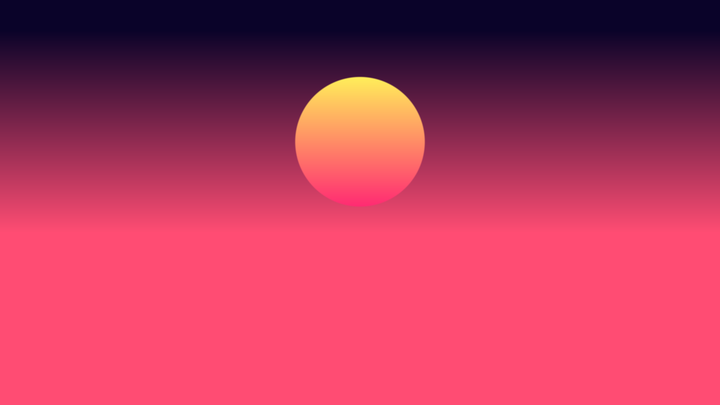
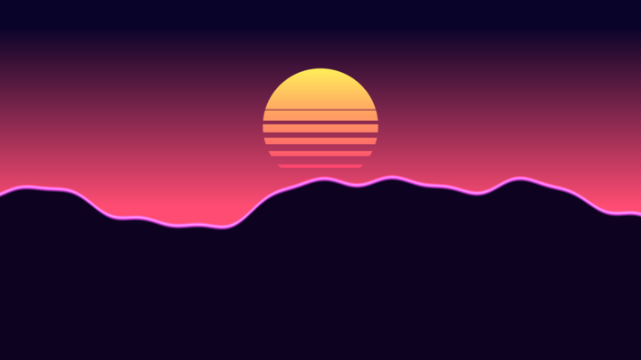
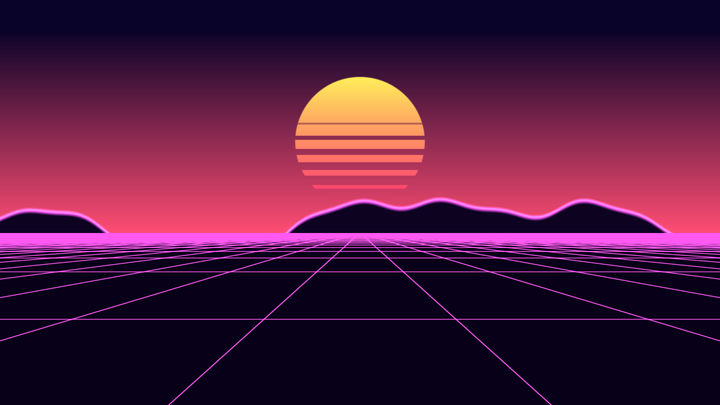
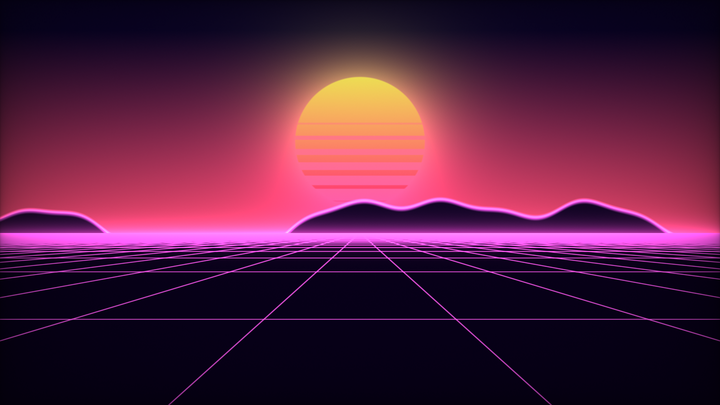

# 第 0 章 · 如何把一个想象中的效果变成代码

> 这是全书唯一一章「心法」。后面 19 章都是它的素材库。
>
> 如果你只读一章，读这章。

---

## 0.1 先认清那个根本约束

初学者写 shader 卡住，几乎总是因为同一件事：**他们还在用"画画"的方式思考。**

在 Canvas、Photoshop、Illustrator 里，你的思维是命令式的："在 (100,50) 画一个红色圆"、"再在上面画一条线"。你是一个拿着笔的主体，画布是被动的。

Shader 里没有笔，也没有画布。GPU 同时启动了几百万个互不通信的小程序，每个负责一个像素，每个都被问同一个问题：

> **"你在屏幕的这个位置。告诉我，你应该是什么颜色？"**

你写的 `mainImage` 就是对这个问题的回答。它必须**只根据自己的坐标**算出颜色。它不知道旁边的像素是什么颜色，不知道之前画过什么，也没法"跑出去"影响别人。

这个约束听起来像残疾，但它其实是整个领域一切技巧的源头。你要做的每一次思维转换，本质上都是同一句话：

> **把"我要画 X"翻译成"对于任意一点 p，它和 X 是什么关系？"**

举几个例子体会一下这个翻译：

| 画画的说法 | Shader 的说法 |
|---|---|
| 画一个半径 0.3 的圆 | 对每个点 p，算 `length(p) - 0.3`；小于 0 的就在圆里 |
| 画 1000 个星星 | 把平面切成格子，每格用坐标算个伪随机数，决定这格有没有星星、在哪 |
| 让物体发光 | 光强 = 到物体距离的倒数，`1.0/d` |
| 把两个球捏在一起 | 取两个距离值的"平滑最小值" `smin(d1, d2, k)` |
| 画一座 3D 山 | 沿着视线一步步往前走，每步问"我撞到地面了吗" |
| 让画面有拖尾 | 把上一帧存进 Buffer，这一帧和它混合 |

每一行右边，都是把"动作"改写成了"位置的函数"。**这就是 shader 思维。**

## 0.2 核心心智模型：一切都是场

请把这句话刻在脑子里：

> **写 shader 就是在设计"场"（field），然后决定怎么看这个场。**

「场」就是一个从位置到数值的函数：`f(p) → 值`。数值可以是距离、密度、高度、颜色、概率。整个语料库 2675 个作品，全部都是这个模式的变体。真正只有四种场：

**① 距离场（Distance Field）** —— `f(p)` 返回 p 到某个形状表面的距离，形状内为负。这是最重要的一种，2D 画形状和 3D raymarching 都靠它。语料里 `sdBox` 出现 228 次、`sdSphere` 119 次、`smin` 327 次，全在玩这个。

**② 密度场（Density Field）** —— `f(p)` 返回该点"有多少东西"。云、烟、火、星云都是密度场，渲染方式是沿光线积分。

**③ 高度场（Height Field）** —— `f(x,z)` 返回地面高度。地形、海浪、山脊线。

**④ 颜色/图案场（Pattern Field）** —— `f(p)` 直接返回颜色或一个用来查调色板的标量。纯 2D 图案、分形着色。

**为什么这个模型这么有用？** 因为它把"造型"和"渲染"彻底分开了：

```
        造型                        渲染
    设计 f(p) 是什么     →     决定怎么把 f 变成像素
    （这里发挥创意）            （这里有固定套路）
```

**渲染部分是可以背下来的固定套路**：距离场就用 `smoothstep` 描边（2D）或 raymarch（3D）；密度场就沿线积分；高度场就 raymarch 或直接比较。套路我会在后面的章节一个个教给你。

**造型部分才是你真正要练的**。而造型的训练，就是积累「什么样的数学表达式长什么样」的直觉。

## 0.3 五步拆解法

现在给你一个可操作的流程。任何时候你想做一个效果，按这五步走。

### 第 1 步 · 分层：把画面拆成可以独立完成的图层

闭上眼睛想象你要的画面，然后**从后往前**把它切成几层。这一步纯粹是美术工作，不涉及任何代码，但它决定了后面所有事情。

以「合成波日落」为例，我看到的是：

```
最后    ← 后期（辉光、暗角、噪点）
 ↑      ← 地面透视网格
 |      ← 山脊剪影
 |      ← 太阳（带横条纹）
最先    ← 天空渐变
```

分层的价值在于：**每一层都能独立做出来、独立调试、独立看效果**。你永远不会面对"整个东西都不对但不知道哪儿错了"的绝望。语料里所有复杂作品都是这么组织的——去看 `000594-fstyD4-Coastal_Landscape`，它整个就是一层层 `mix` 上去的。

分层的原则：**能分开就分开**。宁可分七层也不要分三层。

### 第 2 步 · 定维度：这是全过程最重要的一个决定

问自己：**这个效果需要几维？**

| 选择 | 什么时候选 | 代价 |
|---|---|---|
| **纯 2D** | 图案、UI、平面动画、抽象视觉 | 最便宜，但没有真正的透视和光照 |
| **2.5D（伪 3D）** | 有纵深感但不需要真正的 3D 几何：透视网格、视差图层、等距场景 | 便宜，效果好，技巧性强 |
| **3D Raymarching** | 有实体、有光照、有阴影的场景 | 贵，但表现力最强，语料里 29% 的文件在用 |
| **体积渲染** | 云、烟、火、星云这些"没有表面"的东西 | 最贵 |
| **多 Pass 仿真** | 需要"记忆"的东西：流体、粒子、拖尾、路径追踪累积 | 复杂度陡增 |

**新手最常犯的错误是过早选 3D。** 上面那张合成波日落图看起来很有纵深，但它是**纯 2D** 的——网格的透视是用一个 `1.0/y` 伪造的。语料里大量令人惊艳的作品都是 2D 伪装成 3D。

判断法则：**如果相机不需要自由转动，就先试试能不能用 2D 伪造。**

### 第 3 步 · 找结构：哪里在重复？哪里是随机？

真实世界的复杂性几乎都来自两个东西：**重复**和**随机**。而这两个在 shader 里都极其便宜。

- **重复** → `fract(p)` 把无限平面折叠成一个格子。一行代码，无限个物体，成本不变。
- **随机** → `hash(格子编号)` 给每个格子一个确定的伪随机数。同一个格子每帧算出来都一样，所以物体不会闪。

这两个凑在一起，就是整个程序化生成领域的基石，我称之为**"单元 id + 局部坐标"分解**：

<!-- glsl-frag -->
```glsl
vec2 id = floor(p2);          // 我在第几号格子里？→ 用来查随机数
vec2 lp = fract(p2) - 0.5;    // 我在格子内部的哪儿？→ 用来算形状
```

星空、砖墙、城市楼群、雨滴、树林、Truchet 花纹……全是这一招。`fract` 在语料库 50.6% 的文件里出现，`floor` 46.2%，绝非偶然。

这一步要问的问题：
- 有什么东西出现了很多次？→ 域重复
- 这些东西彼此有差别吗？→ hash 单元 id
- 有分形/自相似结构吗？→ 循环里反复缩放
- 有周期性运动吗？→ `sin` / `fract(t)`

### 第 4 步 · 写场函数：把每一层落实成数学

现在才开始写代码。对每一层，写出它的场函数。

这一步是最需要经验的，而经验就是**词汇量**。0.5 节给你一张「想要的感觉 → 用什么技法」的对照表，那是本手册的浓缩。整本书剩下的部分都在扩充这张表。

有一条重要的实践建议：**一次只加一层，每加一层就看一眼结果**。不要一口气写 80 行然后编译。语料里那些几百行的作品，作者也是一层层长出来的。

### 第 5 步 · 着色与打磨：让它从"对"变成"好看"

这一步经常被低估。**一个技术上完全正确的 shader 和一个好看的 shader，差距全在这一步**，而且这一步的性价比极高——通常十几行代码就能让画面质量翻倍。

打磨清单（按性价比排序）：

1. **调色板** —— 别手调 RGB。用 `iq` 的余弦调色板（第 4 章），十秒钟得到和谐配色。
2. **抗锯齿** —— 所有边缘都用 `smoothstep` 而不是 `step`。
3. **辉光** —— `exp(-d*k)` 或 `k/d`，让亮的东西真的"亮"。
4. **对比与景深** —— 远处压低对比度、加雾，近处保持锐利。这是营造纵深最有效的手段。
5. **暗角（vignette）** —— 四角压暗，视线自动集中到中心。
6. **抖动（dither）** —— 加 `1/255` 量级的噪声，消除渐变里的色带。
7. **色调映射** —— 如果你的颜色可能超过 1.0，用 ACES 或 `1-exp(-x)` 压回来，比直接 clamp 好看得多。

---

## 0.4 完整实战：从零做一张合成波日落

理论讲完了，现在用上面的五步法真做一个。每一阶段的代码都在 `shader-handbook/examples/` 里，每张图都是那段代码真实渲染出来的。

参考作品是语料里的 `000465-Wt33Wf-Cyber_Fuji_2020`（kaiware007，465 赞）。我们不抄它，而是自己按方法推一遍。

### 阶段 1：坐标系与天空

**分层**说了天空在最底层，**定维度**选了纯 2D。第一件事永远是建立坐标系。

<!-- glsl-from: examples/ch0_stage1.glsl -->
```glsl
const float HORIZON = -0.15;

void mainImage(out vec4 fragColor, in vec2 fragCoord)
{
    // 屏幕中心为原点，纵向范围固定为 [-1, 1]，横向随宽高比伸展
    vec2 uv = (2.0 * fragCoord - iResolution.xy) / iResolution.y;

    // t: 0 = 地平线，1 = 天顶
    float t = clamp(uv.y - HORIZON, 0.0, 1.0);
    vec3 col = mix(vec3(1.00, 0.30, 0.45), vec3(0.04, 0.01, 0.16), t);

    fragColor = vec4(col, 1.0);
}
```


两个要点，都很关键：

**为什么除以 `iResolution.y` 而不是 `iResolution.xy`？** 如果除以 `.xy`，x 和 y 会被独立拉伸到 [0,1]，圆就会变成椭圆。除以 `.y`（同一个数）保持了长宽比例，圆还是圆。这是语料库 49.6% 的文件的选择——它几乎是默认答案。

**为什么把地平线抽成常量 `HORIZON`？** 因为后面五层都要用到它。凡是会被多处引用的数字，一律提成常量。这不是洁癖，是因为你等下要反复调它，而调一个数比调五处容易。

### 阶段 2：太阳 —— 你的第一个距离场

<!-- glsl-from: examples/ch0_stage2.glsl -->
```glsl
    // 太阳：圆形有符号距离场，sd < 0 表示在圆内
    vec2  sp = uv - vec2(0.0, 0.30);
    float sd = length(sp) - 0.32;

    // 盘面自身的颜色渐变：顶部偏黄，底部偏品红
    vec3 sunCol = mix(vec3(1.00, 0.95, 0.35), vec3(1.00, 0.15, 0.45),
                      clamp(0.5 - sp.y * 1.5, 0.0, 1.0));

    col = mix(col, sunCol, smoothstep(0.004, -0.004, sd));
```



这五行里藏着三个通用套路，值得单独拆开看：

**套路一：平移 = 减法。** `sp = uv - center` 把坐标系原点搬到了太阳中心。之后所有关于太阳的计算都用 `sp`，就好像太阳在原点一样。**"变换形状"永远等价于"反向变换坐标"**——这个思想（域变换）会贯穿整本书，3D 里的旋转、扭曲、重复全是它。

**套路二：`length(p) - r` 就是圆。** 为什么？`length(p)` 是 p 到原点的距离，减 r 之后：正好在半径 r 上时为 0，在里面为负，在外面为正。而且它的绝对值**恰好等于到圆周的最短距离**——这就是"有符号距离场"这个名字的来历。这个性质后面会变得极其重要。

**套路三：`smoothstep(a, b, x)` 且 a > b，是一个"反向"软阈值。** `smoothstep(0.004, -0.004, sd)` 的含义是：`sd > 0.004`（圆外）返回 0，`sd < -0.004`（圆内）返回 1，中间那 0.008 宽的过渡带平滑插值。这条过渡带就是**抗锯齿**。如果这里写 `step(sd, 0.0)`，边缘会是硬邦邦的锯齿。

> **随手记**：`mix(背景, 前景, 蒙版)` 是 shader 里的"图层叠加"。整个语料库 56.1% 的文件用 `mix`，它就是你的图层面板。

### 阶段 3：条纹 —— 用"加法"做布尔运算

合成波的太阳必须有横条纹，而且要下密上疏、下断上连。

<!-- glsl-from: examples/ch0_stage3.glsl -->
```glsl
    // 条纹：sin 产生周期条带，clamp 项让条纹在顶部被"填满"、在底部被"切光"
    float cut = 3.0 * sin((sp.y + iTime * 0.25) * 90.0)
              + clamp(sp.y * 16.0 + 2.0, -6.0, 6.0);
    cut = clamp(cut, 0.0, 1.0);

    col = mix(col, sunCol, smoothstep(0.004, -0.004, sd) * cut);
```


这是一个非常值得学的小技巧。它把两个东西**相加**然后 clamp：

- `3.0 * sin(sp.y * 90.0)` 在 [-3, 3] 之间快速振荡 —— 这是条纹本身。
- `clamp(sp.y * 16.0 + 2.0, -6.0, 6.0)` 是一个随高度上升的斜坡，在太阳顶部达到 +6，底部到 -3.1。

相加之后再 `clamp(·, 0, 1)`：顶部因为偏置 +6 太大，`3*sin` 怎么摆动都压不到 0 以下 → 全亮；底部偏置 -3.1，`3*sin` 最大才 +3，加起来始终为负 → 全暗；中间地带偏置刚好在 ±3 附近，`sin` 的振荡就显现出来 → 条纹。

**这个"振荡项 + 偏置项，再 clamp"的结构是通用的**：任何时候你想让某个周期图案在空间上渐入渐出，就用它。相比写一堆 `if`，它没有分支、天然平滑，而且改一个系数就能调整过渡的位置和陡峭度。

注意 `iTime * 0.25` 让条纹缓慢上移。**动画就是往场函数里塞一个含 `iTime` 的项**，仅此而已。

### 阶段 4：山 —— 一维高度场

<!-- glsl-from: examples/ch0_stage4.glsl -->
```glsl
// 多个不同频率的正弦叠加 —— 这就是 fbm 的手工雏形
float mountain(float x)
{
    float h = 0.0;
    h += 0.26 * sin(x * 1.1 + 0.3);
    h += 0.13 * sin(x * 2.3 + 1.7);
    h += 0.06 * sin(x * 4.7 + 3.1);
    h += 0.03 * sin(x * 9.1 + 0.9);
    return h;
}
```

<!-- glsl-from: examples/ch0_stage4.glsl -->
```glsl
    // 山：把 1D 高度曲线变成 2D 剪影，md < 0 即在山体内部
    float md = uv.y - (HORIZON + 0.05 + 0.45 * mountain(uv.x * 2.0));
    col = mix(col, vec3(0.05, 0.01, 0.13), smoothstep(0.004, -0.004, md));
    // 山脊描光：|md| 接近 0 的地方最亮
    col += vec3(1.00, 0.35, 0.90) * smoothstep(0.018, 0.0, abs(md)) * 0.9;
```



**高度场变剪影只需要一次减法**：`uv.y - h(uv.x)`。这个值在山下为负、山上为正，也就是一个（近似的）有符号距离场，于是可以照常用 `smoothstep` 描边。

`mountain` 函数值得多说两句。四个正弦，**频率越来越高（1.1 → 2.3 → 4.7 → 9.1），振幅越来越小（0.26 → 0.13 → 0.06 → 0.03）**，每层大约翻倍/减半。这个"频率翻倍、振幅减半"的叠加模式就是 **fbm（分形布朗运动）** 的本质，第 5 章会用真正的噪声替换 `sin`，得到自然得多的山。但结构完全一样。

那些相位偏移 `+0.3, +1.7, +3.1, +0.9` 是干什么的？**防止所有正弦在 x=0 处同时归零**，否则山会在中间出现一个不自然的对称点。随便填几个不相干的数就行。

最后一行的**描光**是个廉价但极有效的技巧：`smoothstep(w, 0.0, abs(md))` 在 `md` 接近 0（也就是山脊边缘）时接近 1，于是沿着轮廓加了一圈亮边。合成波风格全靠这个。**只要有 SDF，就能免费得到描边**——`abs(d)` 小的地方就是边缘。

### 阶段 5：透视网格 —— 用 1/y 伪造三维

这是整张图里最漂亮的一招，也是"2.5D"的典型代表。

<!-- glsl-from: examples/ch0_stage5.glsl -->
```glsl
    // 地面网格。注意：在 if 分支里调用 fwidth 属于未定义行为，
    // 所以这里无条件地把地面算出来，最后再用 step 选择。
    float depth = max(HORIZON - uv.y, 1e-3);          // 到地平线的"距离"
    vec2  g = vec2(uv.x / depth, 1.0 / depth + iTime * 1.5) * vec2(0.45, 0.35);
    vec2  f = abs(fract(g) - 0.5);                     // 到最近格线的距离
    vec2  w = fwidth(g) * 1.5;                         // 该像素覆盖的格子跨度
    vec2  l = 1.0 - smoothstep(vec2(0.0), w, f);       // 越远 w 越大 → 线自动淡出
    float grid = clamp(l.x + l.y, 0.0, 1.0);

    vec3 ground = mix(vec3(0.03, 0.00, 0.10), vec3(1.00, 0.35, 0.95), grid);
    col = mix(col, ground, step(uv.y, HORIZON));
```



**为什么 `1/y` 就是透视？** 想象你站在平地上看向远方。一个距离你 `Z` 米的地面点，在屏幕上出现的高度大约正比于 `1/Z`（这就是透视投影，近大远小）。反过来，屏幕上离地平线 `y` 的位置，对应的实际距离就是 `Z ∝ 1/y`。所以 `1.0/depth` 把屏幕纵坐标还原成了世界纵深。

同理 `uv.x / depth`：同样宽的横向距离，越远在屏幕上越窄，所以要除以 depth 才能还原成世界横坐标。这一步让所有纵向格线自动汇聚到消失点。

`+ iTime * 1.5` 让世界坐标持续增大 = 观察者向前飞。

**`fwidth` 那两行是这段代码真正精妙的地方。** `fwidth(g)` 告诉你"当前这一个像素，在 g 空间里跨越了多大范围"。远处的格子被压缩得极小，一个像素可能横跨好几个格子，此时 `w` 很大，`smoothstep(0, w, f)` 的过渡带就很宽，线条自然糊掉、淡出。

**这不只是抗锯齿，这是自动的细节层次控制（LOD）。** 如果不做这件事，远处的格线会因为采样不足而产生剧烈的摩尔纹闪烁。用固定线宽的话你必须手动写一个距离衰减去掩盖它；用 `fwidth` 则一举两得，而且物理上是正确的。记住这个原则：

> **程序化图案的正确抗锯齿方式，是让特征宽度不小于一个像素。**

代码里那句注释也很重要：**`fwidth`/`dFdx` 依赖相邻像素的值，在非一致的 `if` 分支里调用是未定义行为**，可能在某些 GPU 上出现撕裂。所以要无条件计算，最后用 `step`/`mix` 选择。这是一个真实存在、且很难 debug 的坑。

### 阶段 6：打磨

<!-- glsl-from: examples/ch0_stage6.glsl -->
```glsl
    // 辉光：盘面之外按距离衰减地加光，这是"发光"最省事的做法
    col += sunCol * exp(-max(sd, 0.0) * 6.0) * 0.55;
```

<!-- glsl-from: examples/ch0_stage6.glsl -->
```glsl
    // --- 地平线辉光：一条亮带把天地缝合起来 ---
    col += vec3(1.00, 0.30, 0.80) * exp(-abs(uv.y - HORIZON) * 26.0) * 0.7;

    // --- 暗角 ---
    vec2 q = fragCoord / iResolution.xy;
    col *= 0.35 + 0.65 * pow(16.0 * q.x * q.y * (1.0 - q.x) * (1.0 - q.y), 0.25);

    // --- 抖动：打散 8-bit 量化造成的色带 ---
    col += (fract(sin(dot(fragCoord, vec2(12.9898, 78.233))) * 43758.5453) - 0.5) / 255.0;
```



对比阶段 5 和阶段 6：几何完全没变，但画面质感差了一个档次。这就是打磨的价值。

**辉光用加法而不是 mix。** 真实的光是叠加的，所以 `col += 光` 而不是 `col = mix(col, 光色, k)`。用加法，重叠的光会变亮直至过曝，这正是我们想要的。`exp(-d*k)` 是最自然的衰减曲线（也是物理上正确的，见第 10 章 Beer-Lambert 定律）。

**暗角那一行是 iq 的经典写法。** `16*q.x*q.y*(1-q.x)*(1-q.y)` 在画面中心为 1、四角为 0，`pow(·, 0.25)` 把它变得平缓。这一行在语料里到处都是。

**抖动为什么除以 255？** 因为最终输出是 8 位色深，`1/255` 正好是一个色阶。加上半个色阶的随机扰动，相邻色阶就会犬牙交错地混在一起，人眼看到的是平滑过渡而不是色带。代价是极轻微的噪点——这是非常划算的交易。

### 回头看这个过程

我们做的事情，严格对应五步法：

1. **分层** → 天空 / 太阳 / 山 / 地面 / 后期，五层，每层独立可见。
2. **定维度** → 纯 2D，用 `1/y` 伪造透视。
3. **找结构** → 网格是 `fract` 重复；山是多频率叠加。
4. **写场函数** → 圆的 SDF、高度场、周期条纹。
5. **打磨** → 辉光、暗角、抖动。

整个 shader 60 行，没有一个 `if` 分支（`step`/`clamp` 代替了），没有循环，在集成显卡上都能跑满帧。

**现在轮到你了**：改 `HORIZON` 看看会怎样；把 `mountain` 里的正弦改成五个；让太阳随 `iMouse` 移动；把配色换成青蓝色系。改坏了也没关系——这正是学习发生的地方。

---

## 0.5 「想要的感觉 → 用什么技法」对照表

这张表是全书的索引，也是你应该逐渐背下来的东西。当你想要某种视觉感受时，来这里查。

### 形态与造型

| 我想要… | 技法 | 章节 |
|---|---|---|
| 一个精确的几何形状 | SDF 图元库 | 3, 8 |
| 两个形状融合成有机的一坨 | `smin` 平滑并集 | 8 |
| 挖洞、切割 | `max(d1, -d2)` 减法 | 8 |
| 空心的壳 | `abs(d) - thickness`（洋葱） | 8 |
| 圆角 | `d - r` | 8 |
| 无限多个物体 | `fract`/`mod` 域重复 | 6 |
| 有限个但重复排列 | `p - s*clamp(round(p/s), -n, n)` | 8 |
| 对称图案 | `abs(p)` 折叠 | 6, 11 |
| 放射状对称（花瓣、雪花） | 极坐标 + 角度取模 | 6 |
| 自相似的分形结构 | 循环里"折叠+缩放" | 11 |
| 扭曲、弯折 | 域变换：随 y 旋转 / 位移 | 8 |
| 有机的凹凸表面 | 法线扰动（bump mapping） | 9 |

### 质感与细节

| 我想要… | 技法 | 章节 |
|---|---|---|
| 随机但每帧稳定 | `hash(id)` | 5 |
| 平滑的随机起伏 | value / Perlin 噪声 | 5 |
| 自然的多尺度细节 | fbm（多倍频叠加） | 5 |
| 云朵般的形状 | fbm + `smoothstep` 阈值 | 5, 10 |
| 山脊、闪电的尖锐棱线 | ridged noise：`1 - abs(noise)` | 5 |
| 湍流、火焰的翻滚感 | `abs(noise)` 叠加 + 时间偏移 | 5, 18 |
| 细胞、鳞片、龟裂 | Voronoi | 5 |
| 有机的流动扭曲 | 域扭曲 `fbm(p + fbm(p))` | 5 |
| 流体般的流向 | curl noise（无散度场） | 5, 14 |
| 木纹、大理石 | `fract(noise * k)` / `sin(x + noise)` | 5 |
| 砖墙、地砖 | 网格 + 行偏移 + 每格 hash | 6 |
| 编织、交错 | Truchet + 奇偶判断分层 | 6 |

### 光与色

| 我想要… | 技法 | 章节 |
|---|---|---|
| 和谐的配色 | 余弦调色板 `a+b*cos(6.28*(c*t+d))` | 4 |
| 发光 / 霓虹 | `k/d`、`exp(-k*d)`、`pow(k/d, p)` | 3 |
| 立体感 | 法线 · 光照方向 | 9 |
| 塑料/金属质感 | 高光项、Fresnel、GGX | 9 |
| 边缘泛光（轮廓光） | Fresnel：`pow(1-dot(n,v), 5)` | 9 |
| 柔和的阴影 | 沿光线 raymarch 取最小距离比 | 9 |
| 缝隙里的暗部 | 环境光遮蔽（AO） | 9 |
| 玉石/皮肤的通透感 | 次表面散射（SSS） | 9 |
| 空间纵深感 | 雾 `exp(-d*k)` + 远处降对比 | 9, 10 |
| 体积光/丁达尔效应 | 沿光线积分散射 | 10 |
| 玻璃、水 | `refract` + Fresnel + 全反射 | 12 |
| 彩虹色散 | RGB 分别用不同折射率 | 12 |
| 高光溢出的电影感 | HDR + bloom + 色调映射 | 15 |

### 运动与时间

| 我想要… | 技法 | 章节 |
|---|---|---|
| 循环往复 | `sin(iTime)` |  |
| 匀速前进 | `+ iTime * speed` |  |
| 每隔一段时间重来 | `fract(iTime)` |  |
| 一群物体错落地动 | 相位偏移 `sin(iTime + hash(id)*6.28)` | 5 |
| 有惯性/弹性 | 存速度到 Buffer，逐帧积分 | 13, 14 |
| 拖尾、残影 | 与上一帧混合 | 13 |
| 运动模糊 | 时间维度上多次采样 / 解析积分 | 15 |
| 缓动（ease） | `smoothstep(0,1,t)` 代替线性 t |  |

### 画面质量

| 我想要… | 技法 | 章节 |
|---|---|---|
| 边缘不锯齿 | `smoothstep` + `fwidth` | 3, 15 |
| 远处图案不闪烁 | 按 `fwidth` 做频率限制 | 15 |
| 渐变没有色带 | 抖动 | 15 |
| 焦外虚化 | 景深 / bokeh | 15 |
| 老电视质感 | 扫描线 + 桶形畸变 + 色度偏移 | 15 |
| 手绘/铅笔风 | 沿梯度方向的笔触 + 排线 | 15 |

---

## 0.6 逆向阅读法：怎么读懂别人的 shader

语料库里有 2675 个作品。**读代码是提升最快的途径**，但打开一个 600 行、没有注释、变量名全是单字母的 shader，很容易直接放弃。

给你一个可靠的流程。

### 步骤 1：先看结尾，不要看开头

滚到 `mainImage` 的**最后几行**。找到 `fragColor = ...`，然后往回倒推。你会立刻看到最外层的结构，通常是这样：

<!-- glsl-frag -->
```glsl
    col = pow(col, vec3(0.4545));     // gamma → 说明前面是线性空间
    col *= 0.5;                       // 暗角之类的收尾
    fragColor = vec4(col, 1.0);
```

于是你知道了：`col` 是主角。接着找 `col` 是从哪来的——通常是某个 `render(ro, rd)` 或 `trace(...)`。这样一层层往回剥，比从头读快十倍。

### 步骤 2：认出骨架

绝大多数 3D shader 是同一副骨架。看到这些函数名，你就知道各自负责什么：

| 函数名 | 职责 | 语料出现次数 |
|---|---|---|
| `map` / `scene` / `de` / `DE` | **场函数**，整个作品的灵魂 | 667 + 83 + 56 + 24 |
| `trace` / `march` / `castRay` / `raymarch` | 沿光线找交点 | 198 + 129 + 76 + 75 |
| `calcNormal` / `getNormal` / `normal` | 求表面法线 | 264 + 159 + 218 |
| `calcAO` / `ambientOcclusion` | 环境光遮蔽 | 185 + 30 |
| `softShadow` / `softshadow` | 软阴影 | 122 + 77 |
| `render` / `shade` / `doLighting` | 着色 | 217 + 104 + 21 |
| `setCamera` / `lookat` / `calcLookAtMatrix` | 相机矩阵 | 128 + 44 + 43 |
| `hash*` / `noise` / `fbm` | 随机与噪声 | 537 + 507 + 278 |

**认出骨架之后，90% 的代码你可以直接跳过**——因为骨架部分都是标准写法，你在第 7~9 章会学到。**真正独特的东西永远在 `map` 里。** 直接去读 `map`。

### 步骤 3：把 `map` 拆成一行行看

`map` 通常是一堆距离值的组合。逐行问自己两个问题：

1. **这一行在做域变换还是在算距离？** 形如 `p = ...` 的是域变换（移动/旋转/重复/扭曲坐标）；形如 `d = ...` 或 `d = min(d, ...)` 的是在算距离。
2. **如果是域变换，它把空间变成什么样了？**

### 步骤 4：动手删代码

这是最有效的一招，而且被严重低估：

> **把你看不懂的那一行注释掉，或者把某个系数改成 0，然后看画面少了什么。**

比 read 一百遍都管用。想知道 `col += texture(...).r * 0.3` 干什么？把 `0.3` 改成 `3.0`。想知道某个 `smin` 的作用？改成 `min`。

### 步骤 5：把中间量当颜色输出

在 `mainImage` 的任意位置插一行提前返回，把你想看的东西可视化：

<!-- glsl-frag -->
```glsl
    // 看法线：把 [-1,1] 映射到 [0,1]
    fragColor = vec4(n * 0.5 + 0.5, 1.0); return;

    // 看步进次数（红=慢，判断性能瓶颈在哪）
    fragColor = vec4(float(i) / 128.0, 0.0, 0.0, 1.0); return;

    // 看距离场（条纹状等值线，能直观看出 SDF 是否正确）
    fragColor = vec4(fract(d * 10.0)); return;

    // 看 uv 坐标（红绿渐变，确认坐标系方向对不对）
    fragColor = vec4(uv * 0.5 + 0.5, 0.0, 1.0); return;
```

**最后这几招（删代码 + 可视化中间量）也是你调试自己 shader 的主要手段。** shader 没有断点、没有 `printf`，颜色就是你唯一的输出通道。

---

## 0.7 五个常见的思维误区

**误区一：想用命令式的方式"画"东西。**
症状是想写"先画 A 再画 B"。正确的想法是"这个点同时和 A、B 都是什么关系，然后合成"。

**误区二：过早追求复杂。**
看到一个 800 行的作品就想直接复刻。事实上那 800 行是作者花几十小时长出来的。永远从能跑的 10 行开始，每次只加一层。

**误区三：以为要先学完数学。**
不需要。你需要的数学在用到时现学最有效。真正的门槛只有：向量点乘/叉乘的几何意义、三角函数、以及"函数图像长什么样"的直觉。

**误区四：用 `if` 思考。**
GPU 上分支很贵（同一批像素走不同分支时两边都要执行）。更重要的是，`if` 产生硬边缘 = 锯齿。绝大多数 `if` 都能用 `step`、`clamp`、`mix`、`smoothstep` 替代，而且更平滑、更快。

**误区五：不看别人的代码。**
这个领域的知识几乎全部沉淀在作品里，而不是教科书里。你手上这 2675 个作品就是这个领域最好的教材。本手册的作用是给你一张地图，让你知道该看哪些、以及看的时候该注意什么。

---

## 0.8 给你的学习路径

**第一周**：读完第 1、2、3 章，做出 5 个纯 2D 的静态图形（笑脸、图标、几何图案）。目标是让 SDF 和 `smoothstep` 变成肌肉记忆。

**第二周**：第 4、5、6 章。做出 3 个带噪声和重复的图案（星空、木纹、六边形蜂窝）。目标是掌握 hash + 噪声 + 域重复这三板斧。

**第三、四周**：第 7、8、9 章。这是最陡的一段。目标是能从零默写出一个完整的 raymarching 框架，并用它做出一个有光照和阴影的简单场景。

**之后**：按兴趣挑章节。想做云和火看第 10 章，想做分形看第 11 章，想做流体看第 13、14 章，想做电影感看第 15 章。第 18 章的配方大全可以随时翻。

**最重要的一条**：每学一个技法，**立刻用它做一个小东西**。不要收集技法而不用。你对一个技法的真正理解，发生在你用它做失败了三次之后。

---

> 下一章：[第 1 章 · 平台与心智模型](01-平台与心智模型.md) —— 把 Shadertoy 这个环境本身彻底搞清楚。
