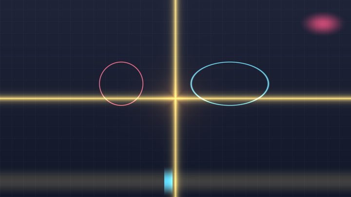
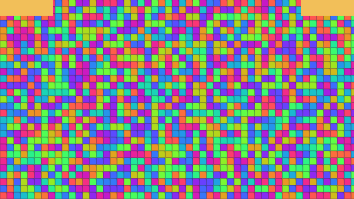
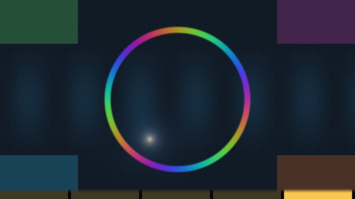

# 第 1 章 · 平台与心智模型

> 把 Shadertoy 这个运行环境彻底搞清楚。这一章信息密度很高，但它是后面所有章节的地基。
>
> 建议第一遍快速通读，之后当成参考手册随时回查。

---

## 1.1 你写的到底是什么

Shadertoy 给你一个文本框，你在里面写一个函数：

```glsl
void mainImage(out vec4 fragColor, in vec2 fragCoord)
{
    fragColor = vec4(1.0, 0.5, 0.2, 1.0);
}
```

背后发生的事情是：Shadertoy 把你的代码包进一个完整的 **片元着色器（fragment shader）**，加上所有 uniform 声明和一个真正的 `main()`，然后画一个铺满屏幕的矩形。矩形上每个像素都会调用一次你的 `mainImage`。

大致等价于这样（这就是本手册配套校验工具实际使用的包装）：

<!-- glsl-skip -->
```glsl
#version 300 es
precision highp float;
uniform vec3 iResolution;
uniform float iTime;
/* ...其余 uniform... */
out vec4 st_FragColor;

/* ==== 你的代码插在这里 ==== */

void main() {
    vec4 c = vec4(0.0);
    mainImage(c, gl_FragCoord.xy);
    st_FragColor = c;
}
```

理解这一点能消除很多困惑：

- **`fragCoord` 就是 `gl_FragCoord.xy`**，单位是**像素**，不是 0~1。左下角是 `(0.5, 0.5)`，右上角是 `(width-0.5, height-0.5)`。注意那个 0.5——它是**像素中心**，不是像素角。
- **y 轴向上**。这和大多数 2D 图形 API（左上角原点、y 向下）相反，是初学者的常见困惑源。
- **`out` 参数 `fragColor` 的初值不确定**，你必须完整地写它。有些浏览器上没赋值的通道会是垃圾数据。
- **没有 `main()`，没有 `#version`，没有 uniform 声明**——这些都由平台补上。所以你不能在 Shadertoy 里改 GLSL 版本。
- **语言是 GLSL ES 3.00**（WebGL2）。这意味着可以用 `texelFetch`、`textureSize`、整数位运算、`switch`，但不能用某些桌面 GLSL 的特性。

## 1.2 全部 uniform 及其精确语义

这是你和外部世界的**唯一**接口。除了这些变量和输入通道，你的 shader 什么都不知道。

| Uniform | 类型 | 含义 | 语料使用率 |
|---|---|---|--:|
| `iResolution` | `vec3` | 视口分辨率（像素）。`.xy` 是宽高，`.z` 是像素宽高比（几乎总是 1.0） | 极高 |
| `iTime` | `float` | 播放时间（秒），从 0 开始 | 极高 |
| `iTimeDelta` | `float` | 上一帧耗时（秒）。`1.0/iTimeDelta` 就是 FPS | 2.8% |
| `iFrameRate` | `float` | 帧率 | 低 |
| `iFrame` | `int` | 帧序号，从 0 开始。**多 Pass 初始化的关键** | 22.1% |
| `iMouse` | `vec4` | 鼠标状态，语义复杂，见下 | 29.5% |
| `iDate` | `vec4` | `(年, 月[0-11], 日, 当天秒数)` | 1.3% |
| `iChannel0..3` | `sampler2D`/`samplerCube` | 四个输入通道 | 56.6% / 27.6% / 13.2% / 9.6% |
| `iChannelResolution[4]` | `vec3[4]` | 各通道纹理的分辨率 | 6.1% |
| `iChannelTime[4]` | `float[4]` | 各通道（视频/音频）的播放时间 | 低 |
| `iSampleRate` | `float` | 音频采样率，通常 44100 | 低（仅 sound pass） |

#### 可跑精读 · Uniform 仪表盘

把看不见的输入变成看得见的控件：时间条、宽高比圆、鼠标十字、帧角标。之后任何「鼠标没反应」「圆被拉扁」都能先回这张仪表盘对表。

**思路拆解**

- `iTime`：归一化进度条（也可用 `fract(iTime)` 看循环）。
- `iResolution`：两个圆，一个按 `/x` 一个按 `/y`——只有 `/y` 那只保持正圆。
- `iMouse`：按下才亮（`z>0`）；没按也可以画「上一次」或自动目标。
- `iFrame`：角标闪烁证明「帧在走」；反馈系统初始化靠它。

**关键旋钮**

| 旋钮 | 作用 |
|---|---|
| 进度条映射 | `fract(iTime*0.1)` vs 连续 |
| 圆的除数 | `/x` 与 `/y` 对照 |
| 鼠标落点大小 | 交互热区手感 |

**动手改（建议按序）**

1. 把圆改成只用 `fragCoord/iResolution.xy`，看扁不扁。
2. 用 `iMouse.xy` 去驱动一个 SDF 圆心。
3. `iFrame==0` 时强制画纯红一帧，理解初始化。

**易错点**

- 在 Web 阅读器里 `iMouse` 未按下时为 0——要用自动回退位置，否则「交互例」像坏了。
- `iFrame` 在某些环境从 0 开始被跳过：反馈初始化写 `iFrame < 10` 更稳（第 13 章）。

<!-- glsl-from: examples/ch1_stage1.glsl -->
```glsl
float t = fract(iTime * 0.1);
vec2 p = (2.0*fragCoord - R) / R.y; // 正圆
vec2 m = iMouse.xy;
```



### iMouse 的语义——这个必须讲清楚

`iMouse` 是最容易用错的 uniform，因为它把四个不同的信息塞进了一个 `vec4`，还用**符号**编码状态：

| 分量 | 含义 |
|---|---|
| `iMouse.xy` | 鼠标当前位置（像素）。按住拖动时持续更新；松开后**保持**在最后位置 |
| `iMouse.zw` | 本次点击**按下时**的位置 |
| `sign(iMouse.z)` | 正 = 按钮当前被按住；负 = 已松开 |
| `sign(iMouse.w)` | 正 = **本帧刚刚按下**；其余时候为负 |

语料里最权威的封装来自 FabriceNeyret2 的工具集：

> 📄 出自 `000356-llySRh-iResolution_iMouse_iDate_etc/image.glsl`（FabriceNeyret2）

<!-- glsl-skip -->
```glsl
// --- mouse side events https://www.shadertoy.com/view/3dcBRS
#define mouseUp      ( iMouse.z < 0. )                  // mouse up even:   mouse button released (well, not just that frame)
#define mouseDown    ( iMouse.z > 0. && iMouse.w > 0. ) // mouse down even: mouse button just clicked
#define mouseClicked ( iMouse.w < 0. )                  // mouse clicked:   mouse button currently clicked
```

**实践上你只需要记住三件事**：

1. 判断"鼠标是否按住"：`iMouse.z > 0.0`
2. 判断"这一帧刚按下"：`iMouse.w > 0.0`
3. **拿归一化坐标前先处理"从未点击过"的情况**，否则页面刚加载时 `iMouse` 全是 0，你的效果会跑到左下角去。

标准的防御式写法（语料里到处都是这个模式）：

<!-- glsl-frag -->
```glsl
// 鼠标位置归一化到 [-1,1]；未点击时给一个默认值
vec2 m = vec2(0.0);
if (iMouse.z > 0.0) {
    m = (2.0 * iMouse.xy - iResolution.xy) / iResolution.y;
} else {
    m = vec2(cos(iTime * 0.3), 0.3);   // 未交互时自动演示
}
col = vec3(m, 0.0);
```

> **注意**：`iMouse` 的坐标和 `fragCoord` 一样是**像素**单位、**y 向上**。

### iTime 的坑

`iTime` 会一直增长。如果用户开着页面一小时，`iTime` 就到了 3600。这时候 `sin(iTime * 1000.0)` 这种表达式的参数会大到 `float` 精度不够，画面开始抖动或卡顿。

语料里的应对办法：**用 `mod` 把时间周期化**。

<!-- glsl-frag -->
```glsl
float t = mod(iTime, 62.83185);   // 10 个 2π 周期，保证 sin 的相位连续
col = vec3(sin(t * 10.0) * 0.5 + 0.5);
```

同样的问题也出现在 hash 上：`fract(sin(x) * 43758.5453)` 当 `x` 很大时，不同 GPU 会给出不同结果。这正是 Dave_Hoskins 写 `Hash without Sine` 的原因（详见第 5 章）。

## 1.3 输入通道（iChannel）

每个 shader 有四个输入通道。可以接：

| 类型 | 说明 | 语料出现次数 |
|---|---|--:|
| **Buffer** | 另一个 Pass 的输出（含自己的上一帧） | 3069 |
| **Texture** | 平台自带的贴图（噪声、木纹、砖墙……）或你上传的 | 1530 |
| **Cubemap** | 立方体贴图，用于环境反射 | 356 |
| **Keyboard** | 256×3 的键盘状态纹理 | 261 |
| **Music / Musicstream / Mic** | 音频，取 FFT 频谱和波形 | 245 |
| **Video** | 视频 | 62 |
| **Volume** | 3D 纹理 | 54 |
| **Webcam** | 摄像头 | 3 |

### 采样器设置很重要

每个通道都有采样器参数，在语料的 `meta.json` 里能看到：

```json
{
  "type": "buffer",
  "channel": 0,
  "sampler": {
    "filter": "mipmap",     // nearest / linear / mipmap
    "wrap":   "repeat",     // clamp / repeat
    "vflip":  "true",
    "srgb":   "false",
    "internal": "byte"      // byte / float / half
  }
}
```

> 📄 出自 `000697-tsKXR3-Multiscale_MIP_Fluid/meta.json`（cornusammonis）

这几个设置会**实质性地改变效果**，而且在网页 UI 上藏得很深，是初学者踩坑的重灾区：

- **`filter: nearest`** —— 关掉双线性插值。做元胞自动机、像素艺术、精确数据存储时**必须**用它，否则相邻格子的数据会互相污染。
- **`filter: mipmap`** —— 开启 mipmap，这样 `textureLod(ch, uv, level)` 才有意义。语料里 10.7% 的文件用 `textureLod`，很多是拿 mipmap 当**免费的模糊**用（第 15 章）。上面那个流体作品用 mipmap 来加速压力场的远距离传播。
- **`wrap: repeat`** —— uv 超出 [0,1] 时环绕。做无缝平铺纹理时需要。用 `clamp` 则边缘像素被拉伸。做仿真时 `clamp` 相当于"墙"边界，`repeat` 相当于周期边界，**这直接决定了你的流体撞到边界会怎样**。
- **`internal: float`** —— 32 位浮点缓冲。做物理仿真、路径追踪累积时**必须**开，否则 8 位精度（1/255）会让数值迅速崩坏。

> **调试提示**：如果你的仿真"莫名其妙就糊了/爆了"，第一件事是检查 filter 是不是 `linear`（应该是 `nearest`）以及 internal 是不是 `byte`（应该是 `float`）。

## 1.4 Pass 模型

Shadertoy 支持多个 Pass。这是从"画一张图"走向"做一个系统"的分界线。

### 五种 Pass

| 类型 | 入口函数 | 作用 | 语料数量 |
|---|---|---|--:|
| **Image** | `mainImage` | 最终输出到屏幕。**必须有且只有一个** | 2675 |
| **Buffer A~D** | `mainImage` | 渲染到离屏纹理，供其它 Pass 采样 | 1502 |
| **Common** | 无 | 不渲染，只是被所有 Pass 共享的代码 | 481 |
| **Sound** | `mainSound` | 生成音频 | 94 |
| **Cubemap** | `mainCubemap` | 渲染立方体贴图 | 48 |

### 执行顺序和"一帧延迟"

每帧的执行顺序是：**Buffer A → B → C → D → Image**。

关键在于：**一个 Buffer 可以把自己作为输入通道**。这时它读到的是**上一帧**自己的输出。这就是"记忆"的来源，也是所有仿真的基础：

```
第 N 帧：Buffer A 读取「第 N-1 帧的 Buffer A」，算出新状态，写入
第 N 帧：Image  读取「第 N 帧的 Buffer A」，画出来
```

如果 Buffer B 读 Buffer A，因为 A 在 B 之前执行，B 读到的是**本帧**的 A。但如果 Buffer A 读 Buffer B，A 读到的是**上一帧**的 B。**这个顺序差异在写多 Pass 仿真时至关重要**，第 13 章会详细讲。

### Pass 数量分布

| Pass 数 | 作品数 | 占比 |
|---|--:|--:|
| 1 | 1728 | 64.6% |
| 2 | 409 | 15.3% |
| 3 | 203 | 7.6% |
| 4 | 134 | 5.0% |
| 5 | 108 | 4.0% |
| 6 | 82 | 3.1% |
| 7 | 11 | 0.4% |

**三分之二的作品只有一个 Pass。** 不要觉得多 Pass 才高级。语料里点赞最高的作品 `002224-Ms2SD1-Seascape`（2224 赞）就是单 Pass 的。

### Common Pass

`Common` 不是一个渲染 Pass，它只是代码。里面的内容会被**插入到其它每个 Pass 的开头**。

用它来放：常量定义、hash/noise 函数库、结构体、以及在 Buffer 之间传递数据的读写辅助函数。481 个作品（18%）用了它。当你有两个以上 Pass 需要共享代码时就该用它——否则你得在每个 Pass 里复制粘贴，改起来很痛苦。

## 1.5 逐像素思维的三个直接后果

理解平台之后，有三个推论决定了你的所有编码习惯。

#### 可跑精读 · 像素彼此不知道对方

每个格子颜色只来自自己的格子 id 的 hash——没有邻居通信。这就是为什么「粒子写出到任意像素」做不到，必须改成 gather 或上 Buffer。

**思路拆解**

把屏幕切成格子，`id = floor(uv*N)`，`color = hash(id)`。动画只用 `iTime` 与 id，仍然不读邻居。对照思考：模糊、生命游戏、拖尾——全都需要读别人的结果，所以要多 Pass / Buffer。

**关键旋钮**

| 旋钮 | 作用 |
|---|---|
| 格子密度 N | 独立「特工」数量 |
| hash 种子 | 换一套随机外观 |

**动手改（建议按序）**

1. 试着（会失败的思路）「把颜色写到右边格子」——在单 Pass 里你写不出去。
2. 改成读 `texture` 假想邻居（Web 无 Buffer 时可 mentally 对比第 13 章）。

**易错点**

- 用 `dFdx` 偷邻居差分 ≠ 通用通信，且在非连续处会炸。
- 不要用「全屏原子累加」幻想；Shadertoy 没有。

<!-- glsl-from: examples/ch1_stage2.glsl -->
```glsl
vec2 id = floor(uv * N);
vec3 col = hash32(id); // 只依赖自己
```



### 后果一：像素之间不能通信，所以"散射"是做不到的

你**不能**说"我这个粒子要在屏幕 (x,y) 处画一个点"。片元着色器只能**写自己那个像素**。

这叫做没有 **scatter（散射）** 能力，只有 **gather（收集）** 能力。所以粒子系统的渲染必须反过来做：

> 不是"每个粒子去找它该染的像素"，而是"**每个像素去找可能影响它的粒子**"。

具体做法（第 14 章详述）：粒子状态存在 Buffer 的某几个纹素里；渲染时，每个像素遍历附近若干个粒子，累加它们的贡献。这个"反过来想"的转换在 GPU 编程里反复出现，值得现在就建立印象。

例外是 `dFdx`/`dFdy`/`fwidth`：GPU 以 2×2 的小块（quad）为单位执行，所以这三个函数能获得**相邻像素的差分**。这是唯一的横向信息通道，我们用它来做抗锯齿（第 0 章已经见过）。代价是：**它们在非一致分支里的行为未定义**。

### 后果二：分支是昂贵的，而且会产生锯齿

GPU 以 32 或 64 个像素为一组（warp/wave）**锁步执行**。如果组内像素走了不同的 `if` 分支，硬件会**两个分支都执行一遍**，然后丢弃不需要的结果。所以 `if` 不省时间，只有当**整组像素都走同一分支**时才真正跳过。

更要紧的是视觉后果：`if (d < 0.0) col = red;` 会产生一条硬边 = 锯齿。

所以你的默认武器是这四个无分支函数：

<!-- glsl-frag -->
```glsl
float x = uv.x;
float a = step(0.5, x);                  // 硬阈值：x<0.5 → 0，否则 1
float b = smoothstep(0.4, 0.6, x);       // 软阈值：带过渡带（抗锯齿）
float c = clamp(x, 0.0, 1.0);            // 限幅
vec3  e = mix(vec3(1,0,0), vec3(0,0,1), b);  // 按权重混合两个值
col = e * a * c;
```

`mix` 出现在 56.1% 的文件里，`clamp` 52.7%，`smoothstep` 42.9%，`step` 20.1%。**这四个函数就是你的 `if`。**

### 后果三：循环次数必须有上界

`for (int i = 0; i < 128; i++)` 是可以的（编译器会展开或用固定上界）。但循环里的 `break` 只是提前跳出，**最坏情况的开销仍然存在**——因为组内只要还有一个像素没 break，整组就得继续。

这直接影响 raymarching 的性能模型：步数上限（通常 64~256）基本就决定了成本。**画面上最"难走"的那几个像素决定了整体帧率**，比如掠射角度贴着表面走的光线。第 19 章会讲怎么定位和缓解。

## 1.6 GLSL 速成：只讲和别的语言不一样的部分

假设你会一门 C 系语言。这里只列 GLSL 特有的东西。

### 向量是一等公民

<!-- glsl-frag -->
```glsl
vec3 a = vec3(1.0, 2.0, 3.0);
vec3 b = vec3(0.5);              // 等价于 vec3(0.5, 0.5, 0.5)
vec3 c = a * b;                  // 逐分量相乘（不是点积！）
vec3 d = a + 1.0;                // 标量广播到每个分量
float s = dot(a, b);             // 点积要显式调用
col = c + d + s;
```

**`*` 对向量是逐分量乘法**，这和数学习惯不同，是最常见的误解之一。矩阵乘向量才是线性代数意义上的乘法。

### swizzle（分量重排）

<!-- glsl-frag -->
```glsl
vec4 v = vec4(1.0, 2.0, 3.0, 4.0);
vec3 rgb = v.xyz;        // (1,2,3)
vec3 bgr = v.zyx;        // (3,2,1)
vec2 xx  = v.xx;         // (1,1) —— 可以重复
vec4 q   = v.xyxy;       // (1,2,1,2)
v.xy = v.yx;             // 交换，可以作为左值
col = rgb + bgr + vec3(xx, 0.0) + q.xyz;
```

分量名有三套等价写法：`xyzw`（位置）、`rgba`（颜色）、`stpq`（纹理坐标）。**不能混用**（`v.xg` 非法）。

swizzle 是代码高尔夫的核心武器，也是读别人代码时的主要障碍。看到 `p.yzx` 这种，就是在做轴向的循环置换。

### 浮点字面量必须带小数点

<!-- glsl-skip -->
```glsl
float x = 1;       // ❌ 报错：不能从 int 隐式转 float
float y = 1.0;     // ✅
float z = 1.;      // ✅ 也合法，语料里为了省字符大量使用
vec3 v = vec3(0);  // ✅ 构造函数里可以，会自动转换
```

这是新手最常见的编译错误。GLSL ES 在这点上比桌面 GLSL 严格得多。

### 矩阵是列主序

<!-- glsl-frag -->
```glsl
// mat2 的构造函数按【列】填充！
mat2 m = mat2(1.0, 2.0,    // 第一列 (1,2)
              3.0, 4.0);   // 第二列 (3,4)
// 数学上它是 [[1,3],[2,4]]
col.xy = m * vec2(1.0, 0.0);
```

**这就是为什么 2D 旋转矩阵长成那个样子**：

```glsl
mat2 rot2(float a) {
    float c = cos(a), s = sin(a);
    return mat2(c, -s, s, c);   // 列主序 → 数学上是 [[c, s], [-s, c]]
}
```

写成 `mat2(c, -s, s, c)`，实际矩阵是 `[[c, s], [-s, c]]`。用它左乘一个向量 `m * p`，得到的是**逆时针**旋转 `a` 弧度。这个 `mat2(c,-s,s,c)` 的写法在语料里出现了 424 次——**背下来**。

（顺带一提：如果你写成 `p * m` 而不是 `m * p`，等于用了转置矩阵，旋转方向会反过来。语料里两种写法都有，读代码时留意。）

### 内置函数的一些非显然之处

| 函数 | 需要注意的地方 |
|---|---|
| `mod(x, y)` | 结果和 `y` 同号，所以 `mod(-0.3, 1.0) = 0.7`。这和 C 的 `%` 不同，而且**正是我们想要的**（负坐标也能正确重复） |
| `fract(x)` | 等价于 `x - floor(x)`，永远在 [0,1)。`fract(-0.3) = 0.7` |
| `atan(y, x)` | 两参数版本才是 `atan2`，返回 (-π, π]。单参数版本是普通反正切 |
| `pow(x, y)` | **`x` 为负时结果未定义**。这是 NaN 的常见来源，记得 `pow(max(x, 0.0), y)` |
| `normalize(v)` | **零向量会得到 NaN**。有风险时用 `v / max(length(v), 1e-6)` |
| `smoothstep(a,b,x)` | `a > b` 时是反向渐变（合法且常用）。`a == b` 时结果未定义 |
| `sqrt(x)`, `log(x)` | 负数参数 → NaN |
| `1.0 / x` | `x = 0` → Inf。Inf 参与运算后传染成 NaN，最终显示为黑色或花屏 |

> **NaN 是 shader 调试的头号敌人**，因为它会静默传播，最后表现为一块黑斑或闪烁。第 19 章有专门的排查方法。一个快速自检：`if (isnan(x)) fragColor = vec4(1,0,1,1);`（品红色特别显眼）。

## 1.7 一个完整的最小例子

把这章的东西串起来。这个 shader 展示了坐标、时间、鼠标、抗锯齿的基本用法：

<!-- glsl-from: examples/ch1_basics.glsl -->
```glsl
void mainImage(out vec4 fragColor, in vec2 fragCoord)
{
    // 1. 坐标归一化：中心为原点，纵向 [-1,1]
    vec2 uv = (2.0 * fragCoord - iResolution.xy) / iResolution.y;

    // 2. 鼠标位置，未点击时自动绕圈
    vec2 m;
    if (iMouse.z > 0.0) m = (2.0 * iMouse.xy - iResolution.xy) / iResolution.y;
    else                m = 0.5 * vec2(cos(iTime), sin(iTime * 0.7));

    // 3. 一个跟随鼠标的圆的有符号距离
    float d = length(uv - m) - 0.25;

    // 4. 抗锯齿：过渡带宽度取一个像素
    float px = 2.0 / iResolution.y;
    float shape = smoothstep(px, -px, d);

    // 5. 背景用余弦调色板做渐变（第 4 章详解）
    vec3 bg = 0.5 + 0.5 * cos(iTime + uv.xyx + vec3(0.0, 2.0, 4.0));

    // 6. 合成：先辉光（加法），再实体（mix）
    vec3 col = bg * 0.35;
    col += vec3(1.0, 0.6, 0.2) * exp(-max(d, 0.0) * 8.0) * 0.6;
    col = mix(col, vec3(1.0, 0.95, 0.9), shape);

    // 7. gamma 校正后输出
    fragColor = vec4(pow(col, vec3(0.4545)), 1.0);
}
```


七个步骤，对应七件事：**建坐标 → 取输入 → 算场 → 抗锯齿 → 配色 → 合成 → 输出**。

几乎所有 2D shader 都是这个骨架。把它敲一遍，改改参数，你就正式入门了。

---

## 课间餐点 · Uniform 仪表盘：平台心跳可视化

> 阶梯练零件；这里把本章词汇一次端上桌。约 2 分钟看完一轮自动轮播——像课间买的糖，甜，但糖纸上写满了今天的知识点。

Shadertoy 的「环境」本身就能做成作品：分辨率格子、时间脉搏、鼠标光标、日期相位——最后合成一屏仪表盘。

**怎么玩**

- **自动**：每约 2.75 秒解锁下一阶段，循环播放「从零长到成片」。
- **手动**：按住鼠标左右拖，scrub 阶段（底部黄条是进度）。
- **对照**：每阶段只多一样本章技法，看画面哪一帧突然「像了」。

**五幕菜单**

1. **分辨率纵横比格子**
2. **iTime 脉搏条纹**
3. **iMouse 光标与拖尾**
4. **伪 iDate 色环**
5. **四象限仪表合成**

**关键旋钮**

| 旋钮 | 感觉 |
|---|---|
| 鼠标 | scrub 阶段 / 当光标 |
| 条纹频率 | 时间感 |
| 格子密度 | 分辨率阅读 |

**动手改**

1. 把 `STAGE_SEC` 改成 `1.2`，快进看结构。
2. 卡在最后一阶段（鼠标拖到最右），只调一个旋钮。
3. 回到本章对应 `stage` 小例，找到餐点里同名技法的「零件版」。

<!-- glsl-from: examples/ch1_snack.glsl -->
```glsl
// snackStage() 解锁图层 · 底部黄条 = 当前阶段 · 鼠标拖拽 scrub
```



## 本章要点回顾

- 你写的是一个**逐像素回答"你该是什么颜色"的函数**，像素之间不能通信。
- `fragCoord` 单位是像素、**y 轴向上**、中心偏移 0.5。
- `iMouse` 用**符号**编码按键状态，且必须处理"从未点击"的情况。
- 采样器的 `filter`/`wrap`/`internal` 设置会实质影响效果，做仿真时尤其要注意。
- Pass 执行顺序 A→B→C→D→Image；Buffer 读自己 = 读上一帧 = "记忆"。
- 用 `step`/`smoothstep`/`clamp`/`mix` 代替 `if`。
- 矩阵**列主序**，`mat2(c,-s,s,c)` 是逆时针旋转。
- `pow(负数,·)`、`normalize(零向量)`、`1.0/0.0` 是 NaN 三大来源。

---

> 上一章：[第 0 章 · 拆解方法论](00-拆解方法论.md) 　|　 下一章：[第 2 章 · 坐标系与变换](02-坐标系与变换.md)
