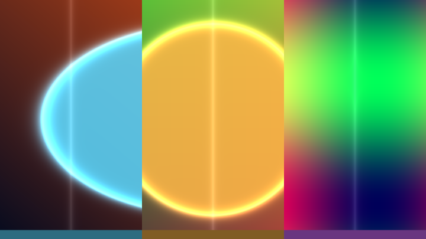
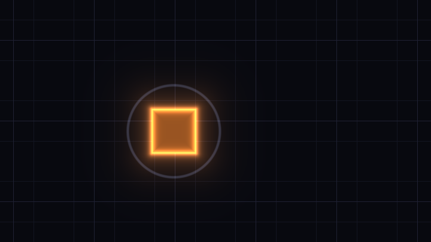
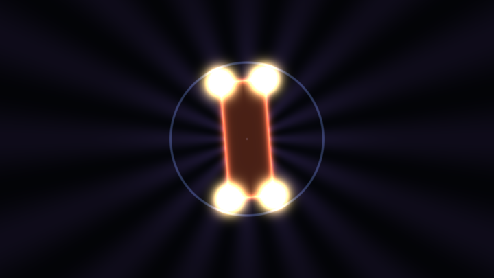
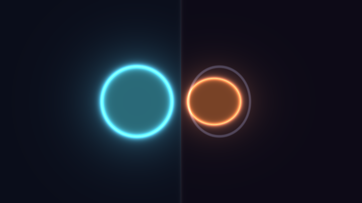
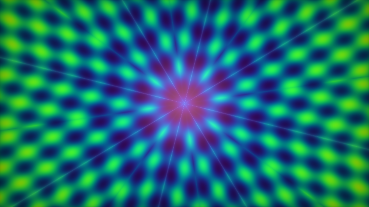
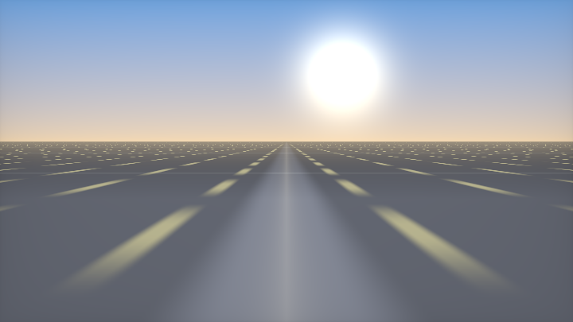

# 第 2 章 · 坐标系与变换

> 这一章解决一个看似琐碎、实际却决定成败的问题：**你要在什么样的坐标系里思考形状？**
>
> 几乎所有"圆变成椭圆"、"旋转方向反了"、"透视网格拧巴"的 bug，根都在这里。把这一章练成肌肉记忆，后面 2D / 3D 会轻松一个量级。

---

## 2.1 先建立直觉：坐标系就是舞台

第 0 章说过：shader 是在回答"这个像素应该是什么颜色"。而回答这个问题的第一步，永远是——

> **把像素坐标翻译成你想工作的空间里的点。**

`fragCoord` 给你的是像素坐标：左下角约 `(0.5, 0.5)`，右上角约 `(宽-0.5, 高-0.5)`。这个坐标系对画画几乎没用——圆的半径会随分辨率变，正方形在宽屏上会变扁，鼠标坐标和形状坐标对不上。

所以你要做的第一件事，就是把 `fragCoord` **归一化**成某种"有意义的" `uv` / `p`。语料库里几乎每个作品开头都有这一行（或它的变体）。别急着抄，先搞清楚**为什么有好几种写法**，以及**各自适合什么场景**。

---

## 2.2 UV 归一化的四大主流流派

下面四种写法覆盖了语料里 95% 以上的情况。每一种都有明确的"坐标系语义"，选错了后面全乱。

**三栏对照**：原始像素热力 / `[0,1]` uv / iq 高度归一化。只有第三栏的圆在任何宽高比下都是正圆——这就是除以 `y` 的意义。

<!-- glsl-from: examples/ch2_stage1.glsl -->
```glsl
vec2 p = (2.0*fragCoord - iResolution.xy) / iResolution.y;
```



### 流派 A · iq 高度归一化（本手册默认）

<!-- glsl-skip -->
```glsl
// 中心为原点，y ∈ [-1, 1]，x 随宽高比伸展
vec2 p = (2.0 * fragCoord - iResolution.xy) / iResolution.y;
// 等价写法（更常见）：
vec2 p = (fragCoord * 2.0 - iResolution.xy) / iResolution.y;
```

> 📄 出自 `000908-3lsSzf-Happy_Jumping/image.glsl`（iq）——写法为 `(-iResolution.xy + 2.0*fragCoord)/iResolution.y`

kishimisu 的入门神作也是同一族：

> 📄 出自 `001063-mtyGWy-Shader_Art_Coding_Introduction/image.glsl`（kishimisu）

<!-- glsl-skip -->
```glsl
vec2 uv = (fragCoord * 2.0 - iResolution.xy) / iResolution.y;
```

**语义**：

| 位置 | 坐标 |
|---|---|
| 屏幕中心 | `(0, 0)` |
| 上边缘中点 | `(0, +1)` |
| 下边缘中点 | `(0, -1)` |
| 左/右边缘 | `x = ±宽高比`（例如 16:9 时约 `±1.78`） |

**为什么是默认？**

1. **圆是圆**：`length(p) - r` 在任何分辨率下都是正圆。
2. **尺寸稳定**：半径 `0.3` 永远是"屏幕高度的 15%"，换手机也不会突然变大变小。
3. **中心对称**：旋转、对称、极坐标都以原点为自然中心。
4. **和 3D 射线方向一致**：后面做 raymarch 时，`normalize(vec3(p, 1.5))` 几乎无缝接上。

### 流派 B · `[0,1]` 再映射

<!-- glsl-frag -->
```glsl
vec2 uv = fragCoord / iResolution.xy;   // uv ∈ [0,1]²，左下角 (0,0)，右上角 (1,1)
```

> 📄 出自 `000581-ll2GD3-Palettes/image.glsl`（iq）——调色板演示用的就是这种

以及经典的"先 [0,1] 再扩到 [-1,1]"：

> 📄 出自 `000139-Xd2XWR-Time_Coordinates/image.glsl`（burito）

<!-- glsl-frag -->
```glsl
vec2 uv = fragCoord.xy / iResolution.xy;
vec2 p = -1.0 + 2.0 * uv;
p.x *= iResolution.x / iResolution.y;   // 事后补宽高比
```

**什么时候用 `[0,1]`？**

- 采样全屏纹理、Buffer（UV 天然就是 [0,1]）
- 做渐变条、UI、调色板条带
- 需要"左下角是原点、右上角是 (1,1)"的直觉（和很多图形 API 一致）

**什么时候别用？** 做几何形状时。因为：

1. 不除以同一个数 → 圆变椭圆（除非你再乘宽高比）
2. 原点在角落 → 旋转、对称都要先减 `0.5`，啰嗦且易错

**实践建议**：全屏后期 Pass 用 `[0,1]`；造型用高度归一化。两者可以并存——Heartfelt 就是这么干的：

> 📄 出自 `001078-ltffzl-Heartfelt/image.glsl`（BigWIngs）

<!-- glsl-frag -->
```glsl
vec2 uv = (fragCoord.xy - .5 * iResolution.xy) / iResolution.y; // 造型用
vec2 UV = fragCoord.xy / iResolution.xy;                         // 采样背景用
```

### 流派 C · `fragCoord - 0.5 * res`（像素中心对齐）

<!-- glsl-frag -->
```glsl
vec2 p = (fragCoord - 0.5 * iResolution.xy) / iResolution.y;
```

> 📄 出自 `001078-ltffzl-Heartfelt/image.glsl`（BigWIngs）
>
> 📄 出自 `001579-3l23Rh-Protean_clouds/image.glsl`（nimitz）——`(gl_FragCoord.xy - 0.5*iResolution.xy)/iResolution.y`

这和流派 A **几乎等价**，只差一个常数因子：

```
流派 A: (2*fragCoord - res) / res.y     → y ∈ 约 [-1, 1]
流派 C: (fragCoord - 0.5*res) / res.y   → y ∈ 约 [-0.5, 0.5]
```

流派 C 的范围是流派 A 的一半。有人喜欢它，因为 `0.5` 这个数字和"半屏"对得上；也有人嫌半径数字变小不好调。**选一个，全书统一即可。** 本手册正文默认用流派 A。

> **关于那个 0.5**：`fragCoord` 本身已经是像素中心（见第 1 章）。减 `0.5 * iResolution` 是把坐标系原点挪到屏幕中心，不是"再对齐一次像素"。两者别混。

### 流派 D · Coyote 无除法构造 `rd`（3D 射线方向）

做 raymarching 时，你需要的不只是 2D 的 `p`，而是 3D 射线方向 `rd`。常规写法：

<!-- glsl-skip -->
```glsl
vec2 p = (2.0 * fragCoord - iResolution.xy) / iResolution.y;
vec3 rd = normalize(vec3(p, 1.5));
```

Coyote 指出可以合成一行、且**不显式除以 `iResolution.y`**：

> 📄 出自 `000072-MsySWK-Raymarched_2D_Sierpinski/image.glsl`（Shane，注释标明 courtesy of Coyote）

<!-- glsl-frag -->
```glsl
// Unit directional ray with no divide, courtesy of Coyote.
vec3 rd = normalize(vec3(2.0 * fragCoord - iResolution.xy, iResolution.y));
```

> 📄 出自 `000115-Mly3WV-Oldschool_Tube/image.glsl`（Shane）

<!-- glsl-frag -->
```glsl
vec3 rd = normalize(vec3(fragCoord - iResolution.xy * 0.5, iResolution.y));
```

**为什么合法？**

`normalize(vec3(2*fc - res.xy, res.y))` 等价于：

```
normalize( vec3( (2*fc - res.xy)/res.y , 1.0 ) )
```

因为 `normalize(k*v) = normalize(v)`，把整个向量乘以 `res.y` 不影响方向。于是"除法"被吸进了 `normalize` 里——高尔夫和性能上都更干净。

变体（控制焦距）：

> 📄 出自 `000237-ldtGWj-Precalculated_Voronoi_Heightmap/image.glsl`（Shane）

<!-- glsl-frag -->
```glsl
vec3 rd = normalize(vec3(fragCoord - iResolution.xy * 0.5,
                         min(iResolution.y * 0.75, 600.0)));
```

这里 z 分量是焦距：越大视野越窄（长焦），越小视野越广（广角）。

**记住口诀**：

| 写法 | 用途 |
|---|---|
| `(2*fc-res)/res.y` | 2D 造型默认 |
| `fc/res.xy` | 纹理 / Buffer / UI |
| `(fc-0.5*res)/res.y` | 半范围中心坐标 |
| `normalize(vec3(2*fc-res, res.y))` | 3D 射线，Coyote 无除法 |

---

## 2.3 为什么除以 `iResolution.y`？

这是新手问得最多的问题之一。第 0 章已经给过短答，这里把几何说透。

### 错误示范：除以 `.xy`

<!-- glsl-frag -->
```glsl
vec2 uv = fragCoord / iResolution.xy;   // x ∈ [0,1], y ∈ [0,1]
float d = length(uv - 0.5) - 0.25;
```

在 16:9 屏幕上，x 方向的"物理一单位"比 y 方向短（同样的 0→1 对应更多像素）。于是圆被横向压扁成椭圆。

### 正确：除以同一个标量

<!-- glsl-frag -->
```glsl
vec2 p = (2.0 * fragCoord - iResolution.xy) / iResolution.y;
float d = length(p) - 0.5;   // 任何分辨率都是正圆
```

x 和 y 被**同一个数**缩放，像素的物理宽高比被保留。代价是：宽屏上 `|p.x|` 可以超过 1——这正是你想要的（两侧多出来的空间用来放内容，而不是把圆拉扁）。

### 另一种正确：先 `[0,1]` 再补宽高比

<!-- glsl-frag -->
```glsl
vec2 p = fragCoord / iResolution.xy;          // [0,1]²
p = p * 2.0 - 1.0;                            // [-1,1]²
p.x *= iResolution.x / iResolution.y;         // 把 x 拉开
```

结果和流派 A 一样，只是分了三步。语料里两种都常见。

### 什么时候故意不用高度归一化？

- **全屏后期**（模糊、色调映射）：你要的是纹理 UV，不是几何
- **故意要椭圆**：比如拉伸星空、挤压 UI
- **像素艺术**：按整数像素思考，根本不归一化

语料统计：`iResolution.y` 出现在 **49.6%** 的文件里——这不是巧合，是整个社区的共识。

---

## 2.4 平移 = 减法

要把形状从原点挪到 `c`，你**不是**给形状加偏移，而是给坐标减偏移：

<!-- glsl-skip -->
```glsl
vec2 q = p - c;           // 把坐标系原点搬到 c
float d = length(q) - r;  // 在新坐标系里画圆，圆就出现在 c
```

> 📄 出自 `000440-4dfXDn-2d_signed_distance_functions/image.glsl`（Maarten）

```glsl
vec2 translate(vec2 p, vec2 t)
{
    return p - t;
}
// 使用：circleDist(translate(p, vec2(100, 250)), 40.0);
```

**为什么是减法？** 因为你问的是："点 p 在以 c 为原点的坐标系里叫什么？"答案是 `p - c`。形状函数始终假设"自己在原点"——这是整个域变换思想的起点（见 2.8）。

动画平移？让 `c` 随时间变：

<!-- glsl-skip -->
```glsl
vec2 c = vec2(cos(iTime), sin(iTime * 0.7)) * 0.5;
float d = length(p - c) - 0.2;
```

**轨道运动**：`p - offset(iTime)`。网格一动，你就永远忘不了「移形状 = 减坐标」。

<!-- glsl-from: examples/ch2_stage2.glsl -->
```glsl
vec2 q = p - orbit;
float d = length(q) - r;
```



---

## 2.5 旋转：`mat2(c, -s, s, c)`

第 1 章提过矩阵是列主序。这里把它变成可操作的工具。

**旋转矩形 + 放射线**：`p *= mat2(c,-s,s,c)`。方向反了就换 `-s` 的位置。

<!-- glsl-from: examples/ch2_stage3.glsl -->
```glsl
p *= mat2(c, -s, s, c);
```



### 标准旋转函数

```glsl
mat2 rot2(float a)
{
    float c = cos(a), s = sin(a);
    return mat2(c, -s,   // 第一列
                s,  c);  // 第二列
}
// 使用：p *= rot2(iTime);   或   p = rot2(a) * p;
```

> 📄 出自 `000356-llySRh-iResolution_iMouse_iDate_etc/image.glsl`（FabriceNeyret2）

```glsl
#define rot2(a) mat2(cos(a), -sin(a), sin(a), cos(a))
```

> 📄 出自 `000440-4dfXDn-2d_signed_distance_functions/image.glsl`（Maarten）——分别给出 CW / CCW

```glsl
vec2 rotateCW(vec2 p, float a)
{
    mat2 m = mat2(cos(a), -sin(a), sin(a), cos(a));
    return p * m;   // 注意：右乘
}

vec2 rotateCCW(vec2 p, float a)
{
    mat2 m = mat2(cos(a), sin(a), -sin(a), cos(a));
    return p * m;
}
```

### 方向陷阱（必读）

| 写法 | 实际效果 |
|---|---|
| `rot2(a) * p` | 逆时针转 `a`（数学标准） |
| `p * rot2(a)` | 等于用转置，变成顺时针 |
| `mat2(c,-s,s,c)` vs `mat2(c,s,-s,c)` | 互为转置，方向相反 |

语料里两种乘法都有。读别人代码时，**先看是左乘还是右乘**，再判断方向。自己写的时候挑一种并固定。

### 绕任意点旋转

先平移到该点，再转，再平移回去：

<!-- glsl-skip -->
```glsl
vec2 rotateAround(vec2 p, vec2 pivot, float a)
{
    return rot2(a) * (p - pivot) + pivot;
}
```

### 省指令的角度向量（Fabrice / Shane 常用）

不想每次都算 `cos/sin` 两次时：

> 📄 出自 `000072-MsySWK-Raymarched_2D_Sierpinski/image.glsl`（Shane，注明 courtesy of Fabrice Neyret）

<!-- glsl-skip -->
```glsl
// a = (cos θ, sin θ)，利用 cos(θ-π/2)=sin θ
vec2 a = sin(vec2(1.570796, 0.0) - angle);
rd.xy = rd.xy * mat2(a, -a.y, a.x);
```

---

## 2.6 缩放

缩放是最简单的域变换，也最容易在 SDF 上踩坑。

**圆变椭圆**：非均匀除坐标。缩放形状 = **除以** scale，不是乘。

<!-- glsl-from: examples/ch2_stage4.glsl -->
```glsl
vec2 q = p / vec2(sx, sy);
float d = length(q) - r;
```



### 均匀缩放

<!-- glsl-skip -->
```glsl
float s = 2.0;
float d = sdSomething(p / s) * s;   // 除以 s 放大形状；最后乘回 s 修正距离
```

**为什么最后要 `* s`？** 因为 SDF 返回的是距离。你把坐标缩小了 2 倍（形状放大 2 倍），算出来的距离也小了 2 倍，必须乘回去，否则后面的 raymarch / 抗锯齿宽度会错。

### 非均匀缩放（小心）

<!-- glsl-skip -->
```glsl
vec2 s = vec2(2.0, 0.5);
float d = sdCircle(p / s);   // 圆被压成椭圆——但这不再是严格 SDF
// 近似修正（偏保守）：
d *= min(s.x, s.y);
```

非均匀缩放会破坏欧氏距离的精确性。2D 画图时通常无所谓（你只关心符号和大致梯度）；3D raymarch 时可能导致漏步，需要更保守的步长。

### 缩放 = 换单位

把"我想要半径 50 像素的圆"翻译成高度归一化坐标：

```
r_normalized = 50.0 * 2.0 / iResolution.y;   // 流派 A 下
```

或者反过来：先在像素坐标里造型（Maarten 的 2D SDF demo 就是这么干的——坐标直接用像素），最后再考虑归一化。两种工作流都合法。

---

## 2.7 极坐标

笛卡尔坐标擅长轴对齐的东西；极坐标擅长**围绕一个中心**的东西——圆环、螺旋、放射对称、齿轮。

**极坐标万花筒**：`atan` 折叠扇区。和第 6 章曼陀罗是同一肌肉。

<!-- glsl-from: examples/ch2_stage5.glsl -->
```glsl
float a = abs(atan(p.y,p.x));
a = mod(a, TAU/n);
```



### 基本转换

> 📄 出自 `000356-llySRh-iResolution_iMouse_iDate_etc/image.glsl`（FabriceNeyret2）

```glsl
#define cart2pol(U)  vec2(length(U), atan((U).y, (U).x))
#define pol2cart(U)  ((U).x * vec2(cos((U).y), sin((U).y)))
```

<!-- glsl-frag -->
```glsl
float r = length(p);
float a = atan(p.y, p.x);   // 注意：atan(y,x) 两参数版才是 atan2
```

### 立刻能用的三个图案

**① 圆环**

<!-- glsl-frag -->
```glsl
float d = abs(length(p) - 0.5) - 0.05;   // 中心半径 0.5、半宽 0.05 的圆环
```

**② 放射花瓣（用角度调制半径）**

<!-- glsl-frag -->
```glsl
float a = atan(p.y, p.x);
float r = length(p);
float petal = 0.3 + 0.1 * cos(a * 5.0);  // 5 瓣
float d = r - petal;
```

**③ 螺旋**

<!-- glsl-frag -->
```glsl
float a = atan(p.y, p.x);
float r = length(p);
float d = abs(r - 0.15 * a / 3.14159) - 0.02;
```

### 极坐标里的"矩形"思维

把 `(r, a)` 当成新的笛卡尔坐标去重复、取模，你会得到环形阵列、蛋糕切块等效果——见 2.9 的极坐标对称。

---

## 2.8 域变换思想：变换形状 = 反向变换坐标

这是本章、也是整本手册最重要的一句话：

> **你从不"移动形状"。你移动的是坐标系，形状函数始终假设自己在原点。**

用数学写：

```
想看的形状：  f( R⁻¹ (p - t) / s )
             └─先平移─┘ └旋转┘ └缩放
```

操作顺序（对坐标！）通常是：**先平移，再旋转，再缩放**——或者说，按你希望形状被施加的变换的**逆序**去变换坐标。

### 一个完整例子：旋转的圆角矩形

```glsl
float sdBox(vec2 p, vec2 b)
{
    vec2 d = abs(p) - b;
    return length(max(d, 0.0)) + min(max(d.x, d.y), 0.0);
}

void mainImage(out vec4 fragColor, in vec2 fragCoord)
{
    vec2 p = (2.0 * fragCoord - iResolution.xy) / iResolution.y;

    // 想要：矩形中心在 (0.3, 0.1)，旋转 iTime，尺寸 (0.4, 0.2)
    vec2 q = p - vec2(0.3, 0.1);          // 1. 平移（坐标减）
    q *= mat2(cos(iTime), -sin(iTime),
              sin(iTime),  cos(iTime));   // 2. 旋转（坐标乘逆旋转=转 -a，这里直接转）
    // 注意：对坐标乘 rot(a) 等价于形状转 -a；要让形状转 +a，应对坐标乘 rot(-a)
    float d = sdBox(q, vec2(0.4, 0.2));

    vec3 col = vec3(0.08, 0.09, 0.12);
    col = mix(col, vec3(0.95, 0.75, 0.35), smoothstep(0.01, -0.01, d));
    fragColor = vec4(col, 1.0);
}
```

### 旋转方向的记忆法

- **对坐标**施加 `rot(+a)` → 形状看起来转了 `-a`
- 所以"让形状顺时针转 a" = "让坐标逆时针转 a"

别死记，调试时改一下符号立刻知道。

### 为什么这个思想贯穿全书？

因为后面所有高级技法都是域变换：

| 技法 | 对坐标做了什么 |
|---|---|
| 重复（第 6 章） | `fract(p)` 折叠进一个格子 |
| 对称 | `abs(p)` 折叠象限 |
| 扭曲 | `p += noise(p)` |
| 分形 / KIFS（第 11 章） | 反复折叠 + 旋转 + 缩放 |
| 3D 物体摆放（第 8 章） | 对 `p` 做刚体变换再丢进 `sdXxx` |

**造型 = 设计坐标怎么被改写，然后喂给一个简单的原点形状。**

---

## 2.9 折叠、取模、极坐标对称

这三类是"用域变换凭空变出复杂度"的基础招式。

### ① `abs` 折叠——镜面对称

<!-- glsl-skip -->
```glsl
vec2 q = vec2(abs(p.x), p.y);   // 把左半平面 Mirror 到右半平面
float d = sdSomething(q - vec2(0.4, 0.0));
// 结果：右边有一个形状，左边自动出现镜像
```

双向折叠：

<!-- glsl-skip -->
```glsl
vec2 q = abs(p);                // 四个象限都折叠到第一象限
float d = length(q - vec2(0.5, 0.5)) - 0.15;  // 四个角上各一个圆
```

> 📄 出自 `000070-mtVXzR-Apparent_Motion/image.glsl`——`abs(u.yx)` / `abs(u)` 做四向箭头对称

这是 Kaleidoscope、雪花、昆虫翅膀对称的起点。折叠次数越多，对称阶数越高。

### ② 取模重复——无限阵列

<!-- glsl-skip -->
```glsl
float cell = 0.5;
vec2 q = mod(p + 0.5 * cell, cell) - 0.5 * cell;  // 每格中心为原点
// 或等价：
// vec2 id = floor(p / cell);
// vec2 q  = fract(p / cell) * cell - 0.5 * cell;
float d = length(q) - 0.15;   // 每个格子里一个圆，成本 = 一个圆
```

> 📄 出自 `001063-mtyGWy-Shader_Art_Coding_Introduction/image.glsl`（kishimisu）——`fract(uv * 1.5) - 0.5` 做缩放重复

关键细节：

- **`mod` 对负数友好**：`mod(-0.3, 1.0) = 0.7`，所以负半轴也会正确重复（见第 1 章）
- **格子编号** `id = floor(p/cell)` 用来查随机数，让每格不一样（第 5、6 章）
- **SDF 修正**：取模后距离场在格子边界附近可能不精确，2D 画图通常无所谓

一维取模（横条、竖条）：

<!-- glsl-frag -->
```glsl
float q = abs(mod(p.y, 0.2) - 0.1) - 0.03;  // 水平条纹
```

### ③ 极坐标对称——N 次旋转对称

把平面切成 N 块扇形，只在一块里造型，自动复制到所有扇区：

<!-- glsl-skip -->
```glsl
vec2 pmod(vec2 p, float n)
{
    float a = atan(p.y, p.x);
    float r = length(p);
    float sector = 6.2831853 / n;
    a = mod(a + 0.5 * sector, sector) - 0.5 * sector;
    return vec2(cos(a), sin(a)) * r;
}

// 使用：5 次对称的圆点
vec2 q = pmod(p, 5.0);
float d = length(q - vec2(0.45, 0.0)) - 0.12;
```

> 📄 出自 `000075-WllSDM-Neon_road/image.glsl`（kaneta）——`pmod` 用于六边形道路物件阵列

Coastal Landscape 把极坐标用到了极致——用 `length` + `atan` 把天空切成同心环与扇区：

> 📄 出自 `000594-fstyD4-Coastal_Landscape/image.glsl`（Aleksey)

<!-- glsl-skip -->
```glsl
vec2 uv = (g + g - r) / r.y;           // 高度归一化（高尔夫写法）
id = vec2((length(u) + 0.01) * yd, 0); // 环号
id.y = atan(t.y, t.x) * xd;            // 扇区号
lc = fract(id);                        // 扇区内局部坐标
```

### 三种折叠的选择指南

| 你想要 | 用 |
|---|---|
| 左右 / 上下镜像 | `abs(p.x)` / `abs(p.y)` |
| 四象限万花筒 | `abs(p)` |
| 无限平铺 | `mod` / `fract` |
| 花朵 / 齿轮 / 曼陀罗 | 极坐标 `pmod` |
| 六边形蜂窝 | 专用六边形格子（第 6 章） |

---

## 2.10 2.5D 透视伪造：`1/y` 的魔力

第 0 章强调过：很多"看起来像 3D"的画面其实是纯 2D。其中最强的一招是**透视除法**。

**较难成片 · 假透视公路**：`1/y` 地平线 + 流动虚线 + 太阳。demoscene 地板的祖传配方。

<!-- glsl-from: examples/ch2_stage6.glsl -->
```glsl
float z = 1.0 / max(uv.y, 0.02);
// road dash by z and x
```



### 几何直觉

在针孔相机模型里，世界点 `(X, Y, Z)` 投影到屏幕的公式是：

```
x_screen ∝ X / Z
y_screen ∝ Y / Z
```

反过来：如果你有屏幕坐标 `(x, y)`，并假设地面是 `Y = const` 的平面，那么：

```
Z ∝ 1 / y_screen
X ∝ x_screen / y_screen
```

于是——**用 `1/y` 重新解释屏幕坐标，平面上的均匀网格就会自动变成透视网格。**

### 合成波地面网格（实战）

> 📄 出自 `000465-Wt33Wf-Cyber_Fuji_2020/image.glsl`（kaiware007）

<!-- glsl-skip -->
```glsl
if (uv.y < -0.2)
{
    uv.y = 3.0 / (abs(uv.y + 0.2) + 0.05);  // 透视：越近（屏幕下方）分母越小 → 坐标越大
    uv.x *= uv.y;                            // x 也按深度拉伸
    float gridVal = grid(uv, battery);
    col = mix(col, vec3(1.0, 0.5, 1.0), gridVal);
}
```

拆解：

1. `uv.y + 0.2`：把地平线移到 0
2. `1 / (...)`：透视除法，得到"深度"
3. `uv.x *= uv.y`：横向也按深度放大（近大远小）
4. 在这个扭曲后的 UV 上画普通正交网格 → 看起来就像延伸到地平线的公路

### 自己手写一个最小透视网格

```glsl
void mainImage(out vec4 fragColor, in vec2 fragCoord)
{
    vec2 uv = (2.0 * fragCoord - iResolution.xy) / iResolution.y;
    vec3 col = vec3(0.02, 0.02, 0.05);

    if (uv.y < -0.15)
    {
        float persp = 1.0 / (abs(uv.y + 0.15) + 0.05);
        vec2 gp = vec2(uv.x * persp, persp);
        gp.y += iTime * 2.0;   // 向前飞

        // 网格线 = 到最近整数的距离很小
        vec2 g = abs(fract(gp) - 0.5);
        float line = smoothstep(0.05, 0.04, min(g.x, g.y));
        // 远处淡出
        float fade = smoothstep(2.0, 20.0, persp);
        col = mix(col, vec3(1.0, 0.3, 0.8), line * (1.0 - fade));
    }
    else
    {
        // 天空渐变
        col = mix(vec3(0.6, 0.2, 0.5), vec3(0.05, 0.0, 0.15), uv.y + 0.15);
    }

    fragColor = vec4(col, 1.0);
}
```

### 还有哪些地方用 `1/y`？

- 隧道：把 UV 解释成极坐标 + 深度（`r = length(uv), z = 1/r`）
- 楼房侧面：横向用 `1/x`
- 伪 3D 精灵缩放：`scale ∝ 1/depth`

**判断法则**（呼应第 0 章）：相机不需要自由转动时，先问自己能不能用 `1/y` 伪造。答案经常是能。

---

## 2.11 实战小例子三则

理论要落地。下面三个例子各自只练一件事，建议逐个敲进 Shadertoy。

### 例子 1：旋转万花筒圆点

练：高度归一化 + `pmod` + `abs` 折叠思维。

```glsl
vec2 pmod(vec2 p, float n)
{
    float a = atan(p.y, p.x);
    float sector = 6.2831853 / n;
    a = mod(a + 0.5 * sector, sector) - 0.5 * sector;
    return length(p) * vec2(cos(a), sin(a));
}

void mainImage(out vec4 fragColor, in vec2 fragCoord)
{
    vec2 p = (2.0 * fragCoord - iResolution.xy) / iResolution.y;
    p *= mat2(cos(iTime * 0.3), -sin(iTime * 0.3),
              sin(iTime * 0.3),  cos(iTime * 0.3));

    vec2 q = pmod(p, 6.0);
    float d = length(q - vec2(0.55, 0.0)) - 0.12;
    d = min(d, length(q) - 0.08);   // 中心再加一个

    vec3 col = vec3(0.05);
    col += vec3(0.2, 0.6, 1.0) * exp(-d * 20.0);          // 辉光
    col = mix(col, vec3(1.0), smoothstep(0.01, -0.01, d)); // 实体

    fragColor = vec4(col, 1.0);
}
```

### 例子 2：重复 + 每格旋转

练：`fract` 格子 + 格子内旋转 + id。

```glsl
void mainImage(out vec4 fragColor, in vec2 fragCoord)
{
    vec2 p = (2.0 * fragCoord - iResolution.xy) / iResolution.y;
    p *= 3.0;

    vec2 id = floor(p);
    vec2 q  = fract(p) - 0.5;

    float ang = iTime + dot(id, vec2(0.1, 0.23));
    q *= mat2(cos(ang), -sin(ang), sin(ang), cos(ang));

    // 小方块
    vec2 b = abs(q) - 0.25;
    float d = length(max(b, 0.0)) + min(max(b.x, b.y), 0.0);

    vec3 col = 0.5 + 0.5 * cos(vec3(0.0, 2.0, 4.0) + id.x + id.y * 0.3);
    col *= smoothstep(0.02, -0.02, d);

    fragColor = vec4(col, 1.0);
}
```

### 例子 3：极坐标螺旋隧道（伪 3D）

练：极坐标 + `1/r` 深度。

```glsl
void mainImage(out vec4 fragColor, in vec2 fragCoord)
{
    vec2 p = (2.0 * fragCoord - iResolution.xy) / iResolution.y;

    float r = length(p);
    float a = atan(p.y, p.x);
    float z = 1.0 / (r + 0.05) + iTime;   // 深度 + 前进

    float stripes = smoothstep(0.1, 0.0, abs(fract(a / 3.14159 * 3.0 + z) - 0.5));
    vec3 col = mix(vec3(0.02, 0.0, 0.05), vec3(0.9, 0.3, 1.0), stripes);
    col *= smoothstep(1.2, 0.1, r);       // 暗角 + 中心隧道口

    fragColor = vec4(col, 1.0);
}
```

---

## 2.12 调试坐标系的四个习惯

1. **先输出 UV 当颜色**：`fragColor = vec4(p * 0.5 + 0.5, 0.0, 1.0);`——红绿渐变立刻告诉你原点在哪、轴向对不对、有没有被压扁。
2. **画单位圆**：`smoothstep` 一个 `length(p)-1.0`，看圆是否贴到上下边缘、左右是否被裁切。
3. **画十字准星**：`min(abs(p.x), abs(p.y))` 出一条细线，确认中心。
4. **改一个变换系数看差分**：旋转角度乘 0、缩放改 1、平移改 0——每次只关一个变换，定位是哪一步反了。

---

## 2.13 阶梯实战：从归一化到假透视公路

正文对应小节已嵌入可跑例子。连刷顺序：

| 阶段 | 文件 | 看点 | 嵌在 |
|---|---|---|---|
| 1 | `ch2_stage1` | 三种 UV 对照 | 2.2 |
| 2 | `ch2_stage2` | 平移 = 减法 | 2.4 |
| 3 | `ch2_stage3` | mat2 旋转 | 2.5 |
| 4 | `ch2_stage4` | 非均匀缩放 | 2.6 |
| 5 | `ch2_stage5` | 极坐标万花筒 | 2.7 / 2.9 |
| 6 | `ch2_stage6` | **2.5D 公路**（较难） | 2.10 |

**延展**：公路两侧加电线杆（按 `1/y` 缩放）；万花筒扇区数接到 `iMouse.x`。

## 本章要点回顾

- **先选坐标系，再造型。** 默认用高度归一化：`(2*fragCoord - res) / res.y`。
- **除以 `iResolution.y`** 是为了保宽高比；除以 `.xy` 会把圆压扁。
- **`[0,1]` UV** 留给纹理和后期；造型坐标和采样坐标可以并存（Heartfelt 模式）。
- **Coyote 无除法 `rd`**：`normalize(vec3(2*fc - res.xy, res.y))`，除法被 normalize 吃掉。
- **平移 = 减，旋转 = 乘 mat2，缩放 = 除（距离再乘回来）。**
- **域变换核心**：变换形状 ≡ 反向变换坐标；形状函数永远住在原点。
- **`abs` 折叠、`mod`/`fract` 重复、极坐标 `pmod`** 是三大复杂度倍增器。
- **`1/y` 透视除法** 是 2.5D 的王牌——合成波地面、隧道、伪 3D 公路都靠它。
- 矩阵是**列主序**；`mat2(c,-s,s,c) * p` 为逆时针；`p * m` 方向相反。

---

> 上一章：[第 1 章 · 平台与心智模型](01-平台与心智模型.md) 　|　 下一章：[第 3 章 · 2D 形状与 SDF](03-2D形状与SDF.md)
