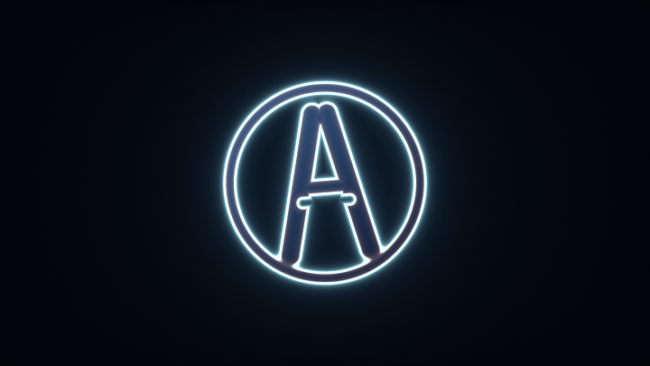
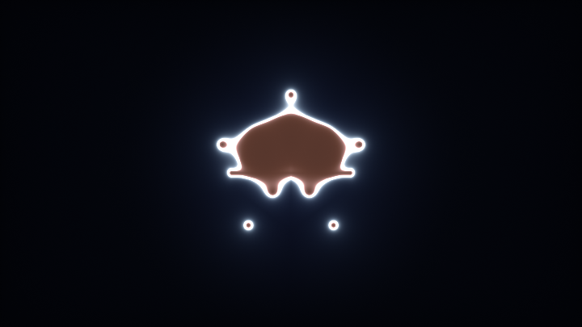
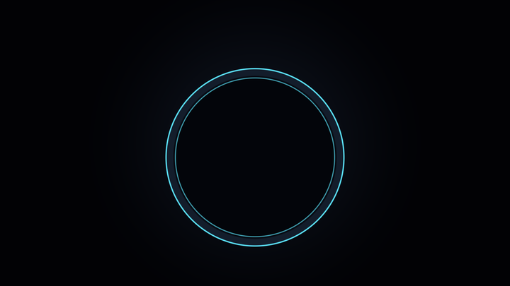
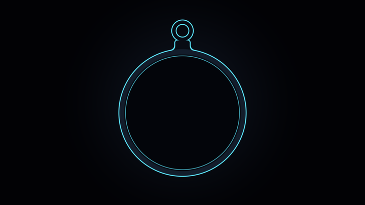
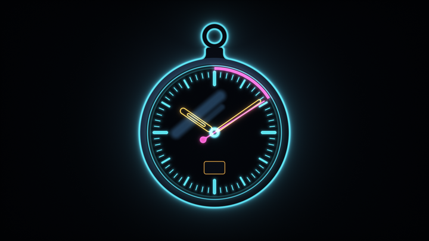
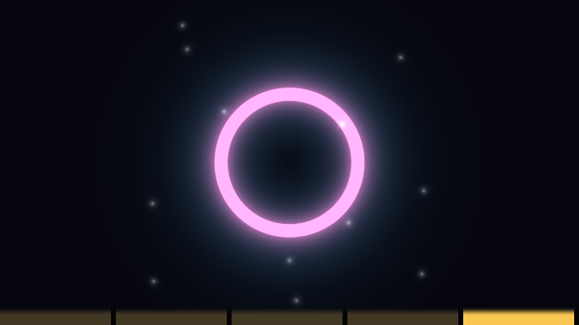

# 第 3 章 · 2D 形状与 SDF

> 有了坐标系，下一步是**在坐标系里放形状**。
>
> 这一章教你用有符号距离场（SDF）思考 2D 造型：怎么描述形状、怎么抗锯齿、怎么拼起来、怎么让它发光。读完你应该能从零拼出图标、Logo、HUD、抽象图案——不用一张贴图。

---

## 3.1 有符号距离场的直觉

回到第 0 章那句翻译：

> "画一个圆" → "对每个点 p，算它到圆周的有符号距离"

**有符号距离场** `d = sd(p)` 满足：

| 条件 | 含义 |
|---|---|
| `d < 0` | p 在形状**内部** |
| `d = 0` | p 在形状**边界**上 |
| `d > 0` | p 在形状**外部** |
| `|d|` | p 到最近表面的**欧氏距离** |

最后一个性质（绝对值等于真实距离）使 SDF 远强于普通的"内外测试"：

1. **描边**：`abs(d) - w` 立刻得到宽 `2w` 的描边
2. **圆角**：`sd(...) - r` 立刻给任何形状加圆角
3. **抗锯齿**：过渡带宽度用像素为单位精确控制
4. **辉光**：`exp(-k * max(d, 0))` 沿距离衰减
5. **布尔运算**：`min` / `max` 对应并 / 交

圆是最好的第一课：

```glsl
float sdCircle(vec2 p, float r)
{
    return length(p) - r;
}
```

> 📄 出自 `000440-4dfXDn-2d_signed_distance_functions/image.glsl`（Maarten）——`circleDist`

为什么 `length(p) - r` 既有符号又是精确距离？因为到原点的距离减半径，正好是到圆周的有符号距离。大多数更复杂的 SDF 都在模仿这种结构：先用对称/投影把问题降维，再落到一个 `length` 上。

### 和"隐式曲线"的区别

`f(p) = 0` 的隐式曲线只告诉你边界在哪，**不保证** `|f|` 是距离。例如 `p.x*p.x + p.y*p.y - r*r` 也是圆，但数值不是距离（差一个因子）。抗锯齿和辉光会跟着错。

**实践原则**：能用真正的 SDF 就用真正的；用不了时至少保证边界附近梯度大约为 1。

### 可视化距离场

调试 SDF 的第一手段——把距离画成条纹：

```glsl
vec3 debugSDF(float d)
{
    vec3 col = (d > 0.0) ? vec3(0.9, 0.6, 0.3) : vec3(0.65, 0.85, 1.0);
    col *= 1.0 - exp(-6.0 * abs(d));
    col *= 0.8 + 0.2 * cos(150.0 * d);          // 等值线
    col = mix(col, vec3(1.0), 1.0 - smoothstep(0.0, 0.01, abs(d))); // 零水平集加白
    return col;
}
```

任何时候形状不对，先输出 `debugSDF(d)`。比猜高效一百倍。

---

## 3.2 常用 2D SDF 图元库

下面每个函数都来自语料。建议建一个自己的 `sdf2d.glsl` 片段库，随用随抄。

### 圆 / 环

> 📄 出自 `000440-4dfXDn-2d_signed_distance_functions/image.glsl`（Maarten）

```glsl
float circleDist(vec2 p, float radius)
{
    return length(p) - radius;
}
```

圆环（洋葱的特例）：

```glsl
float sdRing(vec2 p, float r, float w)
{
    return abs(length(p) - r) - w;
}
```

### 盒子 / 圆角盒子

> 📄 出自 `000440-4dfXDn-2d_signed_distance_functions/image.glsl`（Maarten）

```glsl
float boxDist(vec2 p, vec2 size, float radius)
{
    size -= vec2(radius);
    vec2 d = abs(p) - size;
    return min(max(d.x, d.y), 0.0) + length(max(d, 0.0)) - radius;
}
```

拆解这段——它是 2D SDF 里最值得背的结构之一：

1. `abs(p)`：利用对称，只看第一象限
2. `d = abs(p) - size`：把盒子"减去"后，外部为正、内部为负
3. `length(max(d, 0))`：外部到角/边的距离
4. `min(max(d.x, d.y), 0)`：内部的负距离（到最近边）
5. 最后 `- radius`：圆角（等价于先缩小盒子再膨胀）

无圆角时令 `radius = 0` 就是尖角盒子。iq 风格的无圆角版更短：

> 📄 出自 `000070-mtVXzR-Apparent_Motion/image.glsl`

```glsl
float sdBox(vec2 p, vec2 b)
{
    vec2 d = abs(p) - b;
    return length(max(d, 0.0)) + min(max(d.x, d.y), 0.0);
}
```

### 线段（Segment）

> 📄 出自 `000065-MsjyW3-Constellations/image.glsl`

```glsl
float sdSegment(in vec2 p, in vec2 a, in vec2 b)
{
    vec2 pa = p - a;
    vec2 ba = b - a;
    float h = clamp(dot(pa, ba) / dot(ba, ba), 0.0, 1.0);
    return length(pa - ba * h);
}
```

直觉：把 `p` 投影到线段 `ab` 上，钳制到 `[0,1]`，再取距离。这是画折线、树枝、星座连线、电线的基础。

带宽度的线（Maarten 版直接把宽度做进距离）：

> 📄 出自 `000440-4dfXDn-2d_signed_distance_functions/image.glsl`（Maarten）

```glsl
float lineDist(vec2 p, vec2 start, vec2 end, float width)
{
    vec2 dir = start - end;
    float lngth = length(dir);
    dir /= lngth;
    vec2 proj = max(0.0, min(lngth, dot((start - p), dir))) * dir;
    return length((start - p) - proj) - (width / 2.0);
}
```

### 等边三角形

> 📄 出自 `000070-mtVXzR-Apparent_Motion/image.glsl`

```glsl
float sdEquilateralTriangle(in vec2 p, in float r)
{
    const float k = sqrt(3.0);
    p.x = abs(p.x) - r;
    p.y = p.y + r / k;
    if (p.x + k * p.y > 0.0)
        p = vec2(p.x - k * p.y, -k * p.x - p.y) / 2.0;
    p.x -= clamp(p.x, -2.0 * r, 0.0);
    return -length(p) * sign(p.y);
}
```

Maarten 的简化版（bound，不是严格欧氏，但画图够用且更快）：

> 📄 出自 `000440-4dfXDn-2d_signed_distance_functions/image.glsl`（Maarten）

```glsl
float triangleDist(vec2 p, float radius)
{
    return max(abs(p).x * 0.866025 + p.y * 0.5, -p.y) - radius * 0.5;
}
```

`0.866025 ≈ √3/2`，就是 30°/60° 的法线点积。`max` 几个半平面 = 凸多边形——这是所有正多边形 SDF 的统一构造法。

### 六边形

严格欧氏版（iq，经 Shane 适配）：

> 📄 出自 `000072-tXcSzr-Isometric_Hexagon_Cube_Pattern/common.glsl`（Shane）

```glsl
float sdHex(vec2 p, float r)
{
    // 尖顶六边形
    const vec3 k = vec3(0.5, -0.866025404, 0.577350269);
    p = abs(p);
    p -= 2.0 * min(dot(k.xy, p), 0.0) * k.xy;
    p -= vec2(r, clamp(p.y, -k.z * r, k.z * r));
    return length(p) * sign(p.x);
}
```

更快的 bound（够抗锯齿用）：

> 📄 出自 `000061-3tKSWV-Hex_Neon_Love/image.glsl`（Shane）

<!-- glsl-skip -->
```glsl
float hex(in vec2 p)
{
    p = abs(p);
    // s = vec2(1, 1.73205) 一类的六边形度量常数
    return max(dot(p, s * 0.5), p.x);
}
```

蜂窝、螺丝钉、科幻地板——六边形是语料高频图元。

### 椭圆

精确椭圆 SDF 出人意料地贵（要求根），iq 给了完整版：

> 📄 出自 `000075-3tyGRz-Marakami_Galaxy/image.glsl`（注释标明 An ellipse SDF by iq）

<!-- glsl-skip -->
```glsl
float sdEllipse(in vec2 z, in vec2 ab)
{
    vec2 p = vec2(abs(z));
    if (p.x > p.y) { p = p.yx; ab = ab.yx; }
    // ... 三次方程求根（见原文）...
    // 返回有符号距离
}
```

**大多数时候你不需要精确版。** 用非均匀缩放圆近似：

```glsl
float sdEllipseApprox(vec2 p, vec2 ab)
{
    return (length(p / ab) - 1.0) * min(ab.x, ab.y);
}
```

画 UI、眼睛、星球轮廓完全够用。只有做精确碰撞或 3D 挤出时才上精确版。

### Vesica（双圆透镜 / 杏仁形）

两个圆相交的公共区域边界，经典宗教/纹章形状，也常用来做眼睛、花瓣。

> 📄 出自 `000069-4lyfzw-Extrusion_and_Revolution_SDF/image.glsl`（iq）

```glsl
float sdVesica(vec2 p, float r, float d)
{
    p = abs(p);
    float b = sqrt(r * r - d * d);
    return ((p.y - b) * d > p.x * b)
        ? length(p - vec2(0.0, b))
        : length(p - vec2(-d, 0.0)) - r;
}
```

参数：`r` 是两个圆的半径，`d` 是圆心到对称轴的距离（`d < r`）。`d` 越小透镜越圆，越大越尖。

### 半平面 / 饼图扇形

> 📄 出自 `000440-4dfXDn-2d_signed_distance_functions/image.glsl`（Maarten）

```glsl
float pie(vec2 p, float angle)
{
    angle = radians(angle) / 2.0;
    vec2 n = vec2(cos(angle), sin(angle));
    return abs(p).x * n.x + p.y * n.y;
}
```

与圆做差集就得到扇形环（原文 `semiCircleDist`）。HUD 仪表盘、饼图、雷达扫描都靠它。

### 十字

> 📄 出自 `000069-4lyfzw-Extrusion_and_Revolution_SDF/image.glsl`（iq）

```glsl
float sdCross(in vec2 p, in vec2 b, float r)
{
    p = abs(p);
    p = (p.y > p.x) ? p.yx : p.xy;
    vec2  q = p - b;
    float k = max(q.y, q.x);
    vec2  w = (k > 0.0) ? q : vec2(b.y - p.x, -k);
    return sign(k) * length(max(w, 0.0)) + r;
}
```

### 一张"我想要 X → 用哪个 SDF"速查

| 想要 | 函数 |
|---|---|
| 圆点、泡泡、星球 | `sdCircle` |
| 按钮、卡片、芯片 | `boxDist`（带 radius） |
| 线、树枝、电路 | `sdSegment` / `lineDist` |
| 箭头、警告图标 | `sdEquilateralTriangle` + `sdBox` |
| 蜂窝、螺母 | `sdHex` |
| 眼睛、花瓣 | `sdVesica` / 近似椭圆 |
| 圆环、轨道 | `abs(length-r)-w` |
| 饼图、仪表 | `pie` ∩ `circle` |

---

## 3.3 抗锯齿：从 `step` 到 `smoothstep` + 像素宽度

### 错误：硬阈值

<!-- glsl-skip -->
```glsl
float mask = step(d, 0.0);          // 或 float(d < 0.0)
col = mix(bg, fg, mask);            // 锯齿刺眼
```

### 正确：软阈值，宽度 ≈ 一个像素

在高度归一化坐标里，一个像素的宽度是：

```
px = 2.0 / iResolution.y;     // 流派 A
// 或
px = 1.0 / iResolution.y;     // 流派 C（半范围）
```

<!-- glsl-skip -->
```glsl
float aa = 2.0 / iResolution.y;
float mask = smoothstep(aa, -aa, d);   // d<0 内部 → 1；外部 → 0
col = mix(bg, fg, mask);
```

> 📄 出自 `000594-fstyD4-Coastal_Landscape/image.glsl`（Aleksey）——`sm = 3./r.y` 作为全局 AA 系数

### 为什么 `smoothstep(aa, -aa, d)` 而不是 `smoothstep(-aa, aa, -d)`？

两者等价。写成 `smoothstep(aa, -aa, d)` 的读法是："d 从 +aa 滑到 -aa 时，值从 0 升到 1"——正好覆盖边界两侧各半个像素。**把过渡带中心放在 `d=0` 上**，形状面积才准确。

### 用 `fwidth` 自适应

当坐标被域变换扭曲后，"一个像素"不再是常数。`fwidth(d)` 估计 `d` 在屏幕上的变化率：

<!-- glsl-frag -->
```glsl
float mask = smoothstep(0.0, fwidth(d), -d);   // 或 smoothstep(fwidth(d), 0.0, d)
```

> 📄 出自 `000065-ldsSRX-Texture_anti-aliasing/image.glsl`（Ikaros）——`fwidth(uv)` 用于纹理 AA

注意：`fwidth` 在某些 WebGL 实现上对复杂表达式有开销，且在投影不连续处（`mod` 边界、`atan` 跳变）会出伪影。简单场景用常数 `px` 往往更稳。

### 描边的抗锯齿

```glsl
float stroke(float d, float w, float aa)
{
    return smoothstep(aa, -aa, abs(d) - w);
}
```

### Maarten 的 mask 工具

> 📄 出自 `000440-4dfXDn-2d_signed_distance_functions/image.glsl`（Maarten）

```glsl
float fillMask(float dist)
{
    return clamp(-dist, 0.0, 1.0);   // 像素坐标下，1px 过渡
}

float outerBorderMask(float dist, float width)
{
    float alpha1 = clamp(dist, 0.0, 1.0);
    float alpha2 = clamp(dist - width, 0.0, 1.0);
    return alpha1 - alpha2;
}
```

他的 demo 在**像素坐标**里工作，所以 `clamp(-dist,0,1)` 刚好是 1 像素 AA。换到归一化坐标记得改成 `smoothstep`。

---

## 3.4 合成：布尔、平滑、描边、洋葱

SDF 的合成是它最爽的部分——像 CSG，但一行写完。

**布尔 Logo**：胶囊/盒拼字母感图标。Logo 设计 = 少图元 + 清晰布尔顺序。

<!-- glsl-from: examples/ch3_stage7.glsl -->
```glsl
d = opU(stick, bar);
d = opS(d, cut);
```



### 硬布尔

> 📄 出自 `000440-4dfXDn-2d_signed_distance_functions/image.glsl`（Maarten）

```glsl
float merge(float d1, float d2)      { return min(d1, d2); }           // 并集
float intersect(float d1, float d2)  { return max(d1, d2); }           // 交集
float substract(float d1, float d2)  { return max(-d1, d2); }          // d2 减去 d1
float mergeExclude(float d1, float d2)                                 // 异或
{
    return min(max(-d1, d2), max(-d2, d1));
}
```

记忆口诀（对"内部为负"的约定）：

- **并集**要内部更大 → 距离更负 → `min`
- **交集**要两边都在内部 → `max`
- **差集** A−B → `max(A, -B)`

### 平滑并集 `smin`

硬 `min` 的接缝是尖的。有机造型（水滴、融球、卡通角色）需要平滑过渡：

> 📄 出自 `000440-4dfXDn-2d_signed_distance_functions/image.glsl`（Maarten）——`smoothMerge`

```glsl
float smoothMerge(float d1, float d2, float k)
{
    float h = clamp(0.5 + 0.5 * (d2 - d1) / k, 0.0, 1.0);
    return mix(d2, d1, h) - k * h * (1.0 - h);
}
```

> 📄 出自 `000060-DlVcW1-Smooth-minimum_Bounds/image.glsl`（iq）——系统比较二次/三次/指数等多种 smin

多项式二次版（语料最常见）：

```glsl
float smin(float a, float b, float k)
{
    float h = clamp(0.5 + 0.5 * (b - a) / k, 0.0, 1.0);
    return mix(b, a, h) - k * h * (1.0 - h);
}
```

`k` 是混合半径：越大，接缝越"黏"。典型值在归一化坐标下 `0.05 ~ 0.3`。

平滑差集 / 交集：把 `smin` 的符号翻过来，或对参数取负：

```glsl
float smax(float a, float b, float k) { return -smin(-a, -b, k); }
float ssub(float a, float b, float k) { return smax(a, -b, k); }  // a 减去 b
```

### 描边

<!-- glsl-skip -->
```glsl
float sdStroke = abs(d) - w;    // 原形状边界两侧各扩 w
```

只要实体、不要填充：用 `sdStroke` 替换 `d` 再做 `smoothstep`。

> 📄 出自 `000070-slcXW8-Synthwave_canyon/image.glsl`（mrange）——`abs(d) - 0.0025` 做太阳描边

### 洋葱（多层描边）

> 📄 出自 `000063-3dBSRG-Liquid_glass/image.glsl`

```glsl
float opOnion(in float sdf, in float thickness)
{
    return abs(sdf) - thickness;
}
```

反复洋葱 + 缩放可以得到等高线层叠、树木年轮、科幻护盾。kishimisu 风格的多环辉光本质上也是对距离做周期调制：

> 📄 出自 `001063-mtyGWy-Shader_Art_Coding_Introduction/image.glsl`（kishimisu）

<!-- glsl-frag -->
```glsl
d = sin(d * 8.0 + iTime) / 8.0;
d = abs(d);   // 洋葱式的周期零点
```

### 圆角万能公式

对**任何** SDF：

<!-- glsl-skip -->
```glsl
float dRound = sdSomething(p) - r;   // 向外膨胀 r → 尖角变圆角
```

对盒子更精确的做法是 Maarten 那种"先缩小 size 再减 radius"（避免内部距离被错误偏移）。

### 合成时的实操顺序

1. 每个零件在自己的局部坐标里算 SDF（平移/旋转先做）
2. 用 `min` / `smin` / `max` 拼成场景距离 `d`
3. **最后**再从 `d` 派生描边、洋葱、辉光
4. 用 `smoothstep` 转成 mask，`mix` 上色

千万不要先上色再布尔——那是位图思维。SDF 阶段保持标量，着色放最后。

---

## 3.5 辉光：三种经典衰减

辉光的本质：**颜色贡献 ∝ 距离的衰减函数**。语料里三种配方反复出现。

**洋葱环霓虹徽章**：`abs(d)-t` 剥皮 + 三层衰减各司其职（芯/晕/雾）。

<!-- glsl-from: examples/ch3_stage8.glsl -->
```glsl
float ring = abs(d) - t;
col += glow(ring);
```


### ① `k / d`（双曲线，长尾巴）

<!-- glsl-skip -->
```glsl
float glow = 0.02 / max(d, 1e-3);
col += glowColor * glow;
```

近处极亮，远处慢慢消——适合太阳、能量核。缺点：容易爆（靠近时 → ∞），必须 `max(d, ε)` 或事后 tonemap。

### ② `exp(-k * d)`（指数，干净）

<!-- glsl-skip -->
```glsl
col += glowColor * exp(-max(d, 0.0) * 8.0);
```

> 📄 出自 `000070-slcXW8-Synthwave_canyon/image.glsl`（mrange）——`exp(-90.*max(abs(d),0.0))`、`exp(-2.5*d)`

可控性最好：`k` 越大辉光越紧。只对外部发光时用 `max(d,0)`，避免内部也加。

### ③ `pow(0.01 / d, p)`（kishimisu 招牌）

> 📄 出自 `001063-mtyGWy-Shader_Art_Coding_Introduction/image.glsl`（kishimisu）

<!-- glsl-skip -->
```glsl
d = pow(0.01 / d, 1.2);
finalColor += col * d;
```

这是 `k/d` 的非线性加强版：`p > 1` 时核心更锐、对比更狠，非常适合霓虹抽象动画。同一文件里还配合了：

<!-- glsl-skip -->
```glsl
d = length(uv) * exp(-length(uv0));   // 用全局距离压亮度
d = sin(d * 8.0 + iTime) / 8.0;       // 周期零点 → 多环
d = abs(d);
d = pow(0.01 / d, 1.2);               // 辉光
```

四行构成一个完整的"霓虹分形环"配方——值得背下来。

### 辉光与实体的合成顺序

推荐：

<!-- glsl-skip -->
```glsl
vec3 col = background;
col += glowColor * exp(-max(d, 0.0) * k);           // 先加辉光（加法）
col = mix(col, surfaceColor, smoothstep(aa, -aa, d)); // 再盖实体（mix）
```

先 mix 再加辉光，实体边缘会被辉光洗白。HDR 场景最后做 tonemap（第 4 章）。

### Heartfelt：距离衰减的另一种表情

> 📄 出自 `001078-ltffzl-Heartfelt/image.glsl`（BigWIngs）

Heartfelt 不画 SDF 图标，但雨滴用 `length((st-p)*a.yx)` 得到距离，再 `smoothstep` 出形状与拖尾——**同一个"距离 → 掩码/衰减"思维**。读它时注意：

- 造型坐标 `uv`（高度归一化）和采样坐标 `UV`（[0,1]）分离
- 多层雨滴 = 域重复 + 每格随机（第 5、6 章）
- 雾玻璃 = 噪声扰动 UV 后采样背景

把它当"SDF 思维在非几何场景中的迁移"来读，收获很大。

---

## 3.6 完整实战：从零拼一个霓虹图标

把图元、布尔、抗锯齿、辉光串起来。目标：一枚旋转的圆角六边形徽章，中心挖圆，外带描边辉光。

```glsl
float sdBox(vec2 p, vec2 b)
{
    vec2 d = abs(p) - b;
    return length(max(d, 0.0)) + min(max(d.x, d.y), 0.0);
}

float sdHexBound(vec2 p, float r)
{
    const vec3 k = vec3(-0.866025404, 0.5, 0.577350269);
    p = abs(p);
    p -= 2.0 * min(dot(k.xy, p), 0.0) * k.xy;
    p -= vec2(clamp(p.x, -k.z * r, k.z * r), r);
    return length(p) * sign(p.y);
}

float smin(float a, float b, float k)
{
    float h = clamp(0.5 + 0.5 * (b - a) / k, 0.0, 1.0);
    return mix(b, a, h) - k * h * (1.0 - h);
}

void mainImage(out vec4 fragColor, in vec2 fragCoord)
{
    vec2 p = (2.0 * fragCoord - iResolution.xy) / iResolution.y;
    float aa = 2.0 / iResolution.y;

    // 域变换：慢旋
    float a = iTime * 0.4;
    p *= mat2(cos(a), -sin(a), sin(a), cos(a));

    // 零件
    float dHex = sdHexBound(p, 0.55) - 0.02;          // 微圆角
    float dHole = -(length(p) - 0.22);                 // 挖洞用的"负圆"（外面为负不方便）
    // 更清晰的挖洞：
    float d = max(dHex, -(length(p) - 0.22));          // 六边形减圆

    // 两侧装饰小圆，平滑并上
    float dDot = length(p - vec2(0.78, 0.0)) - 0.08;
    dDot = min(dDot, length(p + vec2(0.78, 0.0)) - 0.08);
    d = smin(d, dDot, 0.08);

    // 着色
    vec3 bg = vec3(0.03, 0.04, 0.08);
    vec3 neon = 0.5 + 0.5 * cos(vec3(0.0, 2.0, 4.0) + iTime + length(p));

    vec3 col = bg;
    col += neon * 0.15 / max(abs(d), 0.001);           // ① 长尾辉光
    col += neon * exp(-max(d, 0.0) * 12.0) * 0.8;      // ② 指数辉光
    float stroke = smoothstep(aa, -aa, abs(d) - 0.02); // 描边
    float fill   = smoothstep(aa, -aa, d);
    col = mix(col, neon * 0.25, fill * 0.5);
    col = mix(col, neon, stroke);

    fragColor = vec4(col, 1.0);
}
```

练习建议：

1. 把 `smin` 换成 `min`，感受尖角差异
2. 注释掉挖洞那行，看实体六边形
3. 只留 `pow(0.01/max(d,1e-3), 1.2)` 一种辉光，对比风格
4. 用 `debugSDF(d)` 替换最终颜色，确认零水平集

---

## 3.7 设计形状的方法论（不是函数列表）

背函数只能让你"有零件"。把零件变成画面，靠下面的思路：

**较难 · SDF 变形图标**：两形态距离 `mix`（可加 smin），再叠色散辉光。做 UI/Logo 动效时，变形比换贴图便宜。

<!-- glsl-from: examples/ch3_stage9.glsl -->
```glsl
float d = mix(dStar, dHeart, morph);
```



### 步骤 1：用剪影思考

忽略颜色，只问：**这个图标的实心剪影是什么布尔表达式？**

例如播放按钮 = 圆 ∪ 三角形；禁止牌 = 圆 − 斜盒子；电池 = 圆角盒 ∪ 小盒 − 内盒。

### 步骤 2：每个零件一个局部坐标

<!-- glsl-skip -->
```glsl
float d1 = sdFoo(p - c1);
float d2 = sdBar((p - c2) * rot);
float d  = min(d1, d2);
```

不要在一个表达式里同时平移旋转三个东西——拆开，名字起清楚。

### 步骤 3：先硬布尔，再决定哪里要 smin

尖角机器感 → `min`/`max`；有机生物感 → `smin`。同一物体里两者常混用（外壳硬、内脏软）。

### 步骤 4：最后才加描边和辉光

描边是 `abs(d)-w`，辉光是衰减函数。它们是**渲染层**，不是造型层。混淆两者会导致改形状时辉光全乱。

### 步骤 5：用距离可视化验收

`debugSDF` → 看等值线是否均匀（梯度是否 ≈ 1）→ 再上色。

### 参考作品阅读顺序

1. `000440-4dfXDn-2d_signed_distance_functions` —— 图元 + 布尔博物馆
2. `000060-DlVcW1-Smooth-minimum_Bounds` —— 弄懂 smin 家族
3. `001063-mtyGWy-Shader_Art_Coding_Introduction` —— 辉光与重复的最少代码
4. `001078-ltffzl-Heartfelt` —— 距离思维迁移到特效
5. `000069-4lyfzw-Extrusion_and_Revolution_SDF` —— 看 2D SDF 如何挤出成 3D（衔接第 8 章）

---

## 3.8 常见坑

**坑 1：非均匀缩放后当精确 SDF 用。** 2D 画图无妨；若拿去 raymarch，步长要乘 `min(sx,sy)`。

**坑 2：`smin` 破坏距离度量。** 混合区梯度 < 1，3D 里可能漏步。2D 无妨；3D 用 iq 文章里带 bound 的版本。

**坑 3：AA 宽度写死成 `0.01`。** 换分辨率就错。用 `2.0/iResolution.y` 或 `fwidth`。

**坑 4：在 `mod` 之后做大半径 smin。** 邻格影响穿帮。要么减小 `k`，要么检查邻格（第 6 章）。

**坑 5：辉光用 `1/d` 却不做 tonemap。** 靠近时爆成白斑。加 `max(d,ε)`，最终 `1.-exp(-col)` 或 ACES（第 4 章）。

**坑 6：`atan(y,x)` 的 π 跳变。** 极坐标扇区在负 x 轴有接缝，AA 和 fwidth 会闪。扇区边界避开关键视觉区，或用 `atan` 前先旋转。

---

## 3.9 阶梯实战：从圆环到霓虹手表

前面每一节都是零件：圆、盒、线段、`smin`、描边、辉光。这一节把它们装成一台机器——一块霓虹手表。

六段完整代码在 `shader-handbook/examples/ch3_stage1..6.glsl`。网页上带「示例文件」徽章的代码块会**直接跑完整文件**；正文只摘关键新增。

用第 0 章的五步法先想清楚：

- **分层**：表壳 → 表冠/提环 → 刻度 → 指针 → 进度弧/日期窗/反光 → 后期
- **定维度**：纯 2D SDF
- **找结构**：一切零件都相对表盘中心 `q`；刻度用极角折叠
- **写场函数**：`sdCircle / sdRing / sdBox / sdSegment / sdArc` + `smin` / 差集
- **打磨**：三色霓虹辉光 + 暗角 + 软膝

### 阶段 1：表壳

只有圆和圆环。**先把坐标系、抗锯齿宽度、图层顺序定下来**。

<!-- glsl-from: examples/ch3_stage1.glsl -->
```glsl
float sdCircle(vec2 p, float r)
{
    return length(p) - r;
}

float sdRing(vec2 p, float r, float w)
{
    return abs(length(p) - r) - w;
}

float fill(float d, float aa)
{
    return smoothstep(aa, -aa, d);
}

float stroke(float d, float w, float aa)
{
    return smoothstep(aa, -aa, abs(d) - w);
}

    vec2  p  = (2.0 * fragCoord - iResolution.xy) / iResolution.y;
    float aa = 2.0 / iResolution.y;                 // 一个像素在 p 空间里的宽度

    // 表壳中心往下挪 0.10，给上面的表冠和提环留位置。
    // 所有属于"表"的零件都用 q，属于"画面"的（背景、暗角）才用 p。
    vec2 q = p - vec2(0.0, -0.10);

    // 背景：中间稍亮的冷灰，向外掉到近黑。霓虹必须有黑底才亮得起来。
    vec3 col = mix(vec3(0.050, 0.070, 0.110), vec3(0.006, 0.008, 0.020),
                   smoothstep(0.05, 1.25, length(p)));

    float dCase  = sdCircle(q, 0.62);               // 壳体外缘
    float dBezel = sdRing(q, 0.595, 0.025);         // 表圈：0.570 ~ 0.620 的一条环带
    float dDial  = sdCircle(q, 0.555);              // 盘面

    // 图层顺序：暗底从大到小依次盖，最后才用亮线勾边。
    col = mix(col, vec3(0.030, 0.045, 0.075), fill(dCase,  aa));
    col = mix(col, vec3(0.075, 0.115, 0.170), fill(dBezel, aa));
    col = mix(col, vec3(0.012, 0.020, 0.038), fill(dDial,  aa));
```



三个颜色常量（青 / 琥珀 / 品红）先定死，后面零件都从这里选。`aa = 2.0/iResolution.y` 跟着分辨率走。

### 阶段 2：表冠与提环

新增圆角矩形、`smin`、差集。壳变成合成距离场 `dBody`。

<!-- glsl-from: examples/ch3_stage2.glsl -->
```glsl
float sdBox(vec2 p, vec2 b, float r)
{
    vec2 d = abs(p) - b + r;
    return min(max(d.x, d.y), 0.0) + length(max(d, 0.0)) - r;
}

float smin(float a, float b, float k)
{
    float h = clamp(0.5 + 0.5 * (b - a) / k, 0.0, 1.0);
    return mix(b, a, h) - k * h * (1.0 - h);
}

    // --- 新增：表冠。圆角矩形，故意和壳重叠 0.02，好让 smin 有东西可混 ---
    float dCrown = sdBox(q - vec2(0.0, 0.655), vec2(0.075, 0.055), 0.026);

    // --- 新增：提环。圆盘减圆盘，就是 3.4 的差集 max(a, -b) ---
    // 它和 abs(length-r)-w 结果一样，但写成差集更能看出"减"的动作。
    vec2  bq   = q - vec2(0.0, 0.800);
    float dBow = max(sdCircle(bq, 0.105), -sdCircle(bq, 0.062));

    // --- 新增：三个零件合成一个实体 ---
    // 表冠用 smin：车出来的一块料，根部应该有倒角。
    // 提环用 min：金属焊上去的，接缝就该是硬的。
    float dBody = smin(dCase, dCrown, 0.045);
    dBody = min(dBody, dBow);

    col = mix(col, vec3(0.030, 0.045, 0.075), fill(dBody,  aa));
    col = mix(col, vec3(0.075, 0.115, 0.170), fill(dBezel, aa));
    col = mix(col, vec3(0.012, 0.020, 0.038), fill(dDial,  aa));

    col = mix(col, CY,       stroke(dBody, 0.0045, aa));
    col = mix(col, CY * 0.7, stroke(dDial, 0.0035, aa));
```




### 阶段 3：刻度环

线段 + 极角折叠。三档粗细刻度 = 同一个函数换参数。

<!-- glsl-from: examples/ch3_stage3.glsl -->
```glsl
float sdSegment(vec2 p, vec2 a, vec2 b)
{
    vec2  pa = p - a;
    vec2  ba = b - a;
    float h  = clamp(dot(pa, ba) / dot(ba, ba), 0.0, 1.0);
    return length(pa - ba * h);
}

vec2 fold(vec2 p, float n)
{
    float sector = TAU / n;
    float a = atan(p.x, p.y);
    a = mod(a + 0.5 * sector, sector) - 0.5 * sector;
    return length(p) * vec2(sin(a), cos(a));
}

float tickRing(vec2 p, float n, float r0, float r1, float w)
{
    return sdSegment(fold(p, n), vec2(0.0, r0), vec2(0.0, r1)) - w;
}
```


### 阶段 4：指针

方向向量 + 差集镂空。指针也是 SDF。

<!-- glsl-from: examples/ch3_stage4.glsl -->
```glsl
vec2 clockDir(float ang)
{
    return vec2(sin(ang), cos(ang));
}

float hand(vec2 p, float ang, float r0, float r1, float w)
{
    vec2 d = clockDir(ang);
    return sdSegment(p, d * r0, d * r1) - w;
}
```


### 阶段 5：进度弧 + 日期窗 + 玻璃反光

圆环 ∩ 扇形 = 弧；盘面差集 = 日期窗；硬蒙版裁软高光 = 玻璃。

<!-- glsl-from: examples/ch3_stage5.glsl -->
```glsl
float sdPie(vec2 p, float halfAng)
{
    vec2 n = vec2(cos(halfAng), sin(halfAng));
    return abs(p.x) * n.x - p.y * n.y;
}

vec2 rotCW(vec2 p, float a)
{
    float c = cos(a), s = sin(a);
    return mat2(c, s, -s, c) * p;
}

float sdArc(vec2 p, float r, float w, float sweep)
{
    p = rotCW(p, sweep * 0.5);                  // 把扇形的中轴转到弧的中点
    return max(sdRing(p, r, w), sdPie(p, sweep * 0.5));
}
```


### 阶段 6：打磨

几何不动，只加辉光、暗角、软膝、抖动。

<!-- glsl-from: examples/ch3_stage6.glsl -->
```glsl
vec3 softKnee(vec3 c)
{
    const float K = 0.82;
    vec3 hi = max(c - K, 0.0);
    return min(c, vec3(K)) + (1.0 - K) * (1.0 - exp(-hi / (1.0 - K)));
}

    col += CY * exp(-abs(dDial)  *  60.0) * 0.28;   // 玻璃边缘：暗示一块凸镜
```




### 回头看这个过程

| 阶段 | 新增了什么 | 用到本章哪节 |
|---|---|---|
| 1 | 圆 / 圆环 / fill / stroke / aa | 3.1–3.3 |
| 2 | `sdBox` + `smin` + 差集 | 3.2 / 3.4 |
| 3 | 线段 + 极角折叠刻度 | 3.2 + 第 6 章 fold |
| 4 | 方向向量指针、差集镂空 | 3.4 |
| 5 | 弧 / 挖窗 / 玻璃反光 | 3.4 / 3.5 |
| 6 | 辉光 / 暗角 / 软膝 / 抖动 | 3.5 + 第 4 章 |

**接着往下玩**：改三色常量；刻度 `n` 从 60 改成 12；秒针改成进度弧驱动；把 `dBody` 拿去第 7 章挤出成 3D。

---

## 课间餐点 · 夜店霓虹 Logo：SDF 一层层亮起来

> 阶梯练零件；这里把本章词汇一次端上桌。约 2 分钟看完一轮自动轮播——像课间买的糖，甜，但糖纸上写满了今天的知识点。

圆环 → 布尔切割 → 描边 → 多重辉光 → 完整 Logo。看着 SDF 从「线稿」变成会呼吸的招牌。

**怎么玩**

- **自动**：每约 2.75 秒解锁下一阶段，循环播放「从零长到成片」。
- **手动**：按住鼠标左右拖，scrub 阶段（底部黄条是进度）。
- **对照**：每阶段只多一样本章技法，看画面哪一帧突然「像了」。

**五幕菜单**

1. **实心圆盘**
2. **圆环（洋葱/差集）**
3. **抗锯齿描边**
4. **外辉光层**
5. **切割字母感 + 闪烁**

**关键旋钮**

| 旋钮 | 感觉 |
|---|---|
| 半径 | 招牌大小 |
| 辉光衰减 | 雾霓虹 |
| 闪烁频率 | 夜店感 |

**动手改**

1. 把 `STAGE_SEC` 改成 `1.2`，快进看结构。
2. 卡在最后一阶段（鼠标拖到最右），只调一个旋钮。
3. 回到本章对应 `stage` 小例，找到餐点里同名技法的「零件版」。

<!-- glsl-from: examples/ch3_snack.glsl -->
```glsl
// snackStage() 解锁图层 · 底部黄条 = 当前阶段 · 鼠标拖拽 scrub
```



## 本章要点回顾

- **SDF**：内部负、外部正、绝对值 = 距离。这一个约定解锁描边、圆角、AA、辉光、布尔。
- **圆** `length(p)-r`、**盒** `length(max(abs(p)-b,0))+min(max(...),0)`、**线段投影**、**半平面 max**——是所有图元的祖宗。
- **抗锯齿**用 `smoothstep(aa,-aa,d)`，`aa` 取一个像素宽；扭曲域用 `fwidth(d)`。
- **布尔**：并 `min`、交 `max`、差 `max(a,-b)`；有机处换 `smin`。
- **描边** `abs(d)-w`，**洋葱**反复 `abs(d)-t`，**圆角** `d-r`。
- **辉光三件套**：`k/d`、`exp(-k*d)`、`pow(0.01/d,p)`（kishimisu）。
- **先造型（标量场）后着色（颜色）**；用 `debugSDF` 验收。
- 关键语料：`000440-4dfXDn`、`001063-mtyGWy`、`001078-ltffzl`、`000060-DlVcW1`。

---

> 上一章：[第 2 章 · 坐标系与变换](02-坐标系与变换.md) 　|　 下一章：[第 4 章 · 颜色](04-颜色.md)
