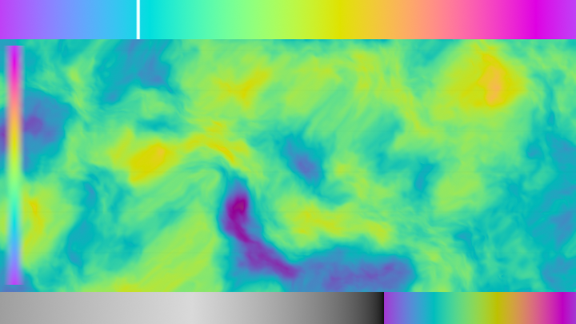
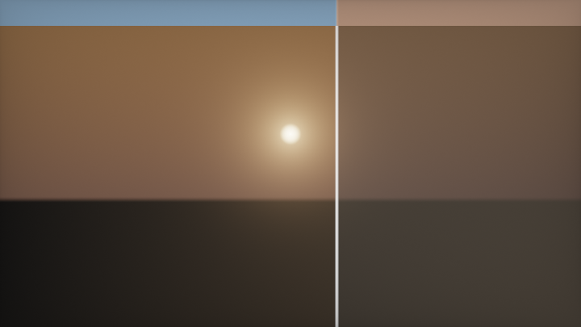
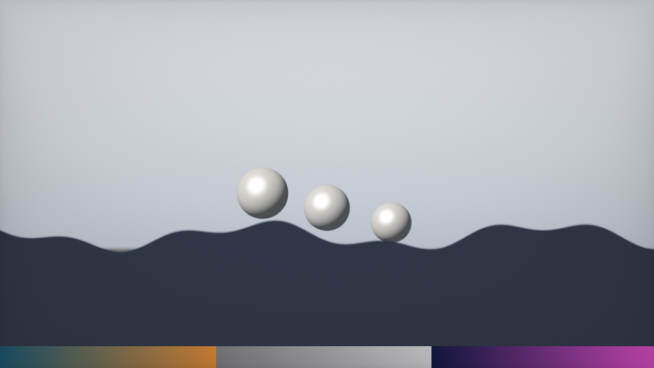
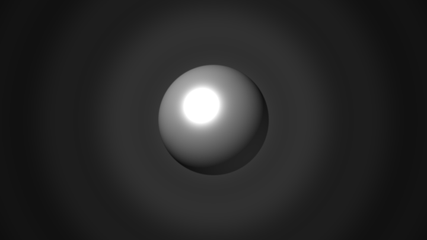
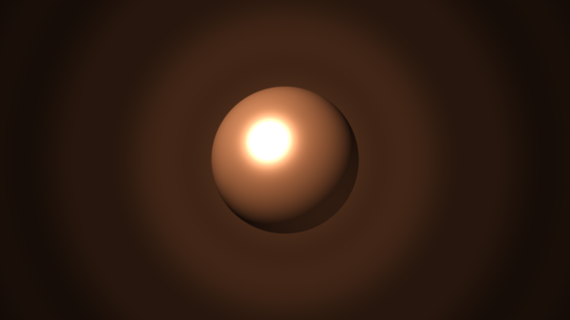
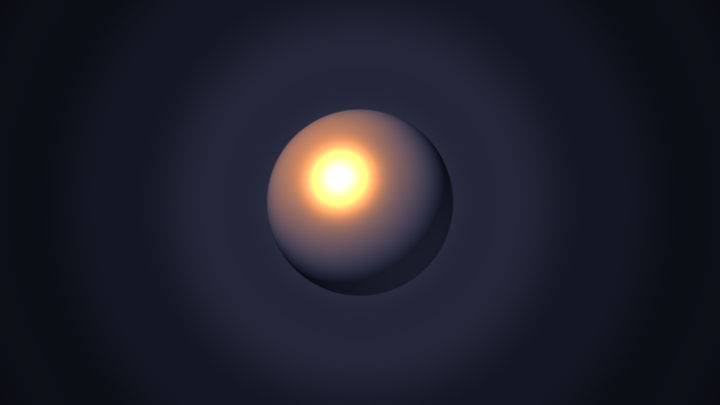
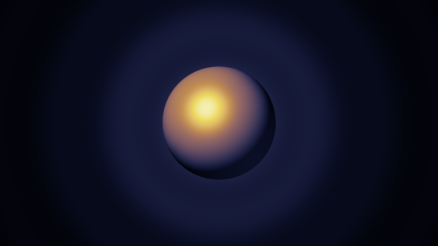
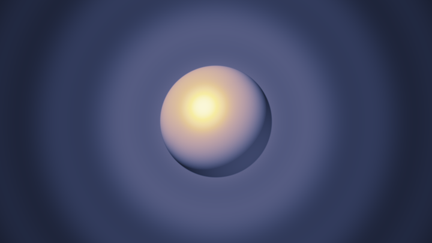
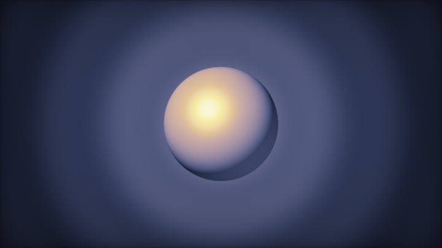

# 第 4 章 · 颜色

> 形状对了只是"正确"，颜色对了才是"好看"。
>
> 这一章把配色从"手调 RGB 碰运气"升级成可复用的方法论：余弦调色板、HSV、线性工作流、色调映射、图层混合、去色带。性价比极高——往往十几行就能让画面升一个档次。

---

## 4.1 余弦调色板：`pal(t, a, b, c, d)`

这是 iq 送给整个社区的礼物。学完它，你可以在十秒钟内得到一套和谐渐变，再也不用盲调 `vec3(0.7, 0.3, 0.9)`。

**调色板探索器**：鼠标 X（或自动扫）改 `pal` 相位，铺在 fbm 场上——调色比改噪声更立竿见影。

<!-- glsl-from: examples/ch4_stage8.glsl -->
```glsl
vec3 col = pal(fbm(uv), a, b, c, d + mousePhase);
```



### 公式

> 📄 出自 `000581-ll2GD3-Palettes/image.glsl`（iq）

```glsl
vec3 pal(in float t, in vec3 a, in vec3 b, in vec3 c, in vec3 d)
{
    return a + b * cos(6.28318 * (c * t + d));
}
```

`t` 是标量参数（通常是 UV 的某一维、距离、时间、噪声值）。对每个颜色通道，这就是：

```
channel(t) = a + b · cos(2π · (c · t + d))
```

一条余弦曲线——平滑、周期、天然适合循环动画。

### 四个参数的直觉（这是重点）

把每个通道想成"一条会摆动的线"：

| 参数 | 角色 | 调它时发生什么 |
|---|---|---|
| **a** | 基线 / 平均亮度 | 整体抬亮或压暗；`a=0.5` 是最常用中性点 |
| **b** | 振幅 / 对比 | `b=0.5` 时颜色在 `[a-b, a+b]` = `[0,1]` 附近扫；减小 → 更灰；增大 → 更艳甚至越界 |
| **c** | 频率 | 通常 `vec3(1)`：三个通道同速变化。改成 `vec3(1,1,0.5)` 让蓝色变化更慢 → 出现复杂交织 |
| **d** | 相位 | **决定色相关系的核心**。三个通道错开相位，才有彩色；若 `d` 三分量相同，就是灰度脉动 |

### 经典预设（直接抄）

> 📄 出自 `000581-ll2GD3-Palettes/image.glsl`（iq）——七条演示带

<!-- glsl-skip -->
```glsl
// 彩虹
col = pal(t, vec3(0.5), vec3(0.5), vec3(1.0), vec3(0.00, 0.33, 0.67));
// 暖橙褐
col = pal(t, vec3(0.5), vec3(0.5), vec3(1.0), vec3(0.00, 0.10, 0.20));
// 蓝绿青
col = pal(t, vec3(0.5), vec3(0.5), vec3(1.0), vec3(0.30, 0.20, 0.20));
// 黄绿
col = pal(t, vec3(0.5), vec3(0.5), vec3(1.0, 1.0, 0.5), vec3(0.80, 0.90, 0.30));
// 橙粉
col = pal(t, vec3(0.5), vec3(0.5), vec3(1.0, 0.7, 0.4), vec3(0.00, 0.15, 0.20));
// 强对比霓虹
col = pal(t, vec3(0.5), vec3(0.5), vec3(2.0, 1.0, 0.0), vec3(0.50, 0.20, 0.25));
// 低饱和大地色
col = pal(t, vec3(0.8, 0.5, 0.4), vec3(0.2, 0.4, 0.2), vec3(2.0, 1.0, 1.0), vec3(0.00, 0.25, 0.25));
```

kishimisu 入门作把其中一组写死成了自己的签名色：

> 📄 出自 `001063-mtyGWy-Shader_Art_Coding_Introduction/image.glsl`（kishimisu）

```glsl
vec3 palette(float t)
{
    vec3 a = vec3(0.5, 0.5, 0.5);
    vec3 b = vec3(0.5, 0.5, 0.5);
    vec3 c = vec3(1.0, 1.0, 1.0);
    vec3 d = vec3(0.263, 0.416, 0.557);
    return a + b * cos(6.28318 * (c * t + d));
}
```

### 怎么为自己的效果"调"一组 pal

不要从零随机。按这个流程：

1. **锁定 `a=b=vec3(0.5), c=vec3(1)`**——保证输出大致落在 `[0,1]`
2. **只拧 `d` 的三个分量**（范围 `0~1`）。这是色相旋钮。
3. 把 `t` 连到你关心的场：`length(p)`、`atan`、`iTime`、`d`（距离）、噪声……
4. 觉得太艳 → 减小 `b`（如 `vec3(0.3)`）；太闷 → 增大 `b` 或微调 `a`
5. 想要双色循环而非三色 → 让 `d` 的两个通道接近、第三个拉开

### `t` 选什么？——调色板的"驱动信号"

| 驱动 | 效果 |
|---|---|
| `t = p.x` | 横向渐变条（Palettes 原作） |
| `t = length(p)` | 径向虹彩 |
| `t = atan(p.y,p.x)/6.28` | 角向彩虹 |
| `t = iTime` | 整体脉动 |
| `t = length(p) + iTime` | 向外推移的色波（kishimisu） |
| `t = noise(p)` | 有机斑驳 |
| `t = d`（SDF） | 按距离上色——等高线着色 |

### 越界颜色怎么办？

`b` 较大或 `a` 偏置时，`pal` 可能产出负值或 >1 的值。两种处理：

<!-- glsl-skip -->
```glsl
col = clamp(pal(t, a, b, c, d), 0.0, 1.0);  // 硬切，简单
col = 0.5 + 0.5 * cos(...);                   // 设计参数时就保证在范围里（推荐）
```

HDR 管线里可以允许 >1，最后 tonemap（见 4.4）。

### 一行版（高尔夫 / 快速原型）

> 📄 出自 `000356-llySRh-iResolution_iMouse_iDate_etc/image.glsl`（FabriceNeyret2）

```glsl
#define hue(v) (.6 + .6 * cos(6.3 * (v) + vec4(0, 23, 21, 0)))
```

相位用魔法数字代替 `d`，极短。正式作品仍建议用完整 `pal`，可读可调。

---

## 4.2 HSV / HSL 与 Smooth HSV

余弦调色板擅长**渐变**；有时你想**精确指定色相**——比如"就是这个蓝，饱和度 0.7，亮度跟距离走"。这时 HSV/HSL 更直观。

### HSV → RGB

> 📄 出自 `000064-lsS3Wc-HSV_and_HSL/image.glsl`（iq）

```glsl
vec3 hsv2rgb(in vec3 c)
{
    c.x *= 6.0;
    vec3 rgb = clamp(vec3(-1.0 + abs(c.x - 3.0),
                          2.0 - abs(c.x - 2.0),
                          2.0 - abs(c.x - 4.0)), 0.0, 1.0);
    return c.z * mix(vec3(1.0), rgb, c.y);
}
```

参数约定：`c = (h, s, v)`，`h ∈ [0,1]` 绕一圈，`s,v ∈ [0,1]`。

### HSL → RGB

> 📄 出自同一文件

```glsl
vec3 hsl2rgb(in vec3 c)
{
    vec3 rgb = clamp(abs(mod(c.x * 6.0 + vec3(0.0, 4.0, 2.0), 6.0) - 3.0) - 1.0,
                     0.0, 1.0);
    return c.z + c.y * (rgb - 0.5) * (1.0 - abs(2.0 * c.z - 1.0));
}
```

**HSV vs HSL 怎么选？**

- **HSV**：`v=1` 时是纯色，做霓虹、发光、UI 很直观
- **HSL**：`l=0.5` 时最饱和，`l→0/1` 变黑/白，做"保持色相改明度"更自然

### 标准 HSV 的问题：色相插值有折痕

RGB 分量由分段线性驱动，线性插值 `h` 时，通道的一阶导不连续——肉眼就是某些色相处有"硬折"。

### Smooth HSV：用 smoothstep 抹平

> 📄 出自 `000197-MsS3Wc-Smooth_HSV/image.glsl`（iq）

```glsl
vec3 hsv2rgb_smooth(in vec3 c)
{
    vec3 rgb = clamp(abs(mod(c.x * 6.0 + vec3(0.0, 4.0, 2.0), 6.0) - 3.0) - 1.0,
                     0.0, 1.0);
    rgb = rgb * rgb * (3.0 - 2.0 * rgb); // cubic smoothing ≈ smoothstep
    return c.z * mix(vec3(1.0), rgb, c.y);
}
```

代价：不再严格符合 HSV 标准，但渐变好看得多。**做动画色相扫掠、彩虹天空时，优先 smooth 版。**

### 实战模式：HSV 控色相，场控明度

<!-- glsl-skip -->
```glsl
float d = sdSomething(p);
float aa = 2.0 / iResolution.y;
float mask = smoothstep(aa, -aa, d);

float hue = 0.55 + 0.08 * sin(iTime + p.x * 3.0);  // 青蓝附近微微漂移
vec3  surface = hsv2rgb_smooth(vec3(hue, 0.7, 1.0));
vec3  col = mix(vec3(0.05), surface, mask);
col += surface * exp(-max(d, 0.0) * 10.0) * 0.5;   // 同色辉光
```

### Fabrice 的极简 hsv 宏

> 📄 出自 `000356-llySRh-iResolution_iMouse_iDate_etc/image.glsl`（FabriceNeyret2）

```glsl
#define hsv(h,s,v) (v)*(1.+(s)*(.6*cos(6.3*(h)+vec3(0,23,21))-.4))
```

这其实是余弦调色板思想的 HSV 皮——又短又好用。

---

## 4.3 Gamma 与线性空间

这是"为什么我的混合总是发灰/发暗"的根源。

### 问题本质

显示器按 **sRGB / gamma ≈ 2.2** 解释你输出的值。`0.5` 的电信号**不是**一半亮，而是大约 `0.5^2.2 ≈ 0.22` 的亮度。

如果你在这种"非线性编码"里做 `mix(a, b, 0.5)`，视觉中点会偏暗，彩色混合还会出现暗色条带（红+绿的中间不是黄，而是肮脏的褐）。

> 📄 出自 `000066-lscSzl-Gamma_Correction_Tutorial/image.glsl`（finalman）——左右对比演示，强烈建议打开原文看一遍

### 正确工作流

```
采样纹理 → 解码到线性 → 在线性空间里光照/混合 → 编码回 sRGB 再输出
```

### 实用近似（够用且快）

<!-- glsl-skip -->
```glsl
vec3 toLinear(vec3 c)  { return pow(c, vec3(2.2)); }
vec3 toSRGB(vec3 c)    { return pow(c, vec3(1.0 / 2.2)); }
// 更常见的写法：
fragColor = vec4(pow(col, vec3(0.4545)), 1.0);  // 0.4545 ≈ 1/2.2
```

### 精确 sRGB 编解码

> 📄 出自 `000066-lscSzl-Gamma_Correction_Tutorial/image.glsl`（finalman）

```glsl
vec3 encodeSRGB(vec3 linearRGB)
{
    vec3 a = 12.92 * linearRGB;
    vec3 b = 1.055 * pow(linearRGB, vec3(1.0 / 2.4)) - 0.055;
    vec3 c = step(vec3(0.0031308), linearRGB);
    return mix(a, b, c);
}

vec3 decodeSRGB(vec3 screenRGB)
{
    vec3 a = screenRGB / 12.92;
    vec3 b = pow((screenRGB + 0.055) / 1.055, vec3(2.4));
    vec3 c = step(vec3(0.04045), screenRGB);
    return mix(a, b, c);
}
```

作者原话：按住鼠标对比精确 sRGB 与 gamma 2.2——差异几乎看不出。所以日常用 `pow(_, 1./2.2)` 完全可以。

### Shadertoy 上你必须自己做

**平台不会自动帮你做线性 ↔ sRGB。** 你输出什么，显示器就按 sRGB 解释什么。所以：

1. 自己算的颜色（光照、`pal`、HSV）→ 当作线性 → 输出前 `pow(col, 1./2.2)`
2. 采样的纹理 → 多数已是 sRGB → 若要参与光照，先 `pow(tex, 2.2)` 进线性
3. 只做 2D 贴图叠加、不关心物理正确时，可以全程"糊弄"——但一做光照，马脚立刻露出来

### 最小落地习惯

<!-- glsl-frag -->
```glsl
// ... 全部着色在"线性"里完成 ...
col = max(col, 0.0);
col = pow(col, vec3(0.4545));   // 输出前一行，养成习惯
fragColor = vec4(col, 1.0);
```

第 1 章的最小例子就是这么收尾的。

---

## 4.4 色调映射：把 HDR 塞回屏幕

辉光、`k/d`、多光源一加，颜色轻松超过 `1.0`。直接 `clamp(col,0,1)` 会把高光切成硬白块。色调映射（tonemap）负责**优雅地压缩**。

**ACES vs softKnee 分屏**：同一 HDR 太阳+Bloom，看出场闸门差在哪。

<!-- glsl-from: examples/ch4_stage9.glsl -->
```glsl
colL = tonemapACES(hdr);
colR = softKnee(hdr);
```



### ① Reinhard——最简单

> 📄 出自 `000061-Ds3XRl-Procedural_Blue_Planet/image.glsl`

```glsl
vec3 simpleReinhardToneMapping(vec3 color)
{
    float exposure = 1.5;
    color *= exposure / (1.0 + color / exposure);
    color = pow(color, vec3(1.0 / 2.4));   // 顺带 gamma
    return color;
}
```

更常见的裸公式：

<!-- glsl-frag -->
```glsl
col = col / (1.0 + col);
```

特性：不会爆白，但整体偏灰、对比流失。适合快速出图。

### ② `1 - exp(-x)`——电影感的胶片曲线

> 📄 出自 `000061-3tKSWV-Hex_Neon_Love/image.glsl`（Shane）

<!-- glsl-frag -->
```glsl
col = 1.0 - exp(-col);
```

> 📄 出自 `000062-XstSRX-Disco_2000/image.glsl`

<!-- glsl-skip -->
```glsl
return 1.0 - exp(-color * EXPOSURE);
```

特性：高光平滑滚降，暗部保留；调 `EXPOSURE` 当感光度。霓虹、夜景、raymarch 场景的默认好选择。

### ③ ACES 近似——业界口味

> 📄 出自 `000064-cssGWS-BLF_Voxel_Accelerated_Ray_March/image.glsl`

```glsl
vec3 ACESFilm(vec3 x)
{
    float a = 2.51;
    float b = 0.03;
    float c = 2.43;
    float d = 0.59;
    float e = 0.14;
    return (x * (a * x + b)) / (x * (c * x + d) + e);
}
```

这是 Krzysztof Narkowicz 的拟合，不是完整 ACES 管线，但长相非常接近。特性：对比强、高光略收、阴影有力——赛博朋克 / 写实 3D 常用。

使用：

<!-- glsl-skip -->
```glsl
col *= exposure;           // 先曝光
col = ACESFilm(col);
col = pow(col, vec3(0.4545)); // 再 gamma（若 ACES 输出视为线性）
```

注意：有人把 gamma 揉进 Reinhard 函数里（Blue Planet），有人分开。**自己统一顺序**：`线性着色 → 曝光 → tonemap → gamma → 输出`。

### ④ `tanh`——Xor 风格的极简 HDR

语料里大量高尔夫 / 抽象作品：

<!-- glsl-frag -->
```glsl
col = tanh(col);   // 把任意正值压进 (-1,1)，再视情况 *0.5+0.5 或直接当颜色
```

粗暴但好看，尤其配合加法辉光。

### 怎么选？

| 场景 | 推荐 |
|---|---|
| 快速 2D、几乎不 HDR | 不用 tonemap，只 clamp + gamma |
| 霓虹 / 辉光抽象 | `1-exp(-k*col)` 或 `tanh` |
| 写实 3D / 体积光 | ACES |
| 只想防爆 | Reinhard |

### 完整输出尾奏（建议背诵）

<!-- glsl-frag -->
```glsl
col *= 1.2;                      // exposure
col = col / (1.0 + col);         // Reinhard，或换 ACESFilm / 1.-exp(-col)
col = pow(max(col, 0.0), vec3(0.4545));
// 可选：dither（下一节）
fragColor = vec4(col, 1.0);
```

---

## 4.5 配色方法论与 `mix` 图层思维

技术工具有了，还差**审美决策**。本节是方法论，不是美学课。

**较难 · 三 Look 循环**：同一场景切 teal-orange / bleach / neon——`mix` 链就是调色台。

<!-- glsl-from: examples/ch4_stage10.glsl -->
```glsl
col = gradeTealOrange(base); // or bleach / neon
```



### 原则 1：先定 1 个主色 + 1 个点缀，其余灰色

新手配色失败，通常因为每个图层都又鲜又满。约束自己：

- 背景：低饱和暗色（`vec3(0.03, 0.04, 0.08)` 一类）
- 主体：一个主色相（用 `pal` 或 HSV 锁定）
- 高光 / 辉光：主色的亮版，或色轮上接近的暖/冷偏移
- 只有一个"尖叫"的点缀色（警告红、能量青）

### 原则 2：颜色跟着场走，不要硬贴

好的着色几乎总是：

<!-- glsl-skip -->
```glsl
vec3 col = palette(某个有意义的标量);
```

而不是：

<!-- glsl-skip -->
```glsl
if (part == 1) col = red;
else if (part == 2) col = blue;
```

有意义的标量：`d`、`length(p)`、`noise`、`ndotv`、高度、速度……让颜色成为场的可视化，和谐感会自动出现。

### 原则 3：`mix` 就是图层面板

> 语料里 `mix` 出现在 **56.1%** 的文件中——它就是 Photoshop 的图层。

<!-- glsl-skip -->
```glsl
vec3 col = sky(p);
col = mix(col, mountains, mountainMask);
col = mix(col, sunColor, sunMask);
col += sunGlow;                             // 加法层：光、辉光、闪电
col *= vignette;                            // 乘法层：暗角、阴影
```

图层类型：

| 操作 | 用法 | 典型 |
|---|---|---|
| `mix(a,b,m)` | 覆盖 | 实体形状、云层 |
| `col += light` | 加光 | 辉光、高光、爆炸 |
| `col *= shadow` | 压暗 | 暗角、AO、夜幕 |
| `max(col, x)` | 滤色感 | 保留更亮的那个 |

Coastal Landscape 是图层思维的教科书——天空、云、水、太阳、树一层层叠：

> 📄 出自 `000594-fstyD4-Coastal_Landscape/image.glsl`（Aleksey）

### 原则 4：同色系辉光

辉光颜色 = 表面颜色（或略偏饱和/偏亮），而不是另选一个无关色。否则画面像贴了彩色贴纸。

<!-- glsl-skip -->
```glsl
vec3 surface = pal(t, a, b, c, d);
col += surface * exp(-max(d, 0.0) * k);   // 同源
```

### 原则 5：用对比度引导视线

- 焦点：高对比、高饱和、硬边缘
- 周围：低对比、低饱和、软边缘 / 雾
- 四角：暗角乘一个 `smoothstep`

<!-- glsl-frag -->
```glsl
float vig = 1.0 - 0.4 * dot(p, p);   // p 为高度归一化坐标
col *= clamp(vig, 0.0, 1.0);
```

### 原则 6：限制调色板的"词汇量"

做一个效果时，先在 `000581-ll2GD3-Palettes` 里挑一条带子，**整幅画只用这一条**的不同 `t`。比五套不同 RGB 更易和谐。

### 实战：三层 mix 的日落骨架

```glsl
vec3 pal(float t, vec3 a, vec3 b, vec3 c, vec3 d)
{
    return a + b * cos(6.28318 * (c * t + d));
}

void mainImage(out vec4 fragColor, in vec2 fragCoord)
{
    vec2 p = (2.0 * fragCoord - iResolution.xy) / iResolution.y;
    float aa = 2.0 / iResolution.y;

    // 驱动信号：高度
    float t = clamp(p.y * 0.5 + 0.5, 0.0, 1.0);
    vec3 sky = pal(t,
        vec3(0.5), vec3(0.5), vec3(1.0, 0.7, 0.4), vec3(0.0, 0.15, 0.20));

    // 太阳
    float sd = length(p - vec2(0.0, 0.25)) - 0.28;
    vec3 sunCol = pal(0.1, vec3(0.5), vec3(0.5), vec3(1.0), vec3(0.0, 0.10, 0.20));
    vec3 col = sky;
    col += sunCol * exp(-max(sd, 0.0) * 6.0) * 0.9;          // 辉光层
    col = mix(col, sunCol * 1.2, smoothstep(aa, -aa, sd));    // 实体层

    // 地面剪影
    float ground = p.y + 0.35 + 0.08 * sin(p.x * 3.0);
    col = mix(col, vec3(0.02, 0.01, 0.04), smoothstep(aa, -aa, ground));

    col *= 1.0 - 0.35 * dot(p, p);                            // 暗角
    col = pow(max(col, 0.0), vec3(0.4545));
    fragColor = vec4(col, 1.0);
}
```

只有一套 `pal` 参数家族，天空和太阳是同一族的不同 `t`——这就是"限制词汇量"。

---

## 4.6 Dither：干掉色带

平滑渐变在 8-bit 帧缓冲里常出现条带（banding）——尤其是暗天空、大面积雾、轻微辉光。解决办法：加一点人眼融掉的噪声，在量化前打散阶梯。

### 最小可用版（请养成习惯）

<!-- glsl-frag -->
```glsl
float dither = fract(sin(dot(fragCoord, vec2(12.9898, 78.233))) * 43758.5453);
col += (dither - 0.5) / 255.0;
```

强度就是 **1/255** 量级——刚好打断相邻色阶，几乎看不见噪点。

### Interleaved Gradient Noise（现代游戏常用）

> 📄 出自 `000180-MslGR8-dithering_Color_Banding_Removal/image.glsl`（hornet）

<!-- glsl-skip -->
```glsl
float InterleavedGradientNoise(vec2 uv)
{
    const vec3 magic = vec3(0.06711056, 0.00583715, 52.9829189);
    return fract(magic.z * fract(dot(uv, magic.xy)));
}

// 使用（在 gamma / tonemap 之后、写入 fragColor 之前）：
col += (InterleavedGradientNoise(fragCoord) - 0.5) / 255.0;
```

### Valve / Portal 风格的屏幕空间 RGB dither

> 📄 出自同一文件

```glsl
vec3 ScreenSpaceDither(vec2 vScreenPos)
{
    vec3 vDither = vec3(dot(vec2(171.0, 231.0), vScreenPos.xy));
    vDither.rgb = fract(vDither.rgb / vec3(103.0, 71.0, 97.0));
    return vDither.rgb / 255.0;
}
```

三分量用不同模数，避免单色灰噪。

### 三角 PDF 噪声（质量更高）

把均匀噪声变成三角分布，再量化，条带抑制更强（原作里的 `remap_pdf_tri_unity`）。日常 2D 作品用 IGN 或简单 hash 足够。

### 有序抖动（Bayer）——刻意像素风

> 📄 出自 `000180-MslGR8-dithering_Color_Banding_Removal/image.glsl`（hornet）——2×2 / 8×8 Bayer 对比条

当你**想要**复古游戏感时，加大 dither 并减色：

<!-- glsl-skip -->
```glsl
float bayer = /* 0..1 的 Bayer 值 */;
col = floor(col * levels + bayer) / levels;
```

这和"去色带"是两个目的：一个隐形修复，一个显性风格。

### 放置位置

```
线性着色 → tonemap → gamma → dither → fragColor
```

在 gamma 之后 dither，针对的是**最终 8-bit 量化**。若在线性域 dither，强度要对齐不同的编码，更麻烦。

### Palette Dithering

> 📄 出自 `000218-MtjGRd-Palette_Dithering_Test`

当你把颜色量化到有限调色板（像素艺术、复古终端）时，dither 决定相邻色怎么混合出中间色——和去色带是同一数学，审美目标不同。需要时打开原文对比。

---

## 4.7 把整章收成一条输出管线

以后每个作品的结尾，按这个清单过一遍：

<!-- glsl-skip -->
```glsl
// 1) 颜色已经在线性空间累加完毕（mix / 辉光 / 光照）
vec3 col = ...;

// 2) 曝光
col *= 1.0;   // 按场景调

// 3) 色调映射（按需三选一）
col = 1.0 - exp(-col);
// col = ACESFilm(col);
// col = col / (1.0 + col);

// 4) 暗角（可选）
col *= 1.0 - 0.3 * dot(p, p);

// 5) gamma
col = pow(clamp(col, 0.0, 1.0), vec3(0.4545));

// 6) dither 去色带
col += (InterleavedGradientNoise(fragCoord) - 0.5) / 255.0;

fragColor = vec4(col, 1.0);
```

### 着色阶段的清单（mainImage 中段）

1. 背景：`pal` / 天空渐变
2. 每个实体：`mix(col, surfacePal, aaMask)`
3. 加法：辉光、高光、粒子
4. 乘法：AO、暗角、夜色
5. 走进上面的输出管线

---

## 4.8 三个专项小练习

### 练习 A：七条调色板浏览器

复制 `000581-ll2GD3-Palettes` 的七组参数，改成圆形径向：`t = length(p)`，再让 `t += iTime * 0.1`。感受相位 `d` 如何决定气质。

### 练习 B：Smooth vs 标准 HSV

左右分屏：`hsv2rgb` vs `hsv2rgb_smooth`，`h = uv.x, s=1, v=uv.y`。盯着橙色→黄色过渡带，看折痕消失——对应 `000197-MsS3Wc-Smooth_HSV`。

### 练习 C：曝光灾难现场

用 `pow(0.01/d, 1.2)` 堆四层辉光（kishimisu），分别用：无 tonemap / Reinhard / `1-exp` / ACES 输出。你会彻底明白为什么 HDR 场景必须 tonemap。

---

## 4.9 常见坑

**坑 1：在 sRGB 空间做光照再输出。** 中间调发脏。线性里算，最后 gamma。

**坑 2：tonemap 后再加辉光。** 辉光被压死或出现奇怪拐点。加法在 tonemap 前。

**坑 3：`pal` 的 `t` 用了未归一化的巨大值。** `cos` 精度尚可，但动画会跳。`fract(t)` 或把范围压到合理区间。

**坑 4：每个图层一套毫无关系的 RGB。** 改用同一 `pal` 的不同 `t`。

**坑 5：dither 太强。** `/255.0` 是隐形修复；`/32.0` 就是雪花屏了。

**坑 6：忘记 `max(col,0)` 就 `pow`。** 负值进 `pow` → NaN → 黑斑（第 1 章警告过）。

---

## 4.10 阶梯实战：同一灰度场上的七步上色

这一节有个苛刻约束：**几何从头到尾一个字节都不改**。变化的只有颜色管线。

七段完整代码在 `shader-handbook/examples/ch4_stage1..7.glsl`。带「示例文件」徽章的块会跑完整文件。

### 阶段 1：一张朴素的灰度场

后面六步都吃这个 `field` 的输出。

<!-- glsl-from: examples/ch4_stage1.glsl -->
```glsl
float field(vec2 p)
{
    float r = length(p);

    // ① 背景：从中心向外缓缓变暗。梯度非常平，正是最容易出色带的地形
    float g = 0.055 + 0.200 * exp(-r * r * 0.85);

    // ② 同心波纹：振幅只有 0.03，负责给背景一点结构
    g += 0.030 * sin(r * 12.0 - iTime * 0.6) * exp(-r * 0.7);

    // ③ 球：用半球高度伪造一个 3D 法线，再做最普通的兰伯特 + Blinn 高光
    float h = sqrt(max(1.0 - dot(p, p) / (RAD * RAD), 0.0));
    vec3  n = normalize(vec3(p / RAD, h));
    vec3  l = normalize(vec3(-0.42, 0.50, 0.76));   // 主光：左上前方
    vec3  f = normalize(vec3( 0.55, -0.60, 0.35));  // 补光：右下，只给一点

    float dif = max(dot(n, l), 0.0);
    float fil = max(dot(n, f), 0.0);
    float spe = pow(max(dot(n, normalize(l + vec3(0.0, 0.0, 1.0))), 0.0), 24.0);

    float sph = 0.030            // 环境光：暗部不能死黑，否则后面根本染不上色
              + 0.620 * dif      // 漫反射：这是"明暗层次"
              + 0.110 * fil      // 补光：让背光面还留一点信息
              + 1.550 * spe;     // 高光：故意冲到 1 以上，这是后面色调映射的靶子

    return mix(g, sph, smoothstep(0.006, -0.006, r - RAD));
}

    vec3 col = vec3(g);
```




### 阶段 2：余弦调色板

`pal(field(p))` —— iq 那一行上色。

<!-- glsl-from: examples/ch4_stage2.glsl -->
```glsl
vec3 pal(float t)
{
    return vec3(1.16, 0.92, 0.72)
         + vec3(0.18, 0.16, 0.28) * cos(TAU * (vec3(0.5) * t + vec3(0.0, 0.5, 0.5)));
}

float field(vec2 p)
{
    float r = length(p);

    // ① 背景：从中心向外缓缓变暗。梯度非常平，正是最容易出色带的地形
    float g = 0.055 + 0.200 * exp(-r * r * 0.85);

    // ② 同心波纹：振幅只有 0.03，负责给背景一点结构
    g += 0.030 * sin(r * 12.0 - iTime * 0.6) * exp(-r * 0.7);

    // ③ 球：用半球高度伪造一个 3D 法线，再做最普通的兰伯特 + Blinn 高光
    float h = sqrt(max(1.0 - dot(p, p) / (RAD * RAD), 0.0));
    vec3  n = normalize(vec3(p / RAD, h));
    vec3  l = normalize(vec3(-0.42, 0.50, 0.76));   // 主光：左上前方
    vec3  f = normalize(vec3( 0.55, -0.60, 0.35));  // 补光：右下，只给一点

    float dif = max(dot(n, l), 0.0);
    float fil = max(dot(n, f), 0.0);
    float spe = pow(max(dot(n, normalize(l + vec3(0.0, 0.0, 1.0))), 0.0), 24.0);

    float sph = 0.030            // 环境光：暗部不能死黑，否则后面根本染不上色
              + 0.620 * dif      // 漫反射：这是"明暗层次"
              + 0.110 * fil      // 补光：让背光面还留一点信息
              + 1.550 * spe;     // 高光：故意冲到 1 以上，这是后面色调映射的靶子

    return mix(g, sph, smoothstep(0.006, -0.006, r - RAD));
}

    vec3  col = g * pal(u);
```




### 阶段 3：明暗分离（双色调）

暗部色 / 亮部色再 `mix`。

<!-- glsl-from: examples/ch4_stage3.glsl -->
```glsl
vec3 pal(float t)
{
    return vec3(1.16, 0.92, 0.72)
         + vec3(0.18, 0.16, 0.28) * cos(TAU * (vec3(0.5) * t + vec3(0.0, 0.5, 0.5)));
}

float field(vec2 p)
{
    float r = length(p);

    // ① 背景：从中心向外缓缓变暗。梯度非常平，正是最容易出色带的地形
    float g = 0.055 + 0.200 * exp(-r * r * 0.85);

    // ② 同心波纹：振幅只有 0.03，负责给背景一点结构
    g += 0.030 * sin(r * 12.0 - iTime * 0.6) * exp(-r * 0.7);

    // ③ 球：用半球高度伪造一个 3D 法线，再做最普通的兰伯特 + Blinn 高光
    float h = sqrt(max(1.0 - dot(p, p) / (RAD * RAD), 0.0));
    vec3  n = normalize(vec3(p / RAD, h));
    vec3  l = normalize(vec3(-0.42, 0.50, 0.76));   // 主光：左上前方
    vec3  f = normalize(vec3( 0.55, -0.60, 0.35));  // 补光：右下，只给一点

    float dif = max(dot(n, l), 0.0);
    float fil = max(dot(n, f), 0.0);
    float spe = pow(max(dot(n, normalize(l + vec3(0.0, 0.0, 1.0))), 0.0), 24.0);

    float sph = 0.030            // 环境光：暗部不能死黑，否则后面根本染不上色
              + 0.620 * dif      // 漫反射：这是"明暗层次"
              + 0.110 * fil      // 补光：让背光面还留一点信息
              + 1.550 * spe;     // 高光：故意冲到 1 以上，这是后面色调映射的靶子

    return mix(g, sph, smoothstep(0.006, -0.006, r - RAD));
}

    // 用【乘】不用 mix：乘法只改三通道的比例，不动明暗层次。
    float sh = 1.0 - smoothstep(0.04, 0.75, g);   // 阴影权重：0.04 以下全算阴影
    float hl = smoothstep(0.55, 1.45, g);         // 高光权重：两段刻意留出间隙
    col *= mix(vec3(1.0), TINT_SHADOW, sh);
    col *= mix(vec3(1.0), TINT_HIGH,   hl);
```




### 阶段 4：饱和度与对比度

分级调色两件套。

<!-- glsl-from: examples/ch4_stage4.glsl -->
```glsl
vec3 saturation(vec3 c, float s)
{
    return mix(vec3(dot(c, LUMA_W)), c, s);
}

vec3 contrast(vec3 c, float k)
{
    const float PIVOT = 0.18;
    return pow(max(c, 0.0) / PIVOT, vec3(k)) * PIVOT;
}

    col = saturation(col, 1.30);
    col = contrast(col, 1.22);
```


### 阶段 5：色调映射

ACES（或 Reinhard）把 HDR 压回显示范围。

<!-- glsl-from: examples/ch4_stage5.glsl -->
```glsl
vec3 aces(vec3 x)
{
    return (x * (2.51 * x + 0.03)) / (x * (2.43 * x + 0.59) + 0.14);
}

    col = aces(col * EXPOSURE);                          // ③ ACES：高光滚降 + 暗部结实
```




### 阶段 6：gamma

算出来的颜色要补；手调显示空间的颜色不要补。

<!-- glsl-from: examples/ch4_stage6.glsl -->
```glsl
    // --- 新增：gamma 编码。位置就该在这里：tonemap 之后、输出之前，全程【只做一次】。 ---
    // max() 不能省：负数进 pow 会得到 NaN，NaN 在屏幕上是黑洞（4.9 坑 6）。
    col = pow(max(col, 0.0), vec3(1.0 / 2.2));
```




### 阶段 7：打磨（暗角 + 抖动）

管线收尾。

<!-- glsl-from: examples/ch4_stage7.glsl -->
```glsl
    col += (fract(sin(dot(fragCoord, vec2(12.9898, 78.233))) * 43758.545) - 0.5) / 255.0;
```




### 回头看这个过程

| 阶段 | 新增 | 对应本章 |
|---|---|---|
| 1 | 灰度场 | — |
| 2 | `pal` | 4.1 |
| 3 | 双色调 | 4.5 |
| 4 | 饱和/对比 | 4.5 |
| 5 | tonemap | 4.4 |
| 6 | gamma | 4.3 |
| 7 | 暗角 + dither | 4.6 |

口诀：**场 → 调色板 → 分级调色 → tonemap → gamma → dither**。几何与着色分离，是出品级 shader 的共同骨架。

---

## 本章要点回顾

- **余弦调色板** `a+b*cos(2π(c*t+d))`：拧 `d` 换气质，拧 `b` 换艳度；`t` 交给有意义的场。
- **HSV/HSL** 擅精确控色；动画渐变用 **Smooth HSV**。
- **线性工作流**：着色在线性，输出前 `pow(col, 1/2.2)`；纹理参与光照前先解码。
- **Tonemap** 三件套：Reinhard、`1-exp(-x)`、ACES；霓虹偏指数，写实偏 ACES。
- **`mix` / `+=` / `*=`** 就是图层；先定主色词汇量，颜色跟着场走。
- **Dither `1/255`** 放在 gamma 之后，消灭色带；IGN / 屏幕空间 RGB 都是语料成熟方案。
- 关键语料：`000581-ll2GD3-Palettes`、`000197-MsS3Wc-Smooth_HSV`、`000066-lscSzl-Gamma_Correction_Tutorial`、`000180-MslGR8-dithering_Color_Banding_Removal`、`000064-cssGWS`（ACES）。

---

> 上一章：[第 3 章 · 2D 形状与 SDF](03-2D形状与SDF.md) 　|　 下一章：[第 5 章 · 随机与噪声](05-随机与噪声.md)
