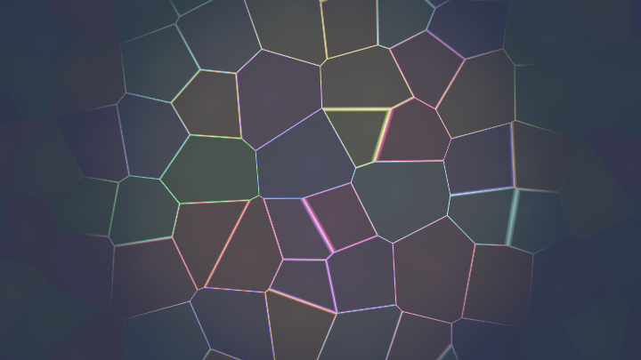
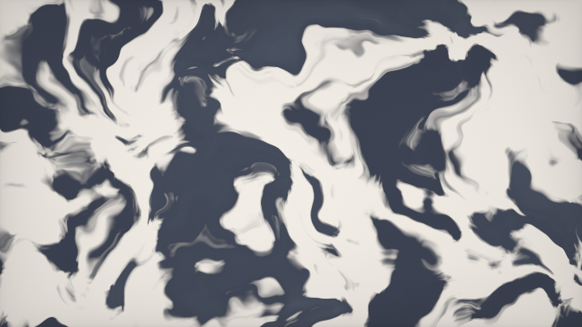
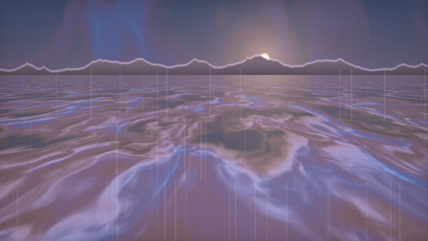
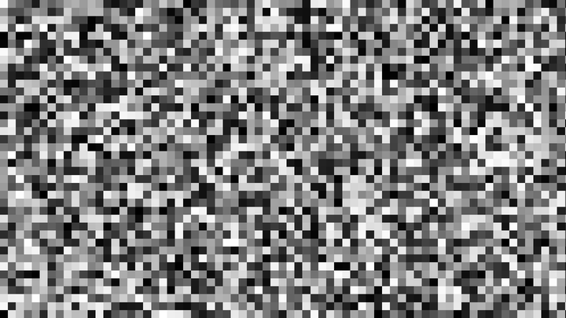
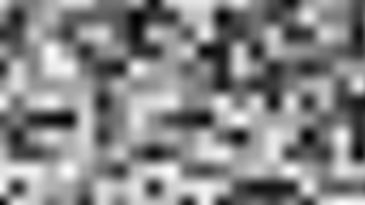
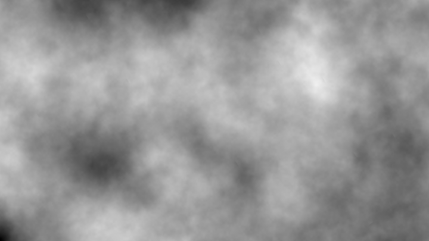
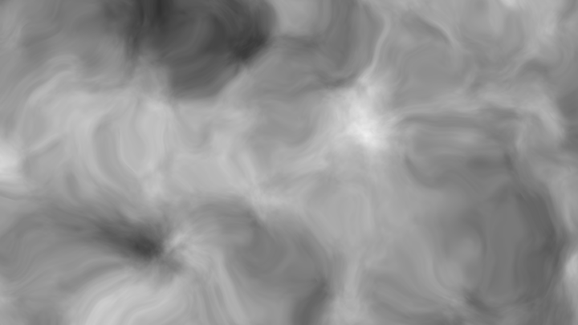
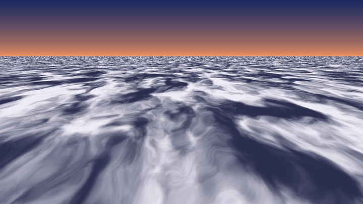
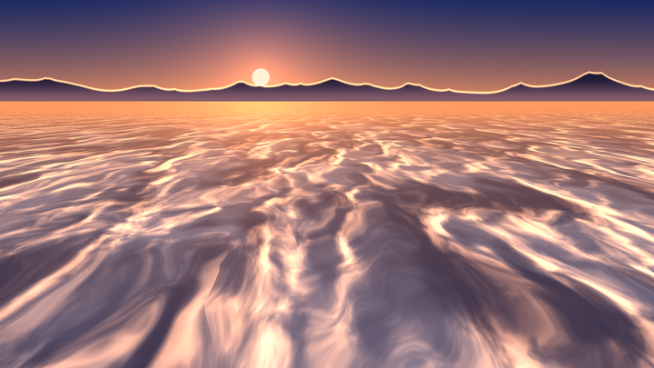

# 第 5 章 · 随机与噪声

> 第 0 章说过：真实世界的复杂性几乎都来自**重复**和**随机**。第 6 章专讲重复；这一章专讲随机——以及由随机长出来的整棵噪声技术树。
>
> 语料桶 `D_noise` 有 327 个作品。读完之后你会发现它们不是 327 种无关技巧，而是一条很短的**依赖链**上的变体。

---

## 5.1 先把整棵树看清楚

请把这句话刻进脑子：

```
hash（格点 → 伪随机数）
   ↓
基础噪声（value / gradient·Perlin / simplex / Voronoi）
   ↓
fbm 分形叠加（标准 / ridged / turbulence / billow）
   ↓
域扭曲 warping  ←→  curl noise（无散度流）
   ↓
着色、等值线、位移、体渲染……
```

**每一层都可以单独替换**，视觉效果随之变，但上层接口不变。这就是为什么同一个"云"能写出几十种实现：

| 你换掉哪一层 | 画面会怎样变 |
|---|---|
| hash | 视觉几乎不变；变的是跨 GPU 一致性、性能、大坐标稳定性 |
| 基础噪声 | 频谱气质变：value 有格子味，gradient 更匀，Voronoi 有细胞感 |
| fbm 组合方式 | 云 ↔ 山脊 ↔ 岩浆 ↔ 棉花糖 |
| 加上 warping | 静态图案突然有了流体感 |
| 换成 curl | 流动变成"打旋"而不是"拉伸" |

整章按这条链往下走。每学一层，你都应该能回答：**它吃什么输入、吐什么输出、上一层怎么喂给它。**

---

## 5.2 哈希：整条链的地基

### 5.2.1 哈希要解决什么问题

GPU 上没有全局随机数种子。每个像素、每一帧，都必须**只从坐标**算出同一个"看起来随机"的数。关键词是**确定性（deterministic）**：

> 同一个格子编号，永远得到同一个随机值 → 星星不会闪、地形不会每帧变。

哈希的任务只有一句：

> **给定格点标识（整数坐标或任意向量），返回 `[0,1)` 或 `[-1,1]` 的伪随机数。**

### 5.2.2 sin-fract 哈希族

这是整个 Shadertoy 生态里出现频率最高的写法。核心公式：

```
h(p) = fract( sin( dot(p, k) ) * A )
```

直觉拆开：

1. `dot(p, k)` —— 把 N 维压成 1 维。`k` 的分量必须**互不成简单比例**，否则 `(1,0)` 和 `(0,1)` 会撞车。
2. `sin(...)` —— 剧烈震荡。
3. `* 43758.5453` —— 把 `sin` 输出的微小差异放大到整数部分天差地别。
4. `fract` —— 只留小数 → `[0,1)`。

语料里最经典的一组常数来自 iq：

> 📄 出自 `000445-ldl3W8-Voronoi_-_distances/image.glsl`（iq）

<!-- glsl-skip -->
```glsl
vec2 hash2( vec2 p )
{
    // procedural white noise
    return fract(sin(vec2(dot(p,vec2(127.1,311.7)),
                          dot(p,vec2(269.5,183.3))))*43758.5453);
}
```

`127.1 / 311.7 / 269.5 / 183.3` 几乎成了行业暗号。另一组同样经典的是 `12.9898 / 78.233`：

> 📄 出自 `000346-MscSzf-Noise_Contour/image.glsl`

<!-- glsl-skip -->
```glsl
float rand(vec2 co)
{
    return fract(sin(dot(co.xy ,vec2(12.9898,78.233))) * 43758.5453);
}
```

TDM 的海面用的是"先 dot 再对标量 sin"的变体，放大系数多了几位：

> 📄 出自 `002224-Ms2SD1-Seascape/image.glsl`（TDM）

<!-- glsl-skip -->
```glsl
float hash( vec2 p ) {
    float h = dot(p,vec2(127.1,311.7));
    return fract(sin(h)*43758.5453123);
}
```

Shane 常用"一次 sin 拆两个分量"的廉价版，还顺手做成动画：

> 📄 出自 `000600-Mld3Rn-Perspex_Web_Lattice/image.glsl`（Shane）

<!-- glsl-skip -->
```glsl
vec2 hash22(vec2 p) {
    float n = sin(dot(p, vec2(41, 289)));
    p = fract(vec2(262144, 32768)*n);
    // Animated：特征点绕圈
    return sin( p*6.2831853 + iTime );
}
```

`262144=2^18`、`32768=2^15` 是在取 `n` 小数部分的不同二进制位段——一次 SFU，榨出两个伪独立分量。

### 5.2.3 为什么 sin-fract 跨 GPU 不一致

问题不在 `fract`，在 `sin`。

现代 GPU 用不同阶数的多项式逼近 `sin`。当输入很大时（格子索引几百、几千），`sin` 的最后一位误差已经存在。再乘上 `43758`，**误差被放大到整个 `[0,1]` 区间**。结果：

> 同一份 shader，在 NVIDIA / AMD / Intel / 手机 GPU 上，噪声图案可以肉眼可见地不同。

Dave_Hoskins 在权威作品里把动机写得很直白：

> 📄 出自 `000748-4djSRW-Hash_without_Sine/image.glsl`（Dave_Hoskins）

他注释里的原意是：他调好一座山脉，换到 Mac / 手机上山形全变了——因为 `sin(很大的数)` 各家实现不一致。他还把旧版 sin 哈希放在右边对比：

<!-- glsl-skip -->
```glsl
float hashOld12(vec2 p)
{
    return fract(sin(dot(p, vec2(12.9898, 78.233))) * 43758.5453);
}
```

**实践结论**：

- 写 demo、golf、临时效果 → sin-fract 够用，代码短。
- 要跨平台一致、要长期维护、要和 CPU 对拍 → **立刻换无 sin 哈希**。
- 坐标很大时（`|p| > 1e5`），即使无 sin 也会因 float 精度崩——先 `mod` 到小范围再哈希。

### 5.2.4 Dave_Hoskins 无 sin 哈希族

核心操作换成**纯乘法 + fract 迭代混合**：

```
p = fract(p * K);
p += dot(p, p.yzx + C);   // 分量互相污染
return fract(...);
```

完整家族在 COMMON 页，命名规则是 `hash[输出维][输入维]`：

> 📄 出自 `000748-4djSRW-Hash_without_Sine/common.glsl`（Dave_Hoskins）

```glsl
// 1 out, 2 in —— 最常用的 2D→1D
float hash12(vec2 p)
{
    vec3 p3  = fract(vec3(p.xyx) * .1031);
    p3 += dot(p3, p3.yzx + 33.33);
    return fract((p3.x + p3.y) * p3.z);
}

// 2 out, 2 in —— Voronoi 特征点、梯度方向
vec2 hash22(vec2 p)
{
    vec3 p3 = fract(vec3(p.xyx) * vec3(.1031, .1030, .0973));
    p3 += dot(p3, p3.yzx+33.33);
    return fract((p3.xx+p3.yz)*p3.zy);
}

// 3 out, 3 in —— 3D 噪声梯度
vec3 hash33(vec3 p3)
{
    p3 = fract(p3 * vec3(.1031, .1030, .0973));
    p3 += dot(p3, p3.yxz+33.33);
    return fract((p3.xxy + p3.yxx)*p3.zyx);
}
```

**调参禁忌**：`.1031 / .1030 / .0973 / .1099` 和偏置 `33.33` 是统计挑出来的。**不要随手改成 `.1`**——立刻出现周期条纹。

morgan3d 有一版把常数缩小约 10 倍，专治大坐标和负坐标：

> 📄 出自 `000218-4dS3Wd-_1D_2D_3D_Value_Noise/image.glsl`（morgan3d）

<!-- glsl-skip -->
```glsl
float hash(float p) { p = fract(p * 0.011); p *= p + 7.5; p *= p + p; return fract(p); }
float hash(vec2 p) {
    vec3 p3 = fract(vec3(p.xyx) * 0.13);
    p3 += dot(p3, p3.yzx + 3.333);
    return fract((p3.x + p3.y) * p3.z);
}
```

iq 还有更省的 `1/π` 自乘哈希（无 sin、无大常数）：

> 📄 出自 `000085-4dffRH-Noise_-_Gradient_-_3D_-_Deriv/image.glsl`（iq）

<!-- glsl-skip -->
```glsl
float hash1( vec2 p )
{
    p  = 50.0*fract( p*0.3183099 );   // 0.3183099 ≈ 1/π
    return fract( p.x*p.y*(p.x+p.y) );
}
```

**现在就可以做一个最小实验**：把屏幕坐标 `floor` 成格子，用 `hash12` 上色——你已经有了程序化星空的地基。

```glsl
float hash12(vec2 p) {
    vec3 p3 = fract(vec3(p.xyx) * .1031);
    p3 += dot(p3, p3.yzx + 33.33);
    return fract((p3.x + p3.y) * p3.z);
}

void mainImage(out vec4 fragColor, in vec2 fragCoord)
{
    vec2 uv = fragCoord / iResolution.y;
    vec2 id = floor(uv * 20.0);
    float h = hash12(id);
    // 只有少数格子亮起来 → 稀疏星点
    float star = step(0.97, h) * h;
    fragColor = vec4(vec3(star), 1.0);
}
```

---

## 5.3 值噪声（Value Noise）

### 5.3.1 核心思路

iq 的说明是迄今最好的中文可译版：在平面上铺虚拟格子，**每个格点存一个随机标量**；查询任意点时，找到它所在格子的四个角，用平滑曲线做双线性插值。

步骤：

1. `i = floor(p)`，`f = fract(p)`
2. 四个角：`hash(i)`、`hash(i+(1,0))`、`hash(i+(0,1))`、`hash(i+(1,1))`
3. 用插值权重 `u = smooth(f)` 混合

> 📄 出自 `000152-lsf3WH-Noise_-_value_-_2D/image.glsl`（iq）

```glsl
float hash(vec2 p) {
    p  = 50.0*fract( p*0.3183099 + vec2(0.71,0.113));
    return -1.0+2.0*fract( p.x*p.y*(p.x+p.y) );
}

float noise( in vec2 p )
{
    vec2 i = floor( p );
    vec2 f = fract( p );
    // 三次插值：C¹ 连续
    vec2 u = f*f*(3.0-2.0*f);

    return mix( mix( hash( i + vec2(0.0,0.0) ),
                     hash( i + vec2(1.0,0.0) ), u.x),
                mix( hash( i + vec2(0.0,1.0) ),
                     hash( i + vec2(1.0,1.0) ), u.x), u.y);
}
```

morgan3d 的全家桶（1D/2D/3D）是日常复制粘贴首选：

> 📄 出自 `000218-4dS3Wd-_1D_2D_3D_Value_Noise/image.glsl`

### 5.3.2 插值曲线：为什么不能用线性

若 `u = f`（纯线性），格点处左右斜率不同 → **导数不连续** → 画面出现菱形块状感（diamond artifacts）。

两种标准曲线：

| 曲线 | 公式 | 连续性 | 何时用 |
|---|---|---|---|
| 三次（smoothstep 族） | `u = f²(3−2f)` | C¹ | 默认；看图、做 fbm 都够 |
| 五次（Perlin improved） | `u = f³(f(6f−15)+10)` | C² | 要解析导数、曲率、高质量法线时 |

五次在代码里长这样：

<!-- glsl-skip -->
```glsl
vec2 u = f*f*f*(f*(f*6.0-15.0)+10.0);
```

> 📄 出自 `000152-lsf3WH-Noise_-_value_-_2D/image.glsl`（宏 `INTERPOLANT` 切换）

**记忆口诀**：只看噪声 → 三次；噪声要求导（法线/侵蚀）→ 五次。

### 5.3.3 值噪声的气质与代价

- **优点**：便宜（2D 四次哈希 + 几次 mix）。
- **缺点**：极值锁在格点上 → 单层时能看出网格。
- **关键洞察**：叠进 fbm 五六层后，高频会把格子感盖掉。所以生产里**值噪声 + fbm** 仍然是主流。

值域建议用 `[-1,1]` 哈希（上面 `hash` 返回的就是）。若用 `[0,1]`，多层叠加会产生 DC 偏移（平均值往上漂），需要除以权重和归一化。

---

## 5.4 梯度噪声 / Perlin

### 5.4.1 和值噪声差在哪

| | 值噪声 | 梯度噪声 |
|---|---|---|
| 格点存什么 | 一个随机标量 | 一个随机**方向**（梯度） |
| 格点处的噪声值 | 就是那个标量 | **恒为 0**（点积位移为 0） |
| 峰谷位置 | 对齐网格 | 在格子**内部**随机漂移 |
| 视觉 | 略块状 | 更各向同性、更"自然" |

几何直觉：每个格点插着一根小箭头。查询点问四个角："我在你箭头的正方向还是反方向？"——答案的加权混合就是噪声值。

### 5.4.2 最小实现

> 📄 出自 `000150-XdXGW8-Noise_-_gradient_-_2D/image.glsl`（iq）

```glsl
vec2 grad( ivec2 z )
{
    int n = z.x + z.y*11111;
    n = (n<<13)^n;
    n = (n*(n*n*15731+789221)+1376312589)>>16;
    // Perlin 风格的 8 个方向（非单位长）
    n &= 7;
    vec2 gr = vec2(n&1, n>>1)*2.0 - 1.0;
    return (n>=6) ? vec2(0.0, gr.x) :
           (n>=4) ? vec2(gr.x, 0.0) : gr;
}

float noise( in vec2 p )
{
    ivec2 i = ivec2(floor(p));
    vec2  f = fract(p);
    vec2  u = f*f*(3.0-2.0*f);

    return mix( mix( dot( grad(i+ivec2(0,0)), f-vec2(0.0,0.0) ),
                     dot( grad(i+ivec2(1,0)), f-vec2(1.0,0.0) ), u.x),
                mix( dot( grad(i+ivec2(0,1)), f-vec2(0.0,1.0) ),
                     dot( grad(i+ivec2(1,1)), f-vec2(1.0,1.0) ), u.x), u.y);
}
```

带解析导数的版本（地形法线、导数阻尼 fbm 的原料）：

> 📄 出自 `000085-4dffRH-Noise_-_Gradient_-_3D_-_Deriv/image.glsl`、`000075-XdXBRH-Noise_-_Gradient_-_2D_-_Deriv/image.glsl`（iq）

### 5.4.3 何时选梯度而不是值

- 单层就要好看（不做 fbm）
- 要做高质量位移贴图 + 法线
- 预算允许（2D 梯度大约比值噪声贵 30%~50%）

在 fbm 里：**值噪声 6 层 ≈ 梯度噪声 4 层的成本，视觉接近**——所以云、雾这类大量叠层的场合，值噪声往往更划算。

---

## 5.5 Simplex 噪声概要

传统梯度噪声在 N 维需要 `2^N` 个角点；Simplex 改用**单纯形剖分**，只要 `N+1` 个顶点（2D 三角 3 个，3D 四面体 4 个）。

做法概要：

1. **斜切（skew）** 把等边三角网格变成便于 `floor` 的直角网格，常数 `K1=(√3−1)/2`
2. 判断点在上三角还是下三角
3. **反斜切** 回原空间，对 3 个顶点用径向衰减核加权：`max(0, r²−|d|²)⁴ · dot(g,d)`——**不是插值，是核函数求和**

优点：高维更省、更各向同性、导数好算。  
缺点：2D 时优势不明显，代码更长；历史上有过专利纠葛（现已过期）。

语料里完整可抄实现可参考带 simplex 标签的作品；日常 2D 效果**优先 value/gradient + fbm**，只有做 3D/4D 或特别在意各向同性时再上 Simplex。

> 相关可视化与变体见 `000109-dlKyWw-SHARD_NOISE`（含 3D simplex 风格用法）。

---

## 5.6 Voronoi / Worley：细胞噪声

**染色玻璃**：动画站点 + 铅条边界。Voronoi 不只是裂纹，也是「单元格上色」。

<!-- glsl-from: examples/ch5_stage7.glsl -->
```glsl
vec3 cell = voronoi(uv);
col = pal(cell.x) * edge;
```



### 5.6.1 思路

每个格子放一个**随机特征点**；噪声值 = 查询点到**最近特征点**的距离（或距离的函数）。

这和 value/gradient 完全不同：它产生的是**细胞、裂纹、石子、鳞片**结构，不是平滑起伏。

### 5.6.2 F1：到最近点的距离

> 📄 出自 `000170-MslGD8-Voronoi_-_basic/image.glsl`（iq）

```glsl
vec2 hash( vec2 p )
{
    p = vec2(dot(p,vec2(127.1,311.7)),
             dot(p,vec2(269.5,183.3)));
    return fract(sin(p)*18.5453);  // Voronoi 对哈希质量要求较低，小系数更稳
}

// 返回：距离, 粗细胞 ID
vec2 voronoi( in vec2 x )
{
    vec2 n = floor(x);
    vec2 f = fract(x);
    vec3 m = vec3(8.0);
    for( int j=-1; j<=1; j++ )
    for( int i=-1; i<=1; i++ )
    {
        vec2  g = vec2(float(i), float(j));
        vec2  o = hash(n + g);
        // 动画：特征点在格内绕动，且保持在 [0,1]
        o = 0.5 + 0.5*sin(iTime + 6.2831*o);
        vec2  r = g - f + o;
        float d = dot(r, r);       // 循环里比平方距离
        if( d < m.x )
            m = vec3(d, o);
    }
    return vec2(sqrt(m.x), m.y+m.z);
}
```

要点：

- 循环里比 `dot(r,r)`，最后才 `sqrt`
- 3×3 邻域在特征点满格游走时偶有漏判；实务上常用 `o = o*0.8+0.1` 把点锁在格心附近

### 5.6.3 F2−F1：裂纹与晶界

同时记录最近距离 F1 和次近距离 F2，输出 `F2−F1`：

- 细胞内部 ≈ 0 附近的平滑区
- 边界处出现亮线（两特征点等距）

> 📄 出自 `000129-MdSGRc-Voronoi_-_metrics/image.glsl`（iq）——同文件还演示了欧氏 / 曼哈顿 / 三角度量

### 5.6.4 到边界的精确距离

这是 iq 的招牌教学作：很多人会算 F1，但**细胞内部到边界的正确距离**很少有人写对。

> 📄 出自 `000445-ldl3W8-Voronoi_-_distances/image.glsl`（iq）

算法两遍：

1. **第一遍 3×3**：找最近特征点，记下相对向量 `mr` 和格子偏移 `mg`
2. **第二遍 5×5**（以最近格为中心）：对每个其它特征点，用几何公式  
   `dot(0.5*(mr+r), normalize(r-mr))`  
   取最小 → 这就是到 Voronoi 边的有符号距离感度量

<!-- glsl-skip -->
```glsl
// 第二遍核心（完整函数见原作）
md = min( md, dot( 0.5*(mr+r), normalize(r-mr) ) );
```

有了边界距离，你才能：

- 画**真正等距的晶界线**（黄边）
- 在细胞内做正确的径向着色 / AO
- 做"鹅卵石缝隙灌浆"

### 5.6.5 Voronoise 与其它变体

iq 的 Voronoise 用参数在"平滑值噪声"和"硬细胞"之间连续插值：

> 📄 出自 `000346-Xd23Dh-Voronoise/image.glsl`（iq）

层次 Voronoi（大细胞里套小细胞）：

> 📄 出自 `000085-Xll3zX-Voronoi_-_hierarchical/image.glsl`（iq）

**成本警告**：Voronoi 是语料里最贵的基础噪声之一（3×3 就要 9 次哈希；边界版更贵）。在 raymarch 内层循环里慎用——云体积里的 Worley 往往**预烘焙到 3D 纹理**（见 `000182-3dVXDc-Tileable_Perlin-Worley_3D`）。

---

## 5.7 fbm：把单层噪声叠成世界

### 5.7.1 标准 fbm

**Fractional Brownian Motion**：同一噪声函数，频率×2、振幅×½，叠若干层。

```
fbm(p) = Σ amp_i * noise( freq_i * p )
       freq ← freq * lacunarity(≈2)
       amp  ← amp  * gain(≈0.5)
```

每层旋转一点，能打断轴向条纹——语料里几乎总带着这句：

```glsl
const mat2 mtx = mat2( 0.80,  0.60, -0.60,  0.80 );
```

> 📄 出自 `000355-4s23zz-Warping_-_procedural_1/image.glsl`（iq）

<!-- glsl-skip -->
```glsl
const mat2 mtx = mat2( 0.80,  0.60, -0.60,  0.80 );

float fbm4( vec2 p )
{
    float f = 0.0;
    f += 0.5000*(-1.0+2.0*noise( p )); p = mtx*p*2.02;
    f += 0.2500*(-1.0+2.0*noise( p )); p = mtx*p*2.03;
    f += 0.1250*(-1.0+2.0*noise( p )); p = mtx*p*2.01;
    f += 0.0625*(-1.0+2.0*noise( p ));
    return f/0.9375;   // 除以权重和，归一化
}
```

`2.02 / 2.03 / 2.01` 略偏离整数 2——故意避免与网格精确共振。

云的经典用法（纹理噪声 + fbm）：

> 📄 出自 `000712-4tdSWr-2D_Clouds/image.glsl`（drift）

### 5.7.2 ridged / turbulence / billow

换的不是循环结构，而是**每一层送进求和之前怎么改造噪声值**：

| 名字 | 单层变换 | 视觉 |
|---|---|---|
| 标准 fbm | `n` | 云、雾、柔和起伏 |
| **turbulence** | `abs(n)` | 湍流、火焰边缘、躁动 |
| **ridged** | `1 - abs(n)` 再常平方 | 山脊、山脉、闪电脉络 |
| **billow** | 类似 ridged 的鼓起版 / 或 `abs` 后再塑形 | 棉花糖云团、泡沫 |

nimitz 的"电"与"水"动画里，ridged/turbulent 写法非常典型：

> 📄 出自 `000466-ldlXRS-Noise_animation_-_Electric/image.glsl`（nimitz）

<!-- glsl-skip -->
```glsl
float fbm(in vec2 p)
{
    float z=2.;
    float rz = 0.;
    for (float i= 1.;i < 6.;i++)
    {
        rz+= abs((noise(p)-0.5)*2.)/z;  // turbulence：取绝对值
        z = z*2.;
        p = p*2.;
    }
    return rz;
}
```

> 📄 出自 `000125-MssSRS-Noise_animation_-_Watery/image.glsl`（nimitz）——同样用 `abs`，并在外层用 fbm 结果去**旋转域**

行星云里的 ridged 变体：

> 📄 出自 `000295-ldyXRw-Tiny_Planet_Clouds/image.glsl`

**调参直觉**：

- `lacunarity`（频率倍增）↑ → 细节更碎
- `gain`（振幅衰减）↑ → 高频更强，更噪；↓ → 更软
- 硬约束：若还要累加导数，需 `gain * lacunarity < 1`，否则导数序列发散

---

## 5.8 域扭曲：`fbm(p + fbm(p))`

**大理石 / 墨水**：双层域扭曲。调内层振幅 = 纹有多「拧」。

<!-- glsl-from: examples/ch5_stage8.glsl -->
```glsl
vec2 q = p + fbm(p);
float n = fbm(q);
```



### 5.8.1 一句话原理

噪声默认是"在 p 上采样"。若先把坐标本身用噪声挪一下：

```
q = p + amp * fbm(p)
color = fbm(q)
```

图案会产生**流体般的拉伸与褶皱**。再套一层：

```
fbm( p + fbm( p + fbm(p) ) )
```

就是 iq 的 Warping 系列核心。

### 5.8.2 权威范例

第一作（更强调多层向量 fbm）：

> 📄 出自 `000355-4s23zz-Warping_-_procedural_1/image.glsl`（iq）

第二作（教学向，噪声甚至可以是 `sin(x)sin(y)`——证明漂亮来自扭曲结构而非噪声本身）：

> 📄 出自 `000579-lsl3RH-Warping_-_procedural_2/image.glsl`（iq）

<!-- glsl-skip -->
```glsl
float noise( in vec2 p ) { return sin(p.x)*sin(p.y); } // 刻意用简陋噪声

float func( vec2 q, out vec4 ron )
{
    q += 0.03*sin( vec2(0.27,0.23)*iTime + length(q)*vec2(4.1,4.3));
    vec2 o = fbm4_2( 0.9*q );
    o += 0.04*sin( vec2(0.12,0.14)*iTime + length(o));
    vec2 n = fbm6_2( 3.0*o );
    ron = vec4( o, n );
    float f = 0.5 + 0.5*fbm4( 1.8*q + 6.0*n );
    return mix( f, f*f*f*3.5, f*abs(n.x) );
}
```

结构读作：

1. `o = fbm4_2(q)` —— 第一层扭曲向量场
2. `n = fbm6_2(3*o)` —— 在扭曲后的域上再采更细的向量场
3. `fbm4(q + 6*n)` —— 最终标量图案
4. 用 `n` 再调制对比度 → 有的区域平坦、有的区域对比拉满

社区高人气的"可直接抄着玩"版本：

> 📄 出自 `000404-tdG3Rd-Base_warp_fBM/image.glsl`（trinketMage）

更深的多层实践：

> 📄 出自 `000187-MdSXzz-Warping_-_procedural_4/image.glsl`、`000069-wttXz8-Domain_warped_FBM_noise/image.glsl`

### 5.8.3 实现时的三个坑

1. **振幅太大** → 图案撕碎、闪烁。从 `0.1~0.5` 起调。
2. **忘记各层用不同偏移**（`fbm(p)` 与 `fbm(p+vec2(5.2))`）→ x/y 扭曲相关，只出现对角拉伸。
3. **在 raymarch 的 `map` 里无节制 warping** → 距离场不再是真正的 SDF，步进会穿帮。2D 图案可以狠扭曲；3D 距离场要克制，或改用受限扭曲。

---

## 5.9 Curl noise 直觉

### 5.9.1 它解决什么

普通梯度 `∇f` 指向"上山方向"，当速度场用会把东西**堆到山脊上**（有散度）。  
**Curl（旋度）** 构造的向量场**散度为零**——流体只打旋、不凭空产生或消失质量。粒子沿 curl 场走，轨迹是涡旋，而不是汇聚到一点。

2D 里最常用的技巧：对一个标量势 `ψ`，取

```
v = ( ∂ψ/∂y, −∂ψ/∂x )     // 2D "curl"
```

则 `∇·v = 0`（在光滑处）。`ψ` 用 fbm 即可。

3D 则对向量势取 `∇×A`。

### 5.9.2 语料入口

> 📄 出自 `000133-mlsSWH-Visualizing_Curl_Noise/image.glsl`（Shane）——专门可视化 curl 扭曲

Shane 的注释把直觉说得很清楚：curl 像"垂直于切向运动的侧向力"，结果是螺旋状遍历。

云层里用 curl 去扰动 Worley：

> 📄 出自 `000063-WddSDr-Horizon_Zero_Dawn_Clouds_2D/image.glsl`

流体 / 烟尘仿真里 curl 与涡度更进一步：

> 📄 出自 `000488-4tGfDW-Chimera_s_Breath/image.glsl`（nimitz）、`000243-MtKSWW-Dynamism/image.glsl`（nimitz）

**决策**：要"有机拉伸褶皱" → warping；要"涡旋、烟圈、无散度流" → curl。两者常组合：先 curl 积分粒子，再在结果上着色 warping 纹理。

---

## 5.10 噪声动画的六种手法

下面六种覆盖了语料里绝大多数"会动的噪声"。不必全用，按需求挑。

### ① 时间当额外维度

把 2D 噪声换成 3D：`noise(vec3(p, iTime))`。最正统，频谱稳定，但成本从 4 角变 8 角。

### ② 域平移

`noise(p + vec2(iTime, 0))` —— 整片纹理在滑动。便宜，但像传送带，缺少内部形变。

### ③ 相位旋转 / 域旋转

用一层 fbm 算出角度，再旋转坐标后采第二层——nimitz "Watery"：

> 📄 出自 `000125-MssSRS-Noise_animation_-_Watery/image.glsl`

### ④ 双 fbm 域扭曲动画

两个方向各跑一个随时间变化的 fbm，去推主采样域——"Electric"：

> 📄 出自 `000466-ldlXRS-Noise_animation_-_Electric/image.glsl`

### ⑤ 特征点绕动（Voronoi 专用）

`o = 0.5+0.5*sin(iTime + 6.2831*o)` —— 细胞在呼吸、边界在游走。

> 📄 出自 `000445-ldl3W8-Voronoi_-_distances/image.glsl`

### ⑥ Flow / 积分型

把噪声当速度，把 uv 沿速度积分（或 Buffer 反馈）——"Flow" 与 curl 可视化：

> 📄 出自 `000225-MdlXRS-Noise_animation_-_Flow/image.glsl`、`000133-mlsSWH-Visualizing_Curl_Noise/image.glsl`

熔岩感的 ridged + 时间：

> 📄 出自 `000226-lslXRS-Noise_animation_-_Lava/image.glsl`

| 手法 | 成本 | 气质 |
|---|---|---|
| ③ 维时间 | 中-高 | 最自然的演化 |
| 域平移 | 极低 | 机械滑动 |
| 域旋转 | 低 | 漩涡水面 |
| 双 fbm 扭曲 | 中 | 电光、能量 |
| Voronoi 绕动 | 中-高 | 细胞、水泡 |
| Flow 积分 | 高（常需 Buffer） | 烟、丝、长时间流线 |

---

## 5.11 决策表：我该用哪种噪声？

| 我想要的感觉 | 首选 | 备选 / 注意 |
|---|---|---|
| 柔和起伏、云、雾、烟雾底噪 | **value/gradient + 标准 fbm** | 单层用 gradient；多层用 value 更省 |
| 山脊、闪电、裂纹状高亮 | **ridged fbm** | turbulence（`abs`）更躁 |
| 棉花糖、泡沫、鼓包云 | **billow / ridged 变体** | 看 `000295` 行星云 |
| 鹅卵石、鳞片、晶格、裂纹 | **Voronoi F1 / F2−F1** | 要漂亮晶界 → `000445` 边界距离 |
| 流体褶皱、大理石、油膜 | **domain warping** | iq `000355` / `000579`；振幅从小心加 |
| 涡旋、烟圈、无散度粒子 | **curl noise** | `000133-mlsSWH`；仿真见 `000488` |
| 跨 GPU 一致的地形 | **Hoskins hash + 任意噪声** | 禁用大参数 sin-fract |
| 只要"看起来花"且要跑得快 | **纹理噪声 LUT** | `texture(iChannel0, p).x` 当 noise |
| 高维、要各向同性 | **Simplex** | 2D 通常不值得 |
| 要解析法线 / 侵蚀 | **gradient `noised` + 五次插值** | `000085-4dffRH` |

**一条总原则**：先用最便宜的能骗过眼睛的方案。多数"高级感"来自 **fbm 组合 + warping**，而不是来自把基础噪声换成 Simplex。

---

## 5.12 把噪声接到"能看的画面"上

技术链会了，还差最后一公里：**噪声标量怎么变成颜色/形状**。语料里反复出现这五种接法。

**较难成片 · 风暴云景**：ridged 山脊 + 透视云 + 调色板 + 雨丝。噪声章节的毕业作品感。

<!-- glsl-from: examples/ch5_stage9.glsl -->
```glsl
// ridged terrain + cloud fbm + rain streaks
```



### A. 直接当灰度 / 调色板索引

<!-- glsl-frag -->
```glsl
float n = fbm(uv * 3.0) * 0.5 + 0.5;
vec3 col = 0.5 + 0.5 * cos(6.2831 * (n + vec3(0.0, 0.33, 0.67)));
```

余弦调色板（第 4 章）+ 一层 fbm，已经是可发布的抽象背景。

### B. 当 SDF 的扰动（粗糙表面）

<!-- glsl-skip -->
```glsl
float d = sdSphere(p, 0.5);
d += 0.05 * noise(p * 8.0);   // 幅度要小，否则 3D 距离场穿帮
```

2D 可以狠一点；3D raymarch 里扰动幅度通常 `< 0.1 * 特征尺寸`。

### C. 当高度场

`h = fbm(xz)`，然后按高度着色，或对高度场 raymarch（地形）。海面经典链路是 **hash → 值噪声 → 多层波/噪声高度**——见 `002224-Ms2SD1-Seascape`。

### D. 等值线

<!-- glsl-skip -->
```glsl
float n = fbm(uv * 4.0);
float lines = smoothstep(0.02, 0.0, abs(fract(n * 8.0) - 0.5));
```

> 相关：`000346-MscSzf-Noise_Contour`、`000183-ldscWH-Smooth_Noise_Contours`

### E. 阈值遮罩

`smoothstep(0.4, 0.6, fbm(...))` 切出云团；多层不同阈值做云的"厚度感"。  
`000712-4tdSWr-2D_Clouds` 是这条路的教科书级 2D 云。

---

## 5.13 常见坑速查

| 症状 | 可能原因 | 对策 |
|---|---|---|
| 换显卡山形全变 | sin-fract 哈希 | 换 `000748` Hoskins 族 |
| 大坐标下出现大色块 | float 精度，`fract(p*k)` 失效 | 先 `mod(p, 256.0)` 再哈希 |
| fbm 整体偏亮/偏灰 | `[0,1]` 噪声 DC 偏移 | 改用 `[-1,1]` 或除以权重和 |
| 单层值噪声看得见格子 | 正常 | 加层 / 换梯度 / fbm 里旋转 |
| Voronoi 边界有细小错位 | 3×3 邻域不够 | 点锁格心，或扩到 5×5 |
| warping 后闪成花屏 | 振幅过大或高频过敏 | 降 amp；时间用 `mod` |
| 3D map 里 warping 穿模 | 距离场被破坏 | 减小平移；或只扭曲着色不扭曲 SDF |
| 动画抖、噪 | `iTime` 过大导致精度差 | `mod(iTime, 周期)` |

---

## 5.14 最小练习路径（建议动手顺序）

1. 只用 `hash12(floor(uv*N))` 做星空 / 彩砖。
2. 接上 value noise，输出 `noise(uv*4)*0.5+0.5`。
3. 写 5 层 fbm，调 `gain`。
4. 把一层改成 `abs(noise)`，看 turbulence。
5. 写 `fbm(p + 0.5*fbm(p))`，体会 warping。
6. 抄一遍 `000445` 的边界 Voronoi，画晶界。
7. 用 `hash22` 换掉所有 `sin` 哈希，确认画面几乎不变但更安心。
8. 用 §5.12 的调色板接法，做一张"可截图"的抽象图。

每一步都把中间量直接当颜色输出——第 0 章的调试法在这里同样适用。

---

## 5.15 阶梯实战：从 hash 到云海

5.14 的练习清单告诉你该按什么顺序练；这一节给出**可编译、可出图**的版本。

六段完整代码在 `shader-handbook/examples/ch5_stage1..6.glsl`。

### 阶段 1：把 hash 直接画出来

马赛克。所有程序化随机的原子。

<!-- glsl-from: examples/ch5_stage1.glsl -->
```glsl
float hash12(vec2 p)
{
    vec3 p3 = fract(vec3(p.xyx) * 0.1031);
    p3 += dot(p3, p3.yzx + 33.33);   // 让三个分量互相污染
    return fract((p3.x + p3.y) * p3.z);
}

    // floor(p) = 格子编号。整格共用一个随机值 → 马赛克
    float h = hash12(floor(p));
```




### 阶段 2：插值成 value noise

四角 hash 插值，块变成软斑。

<!-- glsl-from: examples/ch5_stage2.glsl -->
```glsl
float hash12(vec2 p)
{
    vec3 p3 = fract(vec3(p.xyx) * 0.1031);
    p3 += dot(p3, p3.yzx + 33.33);
    return fract((p3.x + p3.y) * p3.z);
}

float vnoise(vec2 p)
{
    vec2 i = floor(p);   // 我在第几号格子
    vec2 f = fract(p);   // 我在格子内部的哪儿

    // 三次插值曲线 f²(3−2f)：格点处导数为 0，所以跨格时斜率连续。
    // 把这行换成 vec2 u = f; 立刻能看到菱形块状感 —— 见正文。
    vec2 u = f * f * (3.0 - 2.0 * f);

    return mix(mix(hash12(i + vec2(0.0, 0.0)), hash12(i + vec2(1.0, 0.0)), u.x),
               mix(hash12(i + vec2(0.0, 1.0)), hash12(i + vec2(1.0, 1.0)), u.x), u.y);
}

    float n = vnoise(p);
```




### 阶段 3：fbm —— 叠六次

同一个噪声换频率叠上去。

<!-- glsl-from: examples/ch5_stage3.glsl -->
```glsl
float fbm(vec2 p, int oct)
{
    float f = 0.0;
    float a = 0.5;
    float w = 0.0;                      // 权重和，用来归一化
    for (int i = 0; i < 6; i++)
    {
        if (i >= oct) break;
        f += a * vnoise(p);
        w += a;
        p = mtx * p * 2.03;             // lacunarity 2.03，故意不是整数 2
        a *= 0.5;                       // gain 0.5
    }
    return f / max(w, 1e-4);            // 除以权重和 → 结果仍在 [0,1]，不会整体漂白
}

    float n = fbm(p, 6);
```




### 阶段 4：域扭曲

用噪声去挪噪声的坐标。

<!-- glsl-from: examples/ch5_stage4.glsl -->
```glsl
float fbm(vec2 p, int oct)
{
    float f = 0.0;
    float a = 0.5;
    float w = 0.0;
    for (int i = 0; i < 6; i++)
    {
        if (i >= oct) break;
        f += a * vnoise(p);
        w += a;
        p = mtx * p * 2.03;
        a *= 0.5;
    }
    return f / max(w, 1e-4);
}
```




### 阶段 5：铺到地上 —— 云海成形

扭曲 fbm 当密度，配天空渐变。

<!-- glsl-from: examples/ch5_stage5.glsl -->
```glsl
float fbm(vec2 p, int oct)
{
    float f = 0.0;
    float a = 0.5;
    float w = 0.0;
    for (int i = 0; i < 6; i++)
    {
        if (i >= oct) break;
        f += a * vnoise(p);
        w += a;
        p = mtx * p * 2.03;
        a *= 0.5;
    }
    return f / max(w, 1e-4);
}

    vec3 cloud = mix(vec3(0.17, 0.18, 0.31), vec3(0.93, 0.92, 0.96),
                     smoothstep(0.30, 0.70, h));

    col = mix(col, cloud, step(uv.y, HORIZON));
```




### 阶段 6：用噪声驱动光和空气

ridged、散射、雾——噪声从纹理变成导演。

<!-- glsl-from: examples/ch5_stage6.glsl -->
```glsl
float ridged(vec2 p, int oct)
{
    float f = 0.0;
    float a = 0.5;
    float w = 0.0;
    for (int i = 0; i < 6; i++)
    {
        if (i >= oct) break;
        float n = 1.0 - abs(vnoise(p) * 2.0 - 1.0);
        f += a * n * n;
        w += a;
        p = mtx * p * 2.03;
        a *= 0.5;
    }
    return f / max(w, 1e-4);
}

vec3 skyCol(vec2 uv)
{
    float sy = clamp((uv.y - HORIZON) / (1.0 - HORIZON), 0.0, 1.0);
    vec3  c  = mix(vec3(1.00, 0.60, 0.38), vec3(0.10, 0.16, 0.38), pow(sy, 0.60));
    // 太阳附近的大气散射：一大团很软的暖光，衰减系数小 → 铺得开
    c += vec3(1.00, 0.52, 0.24) * exp(-length(uv - SUN) * 3.0) * 0.60;
    return c;
}

    // --- 山脊：ridged 当一维高度场，uv.y − h 就是剪影的有符号距离 ---
    float mh = HORIZON + 0.02 + 0.16 * ridged(vec2(uv.x * 1.1 + 7.0, 0.7), 4);
    float md = uv.y - mh;
    // 山体不是纯黑：越靠近地平线越接近霞色，这就是空气透视
    vec3 mcol = mix(vec3(0.52, 0.36, 0.42), vec3(0.13, 0.11, 0.22),
                    smoothstep(0.0, 0.13, uv.y - HORIZON));
    col = mix(col, mcol, smoothstep(0.004, -0.004, md));
    // 逆光轮廓：|md| 小的地方就是棱线，有距离场就有免费描光
    col += vec3(1.00, 0.66, 0.36) * smoothstep(0.010, 0.0, abs(md)) * 0.9;

    // --- 云海 ---
    float dy    = HORIZON - uv.y;
    float depth = 1.0 / max(dy, 0.003);
    vec2  q     = vec2(uv.x * depth, depth) * 1.8;
    q += vec2(0.03, 0.45) * iTime;

    // 频率限制：fp = 一个像素在 q 空间跨过的距离。
    // 每层频率翻倍，所以能用的层数 ≈ log2(0.5 / fp) —— 超出的层只会变成噪点。
    float fp  = 1.8 * depth * depth * 2.0 / iResolution.y;
    float det = clamp(log2(0.5 / fp), 1.0, 6.0);
```




### 回头看这个过程

| 阶段 | 新增 | 对应本章 |
|---|---|---|
| 1 | hash 可视化 | 5.2 |
| 2 | value noise | 5.3 |
| 3 | fbm | 5.7 |
| 4 | domain warp | 5.8 |
| 5 | 铺到场景 | 5.12 |
| 6 | 噪声驱动光/雾 | 5.12 |

**接着往下玩**：把云换成第 6 章六边形 id 上色；warp 强度接 `iMouse`；把 2D 云密度送进第 10 章体积积分。

---

## 本章要点回顾

- 噪声技术是一条依赖链：**hash → 基础噪声 → fbm → warping/curl**；换层即换气质。
- **sin-fract 哈希跨 GPU 不一致**；生产用 **Dave_Hoskins `000748-4djSRW`** 或整数哈希。
- **值噪声**便宜略块状；**梯度/Perlin**更匀；fbm 多层后差别缩小。
- 插值：默认三次；要求导用五次。
- **Voronoi** 出细胞结构；`F2−F1` 出裂纹；`000445` 给出正确边界距离。
- fbm 变体：`n` / `abs(n)` / `1−abs(n)` → 云 / 湍流 / 山脊。
- **域扭曲** `fbm(p+fbm(p))` 是流体感的最大杠杆（iq Warping 系列）。
- **curl** 造无散度流；动画有平移、旋转域、双 fbm 扭曲、特征点绕动、流积分等手法。
- 决策：先问"要平滑起伏还是细胞还是流体"，再选基础噪声与 fbm 变体。

---

> 上一章：[第 4 章 · 颜色](04-颜色.md) 　|　 下一章：[第 6 章 · 网格与拼贴](06-网格与拼贴.md)
