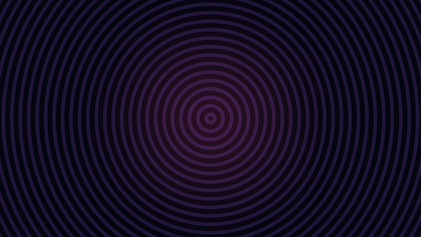
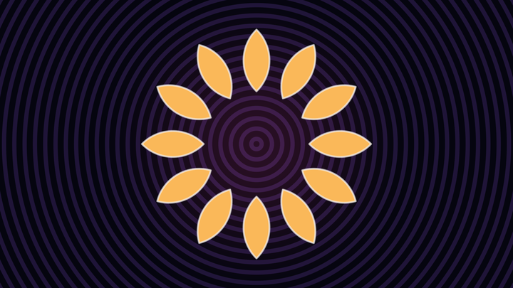
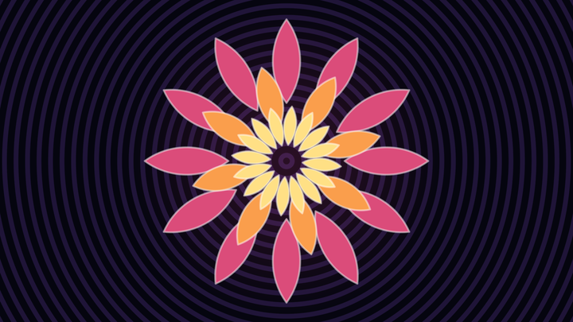
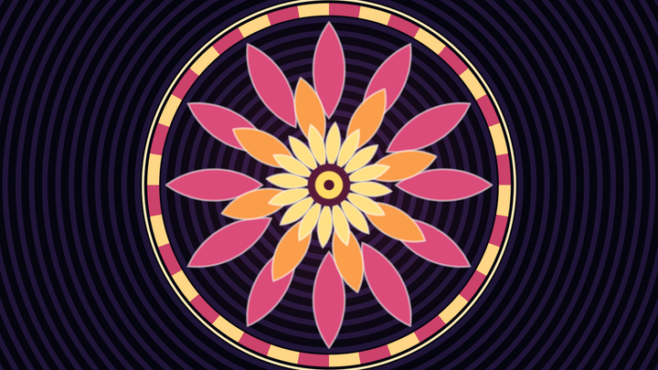
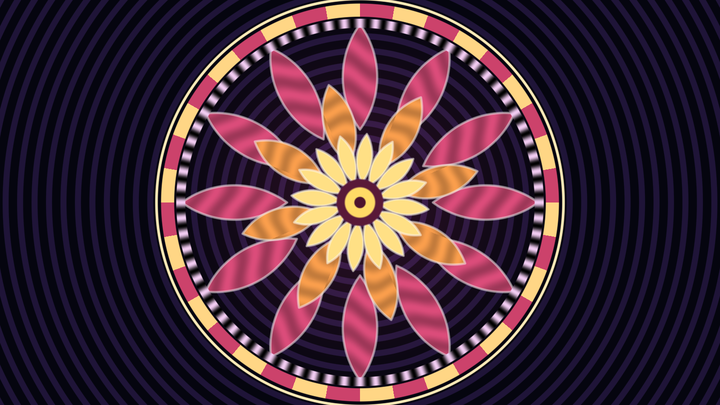
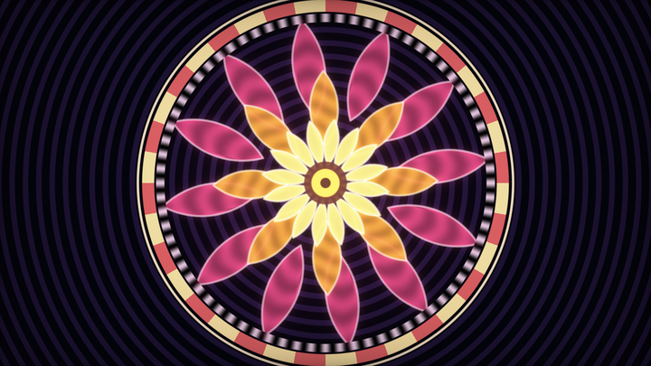

# 第 6 章 · 网格与拼贴

> 第 0 章的核心分解——**单元 id + 局部坐标**——在这一章展开成完整工具箱。
>
> 噪声解决"随机"；网格解决"重复"。两者一碰，就是星空、砖墙、蜂窝、城市、Truchet 隧道……语料桶 `B_grids_tiling` 有 227 个作品，骨架几乎总是同一句：`floor` + `fract`。

---

## 6.1 为什么网格是 shader 里最赚的结构

命令式思维："我要画 1000 个六边形" → 循环 1000 次。  
Shader 思维："任意点 p 落在哪个六边形里？它到该六边形边界多远？" → **成本与六边形个数无关**。

这就是域重复（domain repetition）的魔力：

```
无限个物体 ≈ 一个物体的距离/图案函数 + floor/fract
```

代价是：物体彼此相同。要破除相同，就把 `floor(p)` 得到的**格子编号**丢进哈希（第 5 章）——同构重复立刻变成"程序化多样性"。

整章按难度递进：方格 → 砖墙 → 六边形 → Truchet → 极坐标（年轮 / 扇形色轮 / 花瓣 / 万花筒）→ 有限重复 → 多尺度/四叉树 → 与 3D 挤出网格的关系。章末有一条完整的曼陀罗阶梯实战（6.16），把这些零件装成一台机器。

---

## 6.2 单元 id + 局部坐标：一切的起点

对任意 2D 点 `p`（建议已按屏幕高归一化）：

<!-- glsl-skip -->
```glsl
vec2 id = floor(p);        // 我在第几号格子？→ 哈希、选瓦片、选颜色
vec2 lp = fract(p) - 0.5;  // 格子内坐标，原点在格心 → 画圆、SDF、对称
```

| 量 | 范围 | 用途 |
|---|---|---|
| `id` | 整数（float 存） | `hash(id)`、奇偶分层、邻居查询 |
| `fract(p)` | `[0,1)²` | 贴图 UV、角落对齐的图案 |
| `fract(p)-0.5` | `[-0.5,0.5)²` | 以格心为原点的 SDF（圆、方、星） |

可视化一下你就永远忘不掉：

```glsl
void mainImage(out vec4 fragColor, in vec2 fragCoord)
{
    vec2 p = (2.0*fragCoord - iResolution.xy) / iResolution.y;
    p *= 4.0;
    vec2 id = floor(p);
    vec2 lp = fract(p) - 0.5;

    // 红绿显示局部坐标；格子棋盘用 id 调制亮度
    vec3 col = vec3(lp + 0.5, 0.0);
    col *= 0.6 + 0.4*mod(id.x + id.y, 2.0);
    // 格心小圆
    float d = length(lp) - 0.15;
    col = mix(col, vec3(1.0), smoothstep(0.02, 0.0, d));
    fragColor = vec4(col, 1.0);
}
```

语料里 `fract` 出现在过半文件中，不是巧合——**几乎所有程序化图案都从这里起步**。

kishimisu 的入门作把缩放、重复、哈希串成完整教学链：

> 📄 出自 `001063-mtyGWy-Shader_Art_Coding_Introduction/image.glsl`（kishimisu）

过滤后的方格线（抗锯齿网格）可参考：

> 📄 出自 `000159-XtBfzz-Filtered_grid_box_2D_/image.glsl`（iq）

---

## 6.3 方形网格：从线框到单元格内容

### 6.3.1 画网格线

局部坐标到边缘的距离：

```glsl
float gridLine(vec2 lp, float halfWidth)
{
    // lp ∈ [-0.5,0.5)；到四边的最短距离
    vec2 d = 0.5 - abs(lp);
    float m = min(d.x, d.y);
    return smoothstep(halfWidth, 0.0, m);
}
```

或用 `fract` 直接在 UV 上画：

<!-- glsl-skip -->
```glsl
vec2 g = abs(fract(p) - 0.5);
float line = smoothstep(0.0, 0.02, 0.5 - max(g.x, g.y));
```

### 6.3.2 每格放一个形状

经典公式：格心圆 + 每格随机半径/颜色。

```glsl
float hash12(vec2 p) {
    vec3 p3 = fract(vec3(p.xyx) * .1031);
    p3 += dot(p3, p3.yzx + 33.33);
    return fract((p3.x + p3.y) * p3.z);
}

void mainImage(out vec4 fragColor, in vec2 fragCoord)
{
    vec2 p = (2.0*fragCoord - iResolution.xy) / iResolution.y * 6.0;
    vec2 id = floor(p);
    vec2 lp = fract(p) - 0.5;

    float rnd = hash12(id);
    float r = 0.15 + 0.25*rnd;
    float d = length(lp) - r;
    vec3 col = 0.5 + 0.5*cos(6.2831*rnd + vec3(0.0, 1.0, 2.0));
    col *= smoothstep(0.02, 0.0, d);
    fragColor = vec4(col, 1.0);
}
```

这就是第 0 章说的"画 1000 个星星"——**格子数随缩放变，代码长度不变**。

### 6.3.3 邻居：何时要 3×3

如果形状只在格内、半径 ≤ 0.5，只看本格即可。  
一旦形状可能越界（大圆、光晕、Truchet 弧连到邻格），必须循环邻居：

<!-- glsl-skip -->
```glsl
float d = 1e5;
for (int j = -1; j <= 1; j++)
for (int i = -1; i <= 1; i++) {
    vec2 nid = id + vec2(i, j);
    vec2 nlp = lp - vec2(i, j);   // 把邻格中心变到当前局部系
    d = min(d, length(nlp) - radiusFromHash(nid));
}
```

Voronoi（第 5 章）本质上就是"每格一个特征点 + 3×3/5×5 邻域"。

---

## 6.4 砖墙：行偏移

砖墙 = 方格 + **奇数行平移半格**。

```glsl
vec2 brickId(vec2 p)
{
    // 奇数行（或偶数行）水平挪 0.5
    float row = floor(p.y);
    if (mod(row, 2.0) > 0.5)
        p.x += 0.5;
    return floor(p);
}

vec2 brickLocal(vec2 p)
{
    float row = floor(p.y);
    if (mod(row, 2.0) > 0.5)
        p.x += 0.5;
    return fract(p) - 0.5;
}
```

无分支写法（GPU 更友好）：

```glsl
vec2 brickify(vec2 p)
{
    vec2 f = floor(p);
    p.x += 0.5 * mod(f.y, 2.0);
    return p;
}
// 然后照常 id=floor(brickify(p)), lp=fract(brickify(p))-0.5
```

视觉调参：

- 砖的长宽比：先 `p.x *= 0.5`（或 `p *= vec2(0.5,1.0)`）再进砖墙函数
- 缝宽：用 `0.5 - max(abs(lp.x), abs(lp.y))` 做 mortar 距离
- 每砖颜色：`hash(brickId)`

石板 / 非对称砖缝的进阶可参考：

> 📄 出自 `000148-7tKGRc-Straight_Flagstone_Tiles/image.glsl`（gelami）

---

## 6.5 六边形网格

### 6.5.1 为什么要单独讲

方格有两个问题：对角邻居距离是边邻居的 √2 倍（各向异性）；紧密堆积不是最优。六边形是平面上最匀的单形铺砌之一——游戏、蜂窝、城市场、抽象图案里极常见。

### 6.5.2 iq 的距离版六边形

权威实现同时返回：**细胞 id、到边距离、到中心距离**。

> 📄 出自 `000285-Xd2GR3-Hexagons_-_distance/image.glsl`（iq）

<!-- glsl-skip -->
```glsl
// { 2d cell id, distance to border, distance to center }
vec4 hexagon( vec2 p )
{
    vec2 q = vec2( p.x*2.0*0.5773503, p.y + p.x*0.5773503 );

    vec2 pi = floor(q);
    vec2 pf = fract(q);

    float v = mod(pi.x + pi.y, 3.0);

    float ca = step(1.0,v);
    float cb = step(2.0,v);
    vec2  ma = step(pf.xy,pf.yx);

    // distance to borders
    float e = dot( ma, 1.0-pf.yx + ca*(pf.x+pf.y-1.0) + cb*(pf.yx-2.0*pf.xy) );

    // distance to center
    p = vec2( q.x + floor(0.5+p.y/1.5), 4.0*p.y/3.0 )*0.5 + 0.5;
    float f = length( (fract(p) - 0.5)*vec2(1.0,sqrt(3.0)/2.0) );

    return vec4( pi + ca - cb*ma, e, f );
}
```

`0.5773503 ≈ 1/√3`。先把笛卡尔坐标斜切到"六边形晶格索引空间"，再处理 `mod(...,3)` 的三种子格，纠正 id。

用法模式与方格完全同构：

<!-- glsl-skip -->
```glsl
vec4 h = hexagon(8.0 * pos);
float border = h.z;
float toCenter = h.w;
vec2 id = h.xy;
float rnd = hash1(id);
// 描边、填色、按 id 噪声……
```

原作里还用噪声在六边形之间做"红/灰"区域划分，是**网格 id × 噪声场**的示范课。

### 6.5.3 六边形上的其它玩法

| 方向 | 代表作 |
|---|---|
| 3D 六边形格遍历 / raycast | `000269-WtSfWK-Hexagonal_Grid_Traversal_-_3D`（iq） |
| 六边形 Truchet 挤出 | `000329-4td3zj-Raymarched_Hexagonal_Truchet`（Shane） |
| 霓虹六边形体 | `000324-MsVfz1-Neon_Lit_Hexagons`（Shane） |
| 六边形迷宫流 | `000265-llSyDh-Hexagonal_Maze_Flow`（Shane） |
| 迷幻六边形 | `000193-wsl3WB-Hexagone`（BigWIngs） |

先把 `000285` 的 `hexagon()` 抄通，再去读 Shane 的 3D 挤出，路径最顺。

---

## 6.6 Truchet 与奇偶分层

### 6.6.1 Truchet 是什么

Truchet 瓦片：每个格子只放**有限几种局部图案**（常见是四分之一圆弧、对角斜线），格子之间边界对齐，于是全局出现连续的迷宫、管道、波浪。

最小斜线版：

```glsl
float hash12(vec2 p) {
    vec3 p3 = fract(vec3(p.xyx) * .1031);
    p3 += dot(p3, p3.yzx + 33.33);
    return fract((p3.x + p3.y) * p3.z);
}

// 返回到对角弧/线的距离感
float truchetLine(vec2 lp, float rnd)
{
    // 两种朝向：主对角 or 副对角
    if (rnd < 0.5) lp.x = -lp.x;
    // 两条可能的四分之一圆（中心在对角角点）
    float d1 = abs(length(lp - vec2(-0.5,-0.5)) - 0.5);
    float d2 = abs(length(lp - vec2( 0.5, 0.5)) - 0.5);
    return min(d1, d2);
}
```

更常见的是"按哈希在两种瓦片里二选一"，配合 `smoothstep` 描线。

### 6.6.2 奇偶分层

`mod(id.x + id.y, 2.0)` 把平面分成黑白棋盘两套规则：

- 黑格用瓦片 A，白格用瓦片 B → 自然无缝
- 或黑格画圆、白格画方 → 双形态拼贴
- 或黑格与白格用反色，做编织感（weave）

```glsl
vec2  id      = floor(p * 4.0);
float checker = mod(id.x + id.y, 2.0);
col = mix(vec3(0.10, 0.12, 0.18), vec3(0.95, 0.85, 0.62), checker);
```

多瓦片 + 编织 + 重叠的集大成：

> 📄 出自 `000141-4t3BW4-Quadtree_Truchet/image.glsl`（Shane）

万花筒 × Truchet：

> 📄 出自 `000273-7lKSWW-Truchet_Kaleidoscope_FTW/image.glsl`（mrange）

双 3D Truchet：

> 📄 出自 `000205-4l2cD3-Dual_3D_Truchet_Tiles/image.glsl`（Shane）

挤出 Truchet（2D 图案变 3D 浮雕）：

> 📄 出自 `000147-ttVBzd-Extruded_Truchet_Pattern/image.glsl`（Shane）

### 6.6.3 实现清单

做一个好看 Truchet，按这个清单勾：

1. `id / lp` 分解  
2. `hash(id)` → 选瓦片类型（2~4 种）  
3. 每种瓦片用 SDF 写清（弧、直线、十字……）  
4. 需要越界时扩 3×3  
5. `smoothstep` 描边；可选第二色做"编织下层"  
6. 动画：让 `hash` 驱动的相位随 `iTime` 旋转或翻转瓦片  

---

## 6.7 极坐标：把圆变成直线

这一节是全章最"好出片"的部分。方格给你城市和砖墙，极坐标给你花、齿轮、年轮、曼陀罗、光芒、螺旋——所有**绕着一个中心转**的东西。

而它的全部秘密只有两行：

<!-- glsl-skip -->
```glsl
float r = length(p);        // 到中心的距离，[0, ∞)
float a = atan(p.y, p.x);   // 方位角，(-π, π]
```

### 6.7.1 先建立直觉：r 和 a 长什么样

在动手做任何图案之前，先把这两个量画出来看一眼。**这一步永远值得花三十秒**，因为后面所有图案都是它俩的函数。

```glsl
void mainImage(out vec4 fragColor, in vec2 fragCoord)
{
    vec2 p = (2.0*fragCoord - iResolution.xy) / iResolution.y;

    float r = length(p);
    float a = atan(p.y, p.x);

    // 左半屏画 r，右半屏画 a（都归一化后做成色带）
    float v = (p.x < 0.0) ? r : (a/6.2831853 + 0.5);
    vec3 col = 0.5 + 0.5*cos(6.2831853*(5.0*v + vec3(0.0, 0.33, 0.67)));

    // 中缝
    col *= smoothstep(0.003, 0.007, abs(p.x));
    fragColor = vec4(col, 1.0);
}
```

看到了吗：

- **`r` 的等值线是同心圆。** 任何只依赖 `r` 的图案，一定是一圈圈的环。
- **`a` 的等值线是从原点射出的直线。** 任何只依赖 `a` 的图案，一定是放射状的。

于是整节的路线图就清楚了：

| 只用 | 得到 | 例子 |
|---|---|---|
| `r` | 同心环 | 年轮、靶子、涟漪、唱片 |
| `a` | 放射线 | 扇形派、色轮、齿轮、光芒 |
| `r` + `a` 独立 | 极坐标棋盘 | 靶心格、圆形棋盘 |
| `r` + `a` **耦合** | 螺旋 | 漩涡、发条、星系 |
| `a` 决定 `r` 的阈值 | 花瓣 | 玫瑰线、花朵 |
| 对 `a` 取模 | 旋转对称重复 | 曼陀罗、雪花、万花筒 |

还有一件最重要的认知：

> **在极坐标里，`floor`/`fract` 依然是那台复印机**，只是复印方向从"横向平移"变成了"绕圈"（对 `a`）或"向外"（对 `r`）。第 6.2 节的 `id + lp` 分解一字不改地适用。

### 6.7.2 只动 r：从同心圆到年轮

**第一步，最小可运行版本。** 把 `r` 乘一个数再 `fract`，立刻得到同心环：

```glsl
float r     = length(p);
float rings = step(0.5, fract(r * 8.0));   // 8 圈黑白硬边环
col = vec3(rings);
```

**第二步，换成"到环线的距离"。** 硬边有锯齿，而且线宽不可控。做法和第 6.3.1 节画网格线完全一样——求局部坐标到中心的距离：

```glsl
float r    = length(p);
float N    = 8.0;
float k    = r * N;                  // 整数部分 = 环号，小数部分 = 环内进度
float band = abs(fract(k) - 0.5);    // 0 = 环线正中，0.5 = 两环之间
col = vec3(band * 2.0);
```

**第三步，这里有个容易忽略的细节：除以 `N`。**

`band` 是"相位单位"的距离，不是屏幕单位的。`k = r*N` 意味着 `k` 变化得比 `r` 快 `N` 倍，所以屏幕上的实际距离是 `band / N`。不除的话，你把 `N` 从 8 调到 30，线会跟着变细 4 倍——调参会变成噩梦。

把滑块拖着 `N` 走一遍，你会看到线宽**始终不变**：

```glsl
#define N 8.0
#define W 0.15

void mainImage(out vec4 fragColor, in vec2 fragCoord)
{
    vec2  p = (2.0*fragCoord - iResolution.xy) / iResolution.y;
    float k = length(p) * N;

    // 除以 N，把相位单位的距离换算回屏幕尺度 —— 线宽从此与 N 无关
    float d    = (abs(fract(k) - 0.5) - W) / N;
    float line = smoothstep(0.006, 0.0, d);

    fragColor = vec4(vec3(1.0 - line), 1.0);
}
```

**第四步，让每圈都不一样。** 这就是第 6.2 节那句话的极坐标版：`id = floor(k)` 是环号，丢进哈希就得到"每圈不同"。

**第五步，扰动 r 本身。** 真实的年轮不是正圆——树心偏一边、每年长得不匀。把一个低频起伏加进 `r`，木头的味道就出来了。

合起来是一块木头的横截面：

```glsl
float hash11(float x) { return fract(sin(x*127.1) * 43758.5453); }

// 低频起伏：让年轮偏心、不规则。用几个不同频率的 sin 叠加就够（第 0 章的手工 fbm）
float wob(vec2 p)
{
    return 0.50*sin(p.x*2.3 + 1.7)
         + 0.35*sin(p.y*3.1 - 0.6)
         + 0.20*sin((p.x + p.y)*5.3 + 2.2);
}

void mainImage(out vec4 fragColor, in vec2 fragCoord)
{
    vec2 p = (2.0*fragCoord - iResolution.xy) / iResolution.y * 1.4;

    // 1) 扰动半径 —— 只改一个数，正圆就变成了木头
    float r = length(p) + 0.10*wob(p*1.6);

    // 2) 环号 + 环内位置
    float n  = 9.0;
    float k  = r * n;
    float id = floor(k);

    // 3) 每圈宽度不同（春材宽、秋材窄）
    float w = 0.10 + 0.28*hash11(id);

    // 4) 到环线的距离，除以 n 换回屏幕尺度
    float d    = (abs(fract(k) - 0.5) - w) / n;
    float line = smoothstep(0.006, 0.0, d);

    // 5) 木色底 + 深色环线
    vec3 wood = mix(vec3(0.78, 0.55, 0.32), vec3(0.62, 0.40, 0.22),
                    0.5 + 0.5*sin(k*6.2831853));
    vec3 col  = mix(wood, vec3(0.26, 0.14, 0.06), line);

    // 6) 细纤维：高频微调制，成本一行，质感翻倍
    col *= 0.94 + 0.06*sin(r*260.0);

    fragColor = vec4(col, 1.0);
}
```

想要**涟漪**而不是年轮？把 `r` 换成 `r - iTime*0.4`，再让振幅随 `r` 衰减。想要**唱片**？把 `w` 固定、`n` 调到 200、颜色改成深灰。**同一个骨架**。

### 6.7.3 只动 a：扇形间隔色的圆

这是最常被问的效果之一："怎么做一个像饼图/色轮那样、扇形间隔着颜色的圆？"

答案就是把第 6.2 节的 `id + lp` 分解搬到角度上：

<!-- glsl-skip -->
```glsl
float sector = 6.2831853 / N;        // 每扇的角宽
float sid    = floor(a / sector);    // 扇形编号  ← 对应 floor(p)
float la     = fract(a / sector);    // 扇形内位置 ← 对应 fract(p)
```

**最小版本，六行出图**——这就是"扇形间隔颜色的圆"：

```glsl
float r      = length(p);
float a      = atan(p.y, p.x);
float sector = 6.2831853 / 10.0;             // 10 扇
float sid    = floor(a / sector);            // 扇形编号

col  = mix(vec3(0.92, 0.35, 0.45), vec3(0.99, 0.86, 0.55), mod(sid, 2.0));
col *= step(r, 0.8);                         // 只在半径 0.8 的圆内
```

**但这里埋着本节最重要的坑。** `atan` 的值域是 `(-π, π]`：当你从第二象限跨过 −x 轴走到第三象限时，`a` 会瞬间从 `+π` 跳到 `−π`。于是 `sid` 会从 `+N/2` 跳到 `−N/2`——**在 180° 方向上出现一条接缝**。

两条纪律，记住就永远不会踩：

1. **扇形数 `N` 取整数**，并且让它参与的所有周期函数都以 `N` 为周期；
2. **给 `sid` 套一层 `mod(sid, N)`**，把 `-N/2` 折回 `+N/2`，两侧的编号就对上了。

查错的办法也很简单：**接缝永远出现在正左方（180°）**。看到画面左边有一条不该有的线，先怀疑 `atan`。

完整的旋转色轮，顺便解决了"扇形之间怎么留缝"：

```glsl
void mainImage(out vec4 fragColor, in vec2 fragCoord)
{
    vec2 p = (2.0*fragCoord - iResolution.xy) / iResolution.y;

    float r = length(p);
    float a = atan(p.y, p.x) + iTime*0.35;     // 加一项就是整体旋转

    const float N      = 12.0;
    float       sector = 6.2831853 / N;

    // 扇形编号（取模消接缝）与扇形内的局部角
    float sid = mod(floor(a/sector), N);
    float la  = fract(a/sector) - 0.5;         // [-0.5, 0.5]，0 = 扇形中线

    // 每扇一色：色相跟着 sid 走，明暗按奇偶交替 —— "间隔颜色"就这一行
    vec3 base = 0.5 + 0.5*cos(6.2831853*(sid/N + vec3(0.0, 0.33, 0.67)));
    vec3 col  = mix(base*0.32, base, mod(sid, 2.0));

    // 扇形之间留缝。注意 (0.5-|la|)*sector 是角度差，
    // 再乘 r 才变成【弧长】，也就是屏幕上的真实距离 —— 这样缝宽才不随半径变化
    float gap = (0.5 - abs(la)) * sector * r;
    col *= smoothstep(0.0, 0.006, gap - 0.004);

    // 外边界 + 中心圆孔（都用 smoothstep 抗锯齿）
    col *= smoothstep(0.004, 0.0, r - 0.80);
    col *= smoothstep(0.0, 0.004, r - 0.16);

    fragColor = vec4(col, 1.0);
}
```

那句 `gap = (0.5-|la|) * sector * r` 值得单独记住。**角度差乘半径 = 弧长**。凡是"在极坐标里想要一个屏幕尺度固定的东西"，都要乘这个 `r`。忘了乘，缝隙就会在中心细如发丝、在外圈粗得离谱。

改 `N` 就是改扇数；把 `base` 换成固定两色就是纯色饼图；把 `iTime*0.35` 删掉就是静态色轮；把 `mod(sid,2.0)` 换成 `hash11(sid)` 就是随机亮度的抽奖转盘。

### 6.7.4 r 和 a 一起用：极坐标棋盘

环号 + 扇号，奇偶相加，就是圆形棋盘——第 6.6.2 节 `mod(id.x+id.y, 2.0)` 的极坐标版，**一个字都不用改思路**：

```glsl
#define RINGS   8.0
#define SECTORS 16.0
#define TWIST   1.6

void mainImage(out vec4 fragColor, in vec2 fragCoord)
{
    vec2 p = (2.0*fragCoord - iResolution.xy) / iResolution.y;

    float r = length(p);
    float a = atan(p.y, p.x);

    // TWIST*r：让扇线随半径偏转 —— 棋盘立刻变成漩涡棋盘
    a += TWIST*r + iTime*0.20;

    float ring = floor(r * RINGS);
    float sec  = floor(a / 6.2831853 * SECTORS);
    float chk  = mod(ring + sec, 2.0);

    vec3 col = mix(vec3(0.08, 0.10, 0.16), vec3(0.95, 0.85, 0.60), chk);
    col *= smoothstep(0.006, 0.0, r - 0.9);

    fragColor = vec4(col, 1.0);
}
```

**为什么 `SECTORS` 必须是偶数？** 跨过接缝时 `sec` 跳变 `SECTORS`。要让 `mod(ring+sec, 2.0)` 不变，这个跳变量必须是偶数。把 16 改成 15 试试，左边会立刻出现一条错位的裂缝——这是理解接缝问题最快的实验。

`TWIST` 从 0 慢慢加到 3，你会亲眼看到棋盘怎么变成漩涡。这行 `a += TWIST*r` 就是下一小节的引子。

### 6.7.5 让 r 和 a 耦合：螺旋

螺旋的定义就是**角度相位和半径相位相加**：

<!-- glsl-skip -->
```glsl
float ph = a/6.2831853 * ARMS + r * PITCH;   // 关键的一行
```

- `ARMS` 是臂数（必须是**整数**，否则接缝处断开）
- `PITCH` 是螺距：每向外走一个单位，相位推进多少圈
- 给 `ph` 减一个 `iTime` 项，螺旋就开始旋转

```glsl
#define ARMS  3.0
#define PITCH 2.0

void mainImage(out vec4 fragColor, in vec2 fragCoord)
{
    vec2 p = (2.0*fragCoord - iResolution.xy) / iResolution.y;

    float r = length(p);
    float a = atan(p.y, p.x);

    float ph = a/6.2831853*ARMS + r*PITCH - iTime*0.30;

    // 到臂中心线的距离（相位单位）。和年轮一样，这是 abs(fract-0.5)
    float d   = abs(fract(ph) - 0.5);
    float arm = smoothstep(0.30, 0.10, d);

    vec3 col = mix(vec3(0.03, 0.04, 0.09), vec3(0.30, 0.85, 1.00), arm);
    col += vec3(0.10, 0.45, 0.90) * exp(-d*6.0) * 0.6;   // 辉光
    col *= smoothstep(0.02, 0.0, r - 1.0);

    fragColor = vec4(col, 1.0);
}
```

`PITCH` 为 0 时退化成纯扇形；`ARMS` 为 0 时退化成同心环。**螺旋就是这两者的连续插值**——这个认识比记住公式有用得多。

### 6.7.6 花瓣做法一：让半径随角度变化

现在做花。最直接的想法：**圆是 `r < R`，那让 `R` 随角度波动，就是花。**

<!-- glsl-skip -->
```glsl
float R = R0 + amp*cos(k*a);   // 半径随角度起伏 k 次
float d = r - R;               // d < 0 在花瓣内
```

`k` 就是花瓣数，必须是整数（又是接缝纪律）。`amp/R0` 控制花瓣的"尖锐度"：比值小是波浪形圆，比值接近 1 是尖瓣。

`d = r - R(a)` 不是精确的距离场，但它**符号正确**，所以 `smoothstep` 填充和 `abs(d)` 描边都照常能用。对 2D 装饰图案，这个精度完全够。

三层叠加就是一朵完整的花：

```glsl
// 一层花瓣的（近似）距离场
float petalD(vec2 p, float k, float R0, float amp, float rot)
{
    float r = length(p);
    float a = atan(p.y, p.x) + rot;
    return r - (R0 + amp*cos(k*a));
}

void mainImage(out vec4 fragColor, in vec2 fragCoord)
{
    vec2 p = (2.0*fragCoord - iResolution.xy) / iResolution.y * 1.25;
    vec3 col = vec3(0.05, 0.03, 0.08);

    // 由外到内三层：瓣数递增、半径递减、相位错开
    for (int i = 0; i < 3; i++) {
        float f = float(i);
        float d = petalD(p, 5.0 + 2.0*f,          // k：5, 7, 9 瓣
                            0.72 - 0.20*f,        // R0：由外到内
                            0.16 - 0.03*f,        // amp
                            0.35*f + iTime*0.10*(f + 1.0));
        vec3 pc = 0.5 + 0.5*cos(6.2831853*(0.10*f + vec3(0.0, 0.20, 0.42)));

        col = mix(col, pc, smoothstep(0.006, -0.006, d));
        col += pc * smoothstep(0.05, 0.0, abs(d)) * 0.35;   // 瓣缘描光
    }

    // 花心：极坐标在 r=0 是奇点，几乎所有作品都要盖一个圆盘（见 6.7.8）
    col = mix(col, vec3(1.0, 0.86, 0.35), smoothstep(0.006, -0.006, length(p) - 0.13));

    fragColor = vec4(col, 1.0);
}
```

> 数学课上的**玫瑰线** `r = cos(kθ)` 是这个式子的极端情形（`R0 = 0`），瓣数会因 `k` 的奇偶变成 `k` 或 `2k`。做视觉时用 `R0 + amp*cos(kθ)` 且 `R0 > amp` 更好控制：瓣数恒等于 `k`，而且花瓣不会退化成过原点的尖点。

### 6.7.7 花瓣做法二：折叠 + 真正的 SDF

做法一简单，但有两个硬限制：`abs(d)` 只是近似距离，所以**描边宽度沿角度会变**；而且没法圆角、没法用 `smin` 和别的形状融合。

正统做法是反过来：**先把整个平面折进一个扇形，然后在里面画一枚真正的花瓣。**

```glsl
// 把整个平面折进 1/n 个扇形。
// 用 atan(p.x, p.y)（注意参数顺序反了）是为了从 +y 轴量角，
// 折出来的花瓣自然"朝上"，摆图元时不用再脑内旋转 90°。
vec2 fold(vec2 p, float n)
{
    float sector = 6.2831853 / n;
    float a = atan(p.x, p.y);
    a = mod(a + 0.5*sector, sector) - 0.5*sector;
    return length(p) * vec2(sin(a), cos(a));
}

// iq 的 vesica：两个圆相交出的透镜形，是最像花瓣的 2D 图元。
// 长轴沿 y，半长 = sqrt(r*r-d*d)，半宽 = r-d。
float sdVesica(vec2 p, float r, float d)
{
    p = abs(p);
    float b = sqrt(r*r - d*d);
    return ((p.y - b)*d > p.x*b)
        ? length(p - vec2(0.0, b))
        : length(p - vec2(-d, 0.0)) - r;
}

// vesica 的 (r,d) 太不直观。改成用【半长 L、半宽 W】来描述，要求 W < L
float sdPetal(vec2 p, float L, float W)
{
    float s = L*L/W;
    return sdVesica(p, 0.5*(W + s), 0.5*(s - W));
}

void mainImage(out vec4 fragColor, in vec2 fragCoord)
{
    vec2 p = (2.0*fragCoord - iResolution.xy) / iResolution.y;

    vec2  q = fold(p, 9.0);                          // 9 枚
    float d = sdPetal(q - vec2(0.0, 0.55), 0.28, 0.10);

    d -= 0.02;                                       // 圆角：真距离场才敢这么写

    vec3 col = vec3(0.04, 0.03, 0.07);
    col = mix(col, vec3(0.95, 0.45, 0.60), smoothstep(0.005, -0.005, d));
    // 描边宽度处处一致 —— 这就是"真距离"换来的东西
    col = mix(col, vec3(1.0), smoothstep(0.005, 0.0, abs(d) - 0.004));
    col += vec3(1.0, 0.55, 0.75) * exp(-abs(d)*45.0) * 0.35;

    fragColor = vec4(col, 1.0);
}
```

代码里只画了**一枚**花瓣，屏幕上出现九枚——这正是第 6.1 节那句"成本与个数无关"的极坐标版。

两种做法怎么选：

| | 做法一 `r - R(a)` | 做法二 折叠 + SDF |
|---|---|---|
| 代码量 | 极少 | 多一个 fold + 一个图元 |
| 距离是否准确 | 否（只保证符号） | 是 |
| 描边宽度均匀 | 不均匀 | 均匀 |
| 能否圆角 / `smin` 融合 | 不能 | 能 |
| 花瓣形状自由度 | 只有正弦波形 | 任意 2D SDF（第 7 章整章都能用） |
| 适合 | 快速装饰、背景 | 出品级图形、要挤出成 3D 时 |

**做法二还有一个隐藏福利**：折叠之后你在扇形里放什么都可以——弧线、星星、Truchet 瓦片、噪声。第 6.7.9 节的万花筒和本章末尾的曼陀罗实战都建立在它之上。

### 6.7.8 极坐标的三个坑

**坑一：±π 接缝。** 前面反复提过，这里给出统一的判据。凡是把 `a` 送进 `floor` / `fract` / `cos(k·a)` 的地方，跨过 −x 轴时 `a` 会跳 `2π`。要让图案不断裂，这个跳变必须落在图案的整数周期上，也就是：

> **扇数、臂数、瓣数、齿数——全部取整数。** 需要编号连续时再套一层 `mod(id, N)`。

**坑二：外圈走样。** 弧长 = `r · Δθ`。同样的角频率，`r = 1.0` 处的条纹密度是 `r = 0.2` 处的 5 倍。所以放射状细纹在外圈必然闪烁、起摩尔纹。三种对策：

<!-- glsl-skip -->
```glsl
// A) 让角频率随 r 下降（最简单，物理上也最像"细节随距离变粗"）
float freq = 60.0 / max(r, 0.2);

// B) 用 fwidth 自适应线宽（第 6.13 节那一套，直接搬过来）
float w = 1.5 * fwidth(phase);

// C) 干脆让放射纹在外圈淡出
strength *= smoothstep(1.0, 0.6, r);
```

**坑三：原点是奇点。** `r → 0` 时 `a` 完全没有意义——所有扇形挤在一个像素里，必然出现噪点。**所以真实作品里的曼陀罗、齿轮、花朵，中心永远有一个圆盘（花心、轴、靶心）**。这不是审美选择，是数学上的必需。

顺手记两个小工具：

- `atan(p.y, p.x)`：从 +x 轴量角，逆时针为正。数学惯例。
- `atan(p.x, p.y)`：从 **+y** 轴量角，顺时针为正。做"朝上的花瓣/箭头"时省一次旋转。

### 6.7.9 极坐标重复

把笛卡尔 `(x,y)` 换成 `(r, θ)`，再对 `θ` 做 `fract`：

```glsl
vec2 toPolar(vec2 p)
{
    return vec2(length(p), atan(p.y, p.x));
}

vec2 polarRepeat(vec2 p, float n)
{
    vec2 pol = toPolar(p);
    float sector = 6.2831853 / n;
    pol.y = mod(pol.y, sector) - 0.5*sector; // 折到一个扇形
    // 回到笛卡尔，便于继续用普通 SDF
    return pol.x * vec2(cos(pol.y), sin(pol.y));
}
```

于是"画一个圆角矩形"自动变成"一圈花瓣"。`n = 5,6,8,12` 是常用对称。

注意这个 `polarRepeat` 和 6.7.7 的 `fold` 是同一件事，只差量角的基准轴。

### 6.7.10 万花筒（Kaleidoscope）

万花筒 = 极坐标重复 + **镜像**：

```glsl
vec2 kaleidoscope(vec2 p, float n)
{
    float sector = 6.2831853 / n;
    float a = atan(p.y, p.x);
    float r = length(p);
    a = abs(mod(a, sector) - 0.5*sector); // 镜像折叠
    return r * vec2(cos(a), sin(a));
}
```

`abs(mod(...)-半宽)` 是关键：没有 `abs` 只是重复；有 `abs` 才是镜子拼出的万花筒。

可与 Truchet、噪声、域扭曲叠用——`000273` 就是这条路上的狂欢版。

### 6.7.11 与"对数螺旋 / Droste"的边界

简单极坐标重复保距性差（越靠外弧长越长）。若要 Escher 式无限走廊，需要对数极坐标或 inversion，那是更专门的域变换（语料里 `000158-Mdf3zM` 等 Escher 向作品）。本章先掌握**扇形折叠**即可。

---

## 6.8 有限重复

无限 `fract` 很美，但有时只要"一排 5 个柱子"或"3×3 窗口"。

### 6.8.1 clamp 住格子 id

```glsl
vec2 limitedRepeat(vec2 p, vec2 count)
{
    // count = 想要的格子数量（例如 vec2(5.0, 3.0)）
    vec2 id = clamp(floor(p), vec2(0.0), count - 1.0);
    vec2 lp = p - id - 0.5; // 注意：边缘格的 lp 可以超出 [-0.5,0.5]
    return lp;
}
```

更常见的 iq 风格（先偏移再 clamp）：

<!-- glsl-skip -->
```glsl
// 在 [-s, s] 范围内重复，之外不重复
p.x = p.x - clamp(round(p.x), -s, s);
```

对 1D：

```glsl
float repeatLimited(float x, float spacing, float n)
{
    float id = clamp(round(x / spacing), -n, n);
    return x - id * spacing;
}
```

### 6.8.2 为何不能只写 fract

`fract` 会把**整个实轴**折叠。场景右边无穷远还有柱子，raymarch 会继续撞到它们。有限重复用 `clamp(round(...))` 把 id 锁在范围内，外面恢复成普通欧氏空间——**SDF 才仍然合法**（无限 fract 在 3D 距离场里本就需要小心，有限版更可控）。

### 6.8.3 和哈希的配合

有限个格子仍然可以 `hash(id)`：一排窗户每扇亮度不同、一列柱子半径微扰——成本依旧是 O(1)。

---

## 6.9 四叉树与多尺度拼贴

### 6.9.1 动机

单一尺度网格：要么太碎，要么太空。真实世界（城市街区、裂纹、电路、Truchet 装饰）往往是**大块里面再细分**。

四叉树拼贴的程序化近似：

1. 在粗网格上，用哈希决定：这一格是"叶子"（画最终瓦片）还是"继续分"
2. 若继续分，把格一分为四，递归（或固定 2~3 层展开）
3. 不同层可用不同瓦片集、不同颜色优先级（Shane 所谓 reverse color order）

### 6.9.2 语料入口

多尺度 Truchet 的完整演示：

> 📄 出自 `000141-4t3BW4-Quadtree_Truchet/image.glsl`（Shane）

注释里写明思路：粗格随机铺一部分瓦片 → 剩余格四分 → 再铺 → 直到层数用尽。难点在于**片元着色器不能随机访存**，必须用可解析的层级索引，而不是真正建树。

更短的四叉树实验：

> 📄 出自 `000209-lljSDy-quadtree_3/image.glsl`（FabriceNeyret2）

SDF 四叉树棱柱（把细分挤成 3D）：

> 📄 出自 `000122-mltyDX-2D_SDF_Quadtree_Prisms/image.glsl`（Shane）

分形 XOR 式拼贴（另一路多尺度）：

> 📄 出自 `000173-Ml2GWy-Fractal_Tiling/image.glsl`（iq）

### 6.9.3 实现时怎么想（不必一次抄完）

把层级写成显式循环，而不是递归函数（GLSL 对递归支持差）：

<!-- glsl-skip -->
```glsl
float d = 1e5;
vec2 cell = floor(p);
float scale = 1.0;
for (int level = 0; level < 3; level++) {
    float h = hash12(cell + float(level)*17.0);
    if (h > 0.55) {
        // 本层作为叶子：写入瓦片距离，break
        d = min(d, tileSDF(fract(p/scale) - 0.5, h));
        break;
    }
    // 否则进入子格
    scale *= 0.5;
    cell = floor(p / scale);
}
```

这是教学向伪结构；真正要过线看的效果，请直接对照 `000141` / `000209` 的控制流。关键认知是：

> **多尺度 = 在哈希控制下切换 `floor` 的粒度。**

---

## 6.10 与 raymarch 挤出网格的关系

到目前为止都是 2D。语料里大量"科幻地板 / 迷宫 / 晶格世界"其实是：

```
2D 网格 SDF 或高度  →  挤出成 3D  →  raymarch
```

### 6.10.1 挤出一句话

若 `d2 = sdPattern(p.xz)` 是 2D 距离，挤出高度 `h`：

<!-- glsl-skip -->
```glsl
// 极简挤出（示意）
vec2 w = vec2(d2, abs(p.y) - h);
float d3 = min(max(w.x, w.y), 0.0) + length(max(w, 0.0));
```

更常见的是"网格里采样高度，再对竖直方向做平面差"。无论哪种，**贵的是 2D 图案，不是挤出本身**。

### 6.10.2 Shane 系列在做什么

Shane 在 `B_grids_tiling` 桶里有一组高度相关的作品，建议按这个顺序读：

| 作品 | 看什么 |
|---|---|
| `000373-wtfBDf-Warped_Extruded_Skewed_Grid` | 扭曲 + 斜切网格 + 挤出；演示"有序网格看起来像随机高度" |
| `000147-ttVBzd-Extruded_Truchet_Pattern` | Truchet 直接挤成浮雕 |
| `000329-4td3zj-Raymarched_Hexagonal_Truchet` | 六边形 Truchet 的 3D 版 |
| `000363-WtfGDX-Triangle_Grid_Contouring` | 三角网格上的等高/轮廓 |
| `000205-4l2cD3-Dual_3D_Truchet_Tiles` | 双层 3D Truchet |
| `000600-Mld3Rn-Perspex_Web_Lattice` | Voronoi / 晶格网（跨 noise 与 grid 两桶） |

读这些代码时用第 0 章的方法：**先找 `map`，认准哪里在做 2D 格点分解，哪里开始 `p.y` 挤出，哪里做 warping。** 2D 基础不扎实就冲 3D，会被一堆 `mat2` 斜切绕晕——所以本章放在噪声之后、raymarch 专章之前。

### 6.10.3 设计口诀

1. 先在 2D 把格子图案调到愿意截图  
2. 再挤出  
3. 最后加 warping / 相机路径 / 光照  

不要反过来。

---

## 6.11 一张总表：遇到图案怎么选网格

| 目标图案 | 结构 | 关键函数 |
|---|---|---|
| 窗框、像素风、棋盘 | 方格 | `floor/fract` |
| 砖墙、人行道 | 行偏移方格 | `p.x += 0.5*mod(floor(p.y),2)` |
| 蜂窝、螺母、科技六边 | 六边形 | `hexagon()`（`000285`） |
| 管道、迷宫、电路感曲线 | Truchet | 哈希选瓦片 + 弧 SDF |
| 花瓣、徽章、曼陀罗 | 极坐标重复 / 万花筒 | `atan` + `mod` + `abs` |
| 一排柱、有限窗户 | 有限重复 | `clamp(round(...))` |
| 城市街区、多尺度装饰 | 四叉树 / 分形拼贴 | `000141` / `000173` |
| 3D 地板世界 | 上述任一 + 挤出 | Shane 挤出系列 |

与第 5 章的组合拳：

- 网格负责**位置结构**  
- `hash(id)` 负责**每格差异**  
- 噪声 / fbm / warping 负责**有机扰动**（让格子不那么死）

例如：六边形 id × fbm 选色 × 轻微 domain warp——已经是出品级抽象背景。

---

## 6.12 斜切网格与"看起来随机、其实有序"

方格太齐、纯哈希太乱，中间地带是**斜切（skew）**：先把格子中心推到斜坐标系，再在局部画不斜的方块——整体既有秩序又有动感。

> 📄 出自 `000373-wtfBDf-Warped_Extruded_Skewed_Grid/image.glsl`（Shane）

Shane 在注释里强调：这是一个**完全有序**的网格，但挤成高度场后看起来像随机城市——便宜且好看。制作顺序仍是：

1. 2D 里把斜切格子画对（可视化 id）  
2. 每个斜格中心放方块 / pinwheel 双尺寸方块  
3. 可选 domain warp  
4. 再挤出进 raymarch  

三角网格则是另一条轴：

> 📄 出自 `000363-WtfGDX-Triangle_Grid_Contouring/image.glsl`（Shane）

读这些作品时，把"斜切矩阵 / 基向量变换"和"局部仍用正交 SDF"分开看，就不会被吓到。

---

## 6.13 抗锯齿与过滤：格子在远处会闪

屏幕上一个像素盖住很多格子时，`fract` 的高频会 alias（闪烁、摩尔纹）。应对思路：

1. **按像素足迹收束频率**：用 `fwidth(p)` 估计一个像素对应的域大小，线宽取 `max(设计缝宽, fwidth)`。  
2. **解析过滤**：iq 的过滤网格盒专门演示了 box-filtered 格子。

> 📄 出自 `000159-XtBfzz-Filtered_grid_box_2D_/image.glsl`（iq）

3. **远处直接淡出网格线**，只留低频色块——电影里的城市夜景常用这招。

教学向最小抗锯齿线：

```glsl
float aaGrid(vec2 p)
{
    vec2 f = fract(p);
    // 到最近竖线/横线的距离
    vec2 d = min(f, 1.0 - f);
    float m = min(d.x, d.y);
    float w = 1.5 * length(fwidth(p));
    return smoothstep(w, 0.0, m);
}
```

---

## 6.14 网格 × 噪声：最常见的组合拳

只重复会假；只噪声会散。出品级图案几乎总是：

```
p'     = warp(p)                 // 可选，第 5 章
id,lp  = gridBreak(p')           // 本章
style  = hash(id)                // 第 5 章
detail = noise(p' * freq)        // 第 5 章
color  = shade(tileSDF(lp, style), detail)
```

具体配方例子：

| 效果 | 配方 |
|---|---|
| 程序化星空 | 方格 + `step(0.98, hash(id))` + 微闪烁 |
| 湿石头地面 | Voronoi 边界（`000445`）+ fbm 扰动高度 |
| 霓虹六边地板 | `hexagon` + 挤出 + 发光（`000324`） |
| 抽象油膜 | 方格可省略，直接 warping fbm（`000355`） |
| 科幻电路 | Truchet + 奇偶编织 + 细线 glow |

---

## 6.15 常见坑速查

| 症状 | 原因 | 对策 |
|---|---|---|
| 形状在格界被切断 | 物体比格子大，没搜邻居 | 扩 3×3，或减小半径 |
| 砖墙接缝错位 | 只改了 id 忘了改 lp（或相反） | `brickify` 一次，再 floor/fract |
| 六边形 id 跳变/裂缝 | 斜切与校正项不同步 | 整段复制 `000285` 的 `hexagon`，别手改常数 |
| 万花筒有接缝线 | 扇区角度不是 `2π/n`，或没用镜像 | 检查 `sector`；需要镜面就加 `abs` |
| 有限重复边缘多出半个 | `floor` vs `round` 混用 | 统一用 `round`+`clamp` 或统一 `floor` 语义 |
| 3D 挤出后地板闪 | 2D 高频 alias | `fwidth`、降远处频率 |
| Truchet 断管 | 邻格瓦片朝向规则不兼容 | 用奇偶约束，或只用能无缝对接的瓦片集 |

---

## 6.16 阶梯实战：从一圈同心环到一朵曼陀罗

前面每一节都是**零件**。这一节把零件装成一台机器。

打开语料里那些让人望而生畏的曼陀罗、万花筒作品，你会觉得"这我做不出来"。但它们没有一个是一口气写出来的——都是**六七个阶段长出来的**，而且每个阶段单独看都平平无奇。下面就是完整的过程，六段代码在 `shader-handbook/examples/ch6_stage1..6.glsl`，每张图都是那段代码真实渲染的结果。

用第 0 章的五步法先想清楚：

- **分层**：底盘（径向渐变 + 同心环）→ 三层花瓣 → 外圈色环 → 花心 → 后期
- **定维度**：纯 2D 极坐标
- **找结构**：一切都是旋转对称 → 折叠；层与层是同一个函数换参数
- **写场函数**：`fold` + `sdPetal` 两个函数打天下
- **打磨**：调色板、辉光、暗角、抖动

### 阶段 1：底盘

先只用 `r`。一个径向渐变，加一圈圈淡淡的同心环。**注意这个阶段还没有任何"花"**——但它决定了整张图的空间感。

<!-- glsl-from: examples/ch6_stage1.glsl -->
```glsl
    float r = length(p);

    // 底色：中心偏暖、向外偏冷
    vec3 col = mix(vec3(0.16, 0.06, 0.14), vec3(0.02, 0.02, 0.06),
                   smoothstep(0.0, 1.10, r));

    // 同心环（6.7.2 的第三步，记得除以 14 换回屏幕尺度）
    float k    = r * 14.0;
    float ring = (abs(fract(k) - 0.5) - 0.18) / 14.0;
    col += vec3(0.10, 0.06, 0.16) * smoothstep(0.004, 0.0, ring);
```



为什么先做背景？因为**背景决定了你后面所有颜色的对比基准**。先画主体再配背景，几乎一定要回头重调所有颜色。

### 阶段 2：第一圈花瓣

现在加 6.7.7 的 `fold` + `sdPetal`。**关键在于：代码里只画了一枚花瓣。**

<!-- glsl-from: examples/ch6_stage2.glsl -->
```glsl
    // --- 新增：12 枚花瓣。注意代码里只画了一枚。 ---
    vec2  q = fold(p, 12.0);
    float d = sdVesica(q - vec2(0.0, 0.58), 0.30, 0.21);

    col = mix(col, vec3(0.98, 0.72, 0.35), smoothstep(0.005, -0.005, d));
    // 有了真正的距离，描边就是免费的：|d| 小的地方就是轮廓
    col = mix(col, vec3(1.0), 0.7 * smoothstep(0.006, 0.0, abs(d) - 0.003));
```



已经像点样子了，但很单薄。**这是正常的**——不要在这个阶段就去调颜色，先把结构堆够。

### 阶段 3：三层花瓣

这一步是整个实战里性价比最高的一步，而它做的事情只是**把同一个函数调用三次**。

<!-- glsl-from: examples/ch6_stage3.glsl -->
```glsl
// 一整圈花瓣：n 枚，中心距原点 rad，整圈转 rot
float petalRing(vec2 p, float n, float rad, float L, float W, float rot)
{
    float c = cos(rot), s = sin(rot);
    p = mat2(c, -s, s, c) * p;
    return sdPetal(fold(p, n) - vec2(0.0, rad), L, W);
}
```

<!-- glsl-from: examples/ch6_stage3.glsl -->
```glsl
    // 三层，由外到内。瓣数、半径、长宽、相位全都不同
    float d1 = petalRing(p, 12.0, 0.62, 0.26, 0.085,  0.00);
    float d2 = petalRing(p,  8.0, 0.40, 0.20, 0.075,  0.26);
    float d3 = petalRing(p, 16.0, 0.22, 0.12, 0.038, -0.10);
```



参数怎么选的？三条经验：

1. **瓣数错开且不成倍数**（12 / 8 / 16 里，8 和 16 成倍数，所以给它们错开相位 `rot`）。全都一样会显得呆板，全都互质会显得杂乱。
2. **半径要重叠一点**：外层花瓣内端 `0.62-0.26=0.36`，中层外端 `0.40+0.20=0.60`——重叠 0.24。有重叠才有"层"的感觉，不重叠就是三个同心圆环。
3. **长宽比由外到内递减**：外层最大最舒展，内层最小最密。这就是自然界花朵的样子。

### 阶段 4：外圈色环 + 花心

结构够了，现在补构图。曼陀罗需要一个**把画面收住的外环**，以及一个**压住中心奇点的花心**。

<!-- glsl-from: examples/ch6_stage4.glsl -->
```glsl
    // --- 外圈扇形间隔色环（6.7.3 那一节的直接应用）---
    const float NS     = 36.0;
    float       sector = TAU / NS;
    float a   = atan(p.y, p.x);
    // mod(..., NS) 很关键：atan 在 ±π 处跳 2π，扇号会从 -18 跳到 18，
    // 取模之后两侧对上，接缝就消失了。
    float sid = mod(floor(a / sector), NS);
    vec3 bc   = mix(vec3(0.80, 0.26, 0.42), vec3(1.00, 0.84, 0.52), mod(sid, 2.0));
    col = mix(col, bc, ringBand(r, 0.95, 0.030));
```

<!-- glsl-from: examples/ch6_stage4.glsl -->
```glsl
    // --- 花心。极坐标在 r=0 处是奇点，必须用一个圆盘盖住（坑三）---
    col = mix(col, vec3(0.35, 0.10, 0.22), smoothstep(0.005, -0.005, r - 0.115));
    col = mix(col, vec3(1.00, 0.86, 0.40), smoothstep(0.005, -0.005, r - 0.075));
    col = mix(col, vec3(0.30, 0.08, 0.18), smoothstep(0.004, -0.004, r - 0.028));
```



花心那三行是**同心圆盘从大到小依次盖**——三行代码换来一个有层次的花心，比任何复杂做法都划算。这个"由大到小依次 mix"的套路，画眼睛、按钮、齿轮轴都能用。

### 阶段 5：细节密度

现在画面有了大色块，缺的是**细节密度**：远看有形，近看有料。

这一步用到本章最值得记住的一个技巧：

> **在折叠后的坐标里加任何纹理，都会自动符合整圈对称。** 你完全不用管重复的事。

<!-- glsl-from: examples/ch6_stage5.glsl -->
```glsl
// 脉络：折叠空间里的一组弯曲条纹。
// sin 里再套一个 sin 就是最廉价的域扭曲，条纹立刻从"直"变"有机"。
float veins(vec2 q, float freq, float bend)
{
    return 0.5 + 0.5 * sin(freq * q.y + bend * sin(freq * 0.4 * q.x));
}
```

<!-- glsl-from: examples/ch6_stage5.glsl -->
```glsl
    // 每层花瓣填色时，用它自己折叠空间里的脉络调制明暗
    float v1 = veins(fold(p, 12.0), 44.0, 2.2);
    float v2 = veins(fold(p,  8.0), 60.0, 1.6);
    col = mix(col, c1 * (0.72 + 0.28 * v1), smoothstep(0.005, -0.005, d1));
    ...

    // 外环内侧再加一圈 72 齿的细密射线，密度层次立刻拉开
    float teeth = 0.5 + 0.5 * cos(a * 72.0);
    col = mix(col, vec3(0.95, 0.80, 0.95) * teeth, ringBand(r, 0.885, 0.020));
```



`cos(a * 72.0)` 里的 72 是整数——又是接缝纪律。改成 72.5 你会在左边看到一条明显的错位。

注意脉络的调制幅度只有 `0.72 → 1.00`，**很轻**。细节的作用是"让人凑近看有东西"，不是抢主体的戏。新手常把细节做得太强，结果画面碎掉。

### 阶段 6：打磨

**几何一个都没加。** 这一步只做六件事，但画面质感会跨一个档次：

<!-- glsl-from: examples/ch6_stage6.glsl -->
```glsl
// iq 的余弦调色板：a + b*cos(TAU*(c*t + d))。
// 前面几个阶段手调的粉/橙/奶油三色，其实都落在这一条曲线上
// —— 现在改 4 个向量就能整体换配色。
vec3 pal(float t)
{
    return vec3(0.455, 0.162, 0.580)
         + vec3(0.577, 0.749, 0.312)
         * cos(TAU * (vec3(0.584, 0.790, 1.789) * t + vec3(-0.142, 0.759, 0.258)));
}
```

<!-- glsl-from: examples/ch6_stage6.glsl -->
```glsl
    // 1) 呼吸：极缓地涨缩。曼陀罗不该快速旋转，那样很廉价。
    float breathe = 1.0 + 0.020 * sin(iTime * 0.55);
    p /= breathe;

    // 2) 三层反向缓转 —— 层与层之间有相对运动，比整体转好看得多
    float d1 = petalRing(p, 12.0, 0.62, 0.26, 0.085,  iTime * 0.045);
    float d2 = petalRing(p,  8.0, 0.40, 0.20, 0.075,  0.26 - iTime * 0.075);
    float d3 = petalRing(p, 16.0, 0.22, 0.12, 0.038, -0.10 + iTime * 0.110);

    // 3) 辉光。衰减系数要够大（60~90），辉光才是"贴着轮廓的一圈光"；
    //    系数太小会漫进花瓣内部，整张图发灰发奶 —— 新手最常犯的过度打磨。
    col += c1 * exp(-abs(d1) * 60.0) * 0.20;

    // 4) 暗角
    vec2 uvq = fragCoord / iResolution.xy;
    col *= 0.58 + 0.42 * pow(16.0*uvq.x*uvq.y*(1.0-uvq.x)*(1.0-uvq.y), 0.30);

    // 5) 只压过曝，不动正常颜色（见下）
    col = softKnee(col);

    // 6) 抖动：抹掉 8-bit 渐变色带
    col += (fract(sin(dot(fragCoord, vec2(12.9898, 78.233))) * 43758.545) - 0.5) / 255.0;
```



第 5 条要单独说，因为这是一个**很多人会做错的地方**。常见的收尾写法是 `col = 1.0 - exp(-col)`，但它会把 `(0.85, 0.28, 0.50)` 这样的粉色抬成 `(0.83, 0.45, 0.65)`——**低通道被抬得比高通道多，颜色整体去饱和、发奶**。那种 tonemap 是给 HDR 亮度设计的；而我们这些颜色本来就是在显示空间里挑的，只有辉光会溢出 1.0。所以只压溢出的那部分：

<!-- glsl-from: examples/ch6_stage6.glsl -->
```glsl
// 软膝压缩：K 以下【原样保留】，K 以上平滑压回 1
vec3 softKnee(vec3 c)
{
    const float K = 0.85;
    vec3 hi = max(c - K, 0.0);
    return min(c, vec3(K)) + (1.0 - K) * (1.0 - exp(-hi / (1.0 - K)));
}
```

同理，这里也**没有**补 `pow(col, 1.0/2.2)`。如果你的颜色是自己在显示空间里挑出来的（而不是物理光照算出来的），再补一次 gamma 只会把整张图提亮发灰。第 4 章会把"什么时候该做 gamma"讲全。

### 回头看这个过程

| 阶段 | 新增了什么 | 用到本章哪节 |
|---|---|---|
| 1 | 径向渐变 + 同心环 | 6.7.1 / 6.7.2 |
| 2 | 折叠 + 一枚花瓣 | 6.7.7 |
| 3 | 三层花瓣（同函数换参数） | 6.7.7 |
| 4 | 扇形色环 + 花心 | 6.7.3 / 6.7.8 坑三 |
| 5 | 折叠空间里的脉络与齿纹 | 6.7.7 + 6.14 |
| 6 | 调色板 / 辉光 / 暗角 / 软膝 / 抖动 | 第 4 章 |

整个 shader 一百来行，只有两个真正的"几何函数"（`fold` 和 `sdVesica`），其余全是**参数和图层顺序**。

这就是本手册想传达的最重要的一件事：**震撼的作品不是靠一个厉害的技巧，而是靠七八个平凡技巧的正确堆叠顺序。** 你现在已经有全部零件了。

**接着往下玩**（每一条都只需改几行）：

1. 把 `fold(p, 12.0)` 的 12 改成 5、7、24，看对称感怎么变。
2. 把 `sdPetal` 换成第 7 章的星形、圆角矩形、十字——立刻是完全不同的曼陀罗。
3. 给 `petalRing` 加第四层、第五层，看什么时候开始变糊（这就是"细节密度的上限"）。
4. 把 `pal()` 里的四个向量换成冷色系，整张图的情绪就变了。
5. 把 `veins` 换成第 5 章的 fbm 噪声。
6. 把最终的 `d1/d2/d3` 拿去挤出成 3D（6.10 节），加光照——你会得到一朵浮雕金属花。

---

## 6.17 动手练习（由易到难）

1. 方格棋盘 + 格心圆，随机半径。  
2. 改成砖墙，加灰缝。  
3. 接入 `000285` 的 `hexagon`，只可视化 `h.z`（到边距离）。  
4. 做两种朝向的圆弧 Truchet，奇偶格强制不同朝向对比一下。  
5. 只动 `r`：做一圈年轮；再只动 `a`：做扇形间隔色的圆（6.7.2 / 6.7.3）。  
6. 用做法一 `R0 + amp*cos(k*a)` 画一朵 5 瓣花，再换成做法二的 `fold + sdPetal` 对比描边。  
7. `kaleidoscope(p, 8.0)` 后接任意 SDF 或噪声。  
8. 用 `clamp(round(p.x), -2.0, 2.0)` 做 5 根柱子的 2D 剖面。  
9. 打开 `000141`，删到只剩单层 Truchet，再一层层加回细分。  
10. 给方格线加上 `fwidth` 抗锯齿，缩远看是否还闪。  
11. 读 `000373` 开头注释，尝试在 2D 里复现"斜切 + 双尺寸方块"，暂不 raymarch。  
12. 把 6.16 曼陀罗的 `sdPetal` 换成星形或十字，整张图换一种气质。  

每一步都把 `id`、`lp`、距离场分别输出成颜色——网格 bug 几乎都出在"id 算错半格"或"邻居没扩"。极坐标 bug 几乎都出在"瓣数不是整数"或"忘了盖花心"。

---

## 本章要点回顾

- **单元 id + 局部坐标**（`floor` / `fract`）是一切拼贴的骨架。  
- 方格 → 砖墙（行偏移）→ 六边形（`000285-Xd2GR3`）是三条基础铺砌。  
- **Truchet** = 有限瓦片 + 哈希选择 + 边界对齐；奇偶分层常用来保证可缝合。  
- **极坐标** 的全部秘密是 `r = length(p)` 与 `a = atan(p.y, p.x)`：只动 `r` 得年轮，只动 `a` 得扇形色轮，两者耦合得螺旋，`R(a)` 起伏得花瓣。  
- **花瓣两条路**：`r - R(a)` 快但不准确；`fold` + 真 SDF（vesica）可均匀描边、可圆角、可 `smin`。  
- 极坐标三条纪律：**扇/臂/瓣数取整数**、`sid` 要 `mod` 消 ±π 接缝、**原点必须盖花心**。  
- **极坐标重复 / 万花筒** 用 `atan` + `mod`（+ `abs` 镜像）做旋转对称。  
- **有限重复** 用 `clamp(round)`，避免 `fract` 在全空间无穷复制。  
- **四叉树 / 多尺度** 是在哈希控制下切换格子粒度（`000141`、`000209`）。  
- 3D 酷炫网格多是 **2D 图案挤出 + raymarch**；先做平的，再挤出（Shane 系列）。  
- 与噪声章配合：网格给结构，哈希给差异，噪声给有机感。  
- 曼陀罗不是一个技巧——是 **同心环 → 折叠花瓣 → 外环花心 → 脉络 → 打磨** 的正确堆叠顺序（见 6.16）。

---

> 上一章：[第 5 章 · 随机与噪声](05-随机与噪声.md) 　|　 下一章：[第 7 章 · Raymarching 入门](07-Raymarching入门.md)
