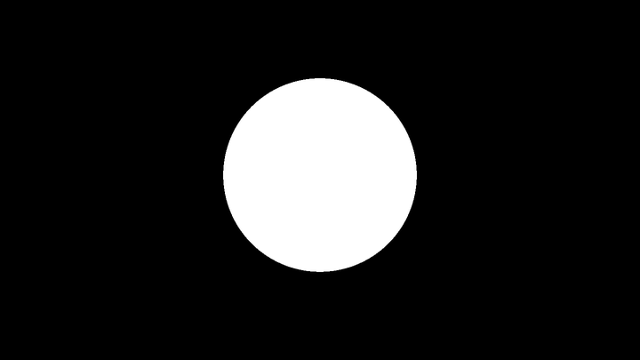
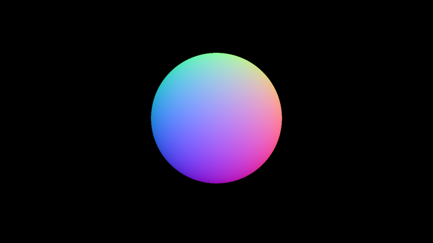
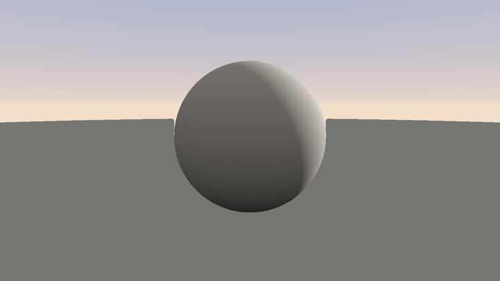
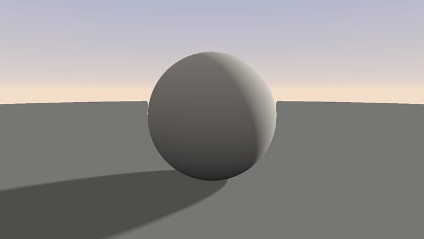
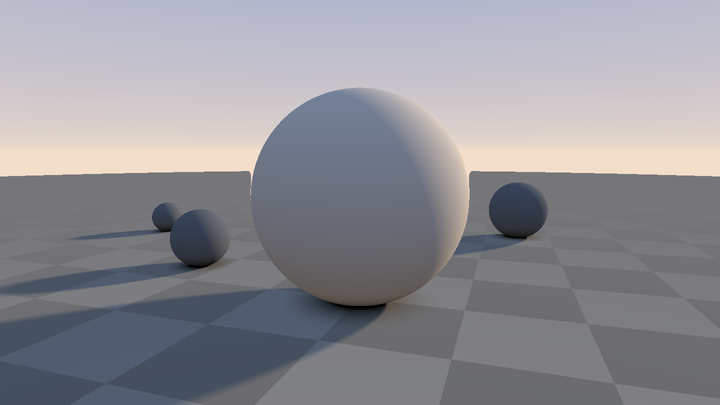
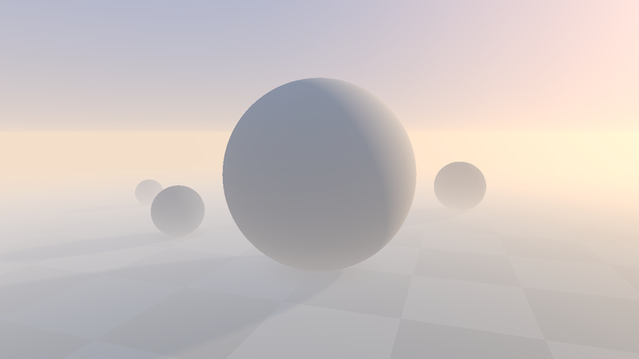
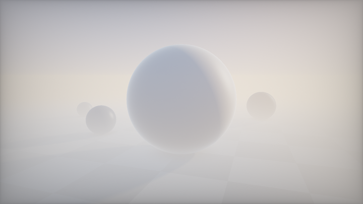

# 第 7 章 · Raymarching 入门

> 把「任意一点到形状的距离」变成「一张有立体感的 3D 图」。
>
> 读完这一章，你应该能从零默写出一个完整的 raymarching 骨架，并用它渲染地面加一个球。

语料桶：`E_sdf_raymarch`（738 个作品）。近三分之一的 Shadertoy 文件在做某种形式的 raymarch——骨架几乎总是同一副，差别只在 `map`。

---

## 7.1 从想法到实现：这一章在五步法里的位置

回顾第 0 章：你已经会用 2D SDF 回答「这个像素和形状是什么关系」。现在想做真正的 3D——有透视、有遮挡、有光照的实体。

**定维度**：选 **3D Raymarching**。
**写场函数**：还是 SDF，只是从 `f(vec2) → float` 变成 `f(vec3) → float`。
**渲染套路**：对每个像素发一条射线，沿射线一步步往前走，直到撞到表面（或走出场景）。

本章只教渲染套路的骨架。造型（图元、CSG、扭曲）在第 8 章；光照在第 9 章。

---

## 7.2 Sphere Tracing：为什么「走 map 那么远」是安全的

传统光栅化用三角形描述几何。Raymarching 用一个标量函数：

- `map(p) < 0`：点在物体**内部**
- `map(p) = 0`：点在**表面**
- `map(p) > 0`：点在物体**外部**

若 `map` 还是到表面的**欧氏距离**（或它的下界），则有一条关键性质：

> 以 `p` 为球心、`map(p)` 为半径的球内部，**不可能碰到任何表面**。

于是步进变成：算距离 → 沿视线安全前进那么远 → 重复。靠近表面时步长自动变小，远离时自动变大。这就是 **Sphere Tracing**（球体追踪）。

<!-- glsl-skip -->
```glsl
// 「合成示例」sphere tracing 的最小循环
float t = 0.0;
for (int i = 0; i < 100; i++) {
    float h = map(ro + rd * t);   // 到最近表面的距离（下界）
    if (h < 0.001 || t > 100.0) break;
    t += h;                       // 安全前进
}
```

**为什么它比固定步长好？** 固定步长要么漏掉薄物体，要么浪费大量空域采样。Sphere Tracing 的步长是自适应的。

### Lipschitz 条件：你必须知道的隐含前提

Sphere Tracing 正确，依赖 `map` 近似满足 **1-Lipschitz**：`|∇map| ≤ 1`。真正的欧氏 SDF 几乎处处 `|∇map| = 1`。

一旦你做了「缩放坐标却不除回来」「twist/bend」「位移贴图」「分形 IFS」这类操作，`|∇map|` 就可能大于 1。此时 `map(p)` **高估**了真实距离，射线会**冲过表面**——画面上出现黑斑、噪点、虫蛀状穿孔。

| 操作 | 对 Lipschitz 的影响 | 修补 |
|---|---|---|
| `map(p*k)` 未除回 | `\|∇\| → k` | 结果乘 `1/k` |
| twist / bend | 局部拉伸 | 全局乘 `< 1` 的保守系数 |
| `d + noise*a` | `\|∇\| ≤ 1 + a·L` | 乘 `1/(1+a·L)` 或直接 `0.5` |
| `min` / `max` | 保持安全 | — |
| `smin`（有限 k） | 仍是安全下界 | — |
| 分形 IFS | 往往远大于 1 | 除以累积 scale，再乘 fudge |

语料里的典型写法：

> 📄 出自 `000270-Mdf3z7-Menger_Journey/image.glsl`（Syntopia）

<!-- glsl-skip -->
```glsl
#define FudgeFactor 0.7
// ...
distance = DE(pos)*FudgeFactor;
totalDistance += distance;
```

> 📄 出自 `000236-XljGDz-Protophore/image.glsl`（otaviogood）

<!-- glsl-skip -->
```glsl
distAndMat = DistanceToObject(pos);
// adjust by constant because deformations mess up distance function.
t += distAndMat.x * 0.7;
```

**调参直觉**：先用 `1.0` 跑；看到表面像被虫蛀，就往下调到 `0.8 → 0.7 → 0.5`。代价是步数线性增加。第 8 章会专门讲何时必须修、怎么修。

---

## 7.3 完整最小可运行骨架

下面是一个你应该能默写的「地面 + 球」完整 shader。先整段读通，再分段拆开。

<!-- glsl-skip -->
```glsl
// 「合成示例」第 7 章最小可运行骨架：地面 + 球
#define MAX_STEPS 100
#define MAX_DIST  100.0
#define SURF_EPS  0.001

float sdSphere(vec3 p, float r) { return length(p) - r; }
float sdPlane(vec3 p) { return p.y; }

float map(vec3 p)
{
    float dPlane = sdPlane(p);
    float dBall  = sdSphere(p - vec3(0.0, 1.0, 0.0), 0.5);
    return min(dPlane, dBall);
}

float raymarch(vec3 ro, vec3 rd)
{
    float t = 0.0;
    for (int i = 0; i < MAX_STEPS; i++) {
        float h = map(ro + rd * t);
        if (h < SURF_EPS || t > MAX_DIST) break;
        t += h;
    }
    return t;
}

vec3 calcNormal(vec3 pos)
{
    vec2 e = vec2(1.0, -1.0) * 0.5773 * 0.0005;
    return normalize(
        e.xyy * map(pos + e.xyy) +
        e.yyx * map(pos + e.yyx) +
        e.yxy * map(pos + e.yxy) +
        e.xxx * map(pos + e.xxx));
}

mat3 setCamera(vec3 ro, vec3 ta, float cr)
{
    vec3 cw = normalize(ta - ro);
    vec3 cp = vec3(sin(cr), cos(cr), 0.0);
    vec3 cu = normalize(cross(cw, cp));
    vec3 cv = cross(cu, cw);
    return mat3(cu, cv, cw);
}

void mainImage(out vec4 fragColor, in vec2 fragCoord)
{
    vec2 p = (2.0 * fragCoord - iResolution.xy) / iResolution.y;

    // 相机：绕场景缓慢旋转
    vec3 ta = vec3(0.0, 0.6, 0.0);
    float an = 0.5 + iTime * 0.3;
    vec3 ro = ta + vec3(2.5 * sin(an), 1.2, 2.5 * cos(an));
    mat3 ca = setCamera(ro, ta, 0.0);

    const float fl = 2.0;                       // 焦距；越大越长焦
    vec3 rd = ca * normalize(vec3(p, fl));

    vec3 col = vec3(0.55, 0.75, 1.0);           // 天空色
    float t = raymarch(ro, rd);
    if (t < MAX_DIST) {
        vec3 pos = ro + rd * t;
        vec3 nor = calcNormal(pos);
        vec3 lig = normalize(vec3(0.6, 0.7, 0.4));
        float dif = clamp(dot(nor, lig), 0.0, 1.0);
        float amb = 0.25 + 0.25 * nor.y;
        // 简单材质：地面灰绿，球偏暖
        vec3 mate = (pos.y < 0.01) ? vec3(0.25, 0.30, 0.22) : vec3(0.85, 0.45, 0.30);
        col = mate * (amb + dif);
        // 雾：远处混向天空
        col = mix(col, vec3(0.55, 0.75, 1.0), 1.0 - exp(-0.01 * t * t));
    }

    col = pow(col, vec3(0.4545));               // 线性 → sRGB 近似
    fragColor = vec4(col, 1.0);
}
```

把这段贴进 Shadertoy，你应该看到一个暖色球落在灰绿地面上，相机绕着转。如果编译通过但全黑，先查 `rd` 有没有 `normalize`、`map` 有没有写反符号。

骨架里有六块，下面逐块讲清楚。

---

## 7.4 相机与光线：`setCamera` / lookat

### 屏幕坐标

语料里最常见的归一化（49.6% 文件用 `iResolution.y`）：

> 📄 出自 `001676-Xds3zN-Raymarching_-_Primitives/image.glsl`（iq）

<!-- glsl-skip -->
```glsl
vec2 p = (2.0*fragCoord-iResolution.xy)/iResolution.y;
```

> 📄 出自 `000908-3lsSzf-Happy_Jumping/image.glsl`（iq）——等价写法

<!-- glsl-skip -->
```glsl
vec2 p = (-iResolution.xy + 2.0*fragCoord)/iResolution.y;
```

结果：`p.y ∈ [-1,1]`，`p.x` 按宽高比伸展，圆不会变椭圆。

### lookat 矩阵

> 📄 出自 `001676-Xds3zN-Raymarching_-_Primitives/image.glsl`（iq）

<!-- glsl-skip -->
```glsl
mat3 setCamera( in vec3 ro, in vec3 ta, float cr )
{
    vec3 cw = normalize(ta-ro);                 // forward
    vec3 cp = vec3(sin(cr), cos(cr),0.0);       // 辅助 up（cr=0 时为世界 up）
    vec3 cu = normalize( cross(cw,cp) );        // right
    vec3 cv =          ( cross(cu,cw) );        // up（已正交单位，无需 normalize）
    return mat3( cu, cv, cw );
}
```

推导要点：

1. `cw`：相机看向目标。
2. `cp`：当 `cr=0` 是 `(0,1,0)`；`cr≠0` 让相机绕视线**滚转**。
3. `cu = normalize(cross(cw, cp))`：右向量。`cw` 与 `cp` 不一定正交，必须 normalize。
4. `cv = cross(cu, cw)`：上向量。两单位正交向量的叉乘自动是单位向量——iq 故意去掉了 `normalize`。
5. GLSL `mat3` **列主序**：`ca * vec3(x,y,z) = x*cu + y*cv + z*cw`。

使用：

<!-- glsl-skip -->
```glsl
const float fl = 2.5;
vec3 rd = ca * normalize( vec3(p, fl) );
```

**焦距与 FOV**：屏幕纵向半高为 1，故 `tan(halfFovY) = 1/fl`，即 `fovY = 2·atan(1/fl)`。

| `fl` | 约 fovY | 典型作品 |
|---:|---:|---|
| 1.0 | 90° | 广角、隧道感 |
| 1.8 | ≈58° | Happy Jumping |
| 2.5 | ≈44° | Raymarching Primitives |
| 3.0 | ≈37° | Elevated（长焦风景） |

**务必 `normalize(rd)`。** 否则 `t` 不是世界距离，后面的雾、阴影、AO 常数全部失效。

### 更简单的「无 lookat」写法

只看 +Z、不需要滚转时：

```glsl
void mainImage(out vec4 fragColor, in vec2 fragCoord)
{
    vec2 p = (2.0 * fragCoord - iResolution.xy) / iResolution.y;
    vec3 ro = vec3(0.0, 1.0, 3.0);
    vec3 rd = normalize(vec3(p, -1.5));
    fragColor = vec4(rd * 0.5 + 0.5, 1.0); // 先看法线方向可视化
}
```

学会完整 `setCamera` 之后，再回来用简写做实验会更快。

---

## 7.5 主循环：命中判定与相对精度

教学版循环已经够用。语料里的生产级写法会再加几件事：

### 绝对精度 vs 相对精度

初学常用 `h < 0.001`。更好的做法是**相对精度**：远处一个像素覆盖的世界尺度更大，允许更大误差。

> 📄 出自 `001676-Xds3zN-Raymarching_-_Primitives/image.glsl`（iq）

<!-- glsl-skip -->
```glsl
if( abs(h.x)<(0.0001*t) )
{
    res = vec2(t,h.y);
    break;
}
```

`abs(h)` 允许从内部命中（`h` 为负也停），避免射线从物体内部出发时穿出去。

### 地板用解析求交

无限大地板用 SDF 步进很浪费。Primitives 里地板直接用平面解析交：

<!-- glsl-skip -->
```glsl
float tp1 = (0.0-ro.y)/rd.y;
if( tp1>0.0 )
{
    tmax = min( tmax, tp1 );
    res = vec2( tp1, 1.0 );
}
```

### 包围盒裁剪

只在物体 AABB 与射线相交的区间内步进，能砍掉大量空域迭代。入门阶段可以不做；场景复杂后这是第一优化。

### 步数经验

| 场景类型 | 典型步数 |
|---|---:|
| 简单教学（球+盒） | 64–100 |
| Primitives 图元展 | ~70（有包围盒） |
| Happy Jumping | ~128 |
| 分形 / 重度扭曲 | 150–300 + fudge |

步数不够的症状：远景破洞、轮廓闪烁。步数太多的症状：帧率崩。先够用，再优化。

---

## 7.6 4-tap 法线 `calcNormal`

光照需要法线。对 SDF，法线就是距离场的梯度：`n = normalize(∇map)`。

**推荐写法是四面体 4-tap**（比中心差分 6-tap 少两次 `map`，精度同阶）：

> 📄 出自 `001676-Xds3zN-Raymarching_-_Primitives/image.glsl`（iq）

<!-- glsl-skip -->
```glsl
// https://iquilezles.org/articles/normalsSDF
vec3 calcNormal( in vec3 pos )
{
    vec2 e = vec2(1.0,-1.0)*0.5773*0.0005;
    return normalize( e.xyy*map( pos + e.xyy ).x +
                      e.yyx*map( pos + e.yyx ).x +
                      e.yxy*map( pos + e.yxy ).x +
                      e.xxx*map( pos + e.xxx ).x );
}
```

四个方向是正四面体顶点：`(+-+)`, `(--+)`, `(-+-)`, `(+++)`，乘 `0.5773 ≈ 1/√3` 使它们成为单位向量。求和后方向与梯度一致，标量因子被 `normalize` 吃掉。

**生产级防内联技巧**（`map` 很大时编译器会把 4 次调用展开成四份代码，编译极慢）：

<!-- glsl-skip -->
```glsl
#define ZERO (min(iFrame,0))
vec3 n = vec3(0.0);
for( int i=ZERO; i<4; i++ )
{
    vec3 e = 0.5773*(2.0*vec3((((i+3)>>1)&1),((i>>1)&1),(i&1))-1.0);
    n += e*map(pos+0.0005*e).x;
}
return normalize(n);
```

`ZERO` 运行时恒为 0，但编译期未知，阻止循环展开。

**`eps` 怎么选**：太小 → 浮点抵消，法线变噪声；太大 → 锐边被磨圆。推荐 `eps = max(0.0005, 0.001*t)`（`t` 为命中距离）。Happy Jumping 用 `0.001`；Primitives 用 `0.0005`。

---

## 7.7 第一个场景：地面 + 球（拆解写法）

用第 0 章五步法走一遍。

### 第 1 步 · 分层

```
天空（未命中时的背景色）
 ↑ 球
 ↑ 地面
 ↑ 雾（按距离混向天空）
```

### 第 2 步 · 定维度

真 3D raymarch。球和地面都要实体感与遮挡。

### 第 3 步 · 找结构

没有重复，没有随机。两个图元 `min` 并集即可。

### 第 4 步 · 写场函数

```glsl
float map(vec3 p)
{
    float d1 = p.y;                              // 地面：y=0 平面
    float d2 = length(p - vec3(0.0, 1.0, 0.0)) - 0.5; // 球心 (0,1,0)，半径 0.5
    return min(d1, d2);                          // 并集
}
```

**域变换 = 反向变换坐标**：球不在原点时，不是改公式，而是 `p - center`。这和第 0 章太阳 `sp = uv - center` 完全同构。

### 第 5 步 · 着色与打磨

先用最简 Lambert：`amb + dif`。雾用 `1.0 - exp(-k*t*t)`。gamma 用 `pow(col, 0.4545)`。阴影、AO、Fresnel 留给第 9 章。

**练习**：

1. 把球改成两个球的 `min`。
2. 用 `max(dBall, -sdSphere(...))` 从大球上挖一个小球（差集预告，第 8 章）。
3. 让球心 `y = 1.0 + 0.3*sin(iTime)`，看它跳起来。

---

## 7.8 可视化调试：没有 printf，颜色就是探针

Shader 没有断点。第 0 章说过：把中间量当颜色输出。Raymarching 里最有用的三个探针：

### ① 步进次数（找性能黑洞）

```glsl
void mainImage(out vec4 fragColor, in vec2 fragCoord)
{
    vec2 p = (2.0 * fragCoord - iResolution.xy) / iResolution.y;
    vec3 ro = vec3(0.0, 1.0, 3.0);
    vec3 rd = normalize(vec3(p, -1.5));

    float t = 0.0;
    int i;
    for (i = 0; i < 100; i++) {
        float h = map(ro + rd * t);
        if (h < 0.001 || t > 100.0) break;
        t += h;
    }
    // 红越亮 = 越难收敛（细缝、非 Lipschitz、远景）
    fragColor = vec4(vec3(float(i) / 100.0, 0.0, 0.0), 1.0);
}
```

### ② 距离场条纹（验证 SDF 对不对）

```glsl
void mainImage(out vec4 fragColor, in vec2 fragCoord)
{
    vec2 p = (2.0 * fragCoord - iResolution.xy) / iResolution.y;
    // 看 xz 平面上的距离场切片（相机俯视地面）
    vec3 q = vec3(p.x * 3.0, 0.0, p.y * 3.0);
    float d = map(q);
    // 等值线：每 0.1 一条；接近 0 的地方用亮线标表面
    vec3 col = vec3(0.2 + 0.2 * sin(d * 60.0));
    col = mix(vec3(1.0, 0.3, 0.1), col, smoothstep(0.0, 0.02, abs(d)));
    fragColor = vec4(col, 1.0);
}
```

正确的球 SDF 应呈现**均匀同心圆**条纹。若条纹一边密一边疏，说明场被非均匀拉伸了（Lipschitz 坏了）。

### ③ 法线可视化

<!-- glsl-skip -->
```glsl
fragColor = vec4(nor * 0.5 + 0.5, 1.0); return;
```

球应该是平滑的彩虹渐变；地面应接近纯绿（法线 ≈ `(0,1,0)` → RGB `(0.5,1,0.5)`）。若表面雪花噪，加大 `eps`。

教学向作品 `000403-4dSfRc-_SH17C_Raymarching_tutorial`（reinder）甚至内置了 `DIST_MODE` 开关，专门切换距离场可视化——值得打开对照。

---

## 7.9 该去读哪些语料

按「先骨架、再造型、再打磨」的顺序：

| 优先级 | 作品 | 学什么 |
|---|---|---|
| ★★★ | `001676-Xds3zN-Raymarching_-_Primitives`（iq） | **原语圣经**：raycast、4-tap 法线、softshadow、calcAO、setCamera |
| ★★★ | `000908-3lsSzf-Happy_Jumping`（iq） | 完整角色场景骨架；vec4 map；五分量光照（第 9 章） |
| ★★☆ | `000403-4dSfRc-_SH17C_Raymarching_tutorial`（reinder） | 多 Pass 教学、距离场可视化 |
| ★★☆ | `000317-XllGW4-HOWTO_Ray_Marching`（MichaelPohoreski） | 30+ 课：从 smin 到 twist/bend 到 Phong |
| ★★☆ | `000076-lcs3DH-An_introduction_to_Raymarching`（kishimisu） | 极简教学循环 |
| ★☆☆ | `000092-ltyXD3-Raymarching_Primitives_Commented`（huttarl） | 给 iq 旧版加注释的导读 |

**读法提醒**（第 0 章逆向阅读法）：先看 `mainImage` 末尾 → 认出 `setCamera` / `raycast` / `render` → **真正独特的东西永远在 `map`**。骨架部分本章已经覆盖，可以直接跳。

---

## 7.10 常见翻车清单

| 现象 | 原因 | 修法 |
|---|---|---|
| 全黑 | 没命中 / `rd` 反了 / gamma 前就是 0 | 先输出步进次数或天空色 |
| 球是椭圆 | uv 除了 `iResolution.xy` | 改除 `iResolution.y` |
| 表面虫蛀噪点 | 非 Lipschitz | 步长乘 0.7；或修正 map |
| 远景破洞 | 步数不够 / 精度太松 | 加步数；用相对精度 |
| 法线雪花 | `eps` 太小 | 加大或用 `k*t` |
| 编译极慢 | `map` 被内联 4–6 次 | `ZERO` 循环技巧 |
| 雾/阴影参数「失灵」 | 忘了 `normalize(rd)` | 单位化光线 |

---

## 7.11 阶梯实战：从剪影球到有雾的小场景

第 7.7 节的「地面 + 球」停在简 Lambert。下面七段把同一场景推到可截图。

完整文件在 `shader-handbook/examples/ch7_stage1..7.glsl`。第 9 章会把光照分量拆得更细；这里先有一张完整的图。

### 阶段 1：命中，还是没命中

能出剪影，骨架就通了。

<!-- glsl-from: examples/ch7_stage1.glsl -->
```glsl
float map(vec3 p)
{
    return sdSphere(p - vec3(0.0, 1.0, 0.0), 1.0);
}

float raymarch(vec3 ro, vec3 rd)
{
    float t = 0.0;
    for (int i = 0; i < MAX_STEPS; i++) {
        float h = map(ro + rd * t);
        if (h < 0.001 || t > MAX_DIST) break;
        t += h;
    }
    return t;
}

    vec3 col = vec3(t < MAX_DIST ? 1.0 : 0.0);
```




### 阶段 2：法线上色

`n*0.5+0.5` 是最便宜的法线调试。

<!-- glsl-from: examples/ch7_stage2.glsl -->
```glsl
vec3 calcNormal(vec3 pos)
{
    vec2 e = vec2(1.0, -1.0) * 0.5773 * 0.0015;
    return normalize(e.xyy * map(pos + e.xyy) +
                     e.yyx * map(pos + e.yyx) +
                     e.yxy * map(pos + e.yxy) +
                     e.xxx * map(pos + e.xxx));
}

    vec3  rd = ca * normalize(vec3(p, 2.2));

    float t   = raymarch(ro, rd);
    vec3  col = vec3(0.0);

    if (t < MAX_DIST) {
        vec3 pos = ro + rd * t;
        vec3 nor = calcNormal(pos);
        col = nor * 0.5 + 0.5;      // [-1,1] → [0,1]，法线当颜色看
    }
```




### 阶段 3：地面 + 天空 + Lambert

`map` 返回 `vec2(距离, 材质 id)`。

<!-- glsl-from: examples/ch7_stage3.glsl -->
```glsl
vec2 map(vec3 p)
{
    vec2 res = vec2(sdSphere(p - vec3(0.0, 1.0, 0.0), 1.0), 1.0);   // 主球
    float dp = p.y;                                                  // 地面：y=0 平面
    if (dp < res.x) res = vec2(dp, 2.0);
    return res;
}

vec3 sky(vec3 rd)
{
    float h = clamp(rd.y, 0.0, 1.0);
    return mix(vec3(0.90, 0.74, 0.60), vec3(0.14, 0.30, 0.62), pow(h, 0.45));
}

        float dif = clamp(dot(nor, LIG), 0.0, 1.0);   // Lambert
        float amb = 0.5 + 0.5 * nor.y;                // 半球环境光：朝上更亮
        col = mate * (1.25 * dif + 0.28 * amb);
    }

    // 上面的光照是在线性空间算的，输出前必须转回显示空间
    col = pow(col, vec3(0.4545));
```




### 阶段 4：软阴影

从着色点沿光线再 march 一次。

<!-- glsl-from: examples/ch7_stage4.glsl -->
```glsl
float softShadow(vec3 ro, vec3 rd)
{
    float res = 1.0;
    float t   = 0.04;              // 起点必须抬离表面，否则第一次采样自己就是 0
    for (int i = 0; i < 24; i++) {
        float h = map(ro + rd * t).x;
        res = min(res, h / (0.055 * t));
        t += clamp(h, 0.06, 0.9);  // 下限防止在表面附近原地踏步，上限防止跨过细物体
        if (res < 0.003 || t > 14.0) break;
    }
    return clamp(res, 0.0, 1.0);
}

        float sha = (dif > 0.001) ? softShadow(pos + nor * 0.01, LIG) : 0.0;

        col = mate * (1.25 * dif * sha + 0.28 * amb);
    }

    col = pow(col, vec3(0.4545));
```




### 阶段 5：AO + 环境光

接触阴影让球「坐」在地上。

<!-- glsl-from: examples/ch7_stage5.glsl -->
```glsl
float calcAO(vec3 pos, vec3 nor)
{
    float occ = 0.0;
    float sca = 1.0;
    for (int i = 0; i < 5; i++) {
        float h = 0.02 + 0.14 * float(i) / 4.0;
        float d = map(pos + h * nor).x;
        occ += (h - d) * sca;
        sca *= 0.92;               // 越远的采样权重越低
    }
    return clamp(1.0 - 1.8 * occ, 0.0, 1.0);
}

        float occ = calcAO(pos, nor);

        float skyL = clamp(0.5 + 0.5 * nor.y, 0.0, 1.0);     // 朝上 → 看见天
        float bou  = clamp(0.3 - 0.3 * nor.y, 0.0, 1.0);     // 朝下 → 接到地面的反弹

        // 三个光源分开算再相加。暖太阳 + 冷天光是整张图立体感的真正来源。
        vec3 lin = vec3(0.0);
        lin += vec3(1.30, 1.02, 0.70) * dif * sha;
        lin += vec3(0.26, 0.36, 0.58) * skyL * occ;
        lin += vec3(0.26, 0.20, 0.14) * bou  * occ;
        col = mate * lin;
    }

    col = pow(col, vec3(0.4545));
```




### 阶段 6：晨雾与空气透视

远球融进雾里，场景才有空气。

<!-- glsl-from: examples/ch7_stage6.glsl -->
```glsl
float mist(vec3 ro, vec3 rd, float t)
{
    const float H = 0.60;                       // 雾的特征高度
    const float D = 0.45;                       // y=0 处的密度
    float ky = rd.y / H;
    // rd.y→0 时 (1-e^-x)/x 是 0/0，用一阶展开 t 顶上
    float s  = (abs(ky) < 1e-3) ? t : (1.0 - exp(-ky * t)) / ky;
    return 1.0 - exp(-D * exp(-ro.y / H) * s);
}

        vec3 mistCol = mix(vec3(0.80, 0.80, 0.84), vec3(1.05, 0.82, 0.58),
                           pow(clamp(dot(rd, LIG), 0.0, 1.0), 3.0));
        col = mix(col, mistCol, mist(ro, rd, t));

        // --- 第二层：空气透视。t³ 让近处几乎不受影响、远处迅速吃满。
        //     终点色用的是同一个 sky(rd)，所以地面和天空在地平线上无缝接上。---
        col = mix(col, sky(rd), 1.0 - exp(-0.0007 * t * t * t));
    }

    col = pow(col, vec3(0.4545));
```




### 阶段 7：打磨

多球、棋盘地、tonemap、暗角。

<!-- glsl-from: examples/ch7_stage7.glsl -->
```glsl
vec3 tonemap(vec3 x)
{
    return clamp((x * (2.51 * x + 0.03)) / (x * (2.43 * x + 0.59) + 0.14),
                 0.0, 1.0);
}

    col = tonemap(col * 1.10);
    col = pow(col, vec3(0.4545));

    // 轻微提饱和：清晨的暖光/冷影对比值得再推一把
    col = mix(vec3(dot(col, vec3(0.299, 0.587, 0.114))), col, 1.12);

    // 暗角：四角压暗，视线自动收到主球上
    vec2 q = fragCoord / iResolution.xy;
    col *= 0.62 + 0.38 * pow(16.0 * q.x * q.y * (1.0 - q.x) * (1.0 - q.y), 0.28);

    // 抖动：天空是一整片缓渐变，8-bit 量化一定会出色带
    col += (fract(sin(dot(fragCoord, vec2(12.9898, 78.233))) * 43758.545) - 0.5) / 255.0;
```




### 回头看这个过程

| 阶段 | 新增 | 对应 |
|---|---|---|
| 1 | raymarch 剪影 | 7.2–7.3 |
| 2 | 4-tap 法线 | 7.6 |
| 3 | 地面/天空/Lambert | 7.7 |
| 4 | 软阴影 | 第 9 章预告 |
| 5 | AO + 环境 | 第 9 章预告 |
| 6 | 雾 | 第 10 章预告 |
| 7 | 打磨 | 第 4 章 |

口诀：**先出剪影，再贴法线，再补光影，最后给空气。** 不要反过来从 PBR 开始。

---

## 本章要点回顾

- Sphere Tracing：每次沿射线安全前进 `map(p)`，前提是 1-Lipschitz（`|∇map|≤1`）。
- 最小骨架六件套：`map` → `raymarch` → `calcNormal` → `setCamera` → 着色 → gamma/雾。
- `setCamera(ro,ta,cr)` 造列主序 `mat3(cu,cv,cw)`；`rd = ca * normalize(vec3(p, fl))`。
- 命中用相对精度 `abs(h) < k*t` 比固定阈值更稳；地板优先解析求交。
- 法线用四面体 4-tap；大 `map` 时用 `ZERO` 循环防内联。
- 调试三板斧：步进次数、距离场条纹、法线上色。
- 精读 `001676`（Primitives）和 `000908`（Happy Jumping）；教学向看 `000403`、`000317`、`000076`。

---

> 上一章：[第 6 章 · 网格与拼贴](06-网格与拼贴.md) 　|　 下一章：[第 8 章 · 3D SDF 图元与算子](08-3D-SDF图元与算子.md)
