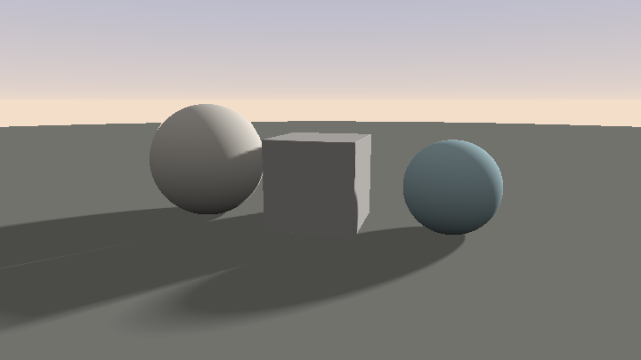
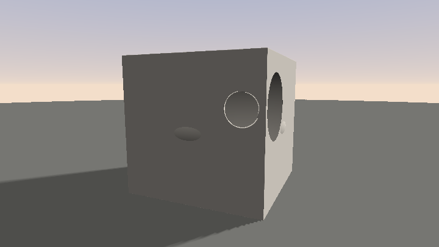
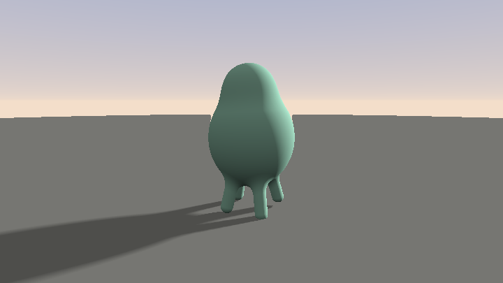
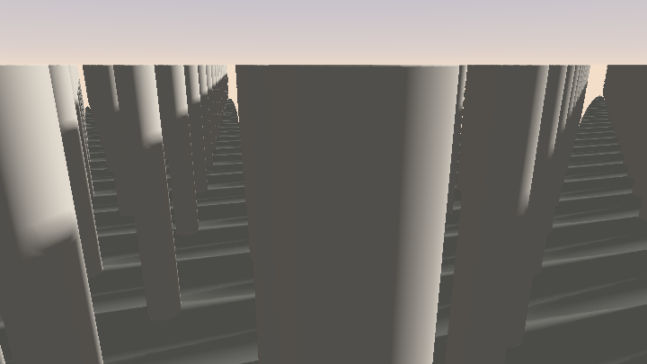
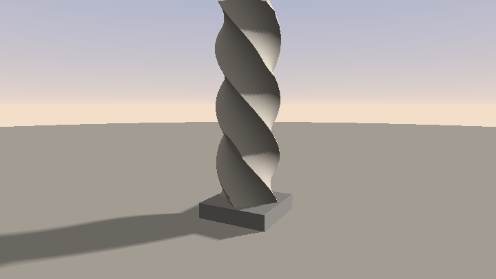
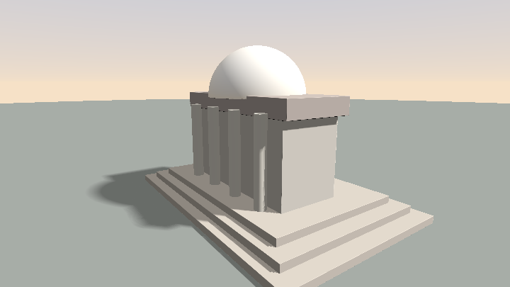

# 第 8 章 · 3D SDF 图元与算子

> 造型部分才是你真正要练的。上一章给了渲染骨架；这一章填满 `map()` 里的词汇表。
>
> 目标：看到一个角色或建筑，能说出「用哪些图元、哪些算子、按什么顺序拼」。

语料桶：`E_sdf_raymarch`。`sdBox` 出现 228 次、`sdSphere` 119 次、`smin` 327 次——全在玩本章内容。权威图元库是 iq 的 `001676-Xds3zN-Raymarching_-_Primitives`。

---

## 8.1 从想法到造型：域变换思维

回忆第 0 章那句翻译：

> 把「我要画 X」变成「对任意一点 p，它和 X 是什么关系？」

3D 里还有第二句，同样重要：

> **「变换形状」永远等价于「反向变换坐标」。**

想把球移到 `(0,1,0)`？写 `sdSphere(p - vec3(0,1,0), r)`，不是改球的公式。想旋转盒子？先把 `p` 乘旋转矩阵的转置（即逆），再喂给 `sdBox`。想无限重复？对 `p` 做 `mod`/`round` 折叠，再画**一个**物体。

于是 `map` 的阅读节奏变成两行一问：

1. 这一行在做**域变换**（`p = ...`）还是在算**距离**（`d = ...`）？
2. 若是域变换，空间被折成什么样了？

---

## 8.2 常用 3D 图元

除非另注，下列均出自或等价于：

> 📄 出自 `001676-Xds3zN-Raymarching_-_Primitives/image.glsl`（iq）

**先跑起来**：地面 + 球 + 盒并排。记住——移物体 = 减坐标，不是改公式。

<!-- glsl-from: examples/ch8_stage1.glsl -->
```glsl
d = sdSphere(p - vec3(-1.2,1,0), 0.7);
d = min(d, sdBox(p - vec3(1.0,0.6,0), vec3(0.55)));
```



### sdPlane / sdSphere

<!-- glsl-skip -->
```glsl
float sdPlane( vec3 p )
{
    return p.y;                    // 法线 (0,1,0)、过原点的平面
}

float sdSphere( vec3 p, float s )
{
    return length(p) - s;
}
```

一般平面：`dot(p, n) + h`，其中 `n` 为单位法线，`h` 为偏移。

### sdBox —— 为什么是那一行

<!-- glsl-skip -->
```glsl
float sdBox( vec3 p, vec3 b )
{
    vec3 d = abs(p) - b;
    return min(max(d.x,max(d.y,d.z)),0.0) + length(max(d,0.0));
}
```

`b` 是半尺寸。`d = abs(p)-b` 把问题折到第一卦限：

- **外部**（任一轴 `d_i > 0`）：到盒子的距离 = `length(max(d,0))`
- **内部**（全为负）：到表面的距离 = 最接近零的那个分量 = `max(d.x,d.y,d.z)`（为负）

两式合并成上面那一行。这是精确欧氏 SDF，不是「廉价近似」。

圆角盒只需末尾 `- r`：`sdRoundBox = sdBox(p, b) - r`（或内联写成 `length(max(d,0)) + min(maxcomp,0) - r`）。

### sdCapsule / sdSegment

<!-- glsl-skip -->
```glsl
float sdCapsule( vec3 p, vec3 a, vec3 b, float r )
{
    vec3 pa = p - a, ba = b - a;
    float h = clamp( dot(pa,ba)/dot(ba,ba), 0.0, 1.0 );
    return length( pa - ba*h ) - r;
}
```

点到线段的距离减半径。Happy Jumping 的四肢、Fish 的骨骼、Snail 的触角，底层都是胶囊。返回 `h` 还可以沿骨骼插值半径/材质（`sdStick` 模式）。

### sdTorus

<!-- glsl-skip -->
```glsl
float sdTorus( vec3 p, vec2 t )
{
    vec2 q = vec2(length(p.xz)-t.x, p.y);
    return length(q) - t.y;
}
```

`t.x` = 圆环主半径，`t.y` = 管道半径。先在 xz 上量到圆环中心线的距离，再和 `y` 组成 2D 点，减管道半径——典型的「降维」思维。

### sdCylinder

竖直有限圆柱（Primitives 写法）：

<!-- glsl-skip -->
```glsl
float sdCylinder( vec3 p, vec2 h )
{
    vec2 d = abs(vec2(length(p.xz),p.y)) - h;
    return min(max(d.x,d.y),0.0) + length(max(d,0.0));
}
```

`(径向, y)` 当成 2D 点，圆柱截面是矩形 → 直接复用 2D sdBox。任意朝向版本用两端点 `a、b` + 半径，先投影到轴上再算径向。

### 更多常用图元（知道「去哪抄」即可）

| 图元 | 用途 | 备注 |
|---|---|---|
| `sdRoundBox` | 家具、建筑块 | `sdBox - r` |
| `sdBoxFrame` | 线框、脚手架 | 三组细杆并集 |
| `sdEllipsoid` | 头、身体团块 | **近似** SDF，极扁时需 fudge |
| `sdCappedCone` / `sdRoundCone` | 喇叭、树干 | RoundCone = 变半径胶囊 |
| `sdHexPrism` / `sdOctogonPrism` | 柱子、螺母 | 平面折叠造正多边形 |
| `sdOctahedron` / `sdPyramid` | 晶体、屋顶 | L1 / 折叠构造 |
| `sdSolidAngle` | 冰淇淋锥、灯罩 | 球扇 |
| `sdBezier`（Snail） | 触角、藤蔓 | 贵，但表现力强 |

完整清单与推导见语料笔记；动手时以 Primitives 源码为准。

---

## 8.3 硬 CSG：`min` / `max` / `-d`

> 📄 出自 `000111-lt3BW2-Combination_SDF/image.glsl`（iq）

<!-- glsl-skip -->
```glsl
float opUnion( float d1, float d2 )        { return min(d1,d2); }
float opSubtraction( float d1, float d2 )  { return max(-d1,d2); } // 从 d2 挖掉 d1
float opIntersection( float d1, float d2 ) { return max(d1,d2); }
```

**为什么是 min/max**：

- **并集** `min`：到「A 或 B」的最近距离——**精确**。
- **交集** `max`：**低估**（安全），角落外侧不是精确欧氏距离，但 Sphere Tracing 仍正确。
- **差集**：补集 = `-d`，故 `max(dA, -dB)`。

**符号约定坑**：有人写 `opSubtraction(a,b) = max(-a,b)`（挖掉 a），有人写 `max(a,-b)`（挖掉 b）。读代码时务必确认参数顺序。

带材质 ID 时不要用裸 `min`（会丢掉 ID），改用：

<!-- glsl-skip -->
```glsl
// 「合成示例」保留较近者的 ID
vec2 opU(vec2 a, vec2 b) { return (a.x < b.x) ? a : b; }
```

**硬布尔成片**：方盒 ∪ 圆环，再挖一个球咬痕。差集顺序写反会「长出肉」而不是挖洞。

<!-- glsl-from: examples/ch8_stage2.glsl -->
```glsl
d = min(box, torus);
d = max(d, -bite); // 差集
```



---

## 8.4 平滑并集：`smin` / `smax`

硬 `min` 的接缝是尖锐的。有机造型（角色、熔岩、软糖）需要**平滑并集**。

**smin 小生物**：胶囊腿 + 球身 + 头。把任意一处 `smin` 改成 `min`，立刻看到接缝变尖——这是读造型最快的办法。

<!-- glsl-from: examples/ch8_stage3.glsl -->
```glsl
d = smin(body, leg, 0.18);
d = smin(d, head, 0.12);
```



### 二次多项式 smin（最常用）

形式 B（Happy Jumping，省指令）：

> 📄 出自 `000908-3lsSzf-Happy_Jumping/image.glsl`（iq）

<!-- glsl-skip -->
```glsl
float smin( float a, float b, float k )
{
    float h = max(k-abs(a-b),0.0);
    return min(a, b) - h*h*0.25/k;
}
```

形式 A（带插值权重，方便混材质）：

> 📄 出自 `000317-XllGW4-HOWTO_Ray_Marching/image.glsl`

<!-- glsl-skip -->
```glsl
float sMinP( float a, float b, float k ) {
    float h = clamp( 0.5+0.5*(b-a)/k, 0.0, 1.0 );
    return mix( b, a, h ) - k*h*(1.0-h);
}
```

两种形式数学等价。`k` 是融合半径：越大，接缝越「融化」。

**关键性质**：`smin` 结果**总是 ≤ min(a,b)** → 仍是安全距离下界 → **不破坏 Sphere Tracing**。这是 SDF 世界里唯一可以「随便用」的混合工具。

### smax（光滑最大）

> 📄 出自 `000908-3lsSzf-Happy_Jumping/image.glsl`（iq）

<!-- glsl-skip -->
```glsl
float smax( float a, float b, float k )
{
    float h = max(k-abs(a-b),0.0);
    return max(a, b) + h*h*0.25/k;
}
```

`smax` 结果 **≥ max** → **高估距离 → 不安全**。大量使用 smax（Sphere Gears 的齿、光滑差集）时，步长通常再乘 `0.7~0.9`。

De Morgan 对偶，三个光滑算子其实只需一个 `smin`：

<!-- glsl-skip -->
```glsl
float smax(float a, float b, float k) { return -smin(-a, -b, k); }
float sSub(float a, float b, float k) { return -smin(-a,  b, k); } // 光滑：从 b 挖 a
float sInter(float a, float b, float k){ return -smin(-a,-b, k); }
```

### 指数 smin

> 📄 出自 `000317-XllGW4-HOWTO_Ray_Marching/image.glsl`

<!-- glsl-skip -->
```glsl
float sMinE( float a, float b, float k) {
    float res = exp( -k*a ) + exp( -k*b );
    return -log( res )/k;
}
```

优点：**可结合**——多物体一次融合，结果与顺序无关。缺点：`exp/log` 贵；无限支撑会系统性低估距离。多项式 smin 在语料里远更常见。

### 调参手感

| 想要的感觉 | `k`（场景尺度 ~1） |
|---|---|
| 几乎看不出圆角 | 0.02–0.05 |
| 塑料件倒角 | 0.08–0.15 |
| 角色肢体融合 | 0.15–0.35 |
| 熔岩/黏液 | 0.4+ |

`k` 必须与场景尺度成正比。把单位场景的 `k` 原样搬到 `[-100,100]` 地形上，融合会消失。

---

## 8.5 域算子：重复、洋葱、拉长、扭曲、弯曲

域算子改的是 **输入点 p**，不是输出距离。

> 若 `T` 是等距（旋转/平移/镜像），`f(T(p))` 仍是精确 SDF。  
> 若 `T` 是均匀缩放 `s`，则 `f(p/s)*s` 精确。  
> 若 `T` 非等距（twist/bend/非均匀缩放），结果不再是 SDF，需要保守系数。

**域重复柱廊**：`p.xz = mod(p.xz+0.5*s,s)-0.5*s` 后只画一根柱。

<!-- glsl-from: examples/ch8_stage4.glsl -->
```glsl
p.xz = mod(p.xz + 0.5*s, s) - 0.5*s;
d = sdCylinder(p, ...);
```



**思路延展 · twist**：按高度旋转 xz，一根方柱变成麻花雕塑。非等距变换记得心里留 fudge。

<!-- glsl-from: examples/ch8_stage5.glsl -->
```glsl
p.xz *= rot(p.y * k); // 先扭曲坐标再喂 sdBox
```



### opRep —— 无限重复

> 📄 出自 `000070-3syGzz-Limited_Repetition_SDF/image.glsl`（iq，推荐 round 版）

<!-- glsl-skip -->
```glsl
vec2 opRep( in vec2 p, in float s )
{
    return p - s*round(p/s);
}
```

经典 `mod` 版：`mod(p, c) - 0.5*c`。`round` 版对负坐标更稳。

**坑**：物体必须完全放进一个格子（半径 `< s/2`），否则相邻拷贝截断且 SDF 错误。

### opRepLim —— 有限重复（正解）

> 📄 出自 `000070-3syGzz-Limited_Repetition_SDF/image.glsl`（iq）

<!-- glsl-skip -->
```glsl
vec2 opRepLim( in vec2 p, in float s, in vec2 lima, in vec2 limb )
{
    return p - s*clamp(round(p/s), lima, limb);
}
```

超出范围的点被映射到**边界格子**，量到的是到边界拷贝的真实距离——**完全正确的 SDF**。错误做法（`opRep` + `max(d, boundingBox)`）会在阵列外围造一层看不见的墙，阴影和法线都会坏。

Greek Temple 的柱廊就是 `opRepLim` 的教科书用法。

### opOnion —— 抽壳

> 📄 出自 `000063-3dBSRG-Liquid_glass/image.glsl`

<!-- glsl-skip -->
```glsl
float opOnion( in float sdf, in float thickness )
{
    return abs(sdf) - thickness;
}
```

得到厚度 `2*thickness` 的壳。精确，但 `abs` 在中面不可微——法线会翻转；壳太薄时步进可能直接跨过（thin geometry miss）。

### elongate —— 拉长

> 📄 出自 `000649-WsSBzh-Selfie_Girl/common.glsl`（iq）

<!-- glsl-skip -->
```glsl
vec4 opElongate( in vec3 p, in vec3 h )
{
    vec3 q = abs(p) - h;
    return vec4( max(q,0.0), min(max(q.x,max(q.y,q.z)),0.0) );
}
// 用法：vec4 w = opElongate(p, h); float d = w.w + sdSphere(w.xyz, r);
```

把球体拉成胶囊、把盒子拉成更长的梁。这是 Minkowski 和：物体 ⊕ 线段/盒子。Selfie Girl 的工具箱大量依赖它。

廉价版（仅外部正确）：`p - clamp(p, -h, h)`。

### twist / bend

> 📄 出自 `000317-XllGW4-HOWTO_Ray_Marching/image.glsl`

<!-- glsl-skip -->
```glsl
vec3 opTwistY( vec3 p, float angle ) {
    float c = cos(angle * p.y);
    float s = sin(angle * p.y);
    mat2  m = mat2(c, -s, s, c);
    return vec3(m * p.xz, p.y);
}

vec3 opBendY( vec3 p, float angle ) {
    mat2 m = mat2(cos(angle*p.z), -sin(angle*p.z),
                  sin(angle*p.z),  cos(angle*p.z));
    return vec3(m * p.zy, p.x); // 具体轴以验证为准
}
```

- **twist**：绕轴旋转角度随该轴坐标变化 → 拧麻花。
- **bend**：旋转包含变化轴的平面 → 掰弯。

二者都非等距。Jacobian 奇异值约 `sqrt(1+(k·r)²)`，保守系数约 `1/sqrt(1+(k·r_max)²)`。实务上很多人直接乘 `0.5`。

### 其它高频域技巧

| 技巧 | 写法 | 用途 |
|---|---|---|
| 镜像折叠 | `p = abs(p)` | 2/4/8 对称，精确 |
| 极坐标重复 | `pModPolar` / `pmod` | 花瓣、齿轮、八角星 |
| 倒圆 | `d - r` | 最安全的圆角 |
| 位移 | `d + amp*sin(...)` | 表面细节；**必须 fudge** |
| 缩放 | `sd(p/s)*s` | 忘了 `*s` 是第一常见 bug |

---

## 8.6 Lipschitz 修补与 fudge factor

把第 7 章的表落到 `map` 写法上：

### 缩放必除回

```glsl
float map(vec3 p)
{
    float s = 2.0;
    vec3 q = p / s;
    return sdSphere(q, 0.5) * s;   // 乘回来！
}
```

### 位移必保守

<!-- glsl-skip -->
```glsl
float d = sdSphere(p, 1.0);
d += 0.1 * sin(p.x*10.0)*sin(p.y*10.0)*sin(p.z*10.0);
return d * 0.5;   // |∇sin| 可达 ~10√3，经验上 0.5 往往仍偏乐观
```

### 步进处乘 vs 返回值乘

两种等价：

- `return d * 0.7;`（map 内）
- `t += h * 0.7;`（循环内）

语料两种都有。map 内修改会影响法线尺度（通常仍 `normalize`，无妨）；循环内修改只影响步进。分形场景常用宏 `FudgeFactor`。

### 调参流程

1. 距离场条纹可视化（第 7 章）：条纹应大致均匀。
2. 步进次数可视化：局部飙红 → 那里 Lipschitz 坏了或有细缝。
3. 从 `1.0` 往下调 fudge，直到噪点消失，再略回调一点保性能。

---

## 8.7 材质 ID：`vec2` / `vec4` map 模式

复杂场景不光要距离，还要知道「撞到了什么」。标准模式：让 `map` 返回打包向量。

### vec2：距离 + 材质 ID

> 📄 出自 `001676-Xds3zN-Raymarching_-_Primitives/image.glsl`（iq）

<!-- glsl-skip -->
```glsl
vec2 opU( vec2 d1, vec2 d2 ) { return (d1.x<d2.x) ? d1 : d2; }

vec2 map( in vec3 pos )
{
    vec2 res = vec2( pos.y, 1.0 );                    // 地面，ID=1
    res = opU( res, vec2( sdSphere(pos-vec3(0,0.25,0), 0.25), 2.0 ) );
    res = opU( res, vec2( sdBox(pos-vec3(1,0.25,0), vec3(0.25)), 3.0 ) );
    return res;
}
```

着色阶段：`float id = res.y;`，再 `if/else` 或查表赋 albedo、roughness。

### vec4：距离 + ID + 辅助 + 遮蔽提示

> 📄 出自 `000908-3lsSzf-Happy_Jumping/image.glsl`（iq）

Happy Jumping 的 `map` 返回 `vec4`：`.x` 距离、`.y` 材质 ID、`.z` 辅助参数（如沿身体的参数）、`.w` 预计算 occlusion 提示。`opU` 仍按 `.x` 取近：

<!-- glsl-skip -->
```glsl
vec4 opU( vec4 d1, vec4 d2 )
{
    return (d1.x<d2.x) ? d1 : d2;
}
```

### 平滑混合时的 ID 陷阱

<!-- glsl-skip -->
```glsl
// Happy Jumping 的 vec2 smin——会广播减法到 y！
vec2 smin( vec2 a, vec2 b, float k )
{
    float h = clamp( 0.5+0.5*(b.x-a.x)/k, 0.0, 1.0 );
    return mix( b, a, h ) - k*h*(1.0-h);
}
```

若 `y` 是**离散材质 ID**，这样写会让 ID 漂移。安全写法：

<!-- glsl-skip -->
```glsl
// 「合成示例」离散 ID 不插值
vec2 sminMat( vec2 a, vec2 b, float k )
{
    float h = clamp( 0.5 + 0.5*(b.x-a.x)/k, 0.0, 1.0 );
    float d = mix(b.x, a.x, h) - k*h*(1.0-h);
    float m = (h > 0.5) ? a.y : b.y;
    return vec2(d, m);
}
```

若 `y` 是连续参数（身体坐标、融合权重），一起插值反而是优点——可以在融合带混色。

### Ladybug 模式：ID 表 + materials()

> 📄 出自 `000298-4tByz3-Ladybug/`（iq）

`map` 只返回几何与 ID；另有 `materials(id, pos, ...)` 输出完整材质结构（albedo、roughness、SSS 系数等）。大型作品更清晰，避免 `render` 里一长串 `if (id==3.0)`。

---

## 8.8 域变换造型方法论：从想法拼出角色/建筑

这是本章的「如何从想法到实现」。

**较难成片 · 微型神庙**：台阶 → 墙 → 四柱 → 山墙 → 上半球穹顶。先按这个顺序搭，不要一上来写完整 `map`。

<!-- glsl-from: examples/ch8_stage6.glsl -->
```glsl
// 台阶 for-loop → 墙/山墙 → 四柱 → max(sphere,-y) 穹顶
```



### 角色（Happy Jumping / Fish / Snail 路线）

1. **骨架**：用胶囊/`sdStick` 搭头–躯干–四肢。每段是 `sdCapsule(p, a, b, r)`，关节处 `smin`。
2. **团块**：头、肚子用球/椭球，与躯干 `smin(k≈0.2)`。
3. **附件**：耳朵、角、壳——`opU` 硬并或小 `k` 的 smin。
4. **挖洞**：眼窝、嘴用 `smax`/`光滑差集`；注意 fudge。
5. **对称**：先做一半，`p.x = abs(p.x)` 镜像；再对需要不对称的部分（表情）用原始 `p`。
6. **动画**：关节端点 `a、b` 随 `iTime` 摆——造型函数吃时间，骨架重算即可。Happy Jumping 的跳跃是整套骨骼关键帧。

**口诀**：胶囊搭骨，球补肉，smin 融，smax 挖，abs 对称。

### 建筑（Greek Temple / Skyline 路线）

1. **模块**：柱 = `sdCylinder` 或 `sdBox`；檐 = `sdBox`；台阶 = 多层盒 `opU`。
2. **阵列**：柱廊用 `opRepLim`，**不要**用 `opRep+包围盒`。
3. **装饰**：线脚 = `opOnion` 或小圆角盒；浮雕用位移或 bump（第 9 章），别全塞进 SDF。
4. **地面**：`p.y` 或高度场；台阶与地面 `min`。
5. **材质 ID**：柱身/柱头/地面/天空分 ID，后期好上三平面贴图。

**口诀**：盒子堆体量，RepLim 排柱，圆角收边，ID 分材质。

### 有机场景（Xyptonjtroz / 洞穴）

1. 基面：平面或高度场。
2. 每格 `hash(id)` → 随机球/藤蔓位置。
3. `smin` 融进地面。
4. 整体乘 fudge（地形抬升/噪声位移会破 Lipschitz）。

### 一条可执行的作业

做一个「小亭子」：

<!-- glsl-skip -->
```glsl
// 「合成示例」造型草稿（距离部分）
float map(vec3 p)
{
    // 地面
    float d = p.y;
    // 四根柱：有限重复
    vec3 q = p;
    q.xz = opRepLim(q.xz, 1.2, vec2(-1.0), vec2(1.0));
    d = min(d, sdCylinder(q - vec3(0,0.6,0), vec2(0.08, 0.6)));
    // 屋顶：尖锥或斜切盒
    d = min(d, sdBox(p - vec3(0,1.35,0), vec3(1.0, 0.08, 1.0)));
    return d;
}
```

先硬 `min` 搭起来；满意后再给屋顶加 `opRound`，给柱脚加 `smin`。

---

## 8.9 读 `map` 的实战节奏

打开 `000908-3lsSzf-Happy_Jumping` 的 `map`，按这个清单扫：

1. 有没有 `abs(p.x)`？→ 左右对称段。
2. 找到所有 `sdStick`/`sdSphere`/`sdEllipsoid` → 列一张「零件表」。
3. 看它们是 `opU` 还是 `smin` → 硬接还是融合。
4. 找 `smax` → 那里在挖洞或做光滑交。
5. 返回值几个分量 → ID/辅助/occ 各是什么。
6. **删掉一行 `smin`，改成 `min`，看画面哪里变尖**——比读注释快。

---

## 8.10 阶梯实战：从图元到一座小神庙

上一章给了 raymarch 骨架；本章把 `map()` 填满。下面六段**嵌在对应小节**的也可按序连刷：

| 阶段 | 文件 | 看点 | 嵌在 |
|---|---|---|---|
| 1 | `ch8_stage1` | 球/盒并排 | 8.2 |
| 2 | `ch8_stage2` | 硬 CSG 咬痕 | 8.3 |
| 3 | `ch8_stage3` | smin 小生物 | 8.4 |
| 4 | `ch8_stage4` | 无限柱廊 | 8.5 |
| 5 | `ch8_stage5` | twist 雕塑 | 8.5 |
| 6 | `ch8_stage6` | **神庙成片**（较难） | 8.8 |

较难的神庙请先完成 1→5：你会清楚每个零件来自哪一节。神庙完整例嵌在 **8.8**。

**延展作业**：把柱改成 `opRepLim`；给穹顶加 `opOnion` 薄壳；给台阶脚加小 `smin`。

## 本章要点回顾

- 域变换思维：动形状 = 反变换 `p`；`map` 里交替出现变换行与距离行。
- 高频图元：`sdSphere` / `sdBox` / `sdCapsule` / `sdTorus` / `sdCylinder` / `sdPlane`；权威库是 `001676`。
- 硬 CSG：`min` 并、`max` 交、`max(-d1,d2)` 差；注意减法参数顺序。
- `smin` 安全（低估），`smax` 不安全（高估）；指数 smin 可结合但更贵。
- `opRep` / `opRepLim` / `opOnion` / `elongate` / `twist` / `bend`：等距保持精确，非等距要 fudge。
- 材质用 `vec2(dist,id)` 或 `vec4`；离散 ID 不要和距离一起被 `smin` 广播减法。
- 角色：胶囊骨骼 + 球肉 + smin；建筑：盒体量 + RepLim；有机：hash 格 + smin + fudge。

---

> 上一章：[第 7 章 · Raymarching 入门](07-Raymarching入门.md) 　|　 下一章：[第 9 章 · 光照与材质](09-光照与材质.md)
