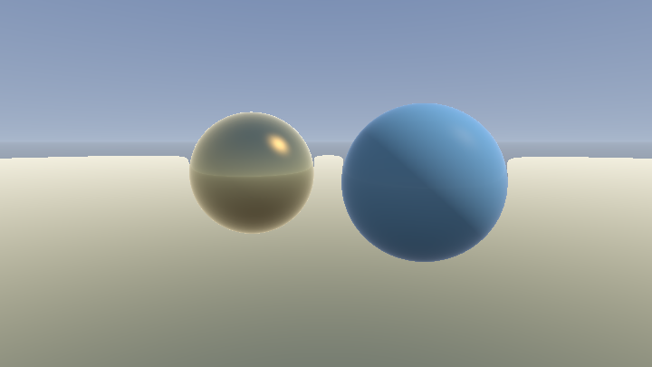
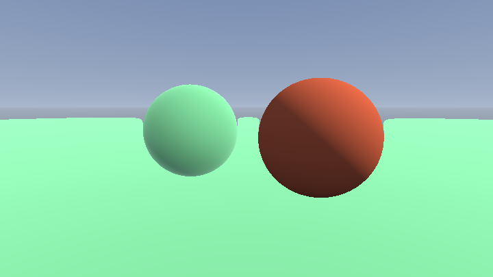
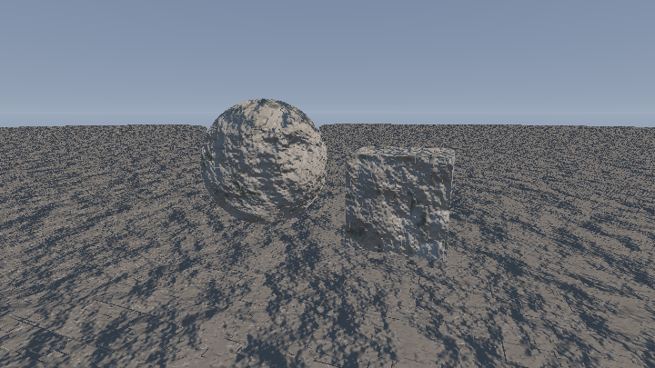
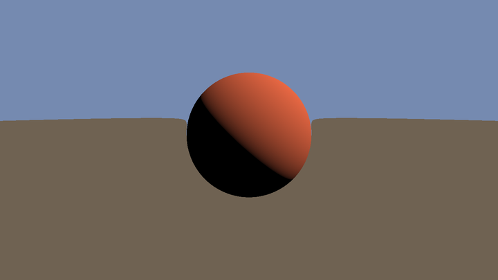
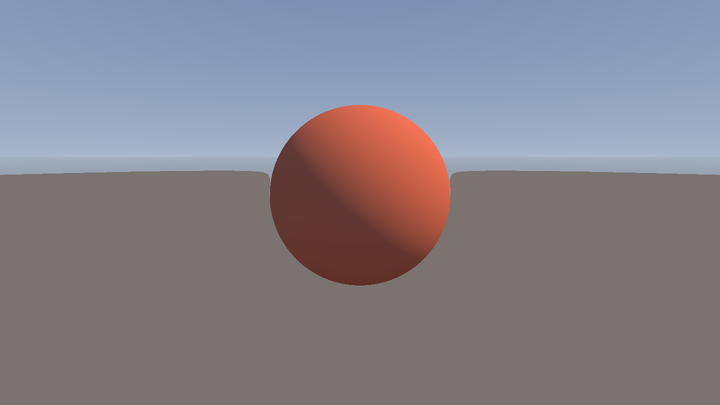
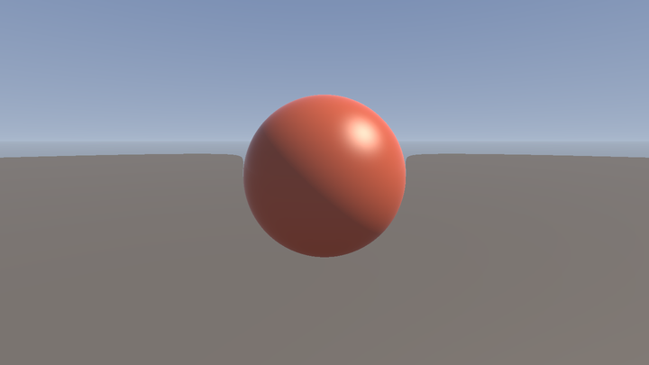
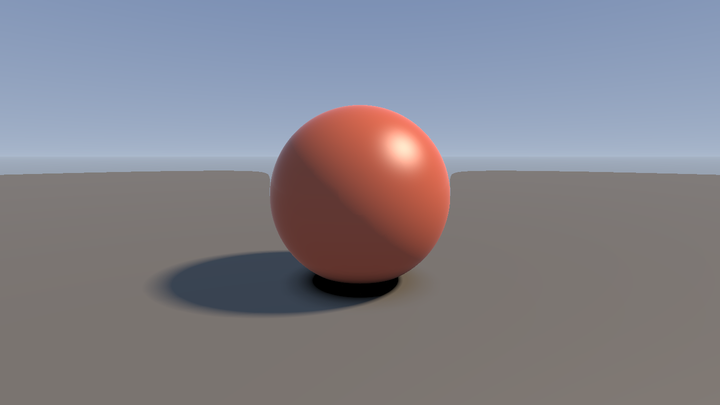
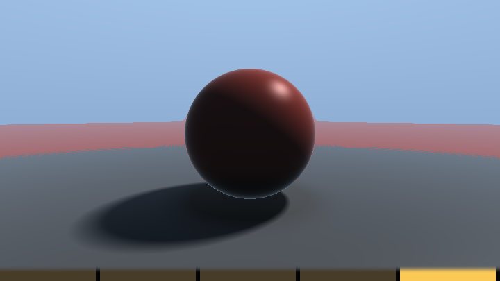

# 第 9 章 · 光照与材质

> 几何对了只是「正确」；光照对了才是「好看」。
>
> 这一章把第 7 章骨架里那行 `amb + dif` 升级成语料里真正在用的着色系统。

语料桶：`F_lighting_pbr`（219）+ `E_sdf_raymarch` 中的着色段。高频函数：`calcAO` 185 次、`softShadow`/`softshadow` 约 200 次、`calcNormal` 264 次。

---

## 9.1 从想法到着色：五步法里的最后一公里

你已经有了命中点 `pos`、法线 `nor`、视线 `rd`、材质 ID。着色要回答：

> 这一点反射进相机的光，RGB 各是多少？

拆成两层：

1. **材质**：base color、粗糙度、金属度、SSS 系数……（查 ID 或程序化算）
2. **光照积分（近似）**：有哪些光？各贡献多少？乘上阴影与 AO。

Shadertoy 实时约束下，几乎没人做完整路径追踪（那是第 12 章）。本章是**经验模型 → 五分量分解 → PBR 概要**这条实用路线。

---

## 9.2 Lambert / Phong / Blinn：三条经典项

### Lambert 漫反射

```glsl
// 「合成示例」
vec3 shadeLambert(vec3 nor, vec3 lig, vec3 albedo)
{
    float dif = clamp(dot(nor, lig), 0.0, 1.0);
    return albedo * dif;
}
```

`dot(n,l)` 是入射角余弦。`clamp` 去掉背光面。这是一切的底座。

### Phong 高光

反射方向 `r = reflect(-l, n)`，再和视线比较：

<!-- glsl-skip -->
```glsl
vec3 ref = reflect(-lig, nor);
float spe = pow(clamp(dot(ref, -rd), 0.0, 1.0), shininess);
```

`shininess` 越大，高光越锐（塑料 ~32，金属漆 ~128+）。注意 `rd` 是从相机指向场景，所以常与 `-rd`（指向相机）比较。

### Blinn-Phong（语料更爱用）

半角向量：`h = normalize(l + v)`，其中 `v = -rd`：

<!-- glsl-skip -->
```glsl
vec3 hal = normalize(lig - rd);   // lig 单位、rd 单位时
float spe = pow(clamp(dot(nor, hal), 0.0, 1.0), shininess);
```

Happy Jumping / Primitives 的高光都是 Blinn 系。Happy Jumping 还乘了 Schlick 风格的 Fresnel 项（见 9.5），让掠射角高光更亮。

### 最小完整着色（接第 7 章场景）

```glsl
// 「合成示例」Lambert + Blinn + 环境项
vec3 shade(vec3 pos, vec3 nor, vec3 rd, vec3 albedo)
{
    vec3 lig = normalize(vec3(0.6, 0.7, 0.4));
    vec3 hal = normalize(lig - rd);

    float dif = clamp(dot(nor, lig), 0.0, 1.0);
    float spe = pow(clamp(dot(nor, hal), 0.0, 1.0), 32.0);
    float amb = 0.25 + 0.25 * nor.y;          // 朝天略亮

    vec3 col = albedo * (amb + dif) + vec3(1.0) * spe * dif;
    return col;
}
```

还缺两样关键的东西：**软阴影**和 **AO**。没有它们，球会像塑料贴纸。

---

## 9.3 softshadow（iq）：便宜的面积光阴影

硬阴影是「光源方向再 raymarch 一次，命中则全黑」。软阴影估计半影：沿光线累计 `k * h / t` 的最小值。

> 📄 出自 `001676-Xds3zN-Raymarching_-_Primitives/image.glsl`（iq）

<!-- glsl-skip -->
```glsl
float calcSoftshadow( in vec3 ro, in vec3 rd, in float mint, in float tmax )
{
    float res = 1.0;
    float t = mint;
    for( int i=0; i<24; i++ )
    {
        float h = map( ro + rd*t ).x;
        float s = clamp(8.0*h/t, 0.0, 1.0);
        res = min( res, s );
        t += clamp(h, 0.02, 0.10);
        if( res<0.005 || t>tmax ) break;
    }
    return clamp(res, 0.0, 1.0);
}
```

**直觉**：`h/t` 是「遮挡物对光源张角」的代理。`k`（这里是 8）越大阴影越硬。`mint` 避免表面自阴影麻点（acne）；太大则阴影脱离物体（peter-panning）。

### 改进版（消半影条纹）

> 📄 出自 `000236-lsKcDD-Soft_Shadow_Variation/image.glsl`（iq）

经典版只在离散采样点估 `h/t`，半影容易出同心条纹。改进版用上一步半径 `ph` 估计采样点**之间**的垂距：

<!-- glsl-skip -->
```glsl
float y = h*h/(2.0*ph);
float d = sqrt(h*h-y*y);
res = min( res, d/(w*max(0.0,t-y)) );
ph = h;
```

入门先用经典版；半影 banding 明显时再换改进版。

### 生产级技巧

| 技巧 | 出处 | 作用 |
|---|---|---|
| `if (dif > 0.001) sha = ...` | Ladybug | 背光不算阴影 |
| `mapShadow` 简化几何 | Ladybug | 阴影用低精度模型 |
| `t += clamp(h, minS, maxS)` | 多处 | 防止步长过小卡死 |
| `max(h, 0.0)` | Ladybug | 防止负距离黑洞 |
| 包围平面截断 `tmax` | Happy Jumping | 少走无效步 |
| `mix(1.0, 16.*h/t, hsha)` | Happy Jumping | 材质自定义阴影不透明度 |

调用：

<!-- glsl-skip -->
```glsl
float sha = calcSoftshadow(pos + nor*0.001, lig, 0.02, 8.0);
dif *= sha;
spe *= sha;
```

---

## 9.4 calcAO：缝隙里的暗部

沿法线向外采几个点，比较「应有距离 `h`」和「实际 `map`」——差即遮挡。

> 📄 出自 `001676-Xds3zN-Raymarching_-_Primitives/image.glsl`（iq）

<!-- glsl-skip -->
```glsl
float calcAO( in vec3 pos, in vec3 nor )
{
    float occ = 0.0;
    float sca = 1.0;
    for( int i=ZERO; i<5; i++ )
    {
        float h = 0.01 + 0.12*float(i)/4.0;
        float d = map( pos + h*nor ).x;
        occ += (h-d)*sca;
        sca *= 0.95;
    }
    return clamp( 1.0 - 3.0*occ, 0.0, 1.0 ) * (0.5+0.5*nor.y);
}
```

Happy Jumping 去掉了末尾的 `nor.y` 项（天光单独算），强度改为 `2.0`：

> 📄 出自 `000908-3lsSzf-Happy_Jumping/image.glsl`（iq）

<!-- glsl-skip -->
```glsl
return clamp( 1.0 - 2.0*occ, 0.0, 1.0 );
```

**调参**：

| 参数 | 增大效果 | 典型范围 |
|---|---|---|
| 最大 `h` | AO 影响范围变大 | 0.05–0.5（随场景尺度） |
| 强度系数 | 更黑 | 1–4 |
| `sca` 衰减 | 越小越「贴身」 | 0.75–0.98 |

**坑**：`h` 必须与场景尺度匹配；起始 `h` 太小会自遮挡；平面上条纹 → 降强度或加采样。

AO 通常乘在环境光 / 天光 / bounce 上，**不要**乘在直射太阳的漫反射上（不然阴影区双倍变黑）。Happy Jumping 的做法：太阳项用 `sun_sha`，其余项乘 `occ`。

---

## 9.5 Fresnel / Schlick：边缘为什么更亮

真实表面在掠射角反射更强。Schlick 近似：

<!-- glsl-skip -->
```glsl
// 「合成示例」
float fre = pow(clamp(1.0 - dot(nor, -rd), 0.0, 1.0), 5.0);
// 或 Happy Jumping 写法（rd 指向场景时）：
float fre = clamp(1.0 + dot(nor, rd), 0.0, 1.0); // 再 pow
```

> 📄 出自 `000317-XllGW4-HOWTO_Ray_Marching/image.glsl` —— `getSchlick` / `getFresnel`

用途：

1. **调高光**：`spe *= mix(f0, 1.0, fre)`（`f0` 非金属约 0.04）
2. **调反射/天光**：边缘更强地映天空
3. **调 SSS 项**：Happy Jumping 的 `sss_dif` 含 `fre`

没有 Fresnel 的塑料球「很对、很假」；加上之后边缘立刻有一层空气感。

**并排对照**：金属 vs 电介质的 Fresnel 边缘。调 `F0` 比调颜色更能「像材质」。

#### 可跑精读 · 金属 vs 电介质并排

同光照下两球：金属高 F0、高光染色；电介质低 F0、高光近白。调 F0 比调 albedo 更能「换材质」。

**思路拆解**

1. 共享 n、L、阴影。
2. 分支：金属 spec*albedo，介质 spec*白。
3. Fresnel 不同 F0。

**关键旋钮**

| 旋钮 | 感觉 |
|---|---|
| 金属 F0/色 | 镀金铜铁 |
| 介质 F0 | 塑料玻璃 |
| 粗糙 shininess | 哑光 |

**动手改（建议按序）**

1. 交换两球参数。
2. 只改 F0 不改色。
3. 加反射天空（进阶）。

**易错点**

- 金属仍加很强漫反射 → 像喷漆塑料。

<!-- glsl-from: examples/ch9_stage6.glsl -->
```glsl
float fr = F0 + (1.0-F0)*pow(1.0-NdotV, 5.0);
```



---

## 9.6 五分量着色：Happy Jumping 的 sun / sky / bounce / back / sss

这是语料里最值得背下来的经验光照框架。

> 📄 出自 `000908-3lsSzf-Happy_Jumping/image.glsl`（iq）

<!-- glsl-skip -->
```glsl
// lighting (sun, sky, bounce, back, sss)
float occ = calcOcclusion( pos, nor, time )*focc;
float fre = clamp(1.0+dot(nor,rd),0.0,1.0);

vec3  sun_lig = normalize( vec3(0.6, 0.35, 0.5) );
float sun_dif = clamp(dot( nor, sun_lig ), 0.0, 1.0 );
vec3  sun_hal = normalize( sun_lig-rd );
float sun_sha = calcSoftshadow( pos, sun_lig, time );
float sun_spe = ks*pow(clamp(dot(nor,sun_hal),0.0,1.0),8.0)*sun_dif
               *(0.04+0.96*pow(clamp(1.0+dot(sun_hal,rd),0.0,1.0),5.0));
float sky_dif = sqrt(clamp( 0.5+0.5*nor.y, 0.0, 1.0 ));
float sky_spe = ks*smoothstep( 0.0, 0.5, ref.y )*(0.04+0.96*pow(fre,4.0));
float bou_dif = sqrt(clamp( 0.1-0.9*nor.y, 0.0, 1.0 ))*clamp(1.0-0.1*pos.y,0.0,1.0);
float bac_dif = clamp(0.1+0.9*dot( nor, normalize(vec3(-sun_lig.x,0.0,-sun_lig.z))), 0.0, 1.0 );
float sss_dif = fre*sky_dif*(0.25+0.75*sun_dif*sun_sha);

vec3 lin = vec3(0.0);
lin += sun_dif*vec3(8.10,6.00,4.20)*vec3(sun_sha,sun_sha*sun_sha*0.5+0.5*sun_sha,sun_sha*sun_sha);
lin += sky_dif*vec3(0.50,0.70,1.00)*occ;
lin += bou_dif*vec3(0.20,0.70,0.10)*occ;
lin += bac_dif*vec3(0.45,0.35,0.25)*occ;
lin += sss_dif*vec3(3.25,2.75,2.50)*occ;
col = col*lin;
col += sun_spe*vec3(9.90,8.10,6.30)*sun_sha;
col += sky_spe*vec3(0.20,0.30,0.65)*occ*occ;
```

逐项翻译成「想要的感觉」：

| 分量 | 物理直觉 | 实现要点 |
|---|---|---|
| **sun** | 主光（暖、强） | `n·L` × 软阴影；高光 Blinn+Fresnel；阴影可带色偏（RGB 阴影系数不同） |
| **sky** | 天穹漫射（冷） | `√(0.5+0.5*n.y)`；乘 AO |
| **bounce** | 地面反弹（绿/暖） | 朝下的面更强：`√(0.1-0.9*n.y)`，并随高度衰减 |
| **back** | 轮廓光/背光填充 | 与太阳水平反向的弱光，避免背光死黑 |
| **sss** | 薄透（耳、鼻、蜡） | `fre * sky * (太阳透过感)`——经验项，不是真体积散射 |

**为什么这套好看？** 因为它显式模拟了户外白天的几路光，而不是一个 `ambient` 常数糊弄。Ladybug、Selfie Girl 同属这一家族。

**廉价 SSS**：wrap lighting + 背光透射的玉色球，旁边放一颗不透明对照。

#### 可跑精读 · 廉价 SSS / wrap

玉/皮肤味道：`wrap = (N·L+w)/(1+w)` 让光「包」到侧面，再加一点背光透射色。旁边放不透明球对照。

**思路拆解**

1. wrap lighting 替代硬 Lambert。
2. `trans = pow(saturate(-N·L),k)*tint`。
3. 与普通 Lambert 球并排。

**关键旋钮**

| 旋钮 | 感觉 |
|---|---|
| wrap w | 包裹量 |
| 透射色 | 玉/耳廓 |
| 透射幂 | 薄边 |

**动手改（建议按序）**

1. w=0 回到 Lambert。
2. 透射色改红。
3. 别指望它替代真多散射。

**易错点**

- 透射过大 → 发光果冻。

<!-- glsl-from: examples/ch9_stage7.glsl -->
```glsl
float wrap = (NdotL*0.5+0.5);
col += sssColor * thickness * back;
```



### 迁移到你自己场景的配方

1. 定太阳方向与颜色（暖黄 `vec3(8,6,4)` 量级——因为后面会 tonemap/gamma）。
2. 天光给冷蓝，乘 AO。
3. 若有大面积地面，加绿色 bounce。
4. 加一点 back，让剪影可读。
5. 皮肤/蜡/玉石材质把 `sss_dif` 开大；石头开小。
6. 直射与高光乘 `sun_sha`；间接光乘 `occ`。

---

## 9.7 三平面映射与 bump

SDF 没有 UV。给建筑/地形贴纹理，语料标准答案是**三平面映射（triplanar）**：用世界坐标在 XY/YZ/ZX 三个平面采样，按法线权重混合。

> 📄 出自 `000356-ldScDh-Greek_Temple/image.glsl`（iq）—— `textureBox`  
> 📄 出自 `000415-MlXSWX-Abstract_Corridor/image.glsl`（Shane）—— `tex3D`

<!-- glsl-skip -->
```glsl
// 「合成示例」三平面（纹理版；无纹理时用程序噪声同理）
vec3 triplanar(sampler2D tex, vec3 p, vec3 n, float scale)
{
    n = abs(n);
    n = n / (n.x + n.y + n.z);          // 权重归一化
    vec3 cx = texture(tex, p.yz * scale).rgb;
    vec3 cy = texture(tex, p.zx * scale).rgb;
    vec3 cz = texture(tex, p.xy * scale).rgb;
    return cx*n.x + cy*n.y + cz*n.z;
}
```

有时对权重做 `pow(n, k)`（`k≈4`）让过渡更硬，减少斜面模糊。

**较难 · Triplanar 岩石**：三方向程序噪声加权 + 梯度 bump。无贴图也能做出「石材质」。

#### 可跑精读 · Triplanar 岩石

无 UV：用 `abs(n)` 权重混合三平面采样的程序噪声，再梯度 bump。岩石/悬崖常用。

**思路拆解**

1. 三平面各采 noise(p.yz) 等。
2. `w = pow(abs(n), k)` 归一权重。
3. 场梯度当 bump 扰 n。

**关键旋钮**

| 旋钮 | 感觉 |
|---|---|
| 噪声频率 | 岩粒大小 |
| 权重幂 k | 接缝锐利 |
| bump 强度 | 褶皱 |

**动手改（建议按序）**

1. k=1 看糊缝；k=8 看硬缝。
2. 关掉 bump 只看色。
3. 换调色板做火星土。

**易错点**

- 三平面尺度不一致 → 拉伸纹理。

<!-- glsl-from: examples/ch9_stage8.glsl -->
```glsl
albedo = triplanarColor(p, n);
n = bumpNormal(p, n, scale);
```



### bump / doBumpMap

不想把细节写进 SDF（那会毁步进性能），就只扰动法线：

<!-- glsl-skip -->
```glsl
// 「合成示例」高度 bump（中心差分）
vec3 doBumpMap(vec3 p, vec3 nor, float strength)
{
    float eps = 0.01;
    float h = fbm(p);                   // 任意标量细节场
    vec3 grad = vec3(
        fbm(p + vec3(eps,0,0)) - h,
        fbm(p + vec3(0,eps,0)) - h,
        fbm(p + vec3(0,0,eps)) - h) / eps;
    return normalize(nor - grad * strength);
}
```

Greek Temple 的石面、Abstract Corridor 的隧道壁、Xyptonjtroz 的地表，都是「粗 SDF + bump」分层。Selfie Girl 更进一步：步进用光滑 `map`，法线用带皮肤细节的 `mapD`。

> 📄 出自 `000263-4l2XWK-Bumped_Sinusoidal_Warp/image.glsl`（Shane）—— 纯程序 bump 教学

---

## 9.8 PBR 概要：GGX 与 `000620`

当「塑料 Phong」不够、你需要金属/粗糙度滑条时，看：

> 📄 出自 `000620-4sSfzK-_SH17C_Physically_Based_Shading/image.glsl`（knarkowicz）

微表面 BRDF 拆三项：

| 项 | 符号 | 含义 |
|---|---|---|
| 法线分布 | **D**（GGX / Trowbridge-Reitz） | 粗糙度如何散布微法线 → 高光形状 |
| 几何遮挡 | **G** / **V** | 微表面自阴影 |
| Fresnel | **F**（Schlick） | 掠射反射增强 |

合起来：`specular = D*G*F / (4*n·l*n·v)`（写法随 V 的定义略变）。漫反射常用 `albedo/π` 的 Lambert，金属度把漫反射关掉并把 `f0` 换成 base color。

该作品还演示了：

- **SH irradiance**：用球谐近似环境漫反射
- **EnvBRDFApprox**：预积分 specular DFG，避免每像素采样环境的昂贵代价

> 📄 补充：`000218-XlKSDR-Physically-based_SDF`（romainguy）、`000217-ld3SRr-Image_Based_PBR_Material`（Bers）、`000551-lllBDM-Goo`（noby，GGX+SSS）

**实务建议**：角色/短片风场景，五分量经验模型往往比全 PBR 更好调、更便宜。建筑/产品展示、需要金属粗糙度滑条时，再上 GGX。两者可以混合——太阳高光用 GGX，间接光仍用 sky/bounce 五项。

---

## 9.9 雾与大气透视

没有雾，raymarch 场景会像真空演播室。最常用的两种：

### 指数雾（按距离）

<!-- glsl-skip -->
```glsl
col = mix(fogColor, col, exp(-fogDensity * t));
```

### Happy Jumping / 许多风景的「距离立方」雾

> 📄 出自 `000908-3lsSzf-Happy_Jumping/image.glsl`（iq）

<!-- glsl-skip -->
```glsl
col = mix( col, vec3(0.5,0.7,0.9), 1.0-exp( -0.0001*t*t*t ) );
```

`t³` 让近景几乎不受影响、远景快速溶进天空——比纯线性/`t` 更有纵深层次。

### 高度雾

<!-- glsl-skip -->
```glsl
float fogAmt = exp(-fogDensity * t) * exp(-heightFalloff * max(pos.y, 0.0));
```

峡谷、晨雾常用。更完整的大气散射（Rayleigh/Mie）见第 10 章；本章够用的是「混向天空色」。

### 与曝光一起收尾

五分量的 `lin` 系数可以到 `8~10`，线性 HDR 值会 >1。收尾常见：

<!-- glsl-skip -->
```glsl
col = pow(col, vec3(0.8, 0.9, 1.0));   // Happy Jumping：轻微压对比+色偏
col = col / (1.0 + col);                 // Reinhard
// 或 ACES / 1-exp(-x)，见第 15 章
col = pow(col, vec3(0.4545));            // 输出到 sRGB
```

---

## 9.10 一张清单：给第 7 章场景升级光照

按顺序加，每加一项就看图：

1. **Blinn 高光** —— 球开始有「点」
2. **`calcSoftshadow`** —— 球在地上有软影
3. **`calcAO`** —— 球底接触线变暗
4. **Fresnel** —— 轮廓有边缘光
5. **拆 sun/sky/bounce** —— 冷暖分离，立刻像户外
6. **雾** —— 接天地
7. （可选）三平面噪声当 albedo、bump 法线
8. （可选）金属球改 GGX

<!-- glsl-skip -->
```glsl
// 「合成示例」升级版着色入口（概念拼装，接第 7 章 map）
vec3 render(vec3 ro, vec3 rd)
{
    float t = raymarch(ro, rd);
    vec3 sky = vec3(0.55, 0.75, 1.0);
    if (t > 100.0) return sky;

    vec3 pos = ro + rd * t;
    vec3 nor = calcNormal(pos);
    vec3 albedo = (pos.y < 0.01) ? vec3(0.25, 0.30, 0.22) : vec3(0.85, 0.45, 0.30);

    vec3  sun = normalize(vec3(0.6, 0.35, 0.5));
    float sha = calcSoftshadow(pos, sun, 0.02, 12.0);
    float occ = calcAO(pos, nor);
    float fre = pow(clamp(1.0 + dot(nor, rd), 0.0, 1.0), 3.0);

    float sun_dif = clamp(dot(nor, sun), 0.0, 1.0);
    float sky_dif = sqrt(clamp(0.5 + 0.5 * nor.y, 0.0, 1.0));
    float bou_dif = sqrt(clamp(0.1 - 0.9 * nor.y, 0.0, 1.0));
    vec3  hal = normalize(sun - rd);
    float spe = pow(clamp(dot(nor, hal), 0.0, 1.0), 16.0) * sun_dif
              * (0.04 + 0.96 * fre);

    vec3 lin = vec3(0.0);
    lin += sun_dif * vec3(8.1, 6.0, 4.2) * sha;
    lin += sky_dif * vec3(0.5, 0.7, 1.0) * occ;
    lin += bou_dif * vec3(0.2, 0.7, 0.1) * occ;
    lin += fre * sky_dif * vec3(1.5, 1.2, 1.0) * occ * 0.35; // 简化 sss/边缘

    vec3 col = albedo * lin + spe * vec3(9.0, 8.0, 6.0) * sha;
    col = mix(col, sky, 1.0 - exp(-0.0001 * t * t * t));
    return col;
}

void mainImage(out vec4 fragColor, in vec2 fragCoord)
{
    vec2 p = (2.0 * fragCoord - iResolution.xy) / iResolution.y;
    vec3 ta = vec3(0.0, 0.6, 0.0);
    float an = 0.5 + iTime * 0.3;
    vec3 ro = ta + vec3(2.5 * sin(an), 1.2, 2.5 * cos(an));
    mat3 ca = setCamera(ro, ta, 0.0);
    vec3 rd = ca * normalize(vec3(p, 2.0));
    vec3 col = render(ro, rd);
    col = pow(col, vec3(0.4545));
    fragColor = vec4(col, 1.0);
}
```

（需与第 7 章的 `map` / `raymarch` / `calcNormal` / `setCamera` / `calcSoftshadow` / `calcAO` 放在同一 shader 里。）

---

## 9.11 该去读哪些语料

| 作品 | 学什么 |
|---|---|
| `000908-3lsSzf-Happy_Jumping` | **五分量圣经** + softshadow + AO + 雾 |
| `001676-Xds3zN-Raymarching_-_Primitives` | 经典 softshadow / calcAO / 四光源 render |
| `000236-lsKcDD-Soft_Shadow_Variation` | 软阴影改进几何 |
| `000298-4tByz3-Ladybug` | materials() 分离、mapShadow、分层 lighting |
| `000356-ldScDh-Greek_Temple` | 三平面 + bump + 半球 AO |
| `000415-MlXSWX-Abstract_Corridor` | Shane 风 triplanar / AO / curve |
| `000620-4sSfzK-_SH17C_Physically_Based_Shading` | GGX D/V/F、EnvBRDFApprox |
| `000551-lllBDM-Goo` | GGX + 真 SSS 向 |
| `000317-XllGW4-HOWTO_Ray_Marching` | getPhong / getSchlick / getFog 课次 |

---

## 9.12 阶梯实战：五分量光照长出来

9.10 的清单告诉你「该给第 7 章加什么」；这一节把清单变成五张可对照的图。几何固定为一球一地，**每一阶段只多一个光照分量**。

文件在 `shader-handbook/examples/ch9_stage1..5.glsl`。

### 阶段 1：方向光漫反射平涂

只有 `N·L`。死黑的背面说明还缺环境。

#### 可跑精读 · 只有 N·L

最瘦光照：`col = albedo * max(dot(n,l),0)`。背面死黑——刻意的，用来逼你下一阶段加环境。

**思路拆解**

1. 求 n 与 L。
2. 夹成非负。
3. 乘 albedo。

**关键旋钮**

| 旋钮 | 感觉 |
|---|---|
| L 方向 | 明暗交界 |
| albedo | 固有色 |

**动手改（建议按序）**

1. 转光方向读形体。
2. 记住死黑背面，再开 stage2。

**易错点**

- 没 normalize n/L → 亮度漂。

<!-- glsl-from: examples/ch9_stage1.glsl -->
```glsl
vec2 map(vec3 p)
{
    float sph = length(p - vec3(0.0, 1.0, 0.0)) - 1.0;
    return (sph < p.y) ? vec2(sph, 1.0) : vec2(p.y, 0.0);
}

vec3 calcNormal(vec3 p)
{
    vec2 e = vec2(0.0015, 0.0);
    return normalize(vec3(map(p + e.xyy).x - map(p - e.xyy).x,
                          map(p + e.yxy).x - map(p - e.yxy).x,
                          map(p + e.yyx).x - map(p - e.yyx).x));
}

        float dif = clamp(dot(nor, SUN), 0.0, 1.0);
        col = albedo * dif * vec3(1.35, 1.10, 0.80);
    }

    // 全程在【线性空间】里算光，最后一步才转 sRGB。
    // 这不是打磨，是从第一行就该做对的事（9.9）
    col = pow(col, vec3(0.4545));
```




### 阶段 2：天光 + 地面反弹

用法线 y 在天空色与地面反弹色之间插值。

#### 可跑精读 · 天光与地面反弹

用 `n.y` 在天空色与地面反弹色之间插值，近似半球环境——户外感立刻上来，仍无 IBL 贴图。

**思路拆解**

1. `hemi = mix(groundBounce, skyColor, n.y*0.5+0.5)`。
2. 加上直射 Lambert。
3. 可调两色温度对比。

**关键旋钮**

| 旋钮 | 感觉 |
|---|---|
| 天空色 | 冷暖 |
| 地面反弹 | 泥土/草地感 |
| 直射比例 | 晴天强度 |

**动手改（建议按序）**

1. 关掉直射只留 hemi。
2. 地面反弹改绿。
3. 对照 stage1 死黑背面。

**易错点**

- 反弹过亮 → 曝光爆；先线性后 tonemap。

<!-- glsl-from: examples/ch9_stage2.glsl -->
```glsl
vec3 envColor(vec3 rd)
{
    float h = rd.y;
    vec3 horizon = vec3(0.42, 0.50, 0.62);          // 地平线附近最亮、最灰
    vec3 col = (h > 0.0)
        ? mix(horizon, vec3(0.06, 0.14, 0.36), pow( h, 0.55))    // 往天顶去：深蓝
        : mix(horizon, vec3(0.10, 0.09, 0.085), pow(-h, 0.35));  // 地平线以下：地面色
    // 太阳周围的一小团晕。指数 40 决定晕的大小
    col += vec3(1.00, 0.72, 0.42) * pow(clamp(dot(rd, SUN), 0.0, 1.0), 40.0) * 1.5;
    return col;
}

    vec3 col = envColor(rd);

    vec2 h = trace(ro, rd);
    if (h.x > 0.0) {
        vec3 pos = ro + rd * h.x;
        vec3 nor = calcNormal(pos);

        vec3 albedo = (h.y < 0.5) ? vec3(0.16, 0.15, 0.14)
                                  : vec3(0.62, 0.13, 0.07);

        float dif = clamp(dot(nor, SUN), 0.0, 1.0);

        // --- 新增：环境光的两路。 ---
        // 天光从整个上半球来 → 朝上的面最亮。sqrt 是经验修正：
        // 让衰减比线性慢一点，暗部不至于一下掉光
        float sky = sqrt(clamp(0.5 + 0.5 * nor.y, 0.0, 1.0));
        // 地面反弹从下半球来 → 只照亮朝下的面（球的下沿）
        float bou = clamp(0.25 - 0.75 * nor.y, 0.0, 1.0);

        // 三项相加。注意颜色：太阳偏暖、天光偏冷 —— 互为补色，这是立体感的一半
```




### 阶段 3：Blinn-Phong 高光

半角向量上的一撮亮斑。

#### 可跑精读 · Blinn-Phong 高光

半角 `h = normalize(l+v)`，`pow(N·H, shininess)` 出一撮亮斑。便宜、好控，够教学与风格化。

**思路拆解**

1. 算 v、h。
2. 高光项乘光色。
3. 与漫反射相加。

**关键旋钮**

| 旋钮 | 感觉 |
|---|---|
| shininess | 斑大小 |
| 高光色 | 金属暗示 |
| 强度 | 油光 |

**动手改（建议按序）**

1. shininess 从 16→128。
2. 高光色跟 albedo（假金属）。
3. 下一阶段用 Fresnel 调制。

**易错点**

- 没 clamp N·H → NaN 闪点。

<!-- glsl-from: examples/ch9_stage3.glsl -->
```glsl
        // --- 新增：Blinn-Phong 高光（9.2）---
        // hal 是半角向量：法线正好指向它时，太阳光被镜面反射进相机
        vec3  hal = normalize(SUN - rd);
        float spe = pow(clamp(dot(nor, hal), 0.0, 1.0), shi);
        // 乘 dif：背光面不可能有高光。这一乘是必须的，否则暗面会浮出一块假亮斑
        // 高光【加】在最后，而且不乘 albedo —— 它是表面反射，不带物体的体色
        col += ks * spe * dif * vec3(1.10, 0.95, 0.75);
    }

    col = pow(col, vec3(0.4545));
```


### 阶段 4：菲涅尔边缘光

边缘亮起来，塑料/金属才分得清。

#### 可跑精读 · Fresnel 边缘

`F = F0 + (1-F0)*(1-N·V)^5`：掠射更镜。塑料/金属的「像」很大程度靠它，不只靠颜色。

**思路拆解**

1. 算 N·V。
2. Schlick 近似。
3. 用 F 混合漫反射与反射/高光。

**关键旋钮**

| 旋钮 | 感觉 |
|---|---|
| F0 | 电介质~0.04 / 金属高 |
| 指数 | 边缘带宽度 |
| 反射内容 | 天空或环境色 |

**动手改（建议按序）**

1. F0=1 全能镜。
2. F0=0 看边缘死掉。
3. 对照 stage6 金属/介质并排。

**易错点**

- N·V 未饱和负值 → 黑斑。

<!-- glsl-from: examples/ch9_stage4.glsl -->
```glsl
        // --- 新增：Fresnel / Schlick（9.5）---
        // rd 指向场景，所以正对相机时 dot(nor,rd) ≈ -1 → fre ≈ 0；
        // 掠射（轮廓处）时 dot ≈ 0 → fre ≈ 1。5 次幂让它只在最边上才起来
        float fre = pow(clamp(1.0 + dot(nor, rd), 0.0, 1.0), 5.0);

        // fre 只是【反射率】，它必须乘上"那个方向真的有什么光"。
        // 所以取镜面反射方向的环境色，而不是拍一个 vec3(1.0) 上去。
        // 再乘 sky：看不见天空的下沿（球压在地上那一圈）不该发光。
        col += ks * fre * sky * envColor(reflect(rd, nor)) * 0.60;
    }

    col = pow(col, vec3(0.4545));
```




### 阶段 5：软阴影 + AO

软影挡直射，AO 堵缝隙。

#### 可跑精读 · 软影 + AO 合成

直射乘软阴影，缝隙乘 AO，再加环境。三路各司其职，塑形成品感。

**思路拆解**

1. 直射 * shadow。
2. ambient * ao。
3. 可选高光也乘 shadow。

**关键旋钮**

| 旋钮 | 感觉 |
|---|---|
| 影 k | 半影 |
| ao 强度 | 接触 |
| 环境比例 | 阴天感 |

**动手改（建议按序）**

1. Solo 开关每一路。
2. 对照第 7 章分阶段。
3. 再上 SSS（stage7）。

**易错点**

- 环境与直射重复算光 → 过亮。

<!-- glsl-from: examples/ch9_stage5.glsl -->
```glsl
float calcSoftshadow(vec3 ro, vec3 rd)
{
    float res = 1.0;
    // 起点必须抬离表面：主步进的命中阈值是 0.002*t，落点可能已经陷进去几个千分之一，
    // 此时 map 返回负数 → res=0 → 满屏黑麻点（self-shadow acne）。0.05 一劳永逸。
    float t = 0.05;
    for (int i = 0; i < 24; i++) {
        float h = map(ro + rd * t).x;
        res = min(res, clamp(10.0 * h / t, 0.0, 1.0));
        t += clamp(h, 0.03, 0.35);    // 步长设下限，防止贴着表面原地磨
        if (res < 0.005 || t > 8.0) break;
    }
    return res;
}

float calcAO(vec3 pos, vec3 nor)
{
    float occ = 0.0, sca = 1.0;
    for (int i = 0; i < 5; i++) {
        float h = 0.02 + 0.22 * float(i) / 4.0;   // 采样半径要和场景尺度匹配
        occ += (h - map(pos + h * nor).x) * sca;
        sca *= 0.92;                              // 越远的采样点权重越低
    }
    return clamp(1.0 - 2.2 * occ, 0.0, 1.0);
}

        float sha = (dif > 0.001) ? calcSoftshadow(pos, SUN) : 0.0;
        float occ = calcAO(pos, nor);

        // 分工要严格：直射光乘 sha，间接光乘 occ。
        // 把 occ 也乘到太阳项上，阴影区就会双倍变黑，画面立刻发脏
        vec3 lin = vec3(0.0);
        lin += dif * sha * vec3(1.35, 1.10, 0.80);
        lin += sky * occ * vec3(0.22, 0.34, 0.55);
        lin += bou * occ * vec3(0.13, 0.10, 0.07);
        col = albedo * lin;

        vec3  hal = normalize(SUN - rd);
        float spe = pow(clamp(dot(nor, hal), 0.0, 1.0), shi);
        col += ks * spe * dif * sha * vec3(1.10, 0.95, 0.75);   // 高光也在阴影里熄灭

        // 边缘光反射的是环境，所以也要乘 occ：贴着地面的那一圈看不到天空
        col += ks * fre * sky * occ * envColor(reflect(rd, nor)) * 0.60;
    }

    col = pow(col, vec3(0.4545));
```




### 回头看这个过程

| 阶段 | 分量 | 对应本章 |
|---|---|---|
| 1 | Lambert | 9.2 |
| 2 | 环境（sky/bounce） | 9.6 |
| 3 | Blinn 高光 | 9.2 |
| 4 | Fresnel | 9.5 |
| 5 | softshadow + AO | 9.3 / 9.4 |

对照 9.10 的清单勾一遍——每一项你都亲眼见过「加上去之前 / 之后」。

---

## 课间餐点 · 材质变装球：五分量光照连奏

> 阶梯练零件；这里把本章词汇一次端上桌。约 2 分钟看完一轮自动轮播——像课间买的糖，甜，但糖纸上写满了今天的知识点。

死黑 Lambert → 天光 → Blinn 高光 → Fresnel → 软影 AO 全开。同一颗球换皮肤，看光照章词汇长成质感。

**怎么玩**

- **自动**：每约 2.75 秒解锁下一阶段，循环播放「从零长到成片」。
- **手动**：按住鼠标左右拖，scrub 阶段（底部黄条是进度）。
- **对照**：每阶段只多一样本章技法，看画面哪一帧突然「像了」。

**五幕菜单**

1. **纯 N·L**
2. **+ 天光反弹**
3. **+ Blinn 高光**
4. **+ Fresnel**
5. **软影 + AO 成片**

**关键旋钮**

| 旋钮 | 感觉 |
|---|---|
| F0 | 金属/塑料 |
| shininess | 高光斑 |
| AO 强度 | 接触感 |

**动手改**

1. 把 `STAGE_SEC` 改成 `1.2`，快进看结构。
2. 卡在最后一阶段（鼠标拖到最右），只调一个旋钮。
3. 回到本章对应 `stage` 小例，找到餐点里同名技法的「零件版」。

<!-- glsl-from: examples/ch9_snack.glsl -->
```glsl
// snackStage() 解锁图层 · 底部黄条 = 当前阶段 · 鼠标拖拽 scrub
```



## 本章要点回顾

- Lambert 给形体，Blinn/Phong 给高光；户外场景用 **sun/sky/bounce/back/sss** 五分量，而不是一个 ambient。
- `softshadow`：沿光方向 march，取 `min(k*h/t)`；注意 `mint`、步长 clamp、背光跳过。
- `calcAO`：沿法线比 `h` 与 `map`；乘在间接光上，别和太阳阴影双重压黑。
- Fresnel/Schlick：掠射更亮；同时喂高光、天光反射、SSS 项。
- 无 UV → 三平面；细节优先 bump/`mapD`，别全塞进步进用的 SDF。
- 需要金属粗糙度滑条时上 GGX（`000620`）；短片风优先五分量。
- 雾用 `1-exp(-k·t³)` 或指数；最后 tonemap + gamma。

---

> 上一章：[第 8 章 · 3D SDF 图元与算子](08-3D-SDF图元与算子.md) 　|　 下一章：[第 10 章 · 体积渲染与大气](10-体积与大气.md)
