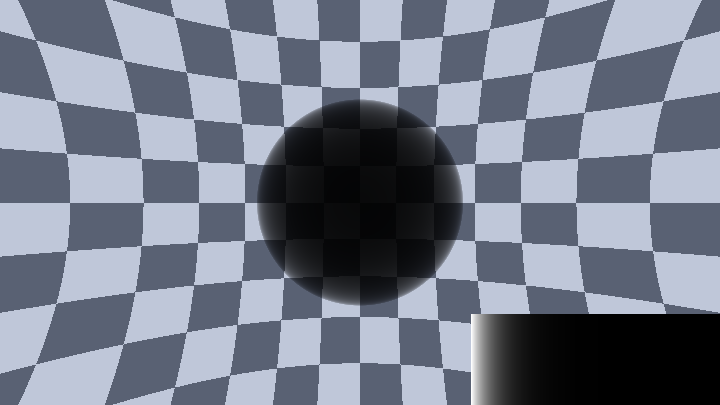
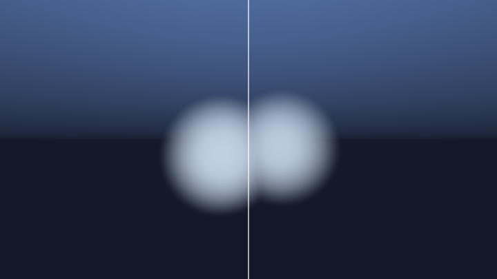
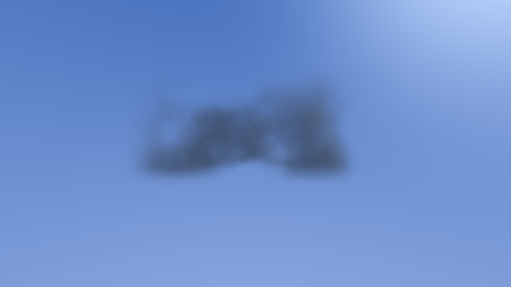

# 第 10 章 · 体积渲染与大气

> 云、雾、烟、体积光——这些**没有表面**的东西，不再问「撞到哪里」，而是问「沿这条视线积了多少密度」。
>
> 本章把辐射传输压成可上手的套路，并锚定语料里最高赞的云/体积作品。  
> **想先看到成片？** 直接跳到 [10.17 阶梯实战](#1017-阶梯实战从透过率到一朵能出片的云)：六段完整可运行代码，从 Beer 透过率一直做到一朵带银边的云。

---

## 10.1 心智切换：从距离场到密度场

第 7–9 章的 raymarching 在找**表面**：`map(p)` 返回有符号距离，撞到零等值面就停。

体积渲染换一个问题：

> **沿光线每走一小段，这段介质吸收了多少光、又往相机方向散射了多少光？**

场函数从「距离」变成「密度」`density(p)`（或物理上的消光系数 \(\sigma_t\)）。渲染套路也从「步进求根」变成「沿线积分」。这就是第 0 章说的四种场里的**密度场**。

一条视线穿过参与介质时，同时发生三件事：

1. **消光**：介质吸收或散射走光 → 后面的东西变暗；
2. **内散射**：太阳/天光被这一小段散射进相机 → 介质自己「发亮」；
3. **传输**：这段发出的光还要穿过**前面**所有介质，继续衰减。

第 3 点是初学者最容易漏的。写成一句话：

> **一段介质的贡献 = 它自己发出的光 × 它前面所有介质的累计透过率。**

语料锚点（先认脸，后文会拆；路径均在 `shaders/shaders/`）：

| 作品 | likes | 你要学什么 |
|---|--:|---|
| `001615-XslGRr-Clouds`（iq） | 1615 | 预乘 alpha 合成、fbm→密度、LOD、方向导数光照 |
| `001579-3l23Rh-Protean_clouds`（nimitz） | 1579 | 变形噪声、密度驱动步长 |
| `000566-XlBSRz-VolumetricIntegration`（SebH） | 566 | **naive vs 能量守恒积分左右对照**——全站最好的教学片 |
| `000435-MdGfzh-Himalayas`（reinder） | 435 | coverage/erosion + HG 相函数 + 体积自阴影 |
| `000347-lslXDr-Atmospheric_Scattering_Sample`（gltracy） | 347 | Rayleigh/Mie 双重光学深度积分 |
| `000418-tdjBR1-Volumetric_lighting`（tmst） | 418 | 体积光 / 丁达尔 |
| `000334-DtdSz7-STELLAR_CLOUDS`（alro） | 334 | 现代参考：sigmaS/A/E、蓝噪声+黄金比 |
| `000724-XtGGRt-Auroras`（nimitz） | 724 | 多项式步长 + 分层帘幕 |

### 决策表：你该做哪种「体积」？

| 目标 | 优先套路 | 代表作品 | 别一上来就… |
|---|---|---|---|
| 一团艺术向云 | 固定/几何步长 + 预乘 alpha + 方向导数 | Clouds | 双重大气积分 |
| 可调阴晴的真实云 | coverage/erosion + 段内 Beer + HG | Himalayas / STELLAR | 手调 `ALPHA_WEIGHT` 凑亮度 |
| 理解能量对不对 | 打开 SebH 左右对照 | VolumetricIntegration | 抄完再调参 |
| 雾/大气感 | 解析指数雾 + 可选高度项 | Volcanic / Mountains | 每像素 100 步雾积分 |
| 丁达尔光柱 | 屏幕径向模糊 或 嵌体积循环 | Shane 径向 / Cloudy Terrain | 每点完整 shadow march |
| 火/烟/爆炸 | SDF+噪声 或 `ld/td/w` 艺术模板 | Flame / Volumetric explosion | 物理相函数 |
| 极光 | 多项式位置采样 + 低不透明度 | Auroras | 云那套自阴影 |

---

## 10.2 Beer-Lambert：透过率是怎么来的

### 核心思路

一段均匀介质，消光系数 \(\sigma_t\)（单位 1/长度），走过距离 \(\Delta t\) 后：

\[
T = e^{-\sigma_t \Delta t}
\]

这就是 **Beer-Lambert 定律**。\(T\) 叫**透过率（transmittance）**：1 = 完全透明，0 = 完全挡住。

直觉：

- \(\sigma_t\) 翻倍 ≈ 厚度翻倍 → 同样「变暗」；
- 多段介质串联：透过率**相乘** \(T_{\text{总}} = T_1 T_2 \cdots\)，对数空间就是光学深度相加。

在 shader 里几乎永远写成：

<!-- glsl-skip -->
```glsl
// 合成示例：单段 Beer-Lambert
float transmittance = exp(-sigmaT * dt);
// 或 GPU 更友好的 exp2 等价形式（见 robobo1221）
// transmittance *= exp2(-opticalDepth);
```

### 调参直觉（语料常见量级）

| 参数 | 物理含义 | 调大 | 调小 | 语料典型值 |
|---|---|---|---|---|
| `sigmaE` / `density` | 消光 | 更不透明、边缘更硬 | 通透、雾化 | Himalayas `CLOUDS_DENSITY≈0.03` |
| `sigmaS/sigmaE` | 单次散射反照率 | 更亮更「棉花」 | 更暗更「烟」 | 云≈1；烟≈0.3~0.7 |
| `MIN_TRANSMITTANCE` | 提前退出 | 更快、可能截断亮边 | 更慢更准 | `0.1`（艺术）~`0.001`（HDR） |
| `ALPHA_WEIGHT` | 手工 \(\sigma\Delta t\) | 更浓 | 更淡 | 与步数强耦合 |


**先看一个完整可运行的透过率演示**（棋盘背景 × 均匀密度球）。调 `SIGMA`：

#### 可跑精读 · 均匀球透过率

体积第一步：不谈发光，只看 Beer 透过率。棋盘背景 × 均匀密度球——调 `SIGMA` 立刻懂「雾有多浓」。

**思路拆解**

1. 射线与球求进入/离开。
2. `T = exp(-SIGMA * thickness)`。
3. `col = mix(fogColor, background, T)` 或背景乘 T。

**关键旋钮**

| 旋钮 | 感觉 |
|---|---|
| SIGMA | 浓度 |
| 球半径 | 光程 |
| 背景对比 | 可读性 |

**动手改（建议按序）**

1. SIGMA→0 应还原棋盘。
2. 加大球，看中心更暗。
3. 下一步加发光积分（stage2）。

**易错点**

- 厚度算成直径符号错 → 不变暗或变黑。

<!-- glsl-from: examples/ch10_stage1.glsl -->
```glsl
float od = chordOpticalDepth(ro, rd, vec3(0.0), 0.85);
float T  = exp(-SIGMA * od);
vec3 col = bg * T;
```

完整文件见阶梯阶段 1；下面继续讲积分形式。

**关键耦合**：naive/`ALPHA_WEIGHT` 写法下，改步数必须反向改密度缩放，否则明暗漂移。`exp(-sigma*dt)` 的物理形式天然免疫——这是采用守恒形式最实际的好处。

### 易错点

- **漏乘透过率**：后面的发光会「穿」过前面的云，整团像塑料棉花糖。SebH 的对照 shader 就是为了演示这个。
- **`sigmaT == 0` 时除零**：能量守恒形式里有 `/sigmaE`，必须 `max(sigmaE, 1e-9)`。
- **提前退出阈值太高**：`T < 0.1` 在浓云内部留下能量缺口，靠 tonemap 掩盖；HDR 输出要到 `0.01` 以下。
- **过早 `clamp(sum,0,1)`**：破坏后续高光与 tonemap。

---

## 10.3 沿光线积分密度：一段介质的贡献

> **动手**：阶段 2（`ch10_stage2.glsl`）是把上面公式写成固定步长循环的完整 shader——软球发光 + 背景乘剩余透过率。先跑通再读公式，会轻松很多。


### 第一性原理（一句话）

> **一段介质的贡献 = 它自己发出的光 × 它前面所有介质的累计透过率。**

设视线从相机 \(t=0\) 出发，背景亮度 \(L_{\text{bg}}\)，则：

\[
L(0) = T(0,D)\,L_{\text{bg}} + \int_0^D T(0,t)\,\sigma_s(t)\,S(t)\,\mathrm{d}t
\]

其中 \(S\) 是源项（太阳经相函数加权后的内散射，或自发光）。

段内假设 \(\sigma\) 常数时，朴素矩形法：

\[
L \mathrel{+}= T_i\,\sigma_s S\,\Delta t,\qquad T_{i+1}=T_i e^{-\sigma_t\Delta t}
\]

段内把透过率也积掉（Frostbite / Hillaire）：

\[
\Delta L = T_i \cdot \sigma_s S \cdot \frac{1 - e^{-\sigma_t\Delta t}}{\sigma_t},\qquad
T_{i+1} = T_i\,e^{-\sigma_t\Delta t}
\]

当 \(\sigma_t\Delta t\to 0\) 退化为矩形法；当 \(\sigma_t\to\infty\) 趋向源亮度本身——**不会随步长爆炸**。这是「改步数亮度不漂」的真正原因。

### 离散化：两派写法

**派 A · 预乘 alpha 前向合成（iq Clouds 定型，抄袭最多）**

把密度变成这一步的不透明度 \(\alpha\)，颜色预乘后做 over：

> 📄 出自 `001615-XslGRr-Clouds/image.glsl`（iq）——习语骨架（合成整理）

<!-- glsl-skip -->
```glsl
// 合成示例：iq 式前向合成（与 Clouds 同构）
col.a    = min(density * k * dt, 1.0); // 密度 → 不透明度（带 dt 补偿）
col.rgb *= col.a;                      // 预乘
sum     += col * (1.0 - sum.a);        // 剩余透过率 = 1 - sum.a
```

`1.0 - sum.a` 就是累计透过率的一阶亲戚；`sum.a > 0.99` 可提前退出。

**派 B · 能量守恒段内积分（Frostbite / SebH / Himalayas）**

> 📄 出自 `000566-XlBSRz-VolumetricIntegration/image.glsl`（SebH）——左右分屏对照 naive / improved

<!-- glsl-skip -->
```glsl
// 000566-XlBSRz-VolumetricIntegration/image.glsl（节选思路）
// Sint = (S - S * exp(-sigmaE*dd)) / sigmaE;
// scatteredLight += transmittance * Sint;
// transmittance  *= exp(-sigmaE * dd);
// 同文件：sigmaE = max(1e-9, sigmaA + sigmaS); // 防除零
```

**艺术向 naive（Duke / Shane）**：用 `w = (1-td)*ld` 手工模拟透过率，没有 `exp`。物理不对，但旋钮直观，星云/爆炸里极常见（`000361-MdKXzc-Supernova_remnant`、`000569-lsySzd-Volumetric_explosion`）。

### 决策表：选哪派积分？

| 情境 | 推荐 | 原因 |
|---|---|---|
| 快速出片、调色板驱动 | 派 A 预乘 alpha | 旋钮直观，与 2D 合成同构 |
| 要改步数/变步长还不漂亮度 | 派 B 段内解析 | \(\frac{1-e^{-x}}{\sigma}\) 守恒 |
| 爆炸/星云艺术向 | Duke `ld/td/w` | 好看优先 |
| 学习「为什么发塑料光」 | 打开 SebH 对照 | 一眼看见 naive 的错 |

### 最小可跑骨架

<!-- glsl-skip -->
```glsl
// 合成示例：固定步长体积积分骨架
vec4 sum = vec4(0.0);
float t = t0;
for (int i = 0; i < STEPS; i++) {
    if (sum.a > 0.99) break;
    vec3 p = ro + rd * t;
    float den = density(p);           // ← 你的密度场
    if (den > 0.01) {
        vec4 col = shade(p, den);     // 颜色 + alpha
        col.rgb *= col.a;
        sum += col * (1.0 - sum.a);
    }
    t += dt;
}
vec3 bg = sky(rd);
vec3 color = sum.rgb + (1.0 - sum.a) * bg;
```

---

## 10.4 步进策略：钱花在刀刃上

体积成本 ≈ **步数 × 单步密度成本**。目标：有料的地方密采，空的地方大步跨。

| 策略 | 代表 | 适用 | 典型步数 |
|---|---|---|--:|
| 固定 `t += const` | Hell | 小包围盒 | 150 |
| 几何 `t += max(a, k*t)` | Clouds / Volcanic | 开放天空 | 60~190 |
| 均匀分段 `(end-start)/N` | Himalayas / Enscape | 有云层 AABB/球壳 | 16~75 |
| SDF 驱动 `t += max(d*k, min)` | Duke / Shane | 爆炸、spikeball | 25~86 |
| 密度多项式 | Protean / Magnetismic | 平滑体积极限性能 | ~130 |
| 多项式**位置** | Auroras | 极大高度帘幕 | 50 |
| 结构化平面钉桩 | huwb Structured Vol Sampling | 低采样+相机大动 | ~40 |

### 几何步长为什么对

屏幕上一像素在距离 \(t\) 处覆盖的世界尺度 \(\propto t\)。令 \(\Delta t \propto t\) 就是「每步在屏幕上前进近似恒定像素」——对数均匀。`max(minStep, …)` 防止 \(t\to 0\) 死循环。

> 📄 出自 `001615-XslGRr-Clouds/image.glsl`（iq）

<!-- glsl-skip -->
```glsl
// LOOK==0：带 LOD 的几何步长
float dt = max(0.05, 0.02 * t / float(kDiv));
// LOOK==1：
// t += max(0.06, 0.05*t);
```

> 📄 出自 `001579-3l23Rh-Protean_clouds/image.glsl`（nimitz）——密度驱动

<!-- glsl-skip -->
```glsl
float dn = clamp((mpv.x + 2.), 0., 3.);
t += clamp(0.5 - dn * dn * 0.05, 0.09, 0.3);
// 作者注：仔细选多项式可 ~+40% 性能而观感不变
```

### 易错点（步进）

- **变步长却用固定 alpha**：忘记 `*dt` → 密区过度累积。修法：`col.a *= dt` 或 `exp(-den*dt)`。
- **把密度场当真 SDF 大步跳**：非 Lipschitz → 漏采。必须安全系数（Shane `0.5`，Duke `0.08~0.25`）。
- **缺 `max(d, minStep)`**：`d≤0` 原地耗尽步数。

---

## 10.5 抖动：消除洋葱条带

所有像素用同一组 \(t\) 样本 → 误差屏幕相关 → **条带 / 洋葱层**。解法：每个像素把起点在 \([0,\Delta t)\) 内偏移；蓝噪声比白噪声「脏感」更轻。

| 方案 | 出处 | 要点 |
|---|---|---|
| 蓝噪声 `texelFetch` | Clouds | 偏移幅度 ≈ 一个步长 |
| 解析 hash | Hell | 不占纹理槽 |
| `hash + iTime` | Himalayas | 配合 TAA |
| **蓝噪声 + 黄金比帧旋** | STELLAR CLOUDS | 当前黄金标准 |
| 四方案对照 | `000099-WsfBDf-Blue_Noise_Fog` | 最好教材 |

> 📄 出自 `001615-XslGRr-Clouds/image.glsl`

<!-- glsl-skip -->
```glsl
float t = tmin + 0.1 * texelFetch(iChannel1, px & 1023, 0).x;
```

> 📄 出自 `000334-DtdSz7-STELLAR_CLOUDS/buffer_b.glsl`（alro）

<!-- glsl-skip -->
```glsl
float blueNoise = texture(iChannel2, fragCoord / 1024.0).r;
offset = fract(blueNoise + float(iFrame % 32) * 1.61803398875);
distToStart += stepS * offset;
```

**二次（向光）阴影射线也要抖动**，否则阴影阶梯——Enscape Cube 主射线与 `lightRay` 都加了 hash。

---

## 10.6 相函数：光往哪边散

### 核心思路

一次散射事件后，光子飞向各个方向的概率分布叫**相函数** \(p(\cos\theta)\)。\(\theta\) 是入射与出射夹角。

| 类型 | 形状 | 典型介质 |
|---|---|---|
| 各向同性 | 球 | 粗烟近似 |
| 前向（\(g>0\)） | 尖峰朝前 | **云滴、雾滴** → 太阳边「银边」 |
| Rayleigh | 前后哑铃 | **空气分子** → 蓝天 / 红日落 |
| Mie | 强前向 + 弱后向 | 真实云滴 |

### Henyey-Greenstein（语料默认选项）

\[
p_{HG}(\mu) = \frac{1}{4\pi}\frac{1-g^2}{(1+g^2-2g\mu)^{3/2}},\quad \mu=\cos\theta
\]

- 云：\(g \approx 0.7\sim 0.9\)
- 烟：\(g \approx 0.3\sim 0.6\)
- \(g=0\)：各向同性

> 📄 出自 `000435-MdGfzh-Himalayas/buffer_d.glsl`（reinder）

```glsl
float HenyeyGreenstein(float sundotrd, float g) {
    float gg = g * g;
    return (1. - gg) / pow(1. + gg - 2. * g * sundotrd, 1.5);
}
```

注意：语料里有的带 `1/(4π)`，有的省略。**抄代码前先对齐归一化**，否则亮度差一个 \(4\pi\)。

双瓣 HG（前向 + 背向凸组合）更接近真实 Mie；`000433-4dSBDt-Enscape_Cube` 甚至用 `numericalMieFit`。

**性能要点**：`mu = dot(sunDir, rd)` 整条射线不变，**在循环外算一次相函数**。

---

## 10.7 云：fbm 如何变成密度

### 三件套

1. **形状先验**：高度剖面、球壳、天气遮罩——决定「云大致在哪」；
2. **噪声调制**：fbm 打破规整；
3. **阈值/重映射**：`clamp` 出清晰云/空边界。

最常见骨架：

```
density = clamp( shape(p) + k * fbm(p), 0, 1 )
```

> 📄 出自 `001615-XslGRr-Clouds/image.glsl`（iq）

<!-- glsl-skip -->
```glsl
float map5(in vec3 p) {
    vec3 q = p - vec3(0.0, 0.1, 1.0) * iTime;
    float f = 0.0, a = 0.5;
    f += a * noise(q); q *= 2.02; a *= 0.5;
    f += a * noise(q); q *= 2.03; a *= 0.5;
    f += a * noise(q); q *= 2.01; a *= 0.5;
    f += a * noise(q); q *= 2.02; a *= 0.5;
    f += a * noise(q);
    return clamp(1.5 - p.y - 2.0 + 1.75 * f, 0.0, 1.0);
}
```

拆解：

- `-p.y`：高度剖面（越高越稀）；
- `-2.0` 一类偏置：覆盖度——调正变阴天，调负变疏云；
- `1.75*f`：噪声强度；
- octave 倍率用 `2.01~2.03` 而非整齐 `2.0`，避免格点对齐伪影。

iq 还按距离切换 `map5/map4/map3/map2`（远处砍 octave）——**体积云最划算的优化**。

### Coverage / Erosion 范式（Himalayas）

完整管线把「有多少云」和「边有多蓬松」拆开：

| 步骤 | 含义 |
|---|---|
| base shape | 低频形状 + 高度窗 |
| remap / coverage | 加法偏置：阴天↔晴天 |
| erosion | **只在边缘**用高频啃掉细节 |
| density 缩放 | 全局不透明度 |

> **coverage = 加法控制天空占比；erosion = 减法只啃边缘。** 两者分离才能独立调「阴晴」和「絮状」。

Enscape Cube 是三级级联：`largeWeather → weather → shape − fbm`，每级不同动画速度，空区域 `if (den<=0) return` 早退——生产级写法。

### 云密度调参总表（语料量级）

| 参数 | 典型区间 | 直觉 |
|---|---|---|
| 覆盖度偏置 | iq 一类 `-0.5`；Himalayas `COVERAGE-1≈-0.48` | 越负越晴，越正越阴 |
| 噪声强度 | iq `1.75`；Hell 可到 `4` | 越大越碎、越乱 |
| octave | 云 2~5；星云 8~12 | +1 层 ≈ +1 次噪声成本 |
| 频率倍率 | `2.01~2.03`（iq）；nimitz `~1.8` | **避开整数 2.0** 防格点伪影 |
| 振幅衰减 | 标准 `0.5`；湍流可更高 | 接近 1 → 更糙 |
| erosion | Himalayas `~0.225` | 只作用边缘的蓬松度 |
| 边缘软度 | `smoothstep` 宽 `0.05~0.1` | 越小边越锐 |

### 云密度易错点（补强）

- 所有 octave 同一速度平移 → 「贴图滑动感」；应逐层不同速度（Hell / Enscape）。  
- 无高度衰减 → 头顶雾墙。  
- erosion 不加权作用全场 → 云心被啃出洞。  
- 远处无地球曲率/高度窗 → 地平线「平得假」。

### 廉价自阴影（方向导数）

不必每点向太阳 march：

<!-- glsl-skip -->
```glsl
// 合成示例：iq Clouds 同构
float dif = clamp((den - density(pos + 0.3 * sundir)) / 0.6, 0.0, 1.0);
```

一次额外密度采样，云就有了明暗体积感。要更真再上 `volumetricShadow`（Himalayas：几何递增步长 ~1.3ˣ）。

### 自阴影决策表

| 方案 | 每主步额外成本 | 质量 |
|---|---|---|
| 无光照 | 0 | 差 |
| 方向导数（iq） | **1 次密度** | 性价比之王 |
| 双探针（nimitz） | 2 | 更好 |
| 二次步进 8~20 | 8~20 | 很好 |
| 预烘焙光照体（tmst） | 1 tex | 取决于分辨率 |

**易错**：只有太阳光没有 ambient → 背阴纯黑塑料感；二次射线不抖动 → 阴影阶梯；powder 用在背光方向 → 反效果（须按 `mu` 加权）。

---

## 10.8 雾：最便宜的体积

雾是「密度几乎均匀、或不随高度缓慢变化」的体积特例，常常**解析求**，不必逐步积分。

| 种类 | 直觉 | 典型写法 |
|---|---|---|
| 指数雾 | 距离越远透过率指数衰减 | `mix(col, fogCol, 1.0 - exp(-d*d*k))` |
| 高度雾 | 贴地更浓 | 对 `exp(-height/H)` 沿射线解析积 |
| 散射雾 | 雾本身被太阳照亮 | Beer + 单次散射项 |
| 色散消光 | 远处偏蓝/偏红 | `exp2(-t*t*k*vec3(r,g,b))`（Volcanic） |

> 📄 出自 `001615-XslGRr-Clouds` 式距离雾（合成同构）

<!-- glsl-skip -->
```glsl
col.xyz = mix(col.xyz, bgcol, 1.0 - exp(-0.003 * t * t));
```

> 📄 出自 `000511-XsX3RB-Volcanic/image.glsl`（iq）—— RGB 分通道消光

<!-- glsl-skip -->
```glsl
// 思路：exp2(-t*t*k*vec3(0.5,1.0,2.0)) → 远处偏蓝消光
```

线性雾（`clamp(t/far,0,1)`）最糙但最稳；真正「空气感」来自指数 + 高度项。蓝噪声抖动起点见 demofox `000099-WsfBDf-Blue_Noise_Fog`。

变步长体积里混雾时，要用积分差分（Protean 的 `fogC - fogT`），不能按固定 `t` 公式瞎套。

---

## 10.9 体积光 / 丁达尔（God rays）

**可运行丁达尔**：遮挡体朝太阳的透过率 × 沿视线 Beer 积分。先搞懂这一枪，再把遮挡换成云密度。

#### 可跑精读 · 丁达尔光柱

遮挡体到太阳的透过率 × 沿视线 Beer 积分：尘雾里的光束。先搞懂这一枪，再把遮挡换成云密度。

**思路拆解**

1. 视线积分点 p。
2. 从 p 向太阳 march/解析求透过。
3. `glow += T_view * T_sun * phase * dt`。

**关键旋钮**

| 旋钮 | 感觉 |
|---|---|
| 尘密度 | 柱可见度 |
| 遮挡造型 | 光束剪影 |
| 相位 g | 朝阳爆亮 |

**动手改（建议按序）**

1. 去掉遮挡，柱变平。
2. 密度极低对照。
3. 换成窗户缝（艺术向）。

**易错点**

- 每步都向太阳满步数 march → 极贵；降采样/降步。

<!-- glsl-from: examples/ch10_stage7.glsl -->
```glsl
T_sun = exp(-tau_to_sun);
col += lightColor * T_view * T_sun * ds;
```


### 核心思路

太阳（或窗光）照进参与介质时，**被照亮的介质段**把光散射进相机 → 你看见「光柱」。算法上仍是体积积分，只是源项 \(S\) 强依赖「该点到光源是否被挡」。

两条常见路线：

1. **真体积**：主射线积分时，每点再向光源做短程 shadow march（或查预烘焙光照体，如 `000418-tdjBR1-Volumetric_lighting`）。
2. **屏幕空间径向模糊**：先渲染遮挡物剪影，再沿「太阳投影点 → 像素」方向模糊累加。便宜，假，但语料里极多（Shane `000179-XsKGRW-Full_Scene_Radial_Blur`）。

Cloudy Terrain（iq `000399-MdlGW7`）在云内用 `rays` 累计量模拟 god-ray，是「嵌在体积循环里」的折中。

调参直觉：光柱可见度 ≈ `相函数前向峰 × 介质浓度 × 光源立体角`；\(g\) 越大、太阳附近越刺眼。

---

## 10.10 大气散射概要（Rayleigh + Mie）

完整天空不是一张渐变贴图，而是：

1. 沿视线积分空气分子（Rayleigh）与气溶胶（Mie）的光学深度；
2. 每个样本再向太阳积一次光学深度（是否被地球挡住）；
3. 乘对应相函数，累加内散射，再乘透过率看到的阳光/背景。

> 📄 完整双重积分：`000347-lslXDr-Atmospheric_Scattering_Sample`（gltracy）  
> 📄 廉价解析/拟合天空：大量地形作品直接用 `sky(rd)` 经验公式（Hoskins Mountains 等）

记忆卡片：

- **Rayleigh** \(\propto 1/\lambda^4\) → 短波散射强 → **白天天空蓝**；
- 低太阳时路径长，蓝光被散射殆尽 → **日落红橙**；
- **Mie** 负责太阳周围那圈白晕与薄雾感。

实时作品常把「完整大气」压成：解析天空色 + 地面指数雾 + 可选一圈 Mie 辉光。只有当你要飞船穿大气、或 Himalayas 级云海时，才值得上双重积分。

---

## 10.11 火、烟、爆炸与极光（体积家族旁支）

这些效果共用「沿线积分」，但密度与着色不同：

| 效果 | 密度来源 | 着色套路 | 代表 |
|---|---|---|---|
| 火焰 | SDF + 噪声位移 | glow 计数 / 黑体温 | `000863-MdX3zr-Flame` |
| 2D 火 | fbm | `vec3(c, c³, c⁶)` 拉色带 | `000392-XsXSWS-Fires` |
| 爆炸 | spiral noise + SDF | `ld/td/w` 艺术累积 | `000569-lsySzd-Volumetric_explosion` |
| 星云 | Disk SDF + noise | `computeColor(密度)` | Supernova remnant |
| 极光 | 2D 帘幕噪声沿高采样 | 低 alpha + `avgCol` | `000724-XtGGRt-Auroras` |
| 星巢 | 折叠累积（非 fbm） | 体积加法 | `001157-XlfGRj-Star_Nest`（接第 11 章） |

> 📄 出自 `000724-XtGGRt-Auroras/image.glsl`（nimitz）——多项式位置而非累加步长

<!-- glsl-skip -->
```glsl
// 思路：pt = ((.8+pow(i,1.4)*.002)-ro.y)/(rd.y*2.+0.4);
// 大高度范围用 i^1.4 拉开样本；配合 hash 抖动 of
```

火「塑料感」常见原因：颜色幂次不够——先把 `vec3(c,c*c,c*c*c*c*c*c)` 一类色带做对，再谈物理散射。

**火焰柱**：竖直对流密度（fbm）× 暖色自发光 × 透过率。调 `emission` 与步数比调噪声更管用。

#### 可跑精读 · 火焰柱

火是「向上的形状掩码 × 密度 × 暖色自发光」。颜色幂次（红→黄白）不对就会塑料；先做对色带再谈物理。

**思路拆解**

1. 竖直域 + 向上飘的 fbm。
2. 掩码削出火苗形。
3. `emission = palette(density)`；积分同体积。

**关键旋钮**

| 旋钮 | 感觉 |
|---|---|
| 上升速度 | 抖动 |
| 掩码宽 | 火苗胖瘦 |
| 色幂 | 黄心 |

**动手改（建议按序）**

1. 对照 ch18_lava（表面）与本例（体积）。
2. emission 幂次加大。
3. 加风偏移。

**易错点**

- 当不透明表面画 → 假。必须积分或至少 soft alpha。

<!-- glsl-from: examples/ch10_stage8.glsl -->
```glsl
emission = palette(y) * dens;
col += emission * transmittance * ds;
```


**较难延展 · 极光飘带**：多层正弦波壳 + 绿紫发光。思路从「一团密度」变成「一张会扭的薄壳」。

#### 可跑精读 · 极光飘带

从「一团密度」变成「会扭的薄壳」：多层正弦波墙 + 绿紫发光。积分薄壳时步长要适配，否则漏带。

**思路拆解**

1. 用波函数定义壳距离/密度。
2. 多层不同相位。
3. 绿-紫 palette × 积分。

**关键旋钮**

| 旋钮 | 感觉 |
|---|---|
| 波幅/频率 | 飘带扭动 |
| 层数 | 纵深 |
| 壳厚度 | 锐利度 |

**动手改（建议按序）**

1. 一层壳先调美。
2. 加慢速相位。
3. 背景星空衬托。

**易错点**

- 壳太薄 + 步长太大 → 闪断。

<!-- glsl-from: examples/ch10_stage9.glsl -->
```glsl
// layered wavy sheets in sky
```


---

## 10.12 Powder 与廉价多次散射（进阶旋钮）

朝阳云边有时「该亮却偏暗」——薄区域光子多半前向穿走，很少散射回相机。**Powder** 修正：\(\text{powder}(\tau)=1-e^{-2\tau}\)，稀处压暗、厚处接近 1。

> 📄 出自 `000141-MstBWs-Real_time_PBR_Volumetric_Clouds/image.glsl`（robobo1221）

```glsl
float powder(float od) {
    return 1.0 - exp2(-od * 2.0);
}
```

STELLAR CLOUDS 按视角混合：正对太阳多用 powder，背对太阳少用——避免背光面误压暗。

**multipleOctaves**（alro / Fewes）：用几层「消光更弱、贡献更小、相函数更各向同性」的 Beer 项近似多次散射，约 6×(exp+双瓣 HG) 换「云肚子透亮」感，远便宜于真路径追踪。

| 何时上 | 何时不上 |
|---|---|
| 已有守恒积分 + HG，还嫌「单次散射假」 | 还在调 coverage，先别叠旋钮 |
| 艺术云要银边+肚子光 | 火/烟/极光——别乱加 powder |

---

## 10.13 常见坑总表

| 症状 | 可能原因 | 修法 |
|---|---|---|
| 云发塑料光、背面透亮 | 漏乘 \(T\) | 前向合成或 SebH 守恒式 |
| 改步数亮度漂 | naive 未乘 `dt` | `col.a*=dt` 或 `exp(-σΔt)` |
| 洋葱条带 | 无抖动 | 蓝噪声/hash 偏 `t0` |
| 阴影阶梯 | 二次射线无抖动 | 阴影也 dither |
| 背阴死黑 | 无 ambient | 上下渐变环境光 |
| 除零花屏 | `sigmaE==0` | `max(sigmaE,1e-9)` |
| 浓云截断亮边 | 提前退出太狠 | 降低 `MIN_TRANSMITTANCE` |
| 手机掉帧 | N×M 密度×fbm | LOD 砍 octave、方向导数代替长阴影 |

---

## 10.14 实战步骤（建议按序做）

1. **骨架**：固定步长 + 预乘 alpha + 球内 `clamp(fbm - threshold)`，先出一团灰云。  
2. **对照**：打开 `000566-XlBSRz-VolumetricIntegration`，左右看 naive vs improved，亲手改 `sigma` 感受亮度是否稳。  
3. **抖动**：给 `t0` 加 hash 或蓝噪声，确认条带消失。  
4. **光照**：加方向导数；再试 HG（循环外算 `mu`）看银边。  
5. **LOD**：远处换少 octave 的 `map`；量一下步数可视化（第 19 章）。  
6. **雾**：场景加 `1-exp(-k*t*t)`；需要空气透视再上 RGB 消光。  
7. **升级**：抄 Himalayas 的 coverage/erosion 一段；或读 STELLAR CLOUDS 的 sigma 命名。  
8. **旁支**：任选 Flame / Auroras / Star Nest 之一，体会「同一积分、不同密度」。

### 性能速查

- 主循环成本 ≈ \(N \times\)（fbm octaves × tex）。  
- 再加向光 \(M\) 步 → \(\approx N(1+M)\) 次密度。Enscape 量级 \(N=35,M=20\) 需要 TAA。  
- **最划算优化排序**：提前退出 → LOD octave → 方向导数代替长阴影 → 变步长 → 结构化采样。

### 调参剧本（一天内可跑完）

| 时段 | 动作 | 成功标准 |
|---|---|---|
| 上午 | 固定步长灰云 + 抖动 | 无洋葱条带 |
| 下午 | 方向导数 + HG | 有体积明暗与银边 |
| 傍晚 | 换成几何步长 / LOD map | FPS 明显升，观感不塌 |
| 加分 | SebH 对照抄守恒式 | 改步数亮度基本不动 |

---

## 10.15 推荐阅读顺序

1. `001615-XslGRr-Clouds`（合成与 LOD）  
2. `000566-XlBSRz-VolumetricIntegration`（能量）  
3. `000099-WsfBDf-Blue_Noise_Fog`（抖动对照）  
4. `000435-MdGfzh-Himalayas`（完整云）  
5. `000334-DtdSz7-STELLAR_CLOUDS`（现代写法）  
6. `000347-lslXDr-Atmospheric_Scattering_Sample`（真大气）  
7. `000724-XtGGRt-Auroras` / `001157-XlfGRj-Star_Nest`（旁支）

---

## 10.16 符号与命名对照（读生产代码时）

不同作品对同一物理量起名不同，抄的时候先对齐：

| 物理量 | iq / 合成派 | Frostbite / alro / SebH |
|---|---|---|
| 消光 | 密度→`col.a` | `sigmaE` / `sigmaT` |
| 散射 | 揉进 `col.rgb` | `sigmaS` |
| 透过率 | `1.0 - sum.a` | `transmittance` / `T` |
| 源项 | `shade()` 颜色 | `S` / `sun*phase*shadow` |
| 步长 | `dt` / `0.05*t` | `stepS` / `dD` / `dd` |

读 Himalayas / STELLAR 时若感觉「和 Clouds 不是一种语言」——其实积分是同一句话，只是左边用 alpha 合成语汇，右边用辐射语汇。

---

## 10.17 阶梯实战：从透过率到一朵能出片的云

前面每一节都是零件。这一节把它们装成一台机器——**六段完整可运行代码**在 `examples/ch10_stage1..6.glsl`，网页上带「示例文件」徽章的块会直接跑完整文件。

用第 0 章五步法：

- **分层**：背景 → 体积积分 → 光照/相函数 → 地面雾 → 后期
- **定维度**：3D 密度场 + 沿线积分（不是 SDF 求根）
- **找结构**：Beer-Lambert 透过率 × 源项
- **写场函数**：球 → 软球 → fbm 云
- **打磨**：抖动、HG、powder、tonemap

### 阶段 1：只看透过率

均匀密度球挡住棋盘背景。没有发光，只有变暗。

#### 可跑精读 · 均匀球透过率

体积第一步：不谈发光，只看 Beer 透过率。棋盘背景 × 均匀密度球——调 `SIGMA` 立刻懂「雾有多浓」。

**思路拆解**

1. 射线与球求进入/离开。
2. `T = exp(-SIGMA * thickness)`。
3. `col = mix(fogColor, background, T)` 或背景乘 T。

**关键旋钮**

| 旋钮 | 感觉 |
|---|---|
| SIGMA | 浓度 |
| 球半径 | 光程 |
| 背景对比 | 可读性 |

**动手改（建议按序）**

1. SIGMA→0 应还原棋盘。
2. 加大球，看中心更暗。
3. 下一步加发光积分（stage2）。

**易错点**

- 厚度算成直径符号错 → 不变暗或变黑。

<!-- glsl-from: examples/ch10_stage1.glsl -->
```glsl
float chordOpticalDepth(vec3 ro, vec3 rd, vec3 c, float r)
{
    vec3  oc = ro - c;
    float b  = dot(oc, rd);
    float h  = b*b - dot(oc, oc) + r*r;
    if (h < 0.0) return 0.0;
    h = sqrt(h);
    float t0 = max(0.0, -b - h);
    float t1 = max(0.0, -b + h);
    return max(0.0, t1 - t0);          // 弦长 = 光学路径（密度=1）
}

    float od = chordOpticalDepth(ro, rd, vec3(0.0), 0.85);
    float T  = exp(-SIGMA * od);       // Beer-Lambert

    vec3 col = bg * T;

    // 侧面小字感：把透过率可视化成色带（右下角）
    if (p.x > 0.55 && p.y < -0.55) {
        float u = (p.x - 0.55) / 0.45;
        col = vec3(exp(-SIGMA * u * 2.5));
    }

    fragColor = vec4(col, 1.0);
```



把 `SIGMA` 拖大——球心更黑，擦边仍透。这就是 \(T=e^{-\sigma L}\)。

### 阶段 2：沿线积分（吸收 + 发光）

固定步长穿过软球。**每步贡献必须乘当前累计透过率 T，再更新 T。**

#### 可跑精读 · 吸收 + 发光积分

固定步长穿软球：每步 `col += T * emission * dt`，再 `T *= exp(-absorb*dt)`。顺序反了能量就错。

**思路拆解**

1. 沿 rd 步进。
2. 先累加再更新 T（或按教材一致）。
3. 出体积后叠背景 * T。

**关键旋钮**

| 旋钮 | 感觉 |
|---|---|
| 步长 | 洋葱条带 |
| emission | 霓虹 |
| absorb | 自遮挡 |

**动手改（建议按序）**

1. emission=0 回到纯吸收。
2. 步长加倍看条带（引出 stage3 抖动）。
3. 记录：贡献必须乘当前 T。

**易错点**

- 先更新 T 再累加且补偿错 → 偏暗/偏亮。

<!-- glsl-from: examples/ch10_stage2.glsl -->
```glsl
float T   = 1.0;                   // 累计透过率
    vec3  col = vec3(0.0);

    for (int i = 0; i < STEPS; i++) {
        vec3  p = ro + rd * (tMin + (float(i) + 0.5) * dt);
        float d = density(p);
        if (d > 1e-4) {
            float sigmaT = SIGMA_T * d;
            float absorb = exp(-sigmaT * dt);
            // 源项：简单各向同性自发光（阶段 5 再换成太阳×相函数）
            vec3  emit = ALBEDO * (SIGMA_S * d);
            // ★ 关键：先乘当前 T，再更新 T
            col += T * emit * dt;
            T   *= absorb;
            if (T < 0.01) break;
        }
    }

    col += T * sky(rd);                // 背景也要乘剩余透过率

    fragColor = vec4(col, 1.0);
```


### 阶段 3：抖动消洋葱

左半无抖动、右半有抖动——条带对比一目了然。

#### 可跑精读 · 抖动消洋葱

固定步长体积积分易出层状条带。每像素随机把起点抖 `hash*dt`——左半关/右半开对比最直观。

**思路拆解**

1. `t0 += hash(uv+iTime)*dt`。
2. 分屏开关。
3. 动画时可用蓝噪声稳一些。

**关键旋钮**

| 旋钮 | 感觉 |
|---|---|
| dt | 条带频率 |
| 抖动幅度 | 去带 vs 噪 |
| 时间动画哈希 | 闪烁 |

**动手改（建议按序）**

1. 静止哈希（不加 iTime）减闪。
2. 只看右半。
3. 步数增加也能消带但更贵。

**易错点**

- 抖动过大 → 时间上雪花闪。

<!-- glsl-from: examples/ch10_stage3.glsl -->
```glsl
float hash21(vec2 p)
{
    p = fract(p * vec2(123.34, 456.21));
    p += dot(p, p + 45.32);
    return fract(p.x * p.y);
}

    // 左半：无抖动（条带明显）；右半：有抖动
    float j = 0.0;
    if (uv.x > 0.0) j = hash21(fragCoord + floor(iTime*2.0));

    vec3 col = integrate(ro, rd, j);

    // 中缝
    col = mix(col, vec3(1.0), smoothstep(0.006, 0.0, abs(uv.x)));

    fragColor = vec4(col, 1.0);
```




### 阶段 4：fbm 密度云

密度 = 高度窗 × 水平窗 × (fbm − 阈值)。

#### 可跑精读 · fbm 密度云

密度 = 空间窗（高度/半径）× `max(fbm - thr, 0)`。先把「像云的团块」做对，再上高级光照。

**思路拆解**

1. 采样点进 fbm。
2. 阈值削出实体感。
3. Beer / 积分同前。

**关键旋钮**

| 旋钮 | 感觉 |
|---|---|
| thr | 覆盖量 |
| fbm 层数 | 碎形 |
| 窗函数 | 云层高度 |

**动手改（建议按序）**

1. thr 提高变稀。
2. 层数 1→5。
3. 对照 stage5 银边。

**易错点**

- 无窗函数 → 全空间雾。

<!-- glsl-from: examples/ch10_stage4.glsl -->
```glsl
float density(vec3 p)
{
    // 高度窗：只在某一层有云
    float hy = smoothstep(0.0, 0.25, p.y) * smoothstep(1.35, 0.75, p.y);
    // 水平范围
    float hr = 1.0 - smoothstep(1.1, 1.9, length(p.xz));
    float n  = fbm(p * 1.35 + vec3(iTime*0.05, 0.0, iTime*0.03));
    // 阈值：调大云更碎更稀
    float d  = n - 0.48;
    return clamp(d * 1.8 * hy * hr, 0.0, 1.0);
}
```


### 阶段 5：方向导数 + HG 银边

#### 可跑精读 · HG 银边

相位函数（Henyey-Greenstein）让朝向太阳的散射更强——云边「发光银边」。用密度梯度近似光方向导数更稳。

**思路拆解**

1. 算 `mu = dot(rd, sun)` 或光方向导数。
2. HG(g, mu) 乘散射。
3. 与吸收积分同循环。

**关键旋钮**

| 旋钮 | 感觉 |
|---|---|
| g | 前向散射强度 |
| 太阳方向 | 银边位置 |
| 散射反照 | 亮度 |

**动手改（建议按序）**

1. g=0 各向同性。
2. g→0.8 看银边炸开。
3. 对照 stage7 丁达尔。

**易错点**

- 只加 HG 不加吸收 → 曝光炸。

<!-- glsl-from: examples/ch10_stage5.glsl -->
```glsl
float henyeyGreenstein(float cosTheta, float g)
{
    float g2 = g*g;
    return (1.0 - g2) / (4.0*3.14159 * pow(1.0 + g2 - 2.0*g*cosTheta, 1.5));
}

    float phase = mix(henyeyGreenstein(mu, 0.6),
                      henyeyGreenstein(mu,-0.3), 0.35);

    float tMin = 1.3, tMax = 5.8;
    float dt   = (tMax - tMin) / float(STEPS);
    float t    = tMin + hash21(fragCoord)*dt;

    float T = 1.0;
    vec3  col = vec3(0.0);
    const float SIGMA_T = 3.8;
    const float SIGMA_S = 3.5;

    for (int i = 0; i < STEPS; i++) {
        vec3  p = ro + rd * t;
        float d = density(p);
        if (d > 1e-4) {
            // 方向导数：朝太阳走一小步，密度下降 → 这面朝光
            float dS = density(p + sun * 0.18);
            float dif = clamp((d - dS) * 3.5 + 0.25, 0.15, 1.5);
            vec3  lin = vec3(0.55, 0.70, 0.95)*0.35          // 天光
```




### 阶段 6：打磨成片

地面、解析雾、powder、软膝、暗角——几何几乎没加。

#### 可跑精读 · 云海打磨

地面、解析雾、powder、软膝、暗角——几何几乎不加也能成片。体积章节的「出场仪式」。

**思路拆解**

1. 主体积积分结果。
2. 粉效应：厚云里压前向过曝。
3. 后期：knee/ACES/vignette。

**关键旋钮**

| 旋钮 | 感觉 |
|---|---|
| powder | 厚云压光 |
| 曝光 | 整体 |
| 雾色 | 大气统一 |

**动手改（建议按序）**

1. Solo 关掉后期。
2. 只留 stage4 核对比。
3. 加丁达尔（stage7）。

**易错点**

- 每个后期都抬曝光 → 白茫茫。

<!-- glsl-from: examples/ch10_stage6.glsl -->
```glsl
float powder(float od) { return 1.0 - exp(-od * 2.0); }

vec3 sky(vec3 rd, vec3 sun)
{
    float h = clamp(rd.y*0.5+0.5, 0.0, 1.0);
    vec3  col = mix(vec3(0.70, 0.78, 0.95), vec3(0.22, 0.40, 0.72), pow(h, 0.7));
    col = mix(col, vec3(1.00, 0.72, 0.45), pow(1.0 - max(rd.y, 0.0), 8.0)*0.45);
    float s = pow(max(dot(rd, sun), 0.0), 12.0);
    col += vec3(1.0, 0.90, 0.65) * s * 0.85;
    return col;
}

vec3 softKnee(vec3 c)
{
    const float K = 0.85;
    vec3 hi = max(c - K, 0.0);
    return min(c, vec3(K)) + (1.0 - K) * (1.0 - exp(-hi / (1.0 - K)));
}
```


### 回头看

| 阶段 | 新增 | 对应本节 |
|---|---|---|
| 1 | Beer 透过率 | 10.2 |
| 2 | 沿线积分 | 10.3–10.4 |
| 3 | 抖动 | 10.5 |
| 4 | fbm 云密度 | 10.7 |
| 5 | 方向导数 + HG | 10.6–10.7 |
| 6 | 雾/powder/后期 | 10.8 / 10.12 |

**接着往下玩**：把 fbm 阈值接 `iMouse.x`；把太阳方向接时间；把阶段 6 的云换第 5 章 domain warp；读 `001615-XslGRr-Clouds` 对照 LOD。

## 本章要点回顾

- 体积 = **密度场 + 沿线积分**；核心是 Beer-Lambert 透过率 × 源项。
- 贡献必须乘**前面的累计透过率**；否则能量错、云发塑料光。
- 两派积分：iq **预乘 alpha**（好调）vs Frostbite **段内解析**（改步长亮度稳）。
- 步进有固定/几何/SDF/密度/结构化多派；**抖动是固定步长的刚需**。
- 云密度 ≈ **高度先验 + fbm − 阈值**；coverage/erosion 分离阴晴与絮边；LOD 砍 octave 是刚需。
- 相函数决定「银边」；HG 的 \(g\) 是最直观旋钮；注意归一化与循环外计算。
- Powder / multipleOctaves 是单次散射之上的廉价多次散射感。
- 雾是解析体积；丁达尔是「带光源可见性的体积散射」；大气是 Rayleigh+Mie（可降级为经验天空）。
- 火/烟/极光/星巢共用积分壳，换密度与着色即可。

---

> 上一章：[第 9 章 · 光照、材质与着色](09-光照与材质.md) 　|　 下一章：[第 11 章 · 分形](11-分形.md)
