# 第 11 章 · 分形

> 分形在 Shadertoy 里不是「画一张漂亮的 Mandelbrot 图片」那么简单——它是一整套**把简单图元变成无限细节**的造型语法。
>
> 先分清三大家族，再学「折叠 + 缩放」循环：这是本章的主线。语料根目录：`shaders/shaders/`（已确认存在）。

---

## 11.1 三大家族：别混在一起

语料里上百个 fractal 标签，数学机制其实只有三类：

| 家族 | 在干什么 | 代表 | 渲染 |
|---|---|---|---|
| **A · 逃逸时间** | 对每个点迭代 \(z\leftarrow f(z,c)\)，看多久跑飞 | Mandelbrot / Julia / Mandelbulb | 2D 着色或 DE→raymarch |
| **B · IFS / 折叠** | 对**空间**反复 fold+scale，再对平凡图元求距离 | Menger / KIFS / Apollonian | DE→raymarch |
| **C · 分形噪声** | 同样迭代，但**不返回距离**，累积轨道标量做纹理 | Kali Star Nest、Simplicity | 体积积分 |

**关键判据**：循环里有没有伴随缩放/导数（`scale` / `dr` / `p.w`），返回时有没有**除以它**？

- 有 → A/B，可当表面 raymarch；
- 没有 → C，当密度/颜色积。

本章造型方法论的核心句：

> **折叠把空间折进基本域；缩放制造自相似；除以累积缩放才得到可用的距离估计。**

语料锚点（路径均在 `shaders/shaders/`）：

| 作品 | 作者 | 看点 |
|---|---|---|
| `000188-lsX3W4-Mandelbrot_-_distance` | iq | DE 公式原始出处 |
| `000141-4df3Rn-Mandelbrot_-_smooth` | iq | 平滑迭代数 |
| `000126-ltfSWn-Mandelbulb_-_derivative` | iq | 三维 power-8 + 导数 |
| `000270-Mdf3z7-Menger_Journey` | Syntopia | **标准 KIFS-Menger** |
| `000138-4sX3Rn-Menger_Sponge` | iq | 减十字路线 |
| `000263-4ds3zn-Apollonian` | iq | 球反演循环 + orbit trap |
| `001157-XlfGRj-Star_Nest` | Kali | 折叠体积噪声巅峰 |
| `001066-XsBXWt-Fractal_Land` | Kali | Amazing Surface 地形 |
| `000067-MdlSRM-KIFS` | — | 极简 KIFS 入口 |
| `000165-MdV3Wz-Fractal_Explorer_Multi-res` | — | Mandelbox + 多分辨率 |

### 决策表：我想做 X，该走哪条家族？

| 目标 | 家族 | 起点作品 | 别混用 |
|---|---|---|---|
| 2D 经典 Mandelbrot 海报 | A | smooth → distance | 不要硬套 KIFS fold |
| 可飞行的 3D 分形表面 | A 的 DE 或 B | Mandelbulb / Menger Journey | 家族 C 没有可靠 DE |
| 建筑感/科技感空腔 | B（Mandelbox） | Fractal Explorer / Twitch Sweeper | 与 bulb 的球坐标 power 不是一路 |
| 星空隧道、电路板纹理 | C | Star Nest / Circuits | 别指望 `/scale` 当 SDF |
| 地形感 Amazing Surface | B 变奏 | Fractal Land | 终端图元选平面/高度 |

---

## 11.2 逃逸时间：Mandelbrot / Julia

### 核心思路

复平面迭代：

\[
z_0=0,\quad z_{n+1}=z_n^2+c
\]

Mandelbrot：\(c\) 是像素，\(z_0=0\)。  
Julia：\(c\) 固定，\(z_0\) 是像素。

\(|z|>2\) 一定逃逸（实践中常用更大阈值如 256 以利平滑着色）。GLSL 没有复数类型，统一用 `vec2`：

> 📄 出自 `000141-4df3Rn-Mandelbrot_-_smooth/image.glsl`（iq）

```glsl
float mandelbrot(in vec2 c) {
    const float B = 256.0;
    float n = 0.0;
    vec2 z = vec2(0.0);
    for (int i = 0; i < 512; i++) {
        z = vec2(z.x * z.x - z.y * z.y, 2.0 * z.x * z.y) + c;
        if (dot(z, z) > (B * B)) break;
        n += 1.0;
    }
    if (n > 511.0) return 0.0;
    // 平滑迭代数（去掉整数条带）
    float sn = n - log2(log2(dot(z, z))) + 4.0;
    return sn;
}
```

要点：

- `dot(z,z)` 比 `length` 省 sqrt；
- 主心形 / period-2 圆盘可 early-out（集合内部最贵）；
- Julia 只需改初值与 \(c\) 角色；四元数 Julia（`000213-MsfGRr`）把 `vec2` 升到 `vec4`。

着色：直接用平滑迭代数查调色板即可；进阶用 **orbit trap**（见 11.5）。

### 易错点

- 逃逸半径太小（`B=2`）时平滑公式数值差，条带去不干净——教学作常用 `B=256`。
- 集合内部迭代跑满 → 极贵；务必对主心形做卡片早退。
- 把平滑迭代数当「距离」去 raymarch → 错家族，请看下一节 DE。

---

## 11.3 距离估计（DE）：让分形可以 raymarch

### 核心思路

我们要「点到 Mandelbrot 集有多远」。边界是分形，精确距离不可能；但 Green 势

\[
G(c)=\lim_{n\to\infty}\frac{1}{2^n}\log|z_n|
\]

给出水平集 \(G=0\)，于是

\[
d\approx\frac{G}{|\nabla G|}=\frac{|z|\,\log|z|}{|z'|}
\]

迭代时同步推导数 \(z'\leftarrow 2zz'+1\)（Mandelbrot；Julia 无最后的 `+1` 差异在初值）。

> 📄 出自 `000188-lsX3W4-Mandelbrot_-_distance/image.glsl`（iq）

```glsl
float distanceToMandelbrot(in vec2 c) {
    vec2 z = vec2(0.0);
    vec2 dz = vec2(0.0);
    float m2 = 0.0;
    for (int i = 0; i < 300; i++) {
        if (m2 > 1024.0) break;
        // Z' → 2·Z·Z' + 1
        dz = 2.0 * vec2(z.x * dz.x - z.y * dz.y,
                        z.x * dz.y + z.y * dz.x) + vec2(1.0, 0.0);
        // Z → Z² + c
        z = vec2(z.x * z.x - z.y * z.y, 2.0 * z.x * z.y) + c;
        m2 = dot(z, z);
    }
    // d = 0.5 * sqrt(|z|²/|z'|²) * log(|z|²)
    return 0.5 * sqrt(dot(z, z) / dot(dz, dz)) * log(dot(z, z));
}
```

三维推广（Mandelbulb 等）常再乘 `0.25`/`0.5` 安全因子——DE 是**估计/下界**，raymarch 宁可欠步。

### 易错点

- 忘记同步 `dz` → 得到的不是距离。
- 安全因子过大 → 表面膨胀、细节糊；过小 → 穿模黑斑（第 19 章 overshoot）。
- 在 DE 循环里做昂贵着色——应把 trap 存下来，命中后再上色。

---

## 11.4 Mandelbulb：球坐标上的「三维平方」

三维没有完美的 \(z^2+c\) 代数。Mandelbulb 的做法是：**在球坐标里把辐角乘 power、模长取幂**。

\[
(r,\theta,\phi)^8 = (r^8,\,8\theta,\,8\phi)
\]

power=8 → 赤道 8 瓣对称；极区奇异 → 「融化蜡」质感。

导数模长近似 \(8|w|^7\)，DE 仍是 \(\tfrac{1}{2}|w|\log|w|/\mathrm{d}r\)。

> 📄 出自 `000126-ltfSWn-Mandelbulb_-_derivative/image.glsl`（iq）

```glsl
float map(in vec3 p, out vec4 resColor) {
    vec3 w = p;
    float m = dot(w, w);
    vec4 trap = vec4(abs(w), m);
    float dz = 1.0;
    for (int i = 0; i < 4; i++) {
        dz = 8.0 * pow(m, 3.5) * dz + 1.0; // m^3.5 = |w|^7
        float r = length(w);
        float b = 8.0 * acos(w.y / r);
        float a = 8.0 * atan(w.x, w.z);
        w = p + pow(r, 8.0) * vec3(sin(b) * sin(a), cos(b), sin(b) * cos(a));
        trap = min(trap, vec4(abs(w), m));
        m = dot(w, w);
        if (m > 256.0) break;
    }
    resColor = vec4(m, trap.yzw);
    return 0.25 * log(m) * sqrt(m) / dz;
}
```

内部漫游神作：`000333-mtScRc-Inside_the_mandelbulb_II`（mrange）。

> **想先练手？** 建议按 11.18：先跑 Menger stage8/9 建立「折叠/挖洞」直觉，再回来跑 Mandelbulb stage10——否则一上来容易只看到噪声团。

### 调参

| 参数 | 调大 | 调小 |
|---|---|---|
| power | 更多瓣、更尖 | 更圆润 |
| 迭代 | 细节↑成本↑ | 4 次常够 |
| DE 前系数 `0.25` | 更保守（慢、稳） | 更激进（易穿模） |

---

## 11.5 轨道陷阱（Orbit Trap）：分形上色母法

逃逸时间只给一个标量。**轨道陷阱**在迭代中记录轨道点到某几何（点、平面、圆、十字）的最近距离，把整条轨道形状压成几个通道——再 `mix` 成颜色。

> 📄 出自 `000263-4ds3zn-Apollonian/image.glsl`（iq）——四通道标准 trap

<!-- glsl-skip -->
```glsl
orb = min(orb, vec4(abs(p), r2));
// orb.xyz ≈ 到三个坐标平面的距离；orb.w ≈ 到原点的 r²
```

上色范式（全语料通用）：

<!-- glsl-skip -->
```glsl
// 同文件思路
col = mix(col, vec3(1.0, 0.80, 0.2), clamp(6.0 * tra.y, 0.0, 1.0));
col = mix(col, vec3(1.0, 0.55, 0.0), pow(clamp(1.0 - 2.0 * tra.z, 0.0, 1.0), 8.0));
```

Mandelbulb / 四元数 Julia 用同一模式：`trap = min(trap, vec4(abs(w), m))`。

| trap 类型 | 视觉 | 代表 |
|---|---|---|
| `abs(p)` + `r2` | 轴向色带 + 心部 | Apollonian / Mandelbulb |
| 十字 / 圆组合 | 电路、铭文感 | `000264-XlX3Rj-Circuits` |
| 到固定点 | 斑点印花 | 各类 Julia |

**易错**：trap 在循环里用 `min` 累积，但着色时用了最后一次 `p` 而非 `orb`；或把 trap 当 DE 去除——单位不对。

---

## 11.6 造型方法论：折叠 + 缩放循环（KIFS）

**较难延展 · KIFS 洞窟**：折叠循环本身就是造型——改折叠平面比改图元清单更快出新形。

#### 可跑精读 · KIFS 万花筒折叠

Kaleidoscopic 折叠 + 缩放平移 → 晶体洞穴。orbit=min|z| 染色；教学款迭代约 6、MAX_STEPS≈72。

**思路拆解**

1. abs/折叠进基本域。
2. scale+offset 迭代。
3. d/=accum；trap 上色。

**关键旋钮**

| 旋钮 | 感觉 |
|---|---|
| 折叠角 | 对称 |
| scale | 空腔密度 |
| trap | 材质斑 |

**动手改（建议按序）**

1. 减迭代看大晶体。
2. 转折叠角。
3. 对照 Apollonian/Mandelbox 语料。

**易错点**

- 无缩放修正 → 假距离。
- fold 过猛数值炸。

<!-- glsl-from: examples/ch11_stage11.glsl -->
```glsl
// fold → scale → translate 循环
```


### 为什么要「反过来跑 IFS」

经典 IFS 正向生成点云；GPU 要的是「点到吸引子的距离」。KIFS（Knighty / Syntopia）把映射求逆：

1. **fold**：反射/`abs`/条件交换 → 折进基本域（万花筒镜子）；
2. **scale + translate**：关于某点位似放大；
3. 累积 `totalScale *= scale`；
4. `return primitive(p) / totalScale`。

### 为什么必须除以累积缩放

相似变换把所有距离乘以 \(s\)。迭代总缩放 \(S\) 后，在变换空间量的图元距离 \(d_F\) 满足：

\[
d_{\text{true}} = d_F / S
\]

折叠是 1-Lipschitz 的，故 \(d_F/S\) 是**保守下界**——正好给 raymarch 用。

> ⚠️ 球反演 \(p/\mathrm{dot}(p,p)\) **不是** 1-Lipschitz，必须配合 clamp / 同步导数，否则穿模。

### 标准循环模板

```glsl
// 合成示例：KIFS 骨架
float kifsDE(vec3 p) {
    float scale = 1.0;
    const float s = 1.8;
    const vec3 offset = vec3(1.0, 1.0, 1.0);
    for (int i = 0; i < 8; i++) {
        p = abs(p);                    // 折叠进正卦限
        if (p.x < p.y) p.xy = p.yx;  // 排序折叠（Menger 风）
        if (p.x < p.z) p.xz = p.zx;
        if (p.y < p.z) p.yz = p.zy;
        p = s * p - offset * (s - 1.0);
        scale *= s;
    }
    return (length(p) - 0.5) / scale;  // 球图元 / 累积缩放
}
```

> 📄 出自 `000270-Mdf3z7-Menger_Journey/image.glsl`（Syntopia）——语料「标准答案」

<!-- glsl-skip -->
```glsl
// 000270-Mdf3z7-Menger_Journey/image.glsl（节选）
z = abs(1.0 - mod(z, 2.0)); // 周期平铺折叠
for (int n = 0; n < Iterations; n++) {
    z.xy = rotate(z.xy, ...);
    z = abs(z);
    if (z.x < z.y) z.xy = z.yx;
    if (z.x < z.z) z.xz = z.zx;
    if (z.y < z.z) z.yz = z.zy;
    z = Scale * z - Offset * (Scale - 1.0);
    d = min(d, length(z) * pow(Scale, float(-n) - 1.0));
}
```

**旋钮直觉**：

| 参数 | 调大 | 调小 |
|---|---|---|
| `Scale` | 更稀、枝更细、更「空」 | 更实心 |
| `Offset` | 改变分支间距与厚度 | — |
| 旋转角 | 打破对称、有机感 | 规整晶体 |
| 迭代次数 | 细节↑、成本↑ | — |
| 终端图元 | 球→圆润；`max` 盒→锐利；`abs(p.y)`→片状 | |

### 易错点（KIFS）

- **忘记 `/scale`** → 距离场尺度错，march 全崩。
- **球反演不 clamp** → 中心导数爆炸、痤疮。
- **迭代里用 `length` 当 DE 却不除 scale** → 表面随迭代「胀」。
- `vec4` 技巧：`p.w` 同步累积缩放（evvvvil / Kali），最后 `d /= p.w`——漏写 `.w` 是经典 bug。

---

## 11.7 Mandelbox：盒折叠 + 球折叠

Mandelbox 用两个非线性折叠代替「平方」：

```
z ← scale · sphereFold( boxFold(z) ) + c
```

- **boxFold**：关于 \(\pm 1\) 平面的条件反射 → 锐利直角建筑感；  
  `p = p - clamp(p,-1,1)*2` 与教科书 `2*clamp-p` 互为镜像，等价。
- **sphereFold**：带内核保护的球反演 → 圆润空腔；  
  `t = clamp(1/r2, 1, 1/MinRad2)` 一行写完三种情形。

> 📄 出自 `000195-3lyXDm-_TWITCH_Mandelbox_Sweeper/image.glsl`（evvvvil）——四行读懂

<!-- glsl-skip -->
```glsl
vec4 np = vec4(p * 0.4, 0.4); // .w 跟踪缩放
for (int i = 0; i < 4; i++) {
    np.xyz = abs(np.xyz) - vec3(1, 1.2, 0);
    np.xyz = 2.0 * clamp(np.xyz, -vec3(0), vec3(2, 0., 4.3)) - np.xyz;
    np = np * (1.3) / clamp(dot(np.xyz, np.xyz), 0.1, 0.92);
}
// 距离 /= np.w
```

| 参数 | 典型 | 直觉 |
|---|---|---|
| `Scale` | 2~4；**可为负** | 负 scale → 有机体 |
| `MinRad2` | 0.25 | 越小空腔越密、DE 越不可靠 |
| `clamp(dot,a,b)` 下界 | 0.1~0.25 | 防爆炸生命线 |
| 迭代 | 4~6 | 少即是多 |

Mandelbox **无超越函数**，通常比 Mandelbulb 快，但 DE 更糙，常需 `t *= 0.7` 一类保守步长。

---

## 11.8 Menger 海绵：三条实现路线

| 路线 | 代表 | 思想 | DE 质量 | 可改形 |
|---|---|---|---|---|
| A · 减十字 | iq `000138-4sX3Rn-Menger_Sponge` | 实心盒 ∩ 十字补集，分层 `mod` | 最好 | 一般 |
| B · fract 折叠 | Shane 隧道变体 | 周期折叠后取三管 min | 中 | 中 |
| C · KIFS | Syntopia `Menger_Journey` | 排序折叠 + scale | 保守下界 | **最好** |

学习顺序：A 懂几何 → C 懂方法论 → 再看 Kali 的自由折叠。

iq 减十字关键几何：每层把空间分成 3×3×3，挖掉中心十字；`s *= 3` 放在度量计算前，是为了把梯度归一回去。

> 📄 路线 A 心智（合成说明，详见 `000138-4sX3Rn-Menger_Sponge/image.glsl`）

```
d = 实心盒(p)
for 层 in 1..N:
    p 按 3 倍缩放进入下一格子
    挖掉十字（三根无限柱的并）
    d = max(d, -十字) 或等价 CSG
返回 d（注意每层度量缩放）
```

路线 B 则先 `fract` 折进单元，再对三轴「管道」取 `min`，隧道感强、改半径直观。

**过程例 · 2 次迭代**：先看清大十字。把 `iters` 改成 1 / 3 观察块面如何分裂。

#### 可跑精读 · Menger 海绵入门（2 次）

家族 B 入口：先看懂「十字掏空」结构，迭代只要 2 次——洞大、好调试。stage9 再加到 4～5 次细节爆炸。

**思路拆解**

1. 十字/盒切割的迭代折叠。
2. 低迭代验收大洞。
3. 简单 Lambert + 天空。

**关键旋钮**

| 旋钮 | 感觉 |
|---|---|
| 迭代=2 | 大结构 |
| 盒尺寸 | 墙厚 |
| 相机 | 飞入感 |

**动手改（建议按序）**

1. 迭代改 1 看大方洞。
2. 看法线色调试。
3. 对照 stage9 加密。

**易错点**

- 忘记 /scale → 溃散。
- 一上来高迭代难定位。

<!-- glsl-from: examples/ch11_stage8.glsl -->
```glsl
float d = mengerDE(p, 2);
```

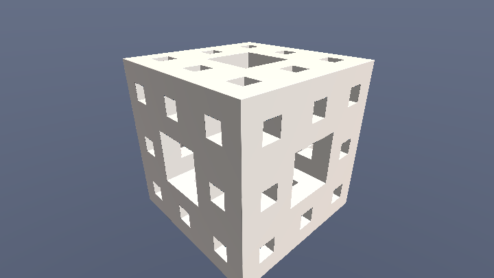

### KIFS 性能小技巧

- 旋转矩阵**提到循环外**预计算，别每迭代 `cos/sin`。  
- 排序折叠的 `if` 在部分 GPU 贵；对已 `abs` 的正分量可用 `max/min` 无分支改写。  
- DE 很保守 → 步数需求高；可用辉光糊远景（少步）或多分辨率 Buffer（Fractal Explorer）。

### 易错点

- 减十字时缩放与 `mod` 顺序反了 → 缝不对齐。
- KIFS 版迭代过多却不降 `Scale` → 细枝小于命中阈值，表面「消失」。
- 排序折叠顺序必须是 x-y、x-z、y-z，换序会漏排列产生不对称瑕疵。

---

## 11.9 反演与 Apollonian

球反演 \(p \mapsto p\,/\,|p|^2\) 把「穿过球的直线」变成圆，是 Kleinian / Apollonian 垫片的引擎。

> 📄 出自 `000263-4ds3zn-Apollonian/image.glsl`（iq）

<!-- glsl-skip -->
```glsl
float map(vec3 p, float s) {
    float scale = 1.0;
    orb = vec4(1000.0);
    for (int i = 0; i < 8; i++) {
        p = -1.0 + 2.0 * fract(0.5 * p + 0.5); // 盒折叠
        float r2 = dot(p, p);
        orb = min(orb, vec4(abs(p), r2));       // orbit trap
        float k = s / r2;                       // 球反演缩放
        p *= k;
        scale *= k;
    }
    return 0.25 * abs(p.y) / scale;             // 平面图元 / scale
}
```

读懂三件事：`fract` 盒折叠、`s/r2` 反演、返回时 `/scale`。`orb` 四通道 trap 直接驱动上色——全语料通用范式。变体：`000074-llKXzh-Apollonian_II`、`000225-Wl3fzM-Apollian_with_a_twist`（mrange）。

Mandelbox 的 sphereFold 本质是「带内核保护的球反演」：半径过小先推开，再反演，避免导数爆炸。

### 易错点

- `r2` 接近 0 不保护 → Inf。
- 终端图元用 `length(p)` 却场景要「薄片」——试 `abs(p.y)`。
- 反演后不除 `scale` → 当普通 SDF 用必穿模。

---

## 11.10 Sierpinski 与其它折叠亲戚（速览）

| 路线 | 思想 | 代表 |
|---|---|---|
| 最近顶点 | 反复映到最近单纯形顶点再缩放 | iq Sierpinski |
| 条件交换折叠 | 类似 Menger 的轴排序 | 标准 DE 写法 |
| 2D 地毯高度图 | 平面迭代当高度 | 地形拼贴 |

与 KIFS 共用「折进基本域再除 scale」；差别只在折叠群的生成元（三角形 vs 立方）。

---

## 11.11 双曲几何概要

欧氏折叠之外，语料还有一支**非欧镶嵌**：

- **Poincaré 圆盘**：把双曲平面画进单位圆，测地线是正交于边界的圆弧；`{N,Q}` 镶嵌用圆反射生成（Shane `000152-mlGfzV-Poincaré_Disc_Animation`）。
- **Coxeter 群极限集**：反复反射后的边界点云（`000182-NstSDs-Hyperbolic_Group_Limit_Set`）。
- **Möbius / Droste**：复对数与反演把「无限缩小」变成可动画的螺旋（Escher、`000158-Mdf3zM`）。

对做效果而言，记住：

> 双曲 shader ≈ **在圆/球里做反射群折叠**，再用欧氏屏幕坐标着色；距离要用双曲度量或仅作 2D 图案。

深入非欧前，先把 KIFS 与 Apollonian 跑熟——镜子群的直觉是通的。

---

## 11.12 家族 C：Kali 式体积分形

不追踪 DE，循环里累积 `min` 长度或陷阱值，沿射线固定步长加法线/发光：

- `001157-XlfGRj-Star_Nest`：fold-and-accumulate 教科书；
- `000240-lslGWr-Simplicity` / `000604-MslGWN-Simplicity_Galaxy`：极简版；
- `000284-NlsXDH-Exit_the_Matrix`：同一语法的矩阵感。

它和第 10 章体积积分接轨：密度来自分形迭代，而不是 fbm。

> 📄 Star Nest 心智模型（合成说明）

```
for 迭代:
    p = abs(p) / dot(p,p) - 偏移     # 折叠+反演
    累积 += 某种 length/trap
沿射线积分该累积当发光/密度
```

**决策**：要表面碰撞、软阴影、AO → 必须家族 A/B 的 DE；只要发光隧道/星尘 → 家族 C 更便宜更好看。

---

## 11.13 折叠语法速查卡（现场改形用）

把语料里反复出现的「一句折叠」收成卡片——改形时只换其中一行：

| 折叠 | 代码骨架 | 视觉 |
|---|---|---|
| 卦限镜像 | `p = abs(p)` | 八分之一万花筒 |
| 排序（Menger） | `if(p.x<p.y)p.xy=p.yx;` … | 立方对称海绵 |
| 盒折 | `p = 2.*clamp(p,lo,hi)-p` | 直角建筑感 |
| 无分支盒折 | `p=abs(p+c)-abs(p-c)-p` | Kali 2D/地形常用 |
| 球反演 | `p *= s/dot(p,p)` | 圆腔、Apollonian |
| 保护球折 | `p *= clamp(1/r2, 1, 1/minR2)` | Mandelbox 内核 |
| 周期折 | `p = abs(1.-mod(p,2.))` | 平铺迷宫 |
| 位似 | `p = s*p - offset*(s-1)` | 自相似树枝 |

**组合顺序很重要**：标准 Mandelbox 是 box → sphere → scale；对调会得到「另一个分形」，不是 bug，但别指望复现参考图。

### 动画旋钮从哪拧

1. 旋转折叠前的 `p.xy`（打破对称 → 有机蠕动）；  
2. `Offset` 随时间轻微摆动（枝间距呼吸）；  
3. 终端图元半径脉冲（整体胀缩）；  
4. 家族 C：偏移向量绕动（Star Nest 星尘流动）。  

避免每帧改 `Scale` 跨越稳定区——DE 尺度突变会导致整屏闪烁。

---

## 11.14 常见坑总表

| 症状 | 原因 | 修法 |
|---|---|---|
| 表面痤疮/穿模 | DE 高估或未 `/scale` | 安全因子；检查累积缩放 |
| 细节「消失」 | 命中阈值 > 枝粗 | 减小 eps 或增大 Scale 厚度 |
| 中心爆炸 NaN | 反演 `r2→0` | `clamp(r2, minR2, …)` |
| 颜色与形状脱节 | 没用 trap / 用了最后一次 p | `orb = min(orb, …)` |
| 极慢 | 集合内部满迭代；无 LOD | 卡片早退；远处减迭代 |
| 家族混搭失败 | C 的累积当 DE | 先判有没有 `/dr` |

---

## 11.15 实战步骤

1. **2D**：Mandelbrot 平滑着色 → 加上 DE 画等高线（`000141` → `000188`）。  
2. **上色**：给任意逃逸循环加 `vec4 trap = min(...)`，用两层 `mix` 出金属感。  
3. **KIFS**：抄 `000270-Mdf3z7-Menger_Journey`，只改 `Scale`/`Offset`/旋转，观察造型。  
4. **换终端图元**：球 → 盒 → `abs(p.y)` 平面，体会「同一折叠、不同皮肉」。  
5. **反演**：精读 Apollonian 八行循环；故意去掉 `/scale` 看崩坏。  
6. **Mandelbox**：跑 Sweeper 骨架，拧 `MinRad2` 与负 `Scale`。  
7. **体积旁支**：Star Nest，接到第 10 章积分壳。  
8. **挑战**：Mandelbulb 相机飞穿（mrange）或 Fractal Land 地形。

### 性能对照（直觉）

| 类型 | 单次 map 贵在 | 优化 |
|---|---|---|
| Mandelbulb | `pow/atan/acos` | 迭代 4；远处降 power |
| Mandelbox / KIFS | 迭代次数 | 4~8；多分辨率 Buffer |
| 家族 C | 体积步数 × 迭代 | 固定低步数 + 加法发光 |
| 2D 逃逸 | 像素满迭代 | 卡片早退、平滑后降 max iter |

### 着色与造型分离（工程习惯）

分形 shader 变慢，常常是因为在 `map` 里既算 DE 又算复杂颜色。习惯拆成：

1. `map(p)` **只返回距离**（可附带 `out vec4 trap`）；  
2. 命中后用 trap / 世界坐标做一次着色；  
3. 软阴影 / AO 只调用「瘦」`map`，不要走完整 palette。  

iq Mandelbulb 的 `out vec4 resColor` 就是这个模式：循环内 `trap = min(...)`，循环外再上色。

### 何时该放弃 DE

- 你其实只想要发光隧道 / 星尘 → 直接家族 C + 第 10 章积分；  
- DE 安全因子已经小到「几乎在做固定步长」→ 固定步长体积可能更简单；  
- 需要布尔出精确机械零件 → 解析 CSG（第 12 章）比硬折 KIFS 干净。

---

## 11.16 推荐阅读顺序

1. `000141-4df3Rn-Mandelbrot_-_smooth`  
2. `000188-lsX3W4-Mandelbrot_-_distance`  
3. `000270-Mdf3z7-Menger_Journey`  
4. `000263-4ds3zn-Apollonian`（折叠+反演+trap 三联）  
5. `000126-ltfSWn-Mandelbulb_-_derivative`  
6. Mandelbox 任选 + `001157-XlfGRj-Star_Nest`  
7. `001066-XsBXWt-Fractal_Land`（造型语法自由发挥）

---

## 11.17 阶梯实战：一张 Mandelbrot 长成片

11.15 是语料阅读路线；这一节是**同一套公式从灰阶到作品的七步**。

文件在 `shader-handbook/examples/ch11_stage1..7.glsl`。

### 阶段 1：最朴素的 Mandelbrot

逃逸迭代次数直接当灰度。

#### 可跑精读 · Mandelbrot 整数迭代（条带）

逃逸时间入口：每个像素当 c，迭代 z→z²+c，用整数迭代次数上色。会看到一圈圈同色条带——先把骨架跑通，平滑是下一阶段的药。

**思路拆解**

1. z 用 vec2 模拟复数乘法。
2. dot(z,z)>bailout 逃逸。
3. fragColor 直接映射迭代次数 n。
4. 内部（跑满）单独着深色。

**关键旋钮**

| 旋钮 | 感觉 |
|---|---|
| 最大迭代 | 边界细节 vs 成本 |
| 视野中心/缩放 | 探索位置 |
| bailout | 逃逸阈值 |

**动手改（建议按序）**

1. 改成 Julia：固定 c，z0=像素。
2. 缩小视野怼边界，看条带变密。
3. 下一步开平滑（stage2）。

**易错点**

- 内部不早退 → 整屏最贵。
- uv 没按 y 归一 → 椭圆集合。

<!-- glsl-from: examples/ch11_stage1.glsl -->
```glsl
float mandel(vec2 c)
{
    vec2  z = vec2(0.0);
    float n = 0.0;
    for (int i = 0; i < MAX_ITER; i++)
    {
        // z ← z² + c。复数平方 (x+yi)² = (x²-y²) + 2xy·i，GLSL 没有复数，用 vec2 手写
        z = vec2(z.x * z.x - z.y * z.y, 2.0 * z.x * z.y) + c;
        // dot(z,z) 就是 |z|²，比 length(z) 省一次 sqrt。整个循环里最该省的就是它
        if (dot(z, z) > BAILOUT * BAILOUT) break;
        n += 1.0;
    }
    return n;
}

    float n   = mandel(c);
    vec3  col = vec3(n / float(MAX_ITER));   // 迭代次数直接当亮度
```

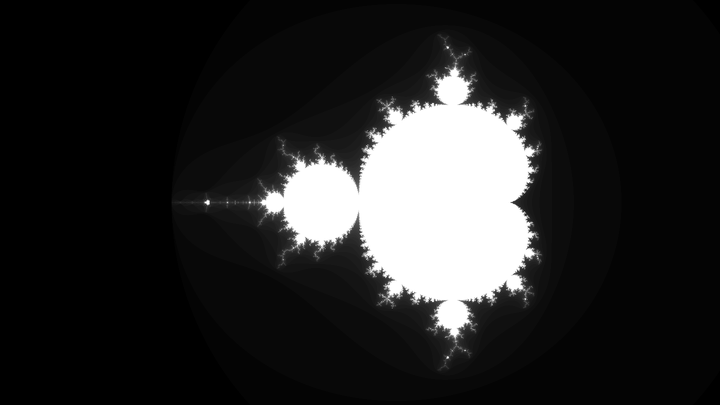


### 阶段 2：平滑迭代数

去掉整数条带，连续的 `n` 才能上色。

#### 可跑精读 · 平滑迭代数

只改 mandel() 返回值后的那一行着色：BAILOUT 提到 256，并用 log2(log2) 平滑，条带消失。函数体几乎不动。

**思路拆解**

1. 逃逸后 sn = n - log2(log2(|z|²)) + const。
2. 用 sn 而非整数 n 查色。
3. B 取大才数值稳定。

**关键旋钮**

| 旋钮 | 感觉 |
|---|---|
| B（bailout） | 平滑质量 |
| 调色板频率 | 条纹密度 |
| 迭代上限 | 深钻细节 |

**动手改（建议按序）**

1. 关掉平滑对比条带。
2. B=2 看平滑变差。
3. 接入 stage3 调色板。

**易错点**

- B=2 时平滑公式数值差。
- 对未逃逸点仍套平滑 → 脏边。

<!-- glsl-from: examples/ch11_stage2.glsl -->
```glsl
float mandel(vec2 c)
{
    vec2  z  = vec2(0.0);
    float n  = 0.0;
    float m2 = 0.0;                  // 【新增】把逃逸那一刻的 |z|² 留住
    for (int i = 0; i < MAX_ITER; i++)
    {
        z  = vec2(z.x * z.x - z.y * z.y, 2.0 * z.x * z.y) + c;
        m2 = dot(z, z);
        if (m2 > BAILOUT * BAILOUT) break;
        n += 1.0;
    }

    // 【新增】没逃逸的点必须在这里截住。它的 |z| 还在 2 以内，m2 可能小于 1，
    // log2(m2) 就是负数，再套一层 log2 直接得到 NaN。少了这一行，
    // 集合内部会变成一片随驱动而异的雪花/纯白/纯黑 —— 这个坑几乎人人踩一次。
    if (n >= float(MAX_ITER)) return -1.0;

    // 【新增】平滑迭代数：把"第几次逃逸"从整数补成实数。
    // |z| 是双指数增长的（|z_{n+1}| ≈ |z_n|²），所以 log2(log2|z|) 每迭代一次
    // 才增加 1 —— 它恰好度量了"这一步走了多远"的小数部分。
    // 末尾 +4.0：逃逸瞬间 m2 ≈ 256² = 65536，log2 得 16，再 log2 得 4，
    // 正好抵消，于是 sn 在逃逸阈值处平滑接上 n，不产生跳变。
    return n - log2(log2(m2)) + 4.0;
}

    float sn  = mandel(c);
    // max(sn, 0.0) 一手包办两件事：哨兵 -1 变 0（内部纯黑），
    // 以及第 0 次就逃逸的远处点算出的轻微负值也归零
    vec3  col = vec3(max(sn, 0.0) / float(MAX_ITER));
```

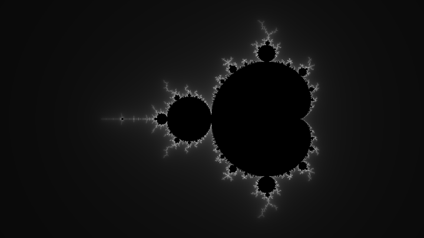


### 阶段 3：余弦调色板

`pal(n)` 接上第 4 章。

#### 可跑精读 · 调色板着色

mandel() 一行没动，只把灰度换成 palette——一张「自己会渐变」的海报。

**思路拆解**

1. sn 进 pal(t)=a+b*cos(2π(c*t+d))。
2. 内外可两套调色。
3. 可乘边缘高光。

**关键旋钮**

| 旋钮 | 感觉 |
|---|---|
| palette 相位 | 主色调 |
| 频率 | 彩虹密度 |
| 对比/伽马 | 海报感 |

**动手改（建议按序）**

1. 改 cos 相位成冷色。
2. 内部单独色。
3. 对照 stage4 trap 纹理。

**易错点**

- 只改色不改几何时别误以为「更清晰」。

<!-- glsl-from: examples/ch11_stage3.glsl -->
```glsl
vec3 pal(float t)
{
    return vec3(0.42, 0.40, 0.42)
         + vec3(0.44, 0.42, 0.48)
         * cos(TAU * (vec3(1.00, 0.92, 0.78) * t + vec3(0.52, 0.42, 0.28)));
}

float mandel(vec2 c)
{
    vec2  z  = vec2(0.0);
    float n  = 0.0;
    float m2 = 0.0;
    for (int i = 0; i < MAX_ITER; i++)
    {
        z  = vec2(z.x * z.x - z.y * z.y, 2.0 * z.x * z.y) + c;
        m2 = dot(z, z);
        if (m2 > BAILOUT * BAILOUT) break;
        n += 1.0;
    }
    if (n >= float(MAX_ITER)) return -1.0;
    return n - log2(log2(m2)) + 4.0;
}

    vec3 col = pal(sqrt(max(sn, 0.0)) * 0.28);

    // 【新增】哨兵 -1 → 集合内部仍然压成纯黑。下一阶段专门来救它。
    col *= step(0.0, sn);
```

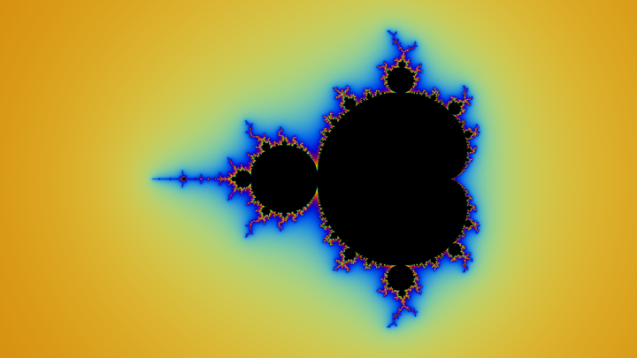


### 阶段 4：轨道陷阱

迭代里盯住「离某点最近的一次」。

#### 可跑精读 · 轨道陷阱（orbit trap）

前三阶段内部只是一块黑。陷阱在循环内 min 累积：轨道离原点最近、离坐标轴最近——内部立刻长出纹理。

**思路拆解**

1. 循环内 trap = min(trap, vec2(|z|², min(|x|,|y|)))。
2. 内色用 trap 查 pal；外色轻调制。
3. 陷阱要用运行中的最小值，不是最后的 z。

**关键旋钮**

| 旋钮 | 感觉 |
|---|---|
| trap 目标 | 斑纹结构 |
| 内外混合 | 谁当主角 |
| trap 映射曲线 | 对比 |

**动手改（建议按序）**

1. 去掉 trap 调制，内部变回死黑。
2. 只显示 trap.y（十字）。
3. 动画 trap 权重。

**易错点**

- trap 初值要用大数。
- 用错成最终 z → 色与形脱节。

<!-- glsl-from: examples/ch11_stage4.glsl -->
```glsl
vec3 pal(float t)
{
    return vec3(0.42, 0.40, 0.42)
         + vec3(0.44, 0.42, 0.48)
         * cos(TAU * (vec3(1.00, 0.92, 0.78) * t + vec3(0.52, 0.42, 0.28)));
}

float mandel(vec2 c, out vec2 trap)
{
    vec2  z  = vec2(0.0);
    float n  = 0.0;
    float m2 = 0.0;
    trap = vec2(1e10);               // 【新增】用 min 累积，所以初值必须够大
    for (int i = 0; i < MAX_ITER; i++)
    {
        z  = vec2(z.x * z.x - z.y * z.y, 2.0 * z.x * z.y) + c;
        m2 = dot(z, z);
        // 【新增】陷阱在【循环内】用 min 累积。着色时用的是这个最小值，
        // 而不是循环结束时最后那个 z —— 用错的话颜色和形状会完全脱节。
        trap = min(trap, vec2(m2, min(abs(z.x), abs(z.y))));
        if (m2 > BAILOUT * BAILOUT) break;
        n += 1.0;
    }
    if (n >= float(MAX_ITER)) return -1.0;
    return n - log2(log2(m2)) + 4.0;
}

    vec2  trap;
    float sn = mandel(c, trap);

    // 【新增】内部：轨道最接近原点的距离当调色板坐标。
    // 主心形里轨道收敛到一个不动点，|z*| 从 0 平滑长到 0.5；各个周期泡里
    // 轨道变成环，最小值跳一档 —— 于是每个泡自己一个颜色，结构全出来了。
    float tr    = sqrt(trap.x);
    vec3  inCol = pal(0.30 + 1.30 * tr) * (0.20 + 0.80 * smoothstep(0.0, 0.16, trap.y));
    inCol *= 0.55;                   // 内部压暗，主角还是边界

    // 【新增】外部：同一个十字陷阱当细纹调制，幅度很轻（0.75 → 1.15）
    vec3 exCol = pal(sqrt(max(sn, 0.0)) * 0.28);
    exCol *= 0.75 + 0.40 * smoothstep(0.0, 0.30, trap.y);

    vec3 col = mix(exCol, inCol, step(sn, -0.5));
```

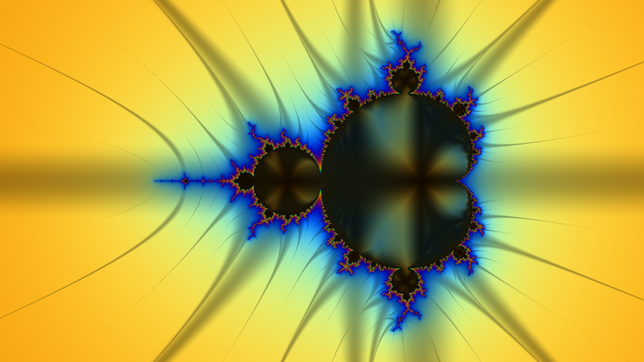


### 阶段 5：距离估计 → 描边与发光

DE 让边界可以描边、发光。

#### 可跑精读 · 距离估计 DE + 边缘发光

循环里同步累乘导数 z′，逃逸后估「像素到集合有多远」。描边和晕光都变好做，线宽可按像素稳。

**思路拆解**

1. 并行迭代 z 与 dz（或等价缩放）。
2. dist ≈ |z|log|z|/|dz|。
3. soft = smoothstep(0,w,dist) 做边缘。

**关键旋钮**

| 旋钮 | 感觉 |
|---|---|
| 边缘宽度 w | 发光描边 |
| 迭代次数 | DE 可信区 |
| 缩放级别 | 深钻稳定性 |

**动手改（建议按序）**

1. 用 DE 做黑底白线海报。
2. 对比 stage1 纯迭代色。
3. 深钻时注意 float 精度。

**易错点**

- 忘了累乘 2z → DE 比例错。
- 深钻崩 → 噪点碎形。

<!-- glsl-from: examples/ch11_stage5.glsl -->
```glsl
vec3 pal(float t)
{
    return vec3(0.42, 0.40, 0.42)
         + vec3(0.44, 0.42, 0.48)
         * cos(TAU * (vec3(1.00, 0.92, 0.78) * t + vec3(0.52, 0.42, 0.28)));
}

float mandel(vec2 c, out vec2 trap, out float de)
{
    vec2  z  = vec2(0.0);
    vec2  dz = vec2(0.0);            // 【新增】z 对 c 的导数，也是复数
    float n  = 0.0;
    float m2 = 0.0;
    trap = vec2(1e10);
    for (int i = 0; i < MAX_ITER; i++)
    {
        // 【新增】z' ← 2·z·z' + 1。必须【先】更新 dz、【后】更新 z，
        // 因为链式法则里用的是这一步之前的 z。顺序写反 → 距离整体偏大，
        // 描边会离边界浮开一点点，很难一眼看出来。
        dz = 2.0 * vec2(z.x * dz.x - z.y * dz.y,
                        z.x * dz.y + z.y * dz.x) + vec2(1.0, 0.0);
        z  = vec2(z.x * z.x - z.y * z.y, 2.0 * z.x * z.y) + c;
        m2 = dot(z, z);
        trap = min(trap, vec2(m2, min(abs(z.x), abs(z.y))));
        if (m2 > BAILOUT * BAILOUT) break;
        n += 1.0;
    }
    // 【新增】d ≈ |z|·log|z| / |z'|（Green 势除以它的梯度，见 11.3）。
    // 写成 |z|² 的形式可以省掉一次 sqrt：0.5·sqrt(m2/|dz|²)·log(m2)
    de = 0.5 * sqrt(m2 / max(dot(dz, dz), 1e-20)) * log(m2);

    if (n >= float(MAX_ITER)) return -1.0;
    return n - log2(log2(m2)) + 4.0;
}

    float de;
    float sn = mandel(c, trap, de);

    float tr    = sqrt(trap.x);
    vec3  inCol = pal(0.30 + 1.30 * tr) * (0.20 + 0.80 * smoothstep(0.0, 0.16, trap.y));
    inCol *= 0.55;

    vec3 exCol = pal(sqrt(max(sn, 0.0)) * 0.28);
    exCol *= 0.75 + 0.40 * smoothstep(0.0, 0.30, trap.y);

    float outside = 1.0 - step(sn, -0.5);
    vec3  col     = mix(inCol, exCol, outside);

    // 【新增】把距离换算成【像素】单位。px 是一个像素在复平面上的边长；
    // dp 就是"离边界几个像素"。这一步让描边宽度与分辨率、缩放全都无关 ——
    // 这是解析抗锯齿，比超采样便宜得多，而且永远不会糊。
    float px = 2.0 * HALF_H / iResolution.y;
    float dp = de / px;

    // 【新增】描边：贴着边界的 2 个像素
```

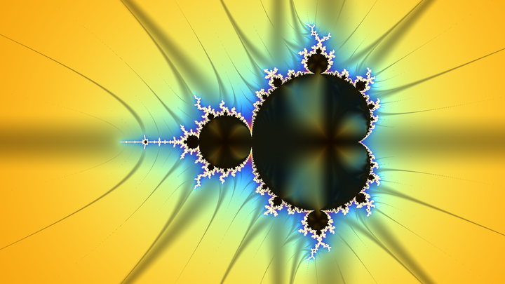


### 阶段 6：缓慢缩放 + 自适应迭代

越进细节迭代上限越高。

#### 可跑精读 · Julia + 自适应迭代

固定幂次让 c 随时间转；同时按缩放提高迭代——放大后边界仍锐。

**思路拆解**

1. c = r*(cos t, sin t)（或路径）。
2. 像素作 z0。
3. iter 随 zoom 增加。

**关键旋钮**

| 旋钮 | 感觉 |
|---|---|
| |c| 半径 | 连通/炸裂 |
| 角速度 | 催眠速度 |
| 自适应斜率 | 细处预算 |

**动手改（建议按序）**

1. |c| 从 0.7 扫到 1.1。
2. 关掉自适应看「糊边」。
3. 加 DE 描边。

**易错点**

- 转速过快闪；混用固定/自适应迭代要一致。

<!-- glsl-from: examples/ch11_stage6.glsl -->
```glsl
float mandel(vec2 c, int lim, out vec2 trap, out float de)
{
    vec2  z  = vec2(0.0);
    vec2  dz = vec2(0.0);
    float n  = 0.0;
    float m2 = 0.0;
    trap = vec2(1e10);
    for (int i = 0; i < MAX_ITER; i++)
    {
        if (i >= lim) break;
        dz = 2.0 * vec2(z.x * dz.x - z.y * dz.y,
                        z.x * dz.y + z.y * dz.x) + vec2(1.0, 0.0);
        z  = vec2(z.x * z.x - z.y * z.y, 2.0 * z.x * z.y) + c;
        m2 = dot(z, z);
        trap = min(trap, vec2(m2, min(abs(z.x), abs(z.y))));
        if (m2 > BAILOUT * BAILOUT) break;
        n += 1.0;
    }
    de = 0.5 * sqrt(m2 / max(dot(dz, dz), 1e-20)) * log(m2);

    if (n >= float(lim)) return -1.0;   // 【改】和动态上限比，不再和 MAX_ITER 比
    return n - log2(log2(m2)) + 4.0;
}

    int lim = int(min(float(MAX_ITER), 64.0 + 26.0 * log2(HALF_H0 / halfH)));

    vec2  trap;
    float de;
    float sn = mandel(c, lim, trap, de);

    float tr    = sqrt(trap.x);
    vec3  inCol = pal(0.30 + 1.30 * tr) * (0.20 + 0.80 * smoothstep(0.0, 0.16, trap.y));
    inCol *= 0.55;

    vec3 exCol = pal(sqrt(max(sn, 0.0)) * 0.28);
    exCol *= 0.75 + 0.40 * smoothstep(0.0, 0.30, trap.y);

    float outside = 1.0 - step(sn, -0.5);
    vec3  col     = mix(inCol, exCol, outside);

    // 【改】px 现在跟着 halfH 变。因为描边宽度是按像素给的，
    // 放大过程中描边始终是 2 像素粗，不会随缩放变胖变瘦
    float px = 2.0 * halfH / iResolution.y;
    float dp = de / px;
```

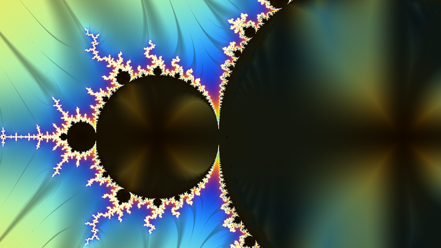


### 阶段 7：打磨

暗角、软膝、抖动——和前几章同一套收尾。

#### 可跑精读 · 2D 分形打磨

数学一行没换：同 z²+c、同平滑、同陷阱、同 DE。变化全在后期——局部曝光、内部透视、晕光、软膝。

**思路拆解**

1. 保留 stage4/5 核。
2. 加 vignette / glow / contrast。
3. 轻微动画相机。

**关键旋钮**

| 旋钮 | 感觉 |
|---|---|
| 曝光 | 整体 |
| 晕光半径 | 梦幻 |
| 暗角 | 聚焦 |

**动手改（建议按序）**

1. Solo 关掉后期看素核。
2. 只开 DE 描边。
3. 准备进 3D（stage8）。

**易错点**

- 先 tonemap 再加 glow 会脏。

<!-- glsl-from: examples/ch11_stage7.glsl -->
```glsl
vec3 softKnee(vec3 c)
{
    const float K = 0.80;
    vec3 hi = max(c - K, 0.0);
    return min(c, vec3(K)) + (1.0 - K) * (1.0 - exp(-hi / (1.0 - K)));
}

    col = softKnee(col);

    // --- 抖动：抹掉 8-bit 量化在大片平缓渐变上留下的色带 ---
    col += (fract(sin(dot(fragCoord, vec2(12.9898, 78.233))) * 43758.545) - 0.5) / 255.0;
```

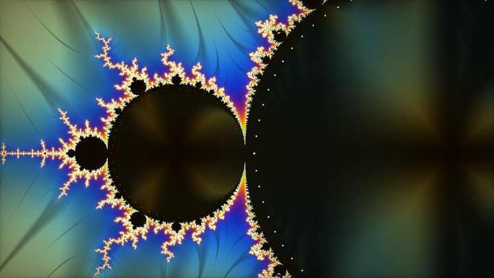


### 回头看这个过程

| 阶段 | 新增 | 对应 |
|---|---|---|
| 1 | 逃逸时间 | 11.2 |
| 2 | 平滑迭代 | 11.2 |
| 3 | pal | 第 4 章 |
| 4 | orbit trap | 11.5 |
| 5 | DE 描边发光 | 11.3 |
| 6 | 缩放 + 自适应 | 11.14 |
| 7 | 打磨 | 第 4 章 |

下一步把同一管线套到 Julia（只改 `c` 的来源），或跳进 Mandelbulb（11.4）。

---

## 11.18 阶梯实战 B：从十字挖洞到 Mandelbulb

Mandelbrot 上色线见 11.17。这里开一条**3D 分形**渐进线——难例前面都有「看结构」的中间步：

| 阶段 | 文件 | 看点 |
|---|---|---|
| 8 | `ch11_stage8` | Menger **2 次**迭代（大十字清晰） |
| 9 | `ch11_stage9` | Menger **4 次** + AO/陷阱色 |
| 10 | `ch11_stage10` | **Mandelbulb**（较难） |
| 11 | `ch11_stage11` | KIFS 四面体折叠洞窟 |

stage8 嵌在 **11.8**，stage11 嵌在 **11.6**。这里补上加密步与 Mandelbulb：

### 阶段 9：Menger 加密

#### 可跑精读 · Menger 加深 + AO

在 stage8 十字掏空后加层数，并上廉价 AO 与金属感着色，海绵才「能逛」。

**思路拆解**

1. 迭代加到 4～5。
2. AO 沿法线短采样。
3. 着色区分内外腔。

**关键旋钮**

| 旋钮 | 感觉 |
|---|---|
| 迭代 | 洞代数 |
| AO 半径 | 缝暗 |
| 金属/雾 | 氛围 |

**动手改（建议按序）**

1. 从 2 加到 4 盯性能。
2. 关 AO 对比。
3. 飞进洞看漏面。

**易错点**

- 过高迭代 + 步数不够 → 破洞。

<!-- glsl-from: examples/ch11_stage9.glsl -->
```glsl
// mengerDE(p, 4) + AO + trap 着色
```

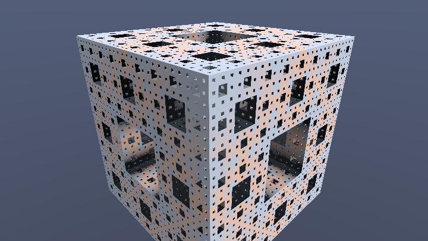

### 阶段 10：Mandelbulb（较难）

球坐标里把角度乘 power——「三维平方」。相机别贴太近。

#### 可跑精读 · Mandelbulb（球坐标幂）

把复平面 power 升到 3D：球坐标 r^p、θ·p、φ·p。与 Menger 的折叠语言完全两路——有机刺球。

**思路拆解**

1. 笛卡尔→球坐标→乘幂→加 c。
2. 带 dr 的 DE。
3. 法线差分 + 雾。

**关键旋钮**

| 旋钮 | 感觉 |
|---|---|
| power | 花瓣/尖刺 |
| 迭代 | 细节 vs 破洞 |
| 相机半径 | 整体可读 |

**动手改（建议按序）**

1. power 8→4 变圆润。
2. 迭代 4→10 看长刺。
3. 对照 stage8 建筑感。

**易错点**

- 球坐标奇异轴要护栏。
- DE 漏除 dr → 缩放错。

<!-- glsl-from: examples/ch11_stage10.glsl -->
```glsl
// power-8 Mandelbulb DE，迭代 7（可调到 8～10）
```

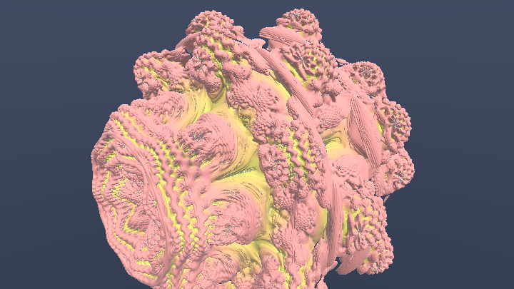

**延展**：Mandelbulb 的 power 改成 6/9；Menger 改成「只挖一个轴向」看结构变化。

## 课间餐点 · 分形万花筒：从条带到洞窟感

> 阶梯练零件；这里把本章词汇一次端上桌。约 2 分钟看完一轮自动轮播——像课间买的糖，甜，但糖纸上写满了今天的知识点。

整数条带 → 平滑 → 调色板 → orbit trap → Julia 变形。2D 分形章的爽点压缩成五幕轮播。

**怎么玩**

- **自动**：每约 2.75 秒解锁下一阶段，循环播放「从零长到成片」。
- **手动**：按住鼠标左右拖，scrub 阶段（底部黄条是进度）。
- **对照**：每阶段只多一样本章技法，看画面哪一帧突然「像了」。

**五幕菜单**

1. **整数迭代条带**
2. **平滑迭代**
3. **调色板**
4. **orbit trap 纹理**
5. **Julia 动画成片**

**关键旋钮**

| 旋钮 | 感觉 |
|---|---|
| 迭代次数 | 细节 |
| c 半径 | Julia 炸裂 |
| trap 权重 | 内部花纹 |

**动手改**

1. 把 `STAGE_SEC` 改成 `1.2`，快进看结构。
2. 卡在最后一阶段（鼠标拖到最右），只调一个旋钮。
3. 回到本章对应 `stage` 小例，找到餐点里同名技法的「零件版」。

<!-- glsl-from: examples/ch11_snack.glsl -->
```glsl
// snackStage() 解锁图层 · 底部黄条 = 当前阶段 · 鼠标拖拽 scrub
```

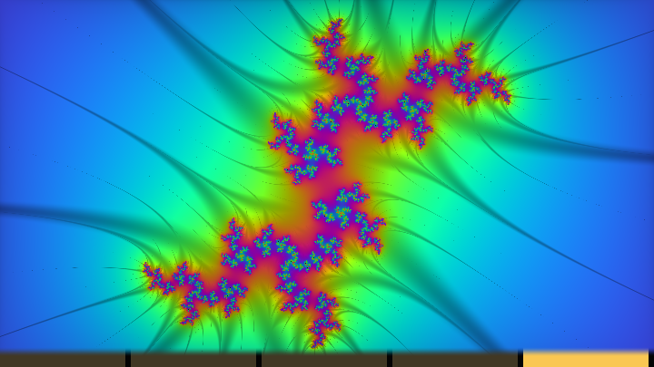

## 本章要点回顾

- 先判家族：**逃逸时间 / 折叠 IFS / 体积噪声**，机制不同，代码不能乱拼。
- Mandelbrot/Julia = 复数迭代；平滑迭代数去条带；DE = \(|z|\log|z|/|z'|\)。
- Mandelbulb = 球坐标 power 映射 + 同步 `dr`；DE 乘安全因子。
- **造型母法**：`fold → scale → translate` 循环，返回 `primitive/totalScale`。
- Mandelbox = boxFold + sphereFold；`vec4.w` 跟踪缩放是实用技巧。
- Menger 可走 CSG 减十字或 KIFS；Apollonian = 盒折叠 + 球反演。
- **Orbit trap** 是分形上色母法；家族 C 不做 DE 而做体积，接第 10 章。
- 双曲 / Möbius 是反射群在圆盘里的变体——镜子直觉与 KIFS 相通。

---

> 上一章：[第 10 章 · 体积与大气](10-体积与大气.md) 　|　 下一章：[第 12 章 · 光追与 GI](12-光追与GI.md)
