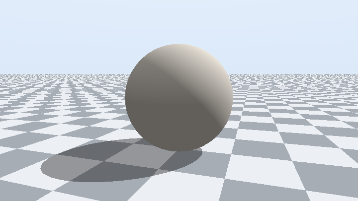
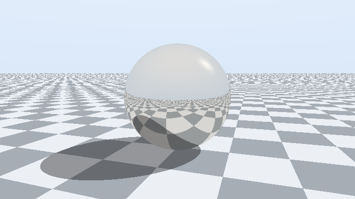
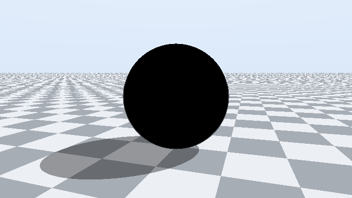
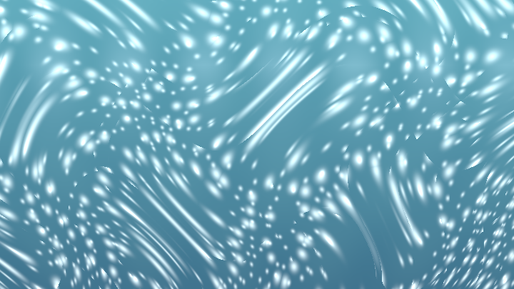
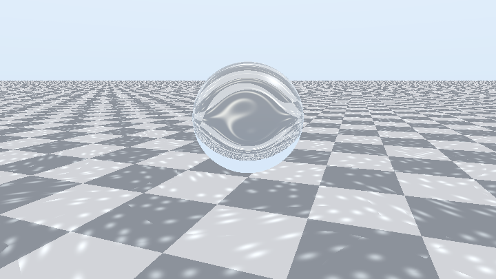
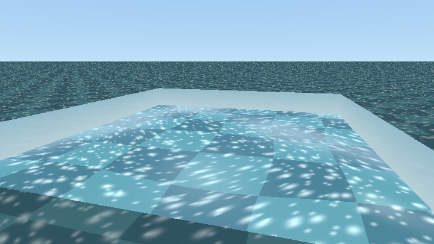
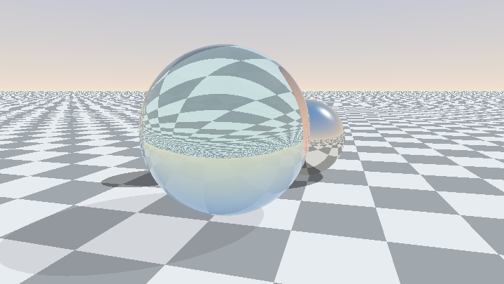
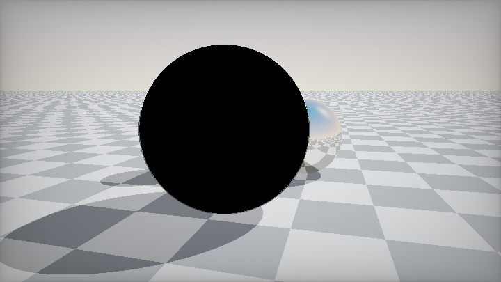

# 第 12 章 · 光线追踪与全局光照

> Raymarching 用距离场「摸」表面；经典光追用方程「解」表面；路径追踪则在表面上不断散射，用噪声换正确的间接光。
>
> Shadertoy 没有递归、有 Buffer 与 `iFrame`——这两点决定了本章所有套路的形状。语料根目录：`shaders/shaders/`（已确认存在）。

---

## 12.1 解析求交 vs Raymarch：怎么选

光线：\(p(t)=\mathrm{ro}+t\cdot\mathrm{rd}\)，\(t\ge 0\)。  
求交 = 把 \(p(t)\) 代入隐式曲面 \(F(p)=0\)，解一元方程。

| \(F\) 的次数 | 形状 | 解法 |
|---|---|---|
| 1 | 平面 | 一次除法 |
| 2 | 球、柱、锥、椭球 | 二次方程 |
| 分片线性 | AABB / 凸盒 | slab 区间 |
| 4 | 圆环等 | 四次（重） |
| 任意 SDF | 有机形、分形 | **只能 raymarch** |

**解析求交的优点**：常数时间、精确 \(t\)、解析法线、掠射角不爆步数。  
**代价**：只能是「你写得出式子」的形状；复杂布尔要区间 CSG。

> 📄 球求交朴素式——`000087-4d2XWV-Sphere_-_soft_shadow/image.glsl`（iq）

<!-- glsl-skip -->
```glsl
float sphIntersect(in vec3 ro, in vec3 rd, in vec4 sph) {
    vec3 oc = ro - sph.xyz;
    float b = dot(oc, rd);
    float c = dot(oc, oc) - sph.w * sph.w;
    float h = b * b - c;
    if (h < 0.0) return -1.0;
    return -b - sqrt(h); // 近根（rd 已单位化）
}
```

图元库精读：`000218-tl23Rm-Ray_Tracing_-_Primitives`（reinder）。布尔区间：`000093-mlfGRM-Raytracing_Booleans`（iq）。

**先跑起来**：解析地面 + 球、Lambert、硬阴影——这就是「不解距离场、直接解方程」的成片味道。

#### 可跑精读 · 解析求交 + 硬阴影

光追入门可以先不 raymarch：平面与球用解析 t，取最近命中。阴影 = 从着色点再朝太阳打一条射线。

**思路拆解**

1. `iPlane` / `iSphere` 返回 t（无命中为 -1）。
2. `map` 选最小正 t，带材质 ID。
3. 着色：Lambert；硬阴影：`inShadow` 再求交。

**关键旋钮**

| 旋钮 | 感觉 |
|---|---|
| 太阳方向 | 影长 |
| 球半径/高度 | 接触阴影 |
| 地面反照 | 对比 |

**动手改（建议按序）**

1. 关掉阴影函数，看变平。
2. 加第二颗球，练习最近 t。
3. 下一步再换金属反射（stage2）。

**易错点**

- 阴影射线自交：原点沿法线偏置。
- `rd.y≈0` 时平面要护栏。

<!-- glsl-from: examples/ch12_stage1.glsl -->
```glsl
float ts = iSphere(ro, rd, vec3(0.0,1.0,0.0), 1.0);
float tp = iPlane(ro, rd);
float sha = inShadow(pos, nor) ? 0.0 : 1.0;
```



### 决策表：解析还是 march？

| 场景 | 选型 | 说明 |
|---|---|---|
| 球/盒/平面/四边形灯 | **解析** | PT 场景默认 |
| smin 有机体、地形、分形 | **raymarch** | 写不出多项式 |
| 走廊盒子 + 细节 | **混合** | 解析主结构 + SDF 细节 |
| 软阴影/AO 只要「差不多」 | SDF + 球迹 | 第 7–9 章 |
| 要正确折射焦散 | 解析优先 | 稳定 \(t\) 利于雅可比 |

**选型口诀**：场景是球/盒/平面/四边形灯 → **解析**；有机体/地形/分形 → **raymarch**；混合很常见。

### 球求交再挖一层：内部出发与双交点

朴素式假设你在球外、只要近根。玻璃/介质追踪常从**球内**出发，此时近根 \(t_1<0\)，必须取远根：

> 📄 出自 `000066-4lfGWr-Bidirectional_path_tracer_2/image.glsl`（reinder）

<!-- glsl-skip -->
```glsl
float iSphere(in vec3 ro, in vec3 rd, in vec4 sph) {
    vec3 oc = ro - sph.xyz;
    float b = dot(oc, rd);
    float c = dot(oc, oc) - sph.w * sph.w;
    float h = b * b - c;
    if (h < 0.0) return -1.0;
    float s = sqrt(h);
    float t1 = -b - s;
    float t2 = -b + s;
    return t1 < 0.0 ? t2 : t1; // 内部出发时取远根
}
```

CSG / 布尔需要**近远两个交点 + 法线**（区间），见 `000093-mlfGRM-Raytracing_Booleans/common.glsl` 的 `Intersection` 返回。同一套球文件还常附赠解析软阴影与 AO：

> 📄 出自 `000087-4d2XWV-Sphere_-_soft_shadow/image.glsl`（iq）

<!-- glsl-skip -->
```glsl
// 廉价解析球软阴影（同文件 #else 分支思路）
// return (b>0.0) ? step(-0.0001,c) : smoothstep(0.0, 1.0, h*k/b);
float sphOcclusion(in vec3 pos, in vec3 nor, in vec4 sph) {
    vec3 r = sph.xyz - pos;
    float l = length(r);
    return dot(nor, r) * (sph.w * sph.w) / (l * l * l);
}
```

几何直觉：`h = b² - c` 即 \(r^2 - d_\perp^2\)；`h<0` ⇔ 垂距大于半径 ⇔ 不相交。法线 `(hit - center)/r` 已单位化，**不必再 normalize**（省一次 sqrt）。

---

## 12.2 常用解析图元（速查 + 坑）

你不必默写所有公式，但要知道「去哪抄、坑在哪」。语料枢纽：`000218-tl23Rm-Ray_Tracing_-_Primitives`。

| 图元 | 要点 | 常见坑 |
|---|---|---|
| 平面 | `t = -dot(n,ro-p0)/dot(n,rd)` | `dot(n,rd)≈0` 平行；注意法线朝向 |
| 球 | 二次方程；稳定式用 \(h=b^2-c\) | 未单位化 `rd`；远原点精度 |
| AABB slab | 三对平面区间求交 | 内外射线；`tmax<tmin` 判空 |
| 圆盘 | 平面交 + 半径判定 | 忘记局部 UV |
| 圆柱/胶囊 | 二次 + 端盖 | 无限柱 vs 有限段 |
| 圆锥 | 二次，注意斜边约束 | 端盖与侧面取近根 |
| 圆环 | 四次；凸性可砍根 | 重、易数值炸 |
| 三角形 | Möller–Trumbore | 背面剔除；共面精度 |

### 球：数值稳定意识

朴素式在 \(ro\) 很远时 \(b^2-c\) 会丢精度。生产代码常用「稳定求根」变体（见 Primitives 与 iq 文章）。Shadertoy 室内小场景朴素式通常够用。

### 盒：slab 心智

对每个轴算进入/离开 \(t\)，取 \(t_{\text{enter}}=\max(t_{\text{enter}})\)，\(t_{\text{exit}}=\min(t_{\text{exit}})\)。这与 CSG 区间布尔同一语言——见下一小节。

### CSG：把求交当成区间

> 📄 思路出自 `000093-mlfGRM-Raytracing_Booleans`（iq）

并/交/差不是对距离做 `min/max`，而是对**沿射线的占有区间**做布尔。这对解析图元组成机械零件极有用；SDF 的 `opSubtraction` 是另一条宇宙（第 8 章）。

心智模型：

```
每个图元 → 沿 rd 的 [t_enter, t_exit]（可空）
并集 = 区间并
交集 = 区间交
差集 = A 减去 B 的占有
```

玻璃壳（球差小球）、管道打孔等，用区间 CSG 比硬写高次方程干净。调试时把「当前最近区间」画成灰度，比直接看最终着色更容易发现布尔符号反了。

### 平面与四边形灯（PT 刚需）

面光源在路径追踪里极常见：先与平面求交，再判定是否落在矩形/圆盘内，命中则贡献 emissive。Demofox 的 `TestQuadTrace` 就是这条路。注意：

- 平面方程对 `rd` 平行要早退；  
- 灯的双面/单面：只让 `dot(n,rd)<0` 一侧发光，避免背面漏光；  
- NEE 采样四边形时，pdf 与到灯的距离、余弦、面积有关——这是 MIS 章节的入口。

---

## 12.3 没有递归的「光线追踪」：throughput 链

GLSL 不能递归。Whitted 树若每次只走**一条**散射分支，就退化成链：

```
throughput = 1
for bounce in 0..N:
    hit = intersect(ray)
    color      += throughput * emitted(hit)
    throughput *= attenuation(hit)
    ray = scatter(hit)
```

展开即渲染方程的 Neumann 级数。记住口诀：

> **加光用 `+= throughput * L`，衰减用 `*= albedo`（或 Fresnel）。**

走廊神作 `000262-3sXyRN-Corridor_Travel`（NuSan）在单 Pass 里用 30 spp × 3 bounce 硬扛，无 Buffer。更完整的 NEE 范例是 iq `000081-Xd2fzR-Some_boxes`。

**对照可运行**：金属球用 throughput 链做最多 2 次镜面反射（没有递归函数）。

#### 可跑精读 · 金属 throughput 反射

镜面反射不是「再画一次景」，而是：命中 → `rd = reflect` → `att *= F*色` → 继续追。throughput（att）防止能量爆。

**思路拆解**

1. 循环：求交 → 若金属则反射并衰减 att。
2. 漫反射叶：着色后 break。
3. 天空当环境，结束时 `col += att*sky(rd)`。

**关键旋钮**

| 旋钮 | 感觉 |
|---|---|
| 最大弹射 | 多重镜像 |
| 金属色 | 镀金/钢 |
| F0 / Fresnel | 掠射强度 |

**动手改（建议按序）**

1. MAX_BOUNCE=1 只看第一面镜子。
2. 金属色改红，看多次反射染色。
3. 对照玻璃 stage3：多了折射分支。

**易错点**

- att 不乘色 → 越反越亮（能量错）。
- 无弹射上限 → GPU 超时。

<!-- glsl-from: examples/ch12_stage2.glsl -->
```glsl
att *= metalColor;
rd = reflect(rd, nor);
ro = pos + nor * 0.002;
```



### Corridor Travel 在做什么（对照）

> 📄 出自 `000262-3sXyRN-Corridor_Travel/image.glsl`（NuSan）——紧凑完整例

<!-- glsl-skip -->
```glsl
vec3 alpha = vec3(1);           // throughput
for (float i = 0.0; i < 3.0; ++i) {
    // ... 盒求交得 p, n, 灯带 addcol ...
    col += addcol * alpha;      // 加光
    float fre = pow(1.0 - max(0.0, dot(n, r)), 3.0);
    alpha *= fre * 0.9;         // 衰减（粗暴 Fresnel）
    vec3 pure = reflect(r, n);
    r = normalize(hash3(...) - 0.5);
    if (dot(r, n) < 0.0) r = -r;
    r = normalize(mix(r, pure, rough)); // lerp 假装 GGX
    s = p;                      // 注意：此场景靠盒内几何免 eps
}
```

自相交一般情况：新光线起点必须 `ro = pos + nor * eps`（典型 `1e-3`），否则黑点/痤疮。Corridor 能省是因为盒求交语义特殊——**别学着省掉 eps**。

### 易错点（throughput）

- 加光写成 `=` 而非 `+=` → 只剩最后一跳。
- 衰减忘记乘 → 能量爆炸火虫。
- `max(throughput)<1e-3` 不早退 → 空转。
- 法线与入射方向同侧时 `reflect`/`refract` 符号错。

---

## 12.4 路径追踪累积：多 Pass + iFrame

单帧路径追踪极噪。Shadertoy 标准解法：

1. **Buffer A** 每帧打 1（或少数）spp，与历史帧做递推平均；
2. **Image** 做曝光、ACES、线性→sRGB；
3. RNG 必须混入 **`iFrame` + 像素坐标**，否则噪声图案每帧相同，累积假收敛。

### Demofox 教学向实现（路径已确认）

语料中的权威入门：

| 文件夹 | 作者 | 内容 |
|---|---|---|
| `000082-WsBBR3-Demofox_Path_Tracing_2` | demofox | 完整 PT：wang_hash、材质、累积 blend、ACES |
| `000118-4tyXDR-Reflect_Refract_TIR_Fresnel_RayT` | demofox | 反射/折射/TIR/Fresnel 专用教学 |

两路径均存在于 `shaders/shaders/` 下（已核验）。

> 📄 出自 `000082-WsBBR3-Demofox_Path_Tracing_2/buffer_a.glsl`（demofox）

<!-- glsl-skip -->
```glsl
uint rngState = uint(uint(fragCoord.x) * uint(1973)
                   + uint(fragCoord.y) * uint(9277)
                   + uint(iFrame) * uint(26699)) | 1u;

// ... GetColorForRay(...) 得到本帧 color ...

vec4 lastFrameColor = texture(iChannel0, fragCoord / iResolution.xy);
float blend = (lastFrameColor.a == 0.0 || spacePressed)
            ? 1.0
            : 1.0 / (1.0 + (1.0 / lastFrameColor.a));
color = mix(lastFrameColor.rgb, color, blend);
fragColor = vec4(color, blend); // alpha 存 1/N
```

`blend` 递推满足 \(\mathrm{blend}_n=1/n\)：**不依赖读 iFrame 做除法**，且空格可重置。Image Pass 只负责显示：

> 📄 出自同目录 `image.glsl`

<!-- glsl-skip -->
```glsl
vec3 color = texture(iChannel0, fragCoord / iResolution.xy).rgb;
color *= c_exposure;
color = ACESFilm(color);
color = LinearToSRGB(color);
```

同类完整工业移植：`000077-sltXRl-Disney_Principled_BSDF`（NEE+MIS+Disney）；双向：`000066-4lfGWr-Bidirectional_path_tracer_2`（reinder）。

### 决策表：累积策略

| 需求 | 做法 |
|---|---|
| 学习 PT | Demofox Buffer 自反馈 |
| 相机动画 | 运动时重置或缩短历史（否则鬼影） |
| 单 Pass 炫技 | Corridor 式多样本 / 帧（贵） |
| 工业对照 | `sltXRl` Disney 移植 |

---

## 12.5 重要性采样直觉

蒙特卡洛积分：\(E[f]=\int f(x)\,\mathrm{d}x \approx \frac{1}{N}\sum\frac{f(x_i)}{p(x_i)}\)。

若 \(p\) 在 \(f\) 大的地方也大，方差就小——这叫**重要性采样**。

对漫反射 BRDF \(\propto \cos\theta\)：应在法线半球按**余弦加权**采样，于是 \(\cos\theta/p\) 抵消，估计更稳。

> 📄 fizzer 余弦半球（Demofox / iq Some boxes 采用的同构写法）

<!-- glsl-skip -->
```glsl
// 合成示例：法线方向 + 单位球随机 ≈ 余弦分布
vec3 diffuseDir = normalize(nor + RandomUnitVector(rng));
```

镜面 / GGX：应按法线分布函数（VNDF）采样半角，再反射；语料简化版常用

<!-- glsl-skip -->
```glsl
rd = normalize(mix(reflect(rd, nor), diffuseDir, roughness * roughness));
```

有偏但好看。正确 PT 还要：除以 pdf、俄罗斯轮盘终止、NEE（下一事件估计）打光源、MIS 混合 BSDF 与 light 采样。

**直觉检验**：若你「均匀球采样」却不做 `cosθ/pdf` 补偿，暗面会偏亮或噪声爆炸——先把余弦采样做对，再谈 GGX。

iq 在 `000218-MsdGzl-Basic_Montecarlo` 里用 `#if` 并列三种采样，是最好的对照教材。

---

## 12.6 俄罗斯轮盘与路径终止

固定砍到 N 跳是**有偏**的（丢掉 N 之后能量）。俄罗斯轮盘：以概率 \(1-q\) 终止，存活路径 \(\times 1/q\)——期望无偏。

> 📄 出自 `000082-WsBBR3-Demofox_Path_Tracing_2/buffer_a.glsl`

<!-- glsl-skip -->
```glsl
float p = max(throughput.r, max(throughput.g, throughput.b));
if (RandomFloat01(rngState) > p)
    break;
throughput *= 1.0 / p; // 补偿被杀掉的能量
```

生产版改进（`000077-sltXRl`）：前 `RR_DEPTH` 跳不做轮盘；`q = min(max(...)+eps, 0.95)` 防止永不终止与除零。

艺术向可用有偏阈值：`if (maxComp(thr) < 0.01) break;`（mrange glass study）——更干净但略暗。

### 易错点（RR）

- **忘记 `throughput /= q`** → 开 RR 后整体变暗（最常见 bug）。
- `q>1` 未 clamp → 永不终止。
- 前几跳就轮盘 → 方差暴涨。

---

## 12.7 NEE 与 MIS（为什么还是噪）

纯 BSDF 采样很难打中小光源 → 火虫。**NEE**：每次弹射额外朝光源打阴影射线，直接估直接光。

**MIS**：光源采样擅长小灯，BSDF 采样擅长镜面；两者都做，用 power/balance heuristic 加权，方差不会比最好的单策略更差。

Power heuristic（\(\beta=2\)）：

\[
w_{\text{light}}=\frac{p_L^2}{p_L^2+p_B^2},\quad
w_{\text{bsdf}}=\frac{p_B^2}{p_L^2+p_B^2}
\]

Balance heuristic 是不平方的版本；Veach 证明 \(\beta=2\) 通常更好。

推荐精读（直白 balance heuristic）：

- `000149-4lfcDr-Path_tracing_cornellbox_with_MIS`
- iq `000081-Xd2fzR-Some_boxes`（直接/间接分离的 GI 教学）

### Some boxes 的 GI 拆分直觉

iq 把贡献拆成「这一跳直接看见的灯」与「弹射后再间接来的光」：直接项用显式采样压方差，间接项继续 throughput 链。读代码时盯三件事：

1. 命中后先累加 emissive / 直接光；  
2. 阴影射线是否与主射线共用同一套求交；  
3. throughput 乘的是 BRDF·cos/pdf 还是「艺术近似」。

### 易错点（NEE/MIS）

- NEE 打灯后又在 BSDF 路径里把同一灯算第二次，却**忘了 MIS 权重** → 过亮。
- 阴影射线原点未偏置 → 自阴影痤疮。
- 对 delta 镜面仍做 NEE 半球采样 → 浪费；镜面应靠 BSDF 反射方向。

入门阶段：先 Demofox 跑通累积 → 再读 Some boxes 看「显式打灯」→ 最后才上完整 MIS。

---

## 12.8 玻璃：折射 + Fresnel + 色散

**完整玻璃球（已修死黑 bug）**：`MAX_BOUNCE` 必须够「进→出→再撞场景」；菲涅尔反射采地板/天空；玻璃只轻度挡光，不投死黑圆斑。

#### 可跑精读 · 玻璃 Fresnel + 折射

玻璃 = 反射与折射按 Fresnel 拌。实现要点：足够弹射、折射后采场景（或环境）、玻璃少投死黑影。

**思路拆解**

1. 算 `fr = fresnel(n, rd, ior)`。
2. 反射支：`att*fr`；折射支：`att*(1-fr)` + `refract`。
3. 内外切换注意 `n` 反向与 eta。
4. 环境/天空兜底，避免透出去是纯黑。

**关键旋钮**

| 旋钮 | 感觉 |
|---|---|
| IOR | 弯折强度 |
| MAX_BOUNCE | 多层玻璃 |
| 吸收色 | 染色玻璃 |

**动手改（建议按序）**

1. MAX_BOUNCE 从 2 加到 8，看黑斑消失。
2. 暂时只留反射，确认外形。
3. 玻璃阴影改为软/透射（对照 stage4/5）。

**易错点**

- 弹射不够 → 死黑玻璃。
- `refract` 全反射时要走反射支。

<!-- glsl-from: examples/ch12_stage3.glsl -->
```glsl
col += att * fr * bounceEnv(pos + nor*0.004, refl);
att *= (1.0 - fr);
rd = refr; inside = !inside;
```



### Fresnel（Schlick）

垂直入射反射率 \(F_0=((n_1-n_2)/(n_1+n_2))^2\)；空气→玻璃 ≈ **0.04**。掠射角 → \(F\to 1\)（任何材质都变镜子）。

\[
F = F_0 + (1-F_0)(1-\cos\theta)^5
\]

从密→疏时要用折射角代入，并检测 **TIR**（全内反射）。

> 📄 出自 `000118-4tyXDR-Reflect_Refract_TIR_Fresnel_RayT/image.glsl`（demofox）——语料里最正确的 Schlick+TIR 之一

<!-- glsl-skip -->
```glsl
float FresnelReflectAmount(float n1, float n2, vec3 normal, vec3 incident) {
    float r0 = (n1 - n2) / (n1 + n2);
    r0 *= r0;
    float cosX = -dot(normal, incident);
    if (n1 > n2) {
        float n = n1 / n2;
        float sinT2 = n * n * (1.0 - cosX * cosX);
        if (sinT2 > 1.0) return 1.0; // TIR
        cosX = sqrt(1.0 - sinT2);
    }
    float x = 1.0 - cosX;
    return r0 + (1.0 - r0) * x * x * x * x * x;
}
```

**最优雅**：TIR 时 Fresnel 直接返回 1，上层只需「以概率 F 反射」。

### 折射进出介质

- 进入：`eta = nAir/nGlass`，法线朝外；
- 离开：法线翻转，`eta` 取倒数；
- `refract()` 返回 0 → TIR，改走反射；
- 厚度吸收：内部路径长 \(t\) 上 `exp(-absorb * t)`（Beer）。

SDF 玻璃可用「内部继续 march」：mrange `a study of glass`、`000466-XfyXRV-Let_s_self_reflect`。

### 色散

IOR 随波长变 → RGB（或更多通道）各追一条折射线再合成。代价成倍，但彩虹棱边立刻「像玻璃」。见 `000102-XlscDH` 等。

### 易错点（玻璃）

- **`MAX_BOUNCE` 太小**（例如 2）→ 只够进球+出球，出射后再撞场景时路径已耗尽 → **整球死黑**。至少 6。
- 菲涅尔反射只采天空、不采地板 → 下半球容易「一片蓝」。
- 玻璃当不透明体打硬阴影 → 地板上出现死黑圆斑；应穿透或轻度衰减。
- 进出介质忘记翻法线 / 倒 eta → 卡在表面或全黑。
- Schlick 用了入射角而非折射角（密→疏）→ TIR 附近错。
- 自交 eps 太小 → 玻璃表面痤疮。

---

## 12.9 焦散速览（知道地图即可）

| 路线 | 成本 | 代表 | 何时用 |
|---|---|---|---|
| 可平铺伪焦散 | 极低 | Hoskins Tileable Water Caustic | 泳池装饰 |
| 雅可比面积比 | 中 | Evan Wallace 思路 | 真、且相对便宜 |
| 反向折射光线 | 中高 | Glass with caustic | 局部高亮斑 |
| 屏幕空间涂抹 | 低 | Everything's A Caustic | 风格化 |

物理焦散里，**两次折射 + 池底求交 + 导数**的雅可比法通常是「真焦散里最便宜」的一档——值得在玻璃之后作为选修。

**伪焦散入门**：Voronoi + 域扭曲亮斑。不求真折射，先建立「光被挤亮」的画面。

#### 可跑精读 · 假焦散斑

真焦散要光子或光谱；教学用扭曲 Voronoi / 噪声做「水底亮斑」味道即可。

**思路拆解**

1. 地板 UV 加域扭曲。
2. `caustic = smoothstep` 在细胞边上提亮。
3. 乘在漫反射上，别当唯一光源。

**关键旋钮**

| 旋钮 | 感觉 |
|---|---|
| 扭曲强度 | 斑流动感 |
| 细胞缩放 | 斑大小 |
| 提亮倍率 | 焦感 |

**动手改（建议按序）**

1. 动画扭曲相位。
2. 对照 stage7 透镜折射地板。
3. 压暗非斑区，对比更强。

**易错点**

- 提亮过大裁切成白块。
- 与法线光完全无关时会「贴花感」——略乘 N·L。

<!-- glsl-from: examples/ch12_stage6.glsl -->
```glsl
// caustic = smoothstep on warped voronoi
```



**过程例**：便宜折射弯折棋盘 + 球下亮斑。真雅可比焦散更重，这一步先够用。

#### 可跑精读 · 球透镜扭曲地板

玻璃球不只看反射：用球面折射方向去采地板 UV，球下出现放大/翻转的亮区。

**思路拆解**

1. 解析求交球。
2. `refract` 得视方向，投影到地板。
3. 球内/球下提亮模拟聚光。

**关键旋钮**

| 旋钮 | 感觉 |
|---|---|
| IOR | 放大率 |
| 球高度 | 光斑位置 |
| 地板纹理频率 | 扭曲可读性 |

**动手改（建议按序）**

1. IOR→1 看扭曲消失。
2. 棋盘密度加大，读变形。
3. 加 Fresnel 外壳（通向 stage8）。

**易错点**

- 全反射区域要有 fallback 色。
- 地板 t 算错会采到天。

<!-- glsl-from: examples/ch12_stage7.glsl -->
```glsl
// distort floor UV through sphere; boost brightness under
```



**较难成片 · 泳池**：波动法线 + 池底伪焦散 + Fresnel 天空条。和 12.8 玻璃球对照看：一个重路径，一个重味道。

#### 可跑精读 · 水波折射 + 焦散层

高度扰动出波浪法线 → `refract` 采池底 + 焦散层 + Fresnel 天空。是「泳池」最小成片。

**思路拆解**

1. 用 sin/噪声算水面高或直接扰动法线。
2. 折射采池底纹理。
3. 叠加假焦散；掠射 Fresnel 混天空。

**关键旋钮**

| 旋钮 | 感觉 |
|---|---|
| 波幅/频率 | 碎浪 |
| IOR | 池底位移 |
| Fresnel 指数 | 镜面带 |

**动手改（建议按序）**

1. 波幅=0，确认平静池。
2. 关掉焦散只看折射位移。
3. 对照第 18 章海洋：那里是外海高度场。

**易错点**

- 法线没归一化 → 闪。
- 只折射不 Fresnel → 贴面也像镜子缺失。

<!-- glsl-from: examples/ch12_stage8.glsl -->
```glsl
// wavy normal → refract floor UV + caustic layer + Fresnel
```



### 伪焦散在干什么

水池底亮斑的本质是「折射把光挤到更小面积 → 更亮」。伪焦散用扭曲的 Voronoi / 域扭曲噪声直接画亮度，不求交——便宜、可平铺、可动画，但不响应真实几何。真焦散则追踪「水面微面 → 池底」的映射，用面积比（雅可比行列式）缩放强度。

**决策**：游戏感泳池 / 风格化 → 伪焦散；要玻璃球在桌面上投出正确斑 → 雅可比或光子映射（后者在 Shadertoy 上极少完整做）。

---

## 12.10 宏展开伪递归与 SDF 玻璃（两条旁路）

除了「单分支 throughput 链」，语料还有两条值得知道的旁路：

### A. 宏展开真·Whitted 树

用宏把 `trace` 嵌套写开，形成有限深度的反射/折射二叉树。能同时走反射**和**折射贡献（能量更「满」），但代码膨胀、寄存器压力大，移动端易挂。适合短深度（1~2）的镜面走廊演示，不适合深路径追踪。

### B. SDF 内部继续 march（mrange）

`000170-lttBzN-a_study_of_glass` 等作品在命中玻璃后**不换解析求交**，而是翻转/保持 SDF 符号在介质内继续步进，配合 Fresnel 俄罗斯轮盘选反射或折射。优点：任意 SDF 造型都能做玻璃；缺点：自交与厚度吸收要非常小心，性能随步数走。

<!-- glsl-skip -->
```glsl
// 合成示例：艺术向有偏早退（mrange 同构）
if (max(throughput.r, max(throughput.g, throughput.b)) < 0.01)
    break;
```

这与真 RR 不同：丢掉的能量不补偿 → 略暗但噪声更干净。艺术优先完全够用。

---

## 12.11 BRDF 概要（续）

BRDF \(f_r(\omega_i,\omega_o)\) 描述「从 \(\omega_i\) 来的光有多少折向 \(\omega_o\)」。路径吞吐量每次散射乘的就是「BRDF · cos / pdf」组合。

| 模型 | 用途 | 语料线索 |
|---|---|---|
| Lambert | 哑光：\(a/\pi\) | 一切漫反射底线 |
| Blinn-Phong / 粗糙反射 lerp | 便宜高光 | Corridor Travel |
| Cook-Torrance（D·G·F / 4…） | 微表面金属/塑料 | `000620-4sSfzK` PBR |
| GGX + Schlick-G | 现代标配 D/G | Disney 移植版 |
| Disney Principled | 艺术参数化一层 | `000077-sltXRl` |

### 微表面三件套（记名字即可）

Cook-Torrance 镜面项：

\[
f_s = \frac{D\,G\,F}{4\,(\mathbf{n}\cdot\mathbf{\omega}_i)\,(\mathbf{n}\cdot\mathbf{\omega}_o)}
\]

- **D**：法线分布——微观镜面朝向有多少指向半角（GGX 最常见）；
- **G**：几何遮蔽——微面互相挡住多少；
- **F**：Fresnel——多少能量被反射而非透射/漫射。

Demofox 教学版用「按概率选 specular/diffuse + roughness lerp」避开完整公式，适合先跑通累积；要正确火光虫更少，再上 `000077-sltXRl` 的 Disney + MIS。

能量守恒直觉：积分半球 \(f_r\cos\theta\,\mathrm{d}\omega\le 1\)；金属无漫反射叶、\(F_0\) 有色；电介质漫反射 + 无色低 \(F_0\)。

升级阶梯：

1. Lambert 余弦采样；
2. `mix(reflect, diffuse, roughness²)` + Schlick（Demofox）；
3. 显式 GGX D + Schlick F（`000620-4sSfzK`）；
4. VNDF 采样 + NEE + MIS（Disney 移植）。

---

## 12.12 Demofox 主循环在做什么（对照阅读）

打开 `000082-WsBBR3-Demofox_Path_Tracing_2/buffer_a.glsl`，按这个清单扫一遍：

| 段落 | 作用 |
|---|---|
| `wang_hash` / `RandomFloat01` | 帧相关 RNG |
| `TestQuadTrace` / 球求交 | **解析**场景 |
| `SMaterialInfo` | albedo / emissive / 镜面概率 / roughness |
| `GetColorForRay` | throughput 循环：命中→加 emissive→选 lobe→更新方向 |
| `normalize(nor + RandomUnitVector())` | 余弦半球近似 |
| `mix(specDir, diffDir, roughness²)` | 假 GGX |
| 子像素 `jitter` | 抗锯齿（累积后收敛） |
| 俄罗斯轮盘块 | 无偏早停 |
| `blend` 存 alpha | \(1/N\) 递推平均 |

配套玻璃课：`000118-4tyXDR-Reflect_Refract_TIR_Fresnel_RayT`（同一作者 demofox）。两者合读 = Shadertoy 路径追踪最快入门路径。

---

## 12.13 最小路径追踪心智图

```
Image ← ACES/sRGB 显示
  ↑
BufferA（自反馈）:
  seed(pixel, iFrame) → 相机射线(+jitter)
  → 循环 bounce:
        解析或 SDF 求交
        命中灯 → += throughput * emission
        （可选 NEE 打显式光源）
        按 BRDF/Fresnel 选反射或折射或漫射
        throughput *= f/pdf
        俄罗斯轮盘可能 break
  → mix(历史, 本帧, 1/N)
```

---

## 12.14 常见坑总表

| 症状 | 原因 | 修法 |
|---|---|---|
| 累积不收敛 / 固定噪点 | RNG 未含 `iFrame` | 种子混帧号 |
| 表面黑点痤疮 | 自交 | `ro += n*eps` |
| 开 RR 变暗 | 忘了 `thr/=q` | 补上补偿 |
| 火虫 | 小灯纯 BSDF | NEE；clamp 高光 |
| 玻璃全黑 | eta/法线进出错 | 跟 demofox 玻璃课逐步对 |
| 相机一动拖影 | 历史未重置 | 空格/`iFrame` 逻辑重置 |
| 间接光偏色 | 线性/sRGB 弄反 | Buffer 线性，Image 再 sRGB |
| 除零 NaN | `pdf==0`、静止项 | `max(pdf,eps)` |

---

## 12.15 实战步骤

1. **解析镜面**：单球 + 平面，throughput 反射链，无随机（验证自交 eps）。  
2. **漫反射**：余弦半球 + Buffer 累积（直接抄 Demofox 骨架）。  
3. **重置键**：空格清 `blend`，确认收敛曲线。  
4. **玻璃球**：接 `000118` 的 Fresnel+TIR；观察掠射变镜。  
5. **RR**：打开轮盘，检查亮度是否保持；故意去掉 `/q` 看变暗。  
6. **NEE**：读 `Some_boxes`，给小面光源消火虫。  
7. **选修**：Cornell MIS 或 Disney Principled 移植；焦散雅可比。

### 性能直觉

| 配置 | 量级 |
|---|---|
| Corridor 30×3 盒求交 | 实时、无纹理 |
| Demofox 1 spp × 累积 | 交互预览，静止收敛 |
| 完整 Disney+MIS | 往往要降分辨率或长累积 |
| 圆环四次 × 多 bounce | 优先换成近似或 bake |

### 决策表：噪声还是偏差？

| 你更在意 | 选择 |
|---|---|
| 物理验证、静帧收敛 | 真 RR + MIS + 长累积 |
| 实时观感、可接受略暗 | 阈值早退 + lerp GGX |
| 小灯室内 | 必上 NEE |
| 大面积天空灯 | BSDF/余弦采样权重大 |
| 动画相机 | 缩短历史或每帧重置，接受噪 |

---

## 12.16 推荐阅读顺序

1. `000218-tl23Rm-Ray_Tracing_-_Primitives`（图元字典）  
2. `000082-WsBBR3-Demofox_Path_Tracing_2`（主课）  
3. `000118-4tyXDR-Reflect_Refract_TIR_Fresnel_RayT`（玻璃课）  
4. `000262-3sXyRN-Corridor_Travel`（无 Buffer 对照）  
5. `000081-Xd2fzR-Some_boxes`（NEE/GI 直觉）  
6. `000149-4lfcDr-..._MIS` 或 `000077-sltXRl-Disney_Principled_BSDF`

---

## 12.17 一张「最小正确 PT」验收表

做完 Demofox 骨架后，用这张表自测（静止相机、空格重置后等 200+ 帧）：

| 检查项 | 期望 |
|---|---|
| RNG 含 `iFrame` | 噪声每帧不同，累积变干净 |
| 漫反射球底暗部 | 有间接光，不是死黑（若有二面/天花板） |
| 镜面球 | 能看见环境倒影，无痤疮 |
| 玻璃球（接第 12.8 节） | 掠射更镜、中心透、有 TIR |
| 开 RR | 亮度不明显整体变暗 |
| Image ACES | 高光不过爆成一片白 |
| 移动相机 | 有重置策略，不拖三秒鬼影 |

全绿之后再碰 NEE/MIS/Disney——否则你分不清是采样 bug 还是材质 bug。

---

## 12.18 例子索引与成片打磨

正文对应小节已嵌入可运行例子。若你想按「成片路线」连刷：

| 顺序 | 文件 | 嵌在 |
|---|---|---|
| 1 | `ch12_stage1.glsl` | 12.1 解析求交 |
| 2 | `ch12_stage2.glsl` | 12.3 throughput 反射 |
| 3 | `ch12_stage3.glsl` | 12.8 玻璃 |
| 4 | `ch12_stage4.glsl` | 三材质同框（下方） |
| 5 | `ch12_stage5.glsl` | 打磨（下方） |

### 三材质同框

漫反射 / 金属 / 玻璃同一 `trace` 循环。

#### 可跑精读 · 三材质同框

同一 `trace` 循环里用材质 ID 分支：漫反射 / 金属 / 玻璃。成片关键是「结构统一、叶节点分材」。

**思路拆解**

1. `map` 返回 `(t, mat)`。
2. `if (mat==diffuse) shade+break;` 金属/玻璃改 rd 与 att。
3. 轻量 GI：反射环境或二次漫反射近似。

**关键旋钮**

| 旋钮 | 感觉 |
|---|---|
| 材质布局 | 叙事焦点 |
| 弹射次数 | 贵度 |
| 曝光 | 玻璃高光 |

**动手改（建议按序）**

1. 只留一种材质，确认分支。
2. 交换金属与玻璃位置。
3. 加 ACES（stage5）前后对比。

**易错点**

- mat 边界用浮点比较要留裕度。
- 玻璃投死影 → 特判 mat。

<!-- glsl-from: examples/ch12_stage4.glsl -->
```glsl
// mat: 1 地面 · 2 漫反射 · 3 金属 · 4 玻璃
if (mat < 3.5) { /* 金属 reflect */ }
else { /* 玻璃 Fresnel + refract */ }
```



### 打磨出场

ACES + 暗角 + 抖动。

#### 可跑精读 · ACES 打磨出场

HDR 路径追完往往过曝或发灰。ACES / 简单 filmic + 暗角 + 抖动，让教学场景「像成品」。

**思路拆解**

1. 线性 col 上 tonemap。
2. 暗角：`col *= 1 - k*dot(q,q)`。
3.  dither 打散色带。

**关键旋钮**

| 旋钮 | 感觉 |
|---|---|
| 曝光乘子 | 总体亮暗 |
| 暗角 k | 电影感 |
| 抖动幅度 | 色带 |

**动手改（建议按序）**

1. 开关 tonemap 对比。
2. 只开暗角。
3. 把同一套打磨套回 stage1。

**易错点**

- 先 tonemap 再加 glow 会糊；顺序要想清。
- 抖动过大变脏。

<!-- glsl-from: examples/ch12_stage5.glsl -->
```glsl
col = tonemapACES(col);
col *= vignette;
col += (hash21(fragCoord) - 0.5) / 255.0;
```



路径追踪噪声累积仍需 Shadertoy Buffer（见 12.4）；上面这些保证你**先看懂反射/玻璃在干什么**。

## 本章要点回顾

- **解析求交**解多项式；**raymarch** 吃任意 SDF——按形状选型，常混合。
- 无递归 → **throughput 迭代链**；加光 `+=`，衰减 `*=`；球内出发要取远根。
- 路径追踪靠 **Buffer 自反馈 + `1/N` 累积**；RNG 必须含 `iFrame`。
- 精读 **`000082-WsBBR3-Demofox_Path_Tracing_2`** 与 **`000118-4tyXDR-Reflect_Refract_TIR_Fresnel_RayT`**（`shaders/shaders/` 下均已确认存在）。
- 重要性采样：让 pdf 跟着 BRDF 走；漫反射先做对余弦半球。
- 俄罗斯轮盘无偏早停——**别忘补偿 `/q`**；NEE/MIS 专治小灯火虫。
- 玻璃 = `refract` + **Schlick Fresnel** + TIR + 可选 Beer 吸收与色散。
- 旁路：宏展开 Whitted、SDF 内继续 march、伪/真焦散——按目标选用。
- BRDF：Lambert → Fresnel 镜面 → Cook-Torrance(D/G/F) → Disney；Demofox 是入门，`sltXRl` 是进阶。

---

> 上一章：[第 11 章 · 分形](11-分形.md) 　|　 下一章：[第 13 章 · 多 Pass 与状态](13-多Pass与状态.md)
