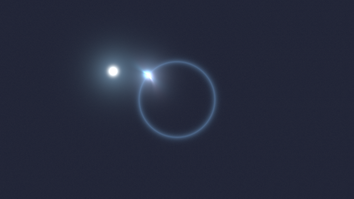
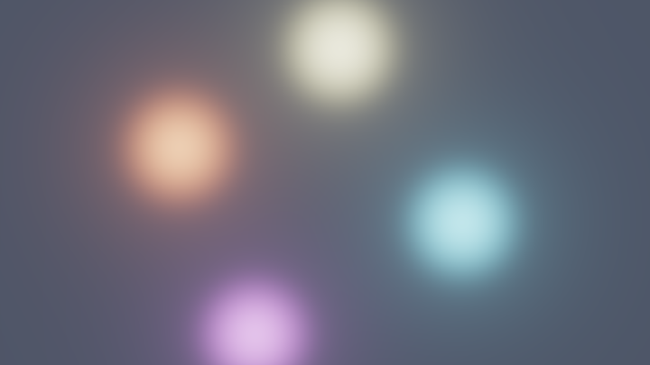
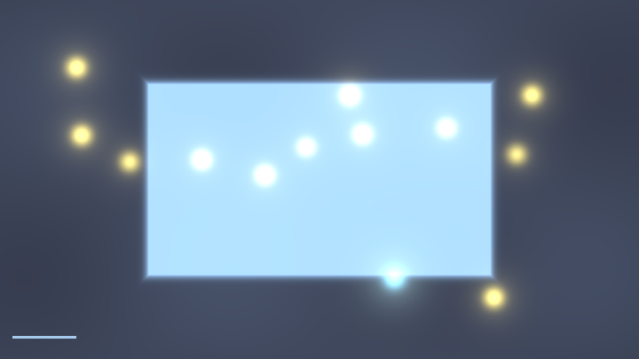
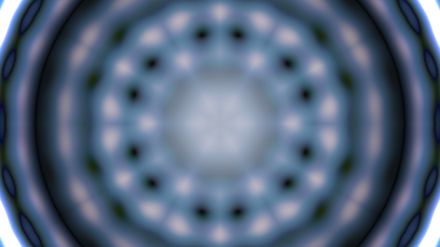
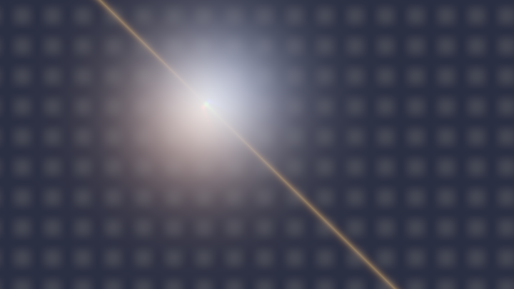
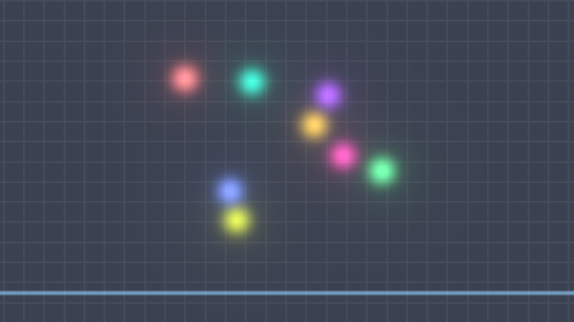
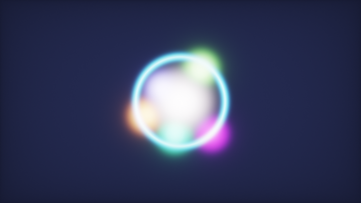

# 第 13 章 · 多 Pass 与状态

> 单 Pass 的世界里，每个像素只认识自己这一帧的坐标。
>
> 多 Pass 让你获得两样东西：**记忆**（上一帧）和**流水线**（先算 A 再算 B）。
>
> 语料库 35.4% 的作品用了多 Pass；一旦你需要拖尾、流体、TAA、bloom 金字塔，就必须走这条路。

---

## 13.1 为什么单 Pass 不够

回顾第 0 章的根本约束：fragment shader 不能写邻居、不能存状态。于是下面这些需求全部卡死：

| 我想要… | 单 Pass 为什么做不到 |
|---|---|
| 画面有拖尾 / 残影 | 读不到上一帧 |
| 流体 / 反应扩散 | 状态必须逐帧演化 |
| 可分离模糊 | 需要中间结果再读一次 |
| 路径追踪累积 | 需要跨帧平均 |
| 粒子位置更新 | 需要读写位置缓冲 |

多 Pass 的本质很简单：

> **把上一帧（或上一个 Pass）的整张图当成一张纹理读进来。**

Shadertoy 给你最多 **四个 Buffer（A/B/C/D）** + **一个 Image** + 可选 **Common / Sound / Cubemap**。每个 Buffer 每帧写一次，下一帧（或同帧后续 Pass）可以读。

---

## 13.2 Pass 顺序：同帧流水线 vs 跨帧反馈

### 同帧流水线（同一帧内 A→B→C→Image）

典型例子：Gargantua 的 bloom 管线。

> 📄 出自 `000490-lstSRS-Gargantua_With_HDR_Bloom`（sonicether，490 likes，5 pass）

`meta.json` 里的拓扑大致是：

```
Buf A  → 渲染 HDR 场景
Buf B  → 从 A 做 mip atlas 降采样
Buf C  → 横向模糊 atlas
Buf D  → 纵向模糊 atlas
Image  → 读 A（场景）+ D（bloom）合成 + tonemap
```

**关键规则**：同帧内，后面的 Pass 读前面的 Pass，读到的是**本帧刚写完**的内容。

### 跨帧反馈（读自己 = 上一帧）

典型例子：反应扩散、拖尾、TAA。

```
Buf A 的 iChannel0 绑回 Buf A 自己
→ 这一帧读到的是「上一帧写进 A 的结果」
```

这是整个仿真世界的地基。请把这句话刻下来：

> **Buffer 读自己，永远是上一帧。不会读到半写完的本帧。**

所以你永远不会遇到「边写边读」的数据竞争——平台保证了双缓冲语义。

### Meta CRT：7 Pass 的后期工厂

> 📄 出自 `000400-4dlyWX-Meta_CRT`（P_Malin，400 likes，含 common + cubemap）

它把键盘状态、场景渲染、TAA、DOF/运动模糊、CRT 材质拆成多个 Buffer。`common.glsl` 里放共享函数（tonemap、相机矩阵），避免每个 Pass 复制粘贴。这是复杂多 Pass 的标准组织方式。

---

## 13.3 读自己 = 上一帧：最小反馈环

最小可用的「状态机」只有三行逻辑：

```glsl
void mainImage(out vec4 fragColor, in vec2 fragCoord)
{
    vec2 uv = fragCoord / iResolution.xy;
    vec4 prev = texture(iChannel0, uv);   // iChannel0 = 本 Buffer 自己

    // 本帧的新贡献（随便举个例子：鼠标落点）
    vec3 paint = vec3(0.0);
    if (iMouse.z > 0.0) {
        vec2 m = iMouse.xy / iResolution.xy;
        float d = length(uv - m);
        paint = vec3(exp(-d * d * 800.0));
    }

    // 与上一帧混合 → 拖尾
    fragColor = vec4(mix(paint, prev.rgb, 0.96), 1.0);
}
```

`0.96` 是衰减系数：每帧保留 96% 旧画面，加 4% 新画面。越大拖尾越长，越接近 1.0 就越「永远擦不掉」。

**网页预览版拖尾味**（单 Pass 假历史）。真版把 `mix(old, paint, 1-decay)` 写进 Buffer A 读自己。

<!-- glsl-from: examples/ch13_stage1.glsl -->
```glsl
// 假历史笔尖残影 —— 真拖尾 = Buffer 自反馈
for (int i = 0; i < TRAIL_N; i++) { /* 衰减克隆 */ }
```


### 初始化：`iFrame == 0`

第一帧没有「上一帧」。Buffer 里可能是未定义/黑色/垃圾。**所有反馈系统都必须初始化**：

```glsl
void mainImage(out vec4 fragColor, in vec2 fragCoord)
{
    vec2 uv = fragCoord / iResolution.xy;

    if (iFrame < 1) {
        // 第一帧：写入初始状态
        fragColor = vec4(0.5, 0.5, 0.0, 1.0); // 例如静止速度场
        return;
    }

    vec4 prev = texture(iChannel0, uv);
    // ... 正常演化 ...
    fragColor = prev;
}
```

语料里更稳健的写法是 `iFrame < 10`，因为有时首帧会被跳过：

> 📄 出自 `000960-4dcGW2-_expansive_reaction-diffusion/buffer_a.glsl`（Flexi）

<!-- glsl-skip -->
```glsl
    if(iFrame<10)
    {
        fragColor = noise; 
    }
```

Shane 的反应扩散注释里也专门提到这一点：

> 📄 出自 `000187-XsG3z1-Reaction_Diffusion_-_2_Pass/buffer_a.glsl`（Shane）

> "Sometimes, the first frame gets skipped, so you do a few more."

### 鼠标重置

交互作品常用「点击重置仿真」：

<!-- glsl-skip -->
```glsl
if (iMouse.z > 0.0 && iMouse.w > 0.0) {
    // 本帧刚按下 → 重新播种
    fragColor = vec4(hash33(fragCoord), 1.0);
    return;
}
```

---

## 13.4 数据打包到 RGBA

一张 Buffer 只有四个通道。仿真经常需要同时存密度、速度、压力……你必须**精打细算地打包**。

### 常见打包方案

| 用途 | R | G | B | A |
|---|---|---|---|---|
| 反应扩散（Gray-Scott） | 化学物 A | 化学物 B | （空/可视化） | 1 |
| 2D 速度场 | vx | vy | 密度 / 染料 | 压力 |
| 粒子（每像素一粒） | px | py | vx | vy |
| 场景 + CoC | 颜色 R | 颜色 G | 颜色 B | 深度/CoC |
| TAA 历史 | 累积色 R | 累积色 G | 累积色 B | 样本权重 |

mu6k 的三 Pass DOF 把 CoC 塞进 alpha，三个模糊 Pass 一路透传：

> 📄 出自 `000158-MsG3Dz-Three_Pass_DOF_Example/buffer_b.glsl`（mu6k）

<!-- glsl-skip -->
```glsl
    float dist = texture(iChannel0,uv).a;
    // ... 模糊 RGB ...
    fragColor = vec4(color,dist);  // 深度原样传递
```

### 编码到 [0,1] 的技巧

如果 Buffer 是 **byte**（8-bit），负速度存不进去。标准做法：

<!-- glsl-skip -->
```glsl
// 写入：把 [-1,1] 映到 [0,1]
fragColor.rg = vel * 0.5 + 0.5;

// 读出
vec2 vel = texture(iChannel0, uv).rg * 2.0 - 1.0;
```

更好的选择：**把 Buffer 设为 float**（Shadertoy 通道设置里选 `float`）。流体、粒子、HDR 累积几乎都需要 float buffer。byte 只有 256 级，积分几帧就量化成色带。

### 用 `texelFetch` 精确读像素

仿真里「读邻居」必须对齐到整数像素，不要用可能插值的 `texture`：

<!-- glsl-frag -->
```glsl
ivec2 p = ivec2(fragCoord);
vec4 c  = texelFetch(iChannel0, p, 0);
vec4 cl = texelFetch(iChannel0, p + ivec2(-1, 0), 0);
vec4 cr = texelFetch(iChannel0, p + ivec2( 1, 0), 0);
vec4 cd = texelFetch(iChannel0, p + ivec2( 0,-1), 0);
vec4 cu = texelFetch(iChannel0, p + ivec2( 0, 1), 0);
```

配合通道过滤 **nearest**（见第 14 章），这是元胞自动机和反应扩散的标配。

---

## 13.5 反馈拖尾的三种配方

**时间回声 / 延迟摄影**：沿圆环排开「过去的笔尖」衰减克隆——多 Pass 环形历史纹理的视觉直觉。

<!-- glsl-from: examples/ch13_stage5.glsl -->
```glsl
// ECHO_N 个相位残影 + 当前笔尖
float age = fi / float(ECHO_N);
```



### ① 指数衰减混合（最常用）

<!-- glsl-skip -->
```glsl
fragColor = vec4(mix(newCol, oldCol, decay), 1.0);
// decay = 0.9 ~ 0.99
```

物理含义：每帧乘以 `decay`，等价于时间常数 `τ ≈ -1/ln(decay)` 帧的指数遗忘。

### ② 最大值拖尾（霓虹/电弧）

<!-- glsl-skip -->
```glsl
fragColor.rgb = max(newCol, oldCol * decay);
```

亮的东西留下「烧灼」痕迹，暗的迅速消失。音乐可视化、电弧很爱用。

### ③ 有界积分（路径追踪累积）

<!-- glsl-skip -->
```glsl
vec3 sum = old.rgb + newCol;
float n  = old.a + 1.0;
fragColor = vec4(sum, n);
// Image 里输出 sum/n
```

alpha 存样本数。这是离线级路径追踪在 Shadertoy 上的标准骨架。

---

## 13.6 Common 用法

`common.glsl` 会**自动拼到每个 Pass 前面**。适合放：

- 常量（`PI`、调色板参数、仿真系数）
- 共享函数（`hash`、`noise`、`sdSphere`、`ACESFilm`）
- 打包/解包工具函数

不适合放：

- `mainImage`（每个 Pass 自己有）
- 依赖特定 `iChannel` 绑定的逻辑（不同 Pass 通道含义不同）

> 📄 出自 `000697-tsKXR3-Multiscale_MIP_Fluid`（cornusammonis，697 likes）

六 Pass 流体把多尺度算子和工具函数放进 `common.glsl`，Buffer A–D 各负责 advection / 压力 / mip 统计中的一段。没有 Common，同样的 50 行工具函数要复制六次。

Meta CRT 的 ACES 与逆变换也在 Common：

> 📄 出自 `000400-4dlyWX-Meta_CRT/common.glsl`（P_Malin）

<!-- glsl-skip -->
```glsl
vec3 Tonemap( vec3 x )
{
    float a = 0.010;
    float b = 0.132;
    float c = 0.010;
    float d = 0.163;
    float e = 0.101;
    return ( x * ( a * x + b ) ) / ( x * ( c * x + d ) + e );
}
```

TAA 需要在 tonemap 空间混合再逆回去——逆变换必须和正变换住在同一个 Common 里，否则改了一处忘了另一处。

---

## 13.7 通道过滤与环绕：仿真必看设置

在 Shadertoy 的通道面板里，每个 `iChannel` 可以设：

| 设置 | 仿真推荐 | 后期/显示推荐 |
|---|---|---|
| filter | **nearest** | linear / mipmap |
| wrap | **clamp** 或 repeat（看边界） | clamp |
| 精度 | **float** | byte 通常够用 |

**错误示范**：反应扩散用 linear 过滤 → 邻居值被插值污染 → 图案融化成一团糊。

**正确示范**：粒子位置缓冲用 nearest + float；最终 Image 对颜色纹理用 linear。

Multiscale MIP Fluid 故意在某些通道开 **mipmap**，因为算法本身要读多级平均：

> 📄 出自 `000697-tsKXR3-Multiscale_MIP_Fluid/meta.json`

Image 的 channel 0/1 设为 `"filter": "mipmap"`，这是功能需求，不是疏忽。

---

## 13.8 典型架构模板

把语料里反复出现的骨架抄下来，按需填空。

### 模板 A：反馈拖尾（1 Buffer）

```
Buf A: 读自己 + 画新内容 → 混合写入
Image: 读 A，做调色/gamma 输出
```

### 模板 B：可分离模糊 / Bloom（3–4 Buffer）

```
Buf A: 渲染场景（或阈值提取亮部）
Buf B: 横向模糊（读 A）
Buf C: 纵向模糊（读 B）
Image: scene + bloom*strength → tonemap
```

> 📄 出自 `000154-lsBfRc-Buffer_pass_bloom`（标准三段式 bloom）

**Bloom 味道**的单 Pass 近似。真版：A 场景 → B 横糊 → Image 纵糊加回。

<!-- glsl-from: examples/ch13_stage2.glsl -->
```glsl
vec3 bright = max(scene - threshold, 0.0);
col = scene + blur(bright);
```



### 模板 C：反应扩散 / 元胞（1–2 Buffer）

```
Buf A: 读自己邻居 → 演化规则 → 写回
（可选 Buf B: 模糊辅助，如 Shane 的 X/Y 双通道技巧）
Image: 把标量场映射成颜色
```

> 📄 出自 `000187-XsG3z1-Reaction_Diffusion_-_2_Pass`（Shane）

X 通道存 RD 值，Y 通道存模糊结果，下帧用 Y 近似 Laplacian。

### 模板 D：半拉格朗日流体（3–5 Buffer）

```
Buf A: 速度场（读自己 advection + 外力）
Buf B: 压力泊松迭代（或散度）
Buf C: 投影去散度 / 染料 advection
Image: 可视化染料或速度
```

高赞代表：`000488-4tGfDW-Chimera_s_Breath`、`000477-WlVyRV-Dry_ice_2`、`000258-MdSczK-Multistep_Fluid_Simulation`。

### 模板 E：粒子（gather 型）

```
Buf A: 粒子状态纹理（位置/速度打包）
Buf B: （可选）把粒子 splatted 成密度场
Image: 读密度 或 直接在像素里 gather 邻近粒子
```

注意：fragment shader **不能 scatter**（一个粒子写到任意像素）。要么「每像素一粒子」规则网格，要么在 Image 里对每个像素 gather 附近粒子。细节见第 14 章。

### 模板 F：TAA / 路径累积

```
Buf A: 本帧新样本（可能带抖动）
Buf B: 历史累积（读自己 + 读 A，按权重混合）
Image: 读 B，除以样本数，tonemap
```

Meta CRT 把 TAA 放在 Buffer D，并在 tonemap 空间混合以防 firefly。

### 模板 G：游戏状态机

```
Buf A: 游戏状态（球位置、砖块存活位图、分数）
Buf B: （可选）上一帧状态备份
Image: 根据状态画画面；键盘/鼠标写入通过「在 Buf A 里读 input」完成
```

> 📄 出自 `000459-MddGzf-Bricks_Game`（iq）、`000326-Ms3XWN-Pacman_Game`（iq）

状态存在少数几个 texel 里（用 `texelFetch(iChannel0, ivec2(0,0), 0)` 读「全局变量」），其余像素负责画图——这是 Shadertoy 上做游戏的经典套路。

---

## 13.9 调试多 Pass 的方法

1. **临时让 Image 直接输出某个 Buffer**：`fragColor = texture(iChannel0, uv);` 确认每一级内容对不对。
2. **把通道可视化成颜色**：速度场 `fragColor.rgb = vec3(vel*0.5+0.5, 0.5);`
3. **检查 `iFrame`**：在角落画一个 `mod(float(iFrame), 256.0)/255.0` 灰度条，确认在跑。
4. **怀疑反馈时先断开环**：把 `iChannel0` 临时成纯黑纹理，看单帧逻辑是否正确。
5. **看 meta.json**：本地语料里每个作品的 `passes[].inputs` 写清了通道绑的是谁、过滤模式是什么——读代码前先读拓扑。

---

## 13.10 性能与配额意识

- 每多一个全屏 Buffer，就多一次全屏写带宽。1080p float RGBA ≈ 8 MB/帧/Buffer。
- 可分离模糊用 2 Pass × N tap，远好过 1 Pass × N² tap。
- 仿真步数不够时，宁可「一帧内串行多个 Buffer 做多次迭代」，也不要指望提高 FPS 来加快收敛——用户机器帧率不稳定。
- Shadertoy 只有 4 个 Buffer。空间不够时：atlas 打包（Gargantua）、双通道复用（Shane RD）、把不常更新的数据塞进 Common 常量。

---

## 13.11 逐作品读拓扑：三份 meta.json 精读

本地语料每个作品旁都有 `meta.json`。读多 Pass 代码之前，**先画一张通道图**。下面三份是高赞标本。

### Gargantua：同帧流水线

> 📄 出自 `000490-lstSRS-Gargantua_With_HDR_Bloom/meta.json`

```
A (场景 HDR，可读上一帧 A 做可选反馈)
  ↓
B (读 A → mip atlas)
  ↓
C (读 B → 横向模糊)
  ↓
D (读 C → 纵向模糊)
  ↓
Image (读 A+B+C+D → 合成)
```

所有 Buffer 过滤基本是 `linear` + `clamp`，精度 `byte`——因为存的是颜色/亮度，不是速度场。**后期管线用 linear；仿真管线用 nearest。** 对比要刻在脑子里。

### Meta CRT：状态 + 后期工厂

> 📄 出自 `000400-4dlyWX-Meta_CRT/meta.json`

- Buffer A 绑了 **keyboard** + 自己（相机/参数状态反馈）
- 后续 Buffer 负责场景、TAA、合成
- 另有 `common.glsl` 与 `cubemap.glsl`
- Image 几乎只做最终展示

这是「交互状态机」和「视觉后期」拆开的范本：键盘积分绝不能放在 Image。

### Multiscale MIP Fluid：反馈网

> 📄 出自 `000697-tsKXR3-Multiscale_MIP_Fluid/meta.json`

Buffer A 同时读 A/B/C/D 四个通道——这是一张**密集依赖图**，不是简单链表。读这种作品时：

1. 列出每个 Pass 的输入列表
2. 标出哪些是「读自己」（跨帧）
3. 标出哪些开了 mipmap（算法需要）

不要一头扎进 `common.glsl` 的数学；先知道水从哪流到哪。

---

## 13.12 全局变量 texel 模式（游戏/UI 必备）

全屏每个像素都跑同一套逻辑时，如何存「只有一份」的分数、关卡、球的位置？

答案：约定几个固定 texel 当寄存器。

```glsl
// 只在 (0,0) 更新球的状态；其它像素透传或画砖块
void mainImage(out vec4 fragColor, in vec2 fragCoord)
{
    ivec2 p = ivec2(fragCoord);
    vec4 ball = texelFetch(iChannel0, ivec2(0, 0), 0);

    if (p == ivec2(0, 0)) {
        vec2 pos = ball.xy;
        vec2 vel = ball.zw * 2.0 - 1.0;
        // 读键盘加速度……
        pos += vel;
        fragColor = vec4(pos, vel * 0.5 + 0.5);
        return;
    }

    // 非寄存器像素：根据 ball 状态画场景
    vec2 pos = ball.xy * iResolution.xy;
    float d = length(fragCoord - pos) - 10.0;
    fragColor = vec4(vec3(1.0 - smoothstep(0.0, 1.5, d)), 1.0);
}
```

注意：`(0,0)` 像素的颜色**不再表示画面内容**。Image Pass 画正式画面时不要直接贴 Buf A，而要「读寄存器 + 重新画」。iq 的砖块/吃豆人游戏都是这个思路。

扩展：`(1,0)` 存分数，`(2,0)` 存生命周期随机种子，`(0,1)` 存上一帧鼠标……开一张小「内存图」。

**小游戏感**：鼠标控圆吃金币 + 左上角分数条。真版把位置/分数打进 BufA 的 `(0,0)` texel。

<!-- glsl-from: examples/ch13_stage8.glsl -->
```glsl
// 玩家圆 + 金币 + HUD 分数条
```



---

## 13.13 Ping-pong 与「假双缓冲」

有人担心：读自己时会不会读到本帧已写区域？Shadertoy **不会**。平台保证 Buffer 自反馈是完整的上一帧快照。

但如果你想在**同一帧**里对同一数据做两步更新（例如压力迭代两次），单 Buffer 做不到「读旧写新」多次——因为每帧每个 Buffer 只跑一次。解法：

```
Buf A → 第 1 次迭代结果
Buf B → 读 A 做第 2 次迭代
Buf A 下一帧读 B ……
```

或接受「跨帧迭代」：每帧只做 1～2 次泊松迭代，靠时间换精度（许多实时流体这么干）。

**反馈万花筒味道**：每帧 zoom/rotate/mix——真版是读自己的反馈缩放。

<!-- glsl-from: examples/ch13_stage6.glsl -->
```glsl
// feedback zoom / rotate / mix
```



**RGB 色散拖影**：三通道各自错位衰减——像劣质棱镜摄像。

<!-- glsl-from: examples/ch13_stage7.glsl -->
```glsl
// R/G/B 分通道拖尾偏移
```



---

## 13.14 练习作业（务必动手）

1. **拖尾画板**：1 Buffer，鼠标喷颜色，`mix(..., 0.97)`。改 decay 观察。
2. **两 Pass 模糊**：A 画几个亮点，B 横糊，Image 纵糊并显示。
3. **寄存器小球**：`(0,0)` 存位置，方向键移动（先用鼠标模拟也行）。
4. **读一份 meta.json**：任选 MULTIPASS 榜前十，手画通道图，再打开 `buffer_a.glsl` 验证。

做完这四项，第 14 章的仿真不会再觉得「多 Pass 很玄」。

---

## 13.15 可运行例子总览（含新颖玩法）

相关小节正文里已经嵌了可跑例子。下面把**多 Pass「味道」**收成一张连刷表——网页可预览；注释写真 Buffer 接法。

| 文件 | 看点 | 真多 Pass | 正文位置 |
|---|---|---|---|
| `ch13_stage1` | 拖尾味 | Buf 自反馈 × decay | 13.3 |
| `ch13_stage2` | Bloom 味 | 可分离模糊链 | 13.8 模板 B |
| `ch13_stage3` | 状态机跳动 | 寄存器 texel | （下方） |
| `ch13_stage4` | 霓虹成片 | 场景 + bloom + 后期 | （下方） |
| `ch13_stage5` | **时间回声** | 环形历史纹理 | 13.5 |
| `ch13_stage6` | **反馈万花筒** | 读自己 zoom/mix | 13.13 |
| `ch13_stage7` | **色散拖影** | RGB 分通道拖尾 | 13.13 |
| `ch13_stage8` | **小游戏 HUD** | 状态 texel | 13.12 |

### 状态机跳动

<!-- glsl-from: examples/ch13_stage3.glsl -->
```glsl
float frame = floor(iTime * 2.0);
vec2 pos = mix(regPos(i, frame), regPos(i, frame + 1.0), blend);
```



### 霓虹成片

<!-- glsl-from: examples/ch13_stage4.glsl -->
```glsl
vec3 col = base + bloom * 1.6;
col = tonemapACES(col);
```



做完请到 Shadertoy 把 stage1 改成真 Buffer 拖尾、把 stage6 改成读自己的反馈缩放。

## 要点回顾

1. **读自己 = 上一帧**；同帧流水线则是 A→B→C 读本帧中间结果。
2. **`iFrame == 0`（或 `< 10`）必须初始化**，否则反馈吃垃圾数据。
3. **RGBA 是稀缺资源**，打包要有方案；深度/CoC 进 alpha 是常用伎俩。
4. **仿真用 nearest + float**；显示用 linear。
5. **Common 放共享函数与常量**，别放 `mainImage`。
6. 先选一个架构模板（拖尾 / 模糊 / RD / 流体 / 粒子 / TAA / 游戏），再填空。

---

> 上一章：看手册目录里与你当前进度衔接的章节（通常是体积或材质相关章）。
>
> 下一章：[第 14 章 · 仿真](14-仿真.md) —— 反应扩散、元胞、流体、粒子、布料；以及为什么 filter 必须是 nearest。
