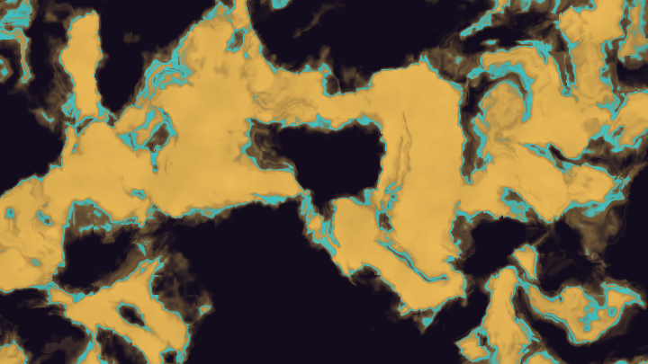
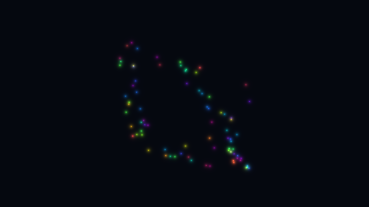
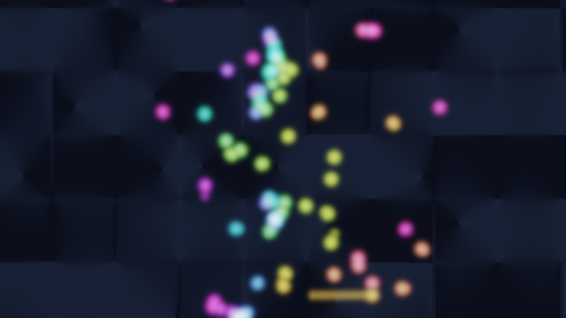
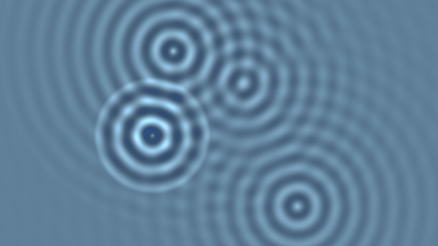
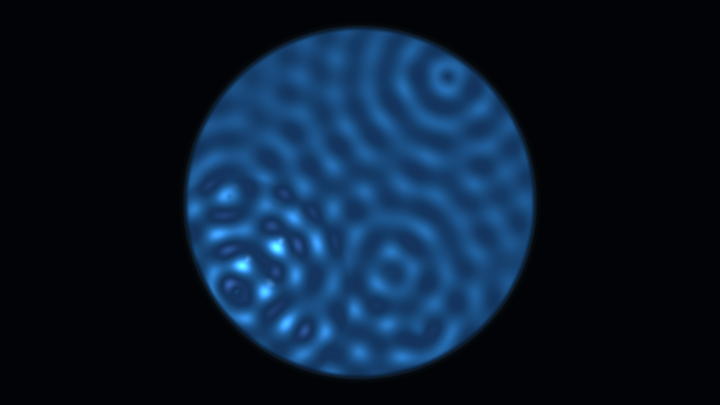
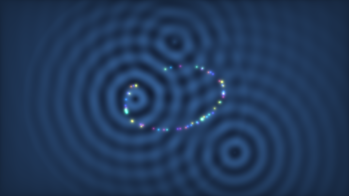
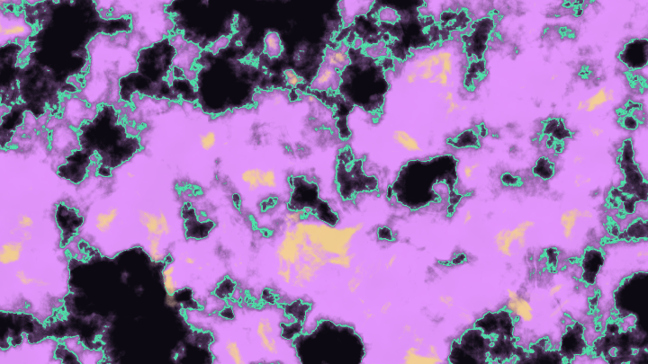
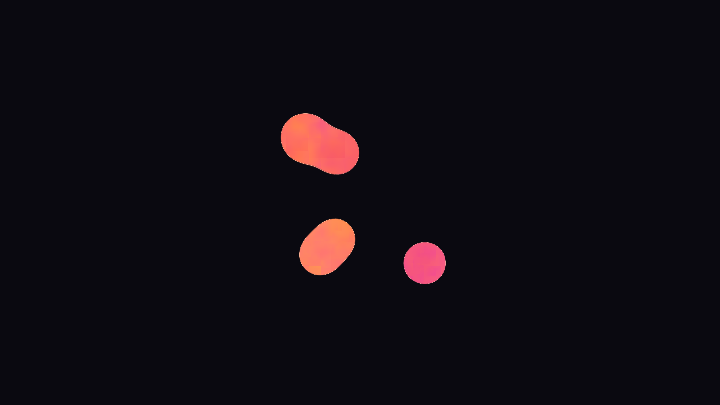

# 第 14 章 · 仿真

> 仿真是多 Pass 最性感的用途：让 Buffer 里的数据自己活起来。
>
> 语料 `J_simulation` 桶有 267 个作品——流体、反应扩散、粒子、布料、蜂群、侵蚀……骨架却出奇一致：**读邻居 → 算更新 → 写回自己**。
>
> 本章强调一件事：**filter nearest + float buffer**。弄错这两项，后面公式再漂亮也是一锅粥。

---

## 14.1 仿真的共同心智模型

所有基于网格的仿真都在做同一件事：

```
对每个格子 (i,j)：
  读上一帧的自己和邻居
  按物理/规则算出下一帧状态
  写回
```

GPU 上「每个像素 = 一个格子」。你**不能**让一个格子去改另一个格子（那是 scatter）；你只能让每个格子**收集**邻居的信息（gather）。

| 你想做的事 | 正确翻译 |
|---|---|
| 粒子把质量泼到周围 | 每个像素问：附近粒子给我多少质量？ |
| 速度把密度带走 | 每个像素问：我的质量是从哪来的？（回溯） |
| 弹簧拉布料节点 | 每个节点读邻居位置，算力，更新自己 |

把思维从「我推别人」改成「别人怎么影响我」，仿真就开始顺了。

---

## 14.2 通道设置：nearest + float（先读这段再写代码）

### 为什么必须 nearest

linear 过滤会在采样时对邻接 texel 插值。仿真里「左邻居」必须是**精确的那个格子**，插值等于凭空制造了不存在的状态，稳定性立刻崩溃。

### 为什么必须 float

byte 缓冲是 8-bit 归一化值。速度 0.001 这种量会被量化成 0；压力迭代几十次后误差爆炸。Shadertoy 通道面板选 **float**（32-bit）。

### 读写规范

<!-- glsl-frag -->
```glsl
// 推荐：整数坐标精确读写
ivec2 p = ivec2(fragCoord.xy);
vec4 self = texelFetch(iChannel0, p, 0);
vec4 left = texelFetch(iChannel0, p + ivec2(-1, 0), 0);

// 边界：clamp 到图像范围
ivec2 q = clamp(p + ivec2(1, 0), ivec2(0), ivec2(iResolution.xy) - 1);
vec4 right = texelFetch(iChannel0, q, 0);
```

只有在半拉格朗日回溯（采样位置不是整数）时才用 `texture` + **linear**——那时插值是算法需要的一部分。

---

## 14.3 反应扩散（Reaction-Diffusion）

**RD 形态切片**（单 Pass 直觉）。真 Gray-Scott 用 float+nearest Buffer 邻域更新。更「黏菌」的斑图见章末 stage6。

<!-- glsl-from: examples/ch14_stage3.glsl -->
```glsl
// 域扭曲 fbm → spots / stripes 相
```



### 直觉

两种化学物 A、B 在盘子里扩散，同时又互相反应。Gray-Scott 模型：

```
∂A/∂t = Da ∇²A - A B² + f (1 - A)
∂B/∂t = Db ∇²B + A B² - (k + f) B
```

- `∇²`：拉普拉斯（邻域平均 - 自己）→ 扩散
- `A B²`：反应项（B 吃掉 A 变更多 B）
- `f`：A 的补给速率；`k`：B 的衰减速率

不同的 `(f,k)` 长出点、条纹、迷宫、螺旋——Karl Sims 的经典参数图值得收藏。

### Shane 的双通道技巧

> 📄 出自 `000187-XsG3z1-Reaction_Diffusion_-_2_Pass/buffer_a.glsl`（Shane，187 likes）

他不显式存 A/B 两物，而是：

- **X 通道**：当前 RD 标量
- **Y 通道**：对 X 做的模糊（近似邻域平均）

下一帧用 Y 构造梯度/拉普拉斯，更新 X，再把新模糊写入 Y。注释写得很清楚：

> "Blur the value from the X channel ... store it in Y, then store the new value in X."

加权 3×3 模糊（近似高斯）：

<!-- glsl-skip -->
```glsl
float blur(in vec2 p){
    vec3 e = vec3(1, 0, -1);
    vec2 px = 1./iResolution.xy;
	float res = 0.0;
	res += tx(p + e.xx*px ).x + tx(p + e.xz*px ).x + tx(p + e.zx*px ).x + tx(p + e.zz*px ).x;
    res += (tx(p + e.xy*px ).x + tx(p + e.yx*px ).x + tx(p + e.yz*px ).x + tx(p + e.zy*px ).x)*2.;
	res += tx(p + e.yy*px ).x*4.;
    return res/16.;
}
```

演化核心（同文件后半）：用模糊通道的梯度当拉普拉斯直觉，再写回 X/Y：

<!-- glsl-skip -->
```glsl
	vec2 lap = vec2(tx(uv + e.xy*pwr).y - tx(uv - e.xy*pwr).y, tx(uv + e.yx*pwr).y - tx(uv - e.yx*pwr).y);
    uv = uv + lap*pw*3.0; 
    float newReactDiff = tx(uv).x + (noise.z - 0.5)*0.0025 - 0.002; 
	newReactDiff += dot(tx(uv + (noise.xy-0.5)*pw).xy, vec2(1, -1))*0.145; 
    if(iFrame>9) fragColor.xy = clamp(vec2(newReactDiff, avgReactDiff/.98), 0., 1.);
    else fragColor = vec4(noise, 1.);
```

翻译成人话：

1. `avgReactDiff = blur(uv)` → 邻域平均，进 Y
2. 用 Y 的差分当「化学物流」方向，稍微推一下 UV
3. 在推过的位置读 X，加噪声衰减，再加一项「X 与 Y 的对抗」（`dot(..., vec2(1,-1))`）
4. 前 10 帧只写噪声种子

这不是教科书 Gray-Scott 的逐字实现，而是 **Shane 风格的可玩近似**——参数少、易出图。正式 Gray-Scott 用下面 14.3 节的双通道 A/B 骨架。

### Flexi 的 expansive RD（多 Pass 高赞）

> 📄 出自 `000960-4dcGW2-_expansive_reaction-diffusion`（Flexi，960 likes，5 pass）

架构拆成：演化 + 多级高斯模糊 + 鼠标状态。初始化：

<!-- glsl-skip -->
```glsl
    if(iFrame<10)
    {
        fragColor = noise; 
    }
```

**播种噪声**是 RD 的生命线——均匀场是不动点，什么图案都长不出来。常用：

<!-- glsl-frag -->
```glsl
if (iFrame < 10) {
    float n = hash12(fragCoord);
    fragColor = vec4(1.0, step(0.9, n), 0.0, 1.0); // 90% 只有 A，10% 有 B 种子
    return;
}
```

### 最小 Gray-Scott 骨架（教学合成）

```glsl
void mainImage(out vec4 fragColor, in vec2 fragCoord)
{
    ivec2 p = ivec2(fragCoord);
    ivec2 R = ivec2(iResolution.xy);

    if (iFrame < 10) {
        float h = fract(sin(dot(fragCoord, vec2(127.1, 311.7))) * 43758.5453);
        fragColor = vec4(1.0, h > 0.92 ? 1.0 : 0.0, 0.0, 1.0);
        return;
    }

    vec2 center = texelFetch(iChannel0, p, 0).xy;
    vec2 lap = vec2(0.0);
    for (int j = -1; j <= 1; j++)
    for (int i = -1; i <= 1; i++) {
        float w = (i == 0 && j == 0) ? -1.0 : 0.2; // 简化拉普拉斯权重
        if (i == 0 && j == 0) w = -1.0;
        else if (i == 0 || j == 0) w = 0.2;
        else w = 0.05;
        ivec2 q = clamp(p + ivec2(i, j), ivec2(0), R - 1);
        lap += w * texelFetch(iChannel0, q, 0).xy;
    }
    // 上面中心权重应单独处理；下面用「邻域均 - 自己」更干净：
    vec2 avg = vec2(0.0);
    avg += texelFetch(iChannel0, clamp(p+ivec2(-1,0),ivec2(0),R-1), 0).xy;
    avg += texelFetch(iChannel0, clamp(p+ivec2( 1,0),ivec2(0),R-1), 0).xy;
    avg += texelFetch(iChannel0, clamp(p+ivec2(0,-1),ivec2(0),R-1), 0).xy;
    avg += texelFetch(iChannel0, clamp(p+ivec2(0, 1),ivec2(0),R-1), 0).xy;
    avg *= 0.25;
    lap = avg - center;

    float Da = 1.0, Db = 0.5;
    float f = 0.037, k = 0.060;
    float A = center.x, B = center.y;
    float Abb = A * B * B;
    float nA = A + (Da * lap.x - Abb + f * (1.0 - A)) * 1.0;
    float nB = B + (Db * lap.y + Abb - (k + f) * B) * 1.0;

    fragColor = vec4(clamp(nA,0.0,1.0), clamp(nB,0.0,1.0), 0.0, 1.0);
}
```

调参入口：只动 `f` 和 `k`。`f≈0.037, k≈0.06` 出点纹；`f≈0.03, k≈0.057` 出迷宫。步长太大（>1.5）会炸，太小则演化极慢。

### Image 着色

不要直接输出 A/B。用梯度做浮雕，或把 B 当遮罩上调色板：

<!-- glsl-frag -->
```glsl
float b = texture(iChannel0, uv).y;
vec3 col = mix(vec3(0.05,0.07,0.12), vec3(0.9,0.85,0.7), smoothstep(0.1, 0.5, b));
fragColor = vec4(col, 1.0);
```

---

## 14.4 元胞自动机（Cellular Automata）

### Game of Life 直觉

每个格子死/活（0/1）。下一帧规则只看 8 邻居存活数：

- 活细胞邻居为 2 或 3 → 继续活
- 死细胞邻居为 3 → 诞生
- 其余 → 死

### 实现要点

1. **nearest + texelFetch**
2. 状态用 R 通道 0/1
3. 边界：clamp（墙）或取模（环形世界）

```glsl
void mainImage(out vec4 fragColor, in vec2 fragCoord)
{
    ivec2 p = ivec2(fragCoord);
    ivec2 R = ivec2(iResolution.xy) - 1;

    if (iFrame == 0) {
        float h = hash12(fragCoord);
        fragColor = vec4(h > 0.7 ? 1.0 : 0.0, 0.0, 0.0, 1.0);
        return;
    }

    int n = 0;
    for (int j = -1; j <= 1; j++)
    for (int i = -1; i <= 1; i++) {
        if (i == 0 && j == 0) continue;
        ivec2 q = clamp(p + ivec2(i, j), ivec2(0), R);
        n += int(texelFetch(iChannel0, q, 0).r > 0.5);
    }
    float alive = texelFetch(iChannel0, p, 0).r > 0.5 ? 1.0 : 0.0;
    float next = alive;
    if (alive > 0.5) next = (n == 2 || n == 3) ? 1.0 : 0.0;
    else             next = (n == 3) ? 1.0 : 0.0;

    fragColor = vec4(next, 0.0, 0.0, 1.0);
}
```

### SmoothLife 与连续化

> 📄 相关高赞：`000179-XtdSDn-SmoothLife_L_`（chronos）

把 0/1 换成连续浓度，邻居求和换成环形邻域积分，规则换成平滑阶跃——图案从「方块闪烁」变成「有机蠕动」。它仍是 CA 家族，只是状态从离散迈向连续，和反应扩散开始接壤。

### 蠕虫 / 迷宫类 CA

> 📄 出自语料标签：`000171-Xs2cRD-maze_worms_graffitis_3c`（FabriceNeyret2）

规则改成「沿着梯度走」或「偏好某一方向的邻居」，几行就能长出迷宫蠕虫。读高尔夫版时先找「邻居计数」那几行，规则一定藏在那里。

---

## 14.5 流体：半拉格朗日直觉

### 为什么不能「把密度推走」

你想：速度指向右边，就把密度写到右邻居。这是 **scatter**，fragment shader 做不到——每个像素只能写自己。

### 半拉格朗日（Semi-Lagrangian）回溯

问每个像素：

> 「我现在的物质，是从哪里流过来的？」

答案：从 `uv - velocity * dt` 那里来。去那里采样上一帧：

<!-- glsl-skip -->
```glsl
vec2 uv = fragCoord / iResolution.xy;
vec2 vel = texture(iChannel0, uv).xy;           // 假设已编码为真实速度
vec2 uvBack = uv - vel * dt / iResolution.xy;   // 注意单位：速度是「像素/帧」还是「uv/帧」
vec4 advected = texture(iChannel1, uvBack);     // linear 插值是需要的
```

**直觉图**：

```
上一帧:  *物质在左*
           \
            \  速度
             ↓
本帧像素 ← 回溯采样点
```

### 完整小步流体（概念流水线）

1. **加力**：鼠标拖动给速度场加一笔
2. **Advect 速度**：速度自己被自己带走（非线性，出涡）
3. **扩散**（可选）：粘性，用几次邻域模糊近似
4. **算散度**：`div = ∂vx/∂x + ∂vy/∂y`
5. **解压力泊松**：迭代让 `∇²p = div`
6. **投影**：`v := v - ∇p` → 近似无散度（不可压缩）
7. **Advect 染料**：用速度带走颜色，供显示

高赞实现可对照：

| 作品 | 特点 |
|---|---|
| `000488-4tGfDW-Chimera_s_Breath` | curl noise + 涡度约束，烟尘感 |
| `000477-WlVyRV-Dry_ice_2` | 不可压缩干冰 |
| `000258-MdSczK-Multistep_Fluid_Simulation` | 多步 / RK4 |
| `000697-tsKXR3-Multiscale_MIP_Fluid` | **mipmap 多尺度**，697 likes |
| `000626-MsGSRd-spilled` | flockaroo 经典泼洒 |

### Multiscale MIP Fluid 的启发

> 📄 出自 `000697-tsKXR3-Multiscale_MIP_Fluid`（cornusammonis）

作者描述：*"A mipmap-based approach to multiscale fluid dynamics."*

核心想法：大尺度涡旋在低分辨率 mip 上算更稳、更便宜，再注入回高分辨率。Buffer 通道显式开启 `"filter": "mipmap"`。这提醒你：**过滤模式是算法的一部分，不是显示器选项。**

### 鼠标加力的标准写法

<!-- glsl-skip -->
```glsl
vec2 force = vec2(0.0);
if (iMouse.z > 0.0) {
    vec2 m  = iMouse.xy;
    vec2 pm = abs(iMouse.zw); // 上一按下位置；注意符号语义见第 1 章
    vec2 d  = fragCoord - m;
    float w = exp(-dot(d,d) * 0.01);
    force = (m - pm) * w * 0.2;
}
vel += force;
```

### 稳定性备忘

- `dt` 太大 → 回溯跳过太多格子 → 漩涡炸裂。从 `dt=0.2` 试起。
- 压力迭代太少 → 体积不守恒，烟雾自己涨。Buffer 不够时，一帧内做不了 40 次迭代，可用「跨帧继续迭代」糊弄（牺牲时间精度）。
- 边界：通常法向速度 = 0（墙），染料 clamp。

---

## 14.6 粒子：只能 gather，不能 scatter

**解析粒子烟花感**：位置由 id+时间算出。真交互粒子把 pos/vel 写入 Buffer。

<!-- glsl-from: examples/ch14_stage1.glsl -->
```glsl
for (int i = 0; i < N; i++) {
  vec2 cen = orbit(id, iTime);
  col += glow(uv - cen);
}
```



**鸟群/粒子流**：沿噪声流向场运动 + 短线拖尾。真版 Buffer 存 pos/vel 每帧积分。

<!-- glsl-from: examples/ch14_stage7.glsl -->
```glsl
// curl-ish 流场上的粒子
```



### 两种布局

**① 纹理里每个 texel = 一个粒子**（最常见）

```
R,G = 位置（或编码后的位置）
B,A = 速度
```

更新 Pass：只读自己的状态（+ 可选读力场纹理），写回自己。粒子之间要交互时，要么把粒子 splat 成场再采样，要么 O(n) 在单一 Pass 里读其他 texel（粒子数受纹理尺寸限制，如 256×256）。

**② 屏幕像素 gather 附近粒子**

Image 里每个像素遍历「可能影响我的粒子」——粒子少时可行，多时爆炸。

### 为什么不能 splat

「粒子在 p 处，给周围 5×5 像素加浓度」需要一次写出 25 个像素。fragment shader 每次调用只写一个。解决办法：

- **把 splat 反转成 gather**：每个像素检查「粒子是否落在我附近」
- 或用 **顶点着色器 / 多 draw**（Shadertoy 基本不给你这条路）
- 或接受「一粒子一像素」的稀疏表示，用别的 Pass 做密度估计

### 最小粒子更新

```glsl
void mainImage(out vec4 fragColor, in vec2 fragCoord)
{
    ivec2 id = ivec2(fragCoord);
    if (id.x >= 256 || id.y >= 256) discard; // 粒子表 256×256

    if (iFrame == 0) {
        vec2 pos = hash22(vec2(id)) * iResolution.xy;
        vec2 vel = (hash22(vec2(id) + 17.0) - 0.5) * 2.0;
        fragColor = vec4(pos / iResolution.xy, vel * 0.5 + 0.5);
        return;
    }

    vec4 s = texelFetch(iChannel0, id, 0);
    vec2 pos = s.xy * iResolution.xy;
    vec2 vel = s.zw * 2.0 - 1.0;

    // 简单力：向中心 + 阻尼
    vec2 toC = iResolution.xy * 0.5 - pos;
    vel += toC * 0.0005;
    vel *= 0.99;
    pos += vel;

    // 边界反弹
    if (pos.x < 0.0 || pos.x > iResolution.x) vel.x *= -1.0;
    if (pos.y < 0.0 || pos.y > iResolution.y) vel.y *= -1.0;
    pos = clamp(pos, vec2(0.0), iResolution.xy);

    fragColor = vec4(pos / iResolution.xy, vel * 0.5 + 0.5);
}
```

显示时：要么另开 Pass 用「像素到最近粒子距离」画圆点，要么在 Image 里对粒子表做循环（粒子少才行）。

高赞参考：`000622-WtfyDj-Paint_streams`、`000298-MdG3Dd-Synaptic`、`000272-ldd3DB-Interactive_Shoal_of_fish`（boids 蜂群）。

### Boids 三力

每个鱼读若干邻居（或读密度/对齐场）：

1. **分离**：太近则推开
2. **对齐**：速度趋向邻居平均速度
3. **凝聚**：位置趋向邻居平均位置

仍是 gather：我读邻居状态，更新**我的**速度。

---

## 14.7 Verlet 布料

### 为什么用 Verlet 而不是欧拉

欧拉：`v += a*dt; x += v*dt`——显式积分，弹簧一硬就炸。

Verlet：只存位置，速度由位置差暗示：

```
x_next = x + (x - x_prev) + a * dt²
```

约束（弹簧长度）用**位置投影**反复拉回，比调弹性系数稳得多。

### 网格布局

布料 = `N×N` 点，每个 texel 存 `vec2` 或 `vec3` 位置。弹簧连：

- 结构弹簧：上下左右
- 剪切弹簧：对角
- （可选）弯曲弹簧：隔一个点

### 单次约束投影

```glsl
vec2 constrain(vec2 p, vec2 q, float rest)
{
    vec2 d = q - p;
    float len = length(d);
    if (len < 1e-5) return p;
    float diff = (len - rest) / len;
    // 假设两端等质量，各移一半；固定点质量无穷则只移自由端
    return p + d * 0.5 * diff;
}
```

每个点 gather 邻居，对每根弹簧做一次投影，迭代 4–10 次（可跨 Pass 或同帧多 Buffer）。

### 固定点

挂帘左上角两点钉死：

<!-- glsl-skip -->
```glsl
if (id.y == N-1 && (id.x == 0 || id.x == N-1)) {
    fragColor = vec4(pinnedPos, pinnedPos); // 当前位置=上一位置，速度为零
    return;
}
```

> 📄 高赞参考：`000324-MldXWX-curtain_and_ball`（archee，帘子 + 球碰撞，5 pass）

碰撞：读球心，若点进入球内就推到球表面——仍是改**自己的位置**。

### 与刚体 Verlet

> 📄 `000206-MdXBD8-physics_engine`（archee）——刚体 + Verlet 积分，多 pass。

布料是「多质点 + 距离约束」；刚体引擎是「更少刚体 + 碰撞约束」。积分骨架相通。

---

## 14.8 波方程与水涟漪

另一类超经典的反馈：

```
h_new = 2*h - h_old + c² * dt² * ∇²h
```

需要**两帧历史**。打包技巧：

- R = 当前高度
- G = 上一帧高度

或用两个 Buffer 交替。

鼠标点击给 R 加一个脉冲，Image 把高度当法线做折射读背景图——就是常见「雨滴涟漪」。

> 📄 `000220-Xsd3DB-Wave_Propagation_Effect`（tomkh，3 pass）

**多源涟漪干涉**（解析叠加）。真版双历史 Buffer 离散波方程。

<!-- glsl-from: examples/ch14_stage2.glsl -->
```glsl
float w = sin(k*r - omega*t) * exp(-damp*r);
```



**鼠标涟漪池**：一个波源跟鼠标——把石头丢进水里的实战直觉。

<!-- glsl-from: examples/ch14_stage5.glsl -->
```glsl
// iMouse 丢石头 + 多源干涉
```



---

## 14.9 调试仿真的专项技巧

1. **先静止**：关掉 advection，只看扩散是否对称。
2. **棋盘初始化**：看一层层糊掉的速度，判断数值耗散。
3. **单像素种子**：反应扩散只在中心点 B=1，看图案各向是否同性。
4. **把散度画成颜色**：投影后散度应接近 0；若仍鲜艳，压力迭代不够。
5. **炸屏时降 dt、降力、加阻尼**——先求稳，再求好看。

---

## 14.10 选型决策树

```
需要「活」的图案，但不在乎物理正确？
  → 反应扩散 / SmoothLife / curl noise 假流体

需要烟、墨水、不可压缩感？
  → 半拉格朗日 + 压力投影（多 Buffer）

需要点状物体各自运动？
  → 粒子表纹理；交互用场或邻居 gather

需要布、绳、软体？
  → Verlet + 距离约束迭代

需要水面涟漪？
  → 波动方程双缓冲
```

假流体（一张噪声场让 UV 扭曲）往往比真 Navier-Stokes 好看且便宜——见 `000302-4sGSDw-Sinuous`。先问「观众是否需要真实碰壁回弹」，再决定上不上完整投影。

---

## 14.11 可运行例子总览（更有趣的仿真）

相关小节正文里已经嵌了可跑例子。这里再给一条「好玩路线」连刷：

| 文件 | 看点 | 真仿真接法 | 正文位置 |
|---|---|---|---|
| `ch14_stage1` | 解析粒子 | Buffer 粒子表 | 14.6 |
| `ch14_stage2` | 多源涟漪 | 双历史波方程 | 14.8 |
| `ch14_stage3` | RD 形态切片 | Gray-Scott | 14.3 |
| `ch14_stage4` | 粒子+波成片 | 组合 | （下方） |
| `ch14_stage5` | **鼠标涟漪池** | 波方程 + 鼠标种子 | 14.8 |
| `ch14_stage6` | **黏菌斑图** | RD / agent | （下方） |
| `ch14_stage7` | **鸟群流场** | pos/vel Buffer | 14.6 |
| `ch14_stage8` | **熔岩灯 Blob** | metaball / 软体 | （下方） |

### 粒子 + 波打磨

<!-- glsl-from: examples/ch14_stage4.glsl -->
```glsl
// 粒子 glow + 涟漪高度当法线感
```



### 黏菌斑图

<!-- glsl-from: examples/ch14_stage6.glsl -->
```glsl
// 域扭曲 fbm → spots / worms 相
```



### 熔岩灯 Blob

<!-- glsl-from: examples/ch14_stage8.glsl -->
```glsl
float field = meta(c0) + meta(c1) + ...;
float blob = smoothstep(0.95, 1.05, field);
```



完整 Gray-Scott / 流体请到 Shadertoy 按 14.3–14.5 节搭建——你已经知道目标画面长什么样了。

## 要点回顾

1. **gather 思维**：只更新自己，靠读邻居/回溯采样完成物理。
2. **nearest + float + texelFetch** 是网格仿真标配；半拉格朗日回溯处改用 linear。
3. **反应扩散**：扩散用拉普拉斯，反应用 `AB²`，参数 `f,k` 决定形态；记得噪声播种。
4. **元胞自动机**：邻居计数 + 规则表；SmoothLife 是连续版。
5. **流体**：半拉格朗日回溯 = 可在 GPU 上做的 advection；不可压缩靠压力投影。
6. **粒子 / 布料**：状态在纹理里；约束用位置投影；不能 splat 就反转成 gather。

---

> 上一章：[第 13 章 · 多 Pass 与状态](13-多Pass与状态.md)
>
> 下一章：[第 15 章 · 后期与 NPR](15-后期与NPR.md) —— 模糊、bloom、DOF、CRT、手绘风。
