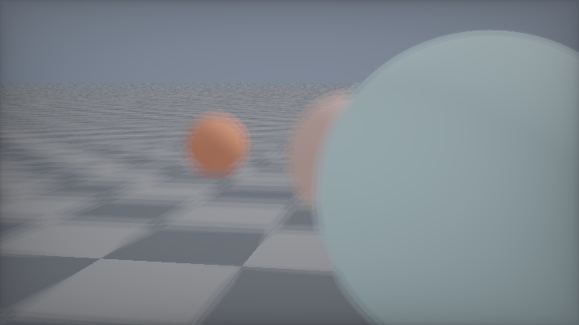
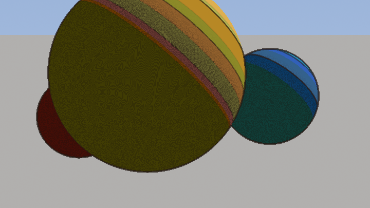
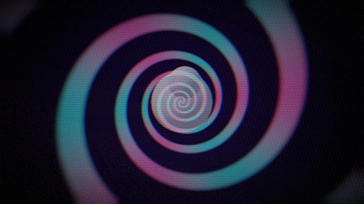
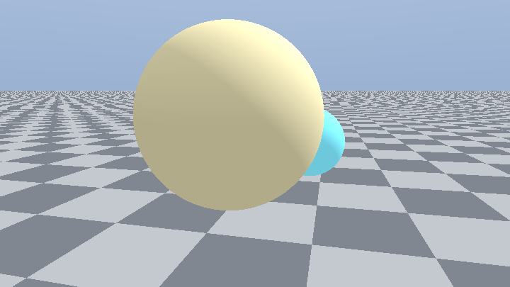
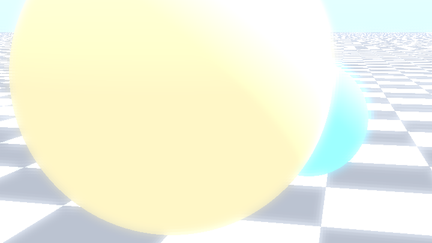
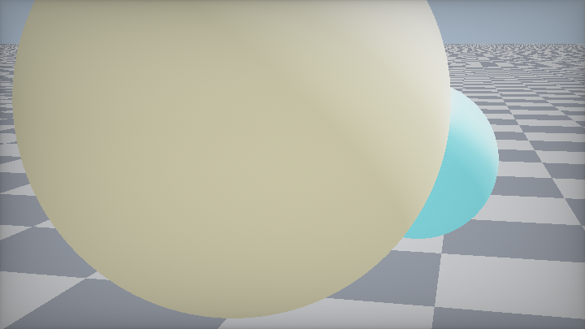
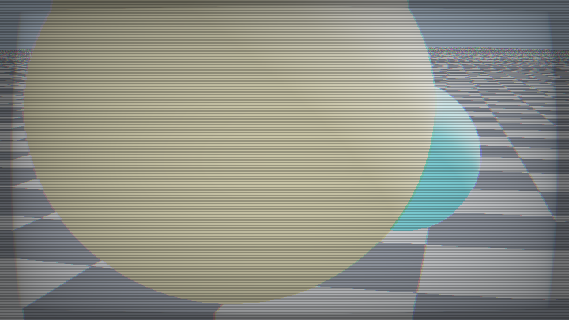
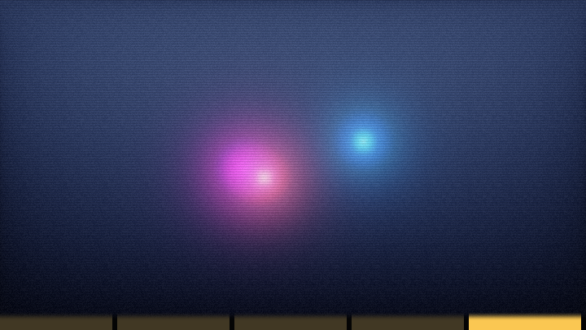

# 第 15 章 · 后期与 NPR

> 后期处理是「已经有一张图，再把它变好看/变风格」的艺术。
>
> 语料 `K_postfx` 有 306 个作品。分析笔记把它们收成四种基本动作：**重映射、邻域卷积、坐标扰动、阈值化图案**。本章按实现路径教你组合这些动作。
>
> 读完你应能搭出：模糊 → bloom → tonemap → dither/CRT/NPR 的完整出场管线。

---

## 15.1 后期的四种原子操作

| 动作 | 公式直觉 | 例子 |
|---|---|---|
| 逐像素重映射 | `c' = f(c)` | gamma、tonemap、posterize |
| 邻域加权求和 | `c' = Σ wᵢ c(p+dᵢ)` | blur、bloom、sobel、FXAA |
| 坐标扰动 | `c' = c(g(p))` | 桶形、色差、glitch |
| 与图案比较 | `c' = step(pattern, c)` | dither、扫描线、半调 |

复杂效果 = 多 Pass 串起这些原子。Gargantua 的 HDR bloom 是「阈值/降采样（重映射+卷积）→ 可分离模糊（卷积）→ 相加 → filmic tonemap（重映射）」。

---

## 15.2 模糊家族

### 可分离高斯（生产级默认）

二维高斯 = 横向 1D × 纵向 1D。半径 n 的 tap 从 `(2n+1)²` 降到 `2(2n+1)`。

> 📄 出自 `000154-lsBfRc-Buffer_pass_bloom/buffer_b.glsl`（横向）

<!-- glsl-skip -->
```glsl
float gauss(float x)
{
    return exp(-x * x / (2.0 * SIGMA * SIGMA));
}
// 循环：bloom += texture(... uv + vec2(i*spread/res.x, 0) ...) * w;
// 最后 bloom /= wg;  // 运行时归一化，强烈推荐
```

Buffer C 只把偏移改成 `(0, i*spread/res.y)`。

**参数**：先定要的像素半径 `R`，取 `SAMPLES ≈ 3σ`，`spread ≈ R/σ`。

### mipmap / LOD 作弊模糊

`textureLod(tex, uv, lod)` 约等于半径 `2^lod` 的 box 模糊，**一次采样**。

陷阱：**Shadertoy 的 Buffer 默认不生成 mipmap**。要在通道设置里打开，或像 Gargantua 那样手动做 mip atlas。

> 📄 出自 `000490-lstSRS-Gargantua_With_HDR_Bloom/image.glsl` — 手动 atlas 取多级 bloom

### One-sample / Kawase

> 📄 出自 `000151-MsdGD2-One_Sample_Blur`

把采样点放在四纹素中心之间，一次双线性 = 2×2 box。迭代几次半径翻倍。移动端 bloom 的祖先。

### 黄金角散景采样

> 📄 出自 `000259-4d2Xzw-Bokeh_disc/image.glsl`（Dave_Hoskins）

<!-- glsl-skip -->
```glsl
#define GOLDEN_ANGLE 2.39996323
mat2 rot = mat2(cos(GOLDEN_ANGLE), sin(GOLDEN_ANGLE), -sin(GOLDEN_ANGLE), cos(GOLDEN_ANGLE));
// 循环内：r += 1./r;  vangle = rot * vangle;
// col 用 pow(col,9) 做能量加权 → 亮点成光斑
```

`r += 1/r` 生成近似 `√n` 半径序列；能量加权是散景「亮核」的灵魂。tap 数要多（50–150），建议降分辨率做。

### 径向模糊 / God rays

沿「像素 → 光源」方向累加：

<!-- glsl-skip -->
```glsl
vec2 dir = lightPos - uv;
vec3 acc = vec3(0.0);
float illum = 1.0;
for (int i = 0; i < 32; i++) {
    uv += dir * density / 32.0;
    acc += texture(iChannel0, uv).rgb * illum;
    illum *= decay;
}
```

---

## 15.3 Bloom

### 三段式（务必记住）

1. **提取**：只留亮部（阈值或 soft knee）
2. **多尺度模糊**：单一高斯像贴了一圈毛边；5–8 个 σ 叠加才像真辉光
3. **相加**：`scene + bloom * strength`（加法！不是 mix）

### Soft knee 阈值（防闪烁）

```glsl
vec3 prefilter(vec3 c, float threshold, float softKnee)
{
    float br = max(c.r, max(c.g, c.b));
    float knee = threshold * softKnee;
    float soft = clamp(br - threshold + knee, 0.0, 2.0 * knee);
    soft = soft * soft / (4.0 * knee + 1e-5);
    float contrib = max(soft, br - threshold) / max(br, 1e-5);
    return c * contrib;
}
```

### Gargantua 的 atlas 压缩术

> 📄 出自 `000490-lstSRS-Gargantua_With_HDR_Bloom`

把 8 级降采样塞进一张 Buffer 的不同区域，**一次可分离模糊同时糊完所有级**，Image 再按权重取回。padding 必须留够，否则模糊泄漏到隔壁 octave。

合成时 bloom 强度往往是个位数百分比：`color += GetBloom(uv) * 0.08;`

### 零成本 glow：在 SDF 里累加

> 📄 出自 `000156-3s3GDn-GLOW_TUTORIAL`

raymarch 时累加 `1/(d*d+eps)`，再 `1-exp(-color*k)` tonemap。无额外 Pass，且自带遮挡。只适用于程序化场景。

### Gamma 警告

在 **线性空间** 做模糊/bloom。语料里 `000154-lsBfRc` 的 Image 曾连做两次 `pow(...,2.2)`——典型 bug。约定：Buffer 里存线性，最终输出一次 gamma。

---

## 15.4 景深与散景（DOF / Bokeh）

**单 Pass 假景深**：多深度球 + 按 `|z-focus|` 加宽采样。真 DOF 用 Buffer 可分离模糊；这里先建立 CoC 直觉。

<!-- glsl-from: examples/ch15_stage6.glsl -->
```glsl
float coc = abs(z - focus) * aperture;
col = blurTap(uv, coc);
```



### CoC

```
CoC = clamp(|depth - focus| * scale, 0, maxCoC)
```

存在 alpha，随模糊 Pass 透传（见第 13 章）。

### 三方向可分离六边形

> 📄 出自 `000158-MsG3Dz-Three_Pass_DOF_Example`（mu6k）

三个 Buffer 沿不同 `dir` 做 1D 模糊，偏移 ∝ CoC。深度加权近似 scatter：

<!-- glsl-skip -->
```glsl
        if (dist>=c.a){
            w*=max(.0,1.0-(dist-c.a)/thresh);
        }
```

前景可以糊到背景上；背景不可非法糊进更近的前景——靠这个不对称判断。

### 程序化光斑层

> 📄 出自 `000186-4s2yW1-Bokeh_Paralax`（knarkowicz）

不模糊整图，直接把点光源画成圆盘 + 指数辉光，多层视差滚动。零纹理采样，质量完美，只适合「满天光斑」类场景。

### DOF + 运动模糊合并采样

> 📄 出自 `000400-4dlyWX-Meta_CRT`

同一 tap 循环里：`offset = CoC * spiral + velocity * (t-0.5)`。尺度接近时省一半成本。

---

## 15.5 运动模糊

三条路：

| 路线 | 做法 | 适用 |
|---|---|---|
| 解析 | 对圆/球闭式积分覆盖率 | 少量简单几何 |
| 累积 | 多时刻重渲染平均 | 质量优先、贵 |
| 速度缓冲 | 沿屏幕速度拉伸采样 | 通用后期 |

### iq 解析 2D

> 📄 出自 `000307-MdSGDm-Analytic_Motionblur_2D`

解 `|x - (c+vt)| < r` 的时间区间，与快门 `[0,1]` 求交。成本与模糊长度无关。

**坑**：`|v|=0` 时除零，必须特判静止。

### 时间抖动累积

> 📄 出自 `000102-4sBGD1-Motion_Blur`

AA 循环同时分配子像素与子时刻；每像素加 `sin` 伪随机错开时间。快门常用电影标准 `0.5/24` 秒。

---

## 15.6 色调映射（出场前最后一闸）

HDR → 屏幕 `[0,1]`：

<!-- glsl-skip -->
```glsl
// 最快：胶片曝光
col = 1.0 - exp(-col * exposure);

// 电影感默认：ACES
col = clamp((x*(2.51*x+0.03))/(x*(2.43*x+0.59)+0.14), 0.0, 1.0);

// 然后 gamma
col = pow(col, vec3(1.0/2.2));
```

> 📄 对照集：`000101-lslGzl-Tone_mapping`（Zavie）一屏七条曲线。

顺序铁律：**先 tonemap，再 gamma**。反过来曲线全歪。

---

## 15.7 抖动（Dither）去色带

渐变出现一节节色带时，加 `1/255` 量级噪声：

<!-- glsl-frag -->
```glsl
float n = hash12(fragCoord) - 0.5;
col += n / 255.0;
```

受限调色板则用 Bayer/蓝噪声阈值在两色之间抖动：

> 📄 出自 `000218-MtjGRd-Palette_Dithering_Test`

<!-- glsl-skip -->
```glsl
float mixAmt = float(fract(idx) > dith); // dith 来自噪声纹理
return mix(c1, c2, mixAmt);
```

抖动纹理必须 **nearest**，否则阈值被插成连续值，抖动失效。

---

## 15.8 CRT / 扫描线 / 桶形

### 桶形畸变

```glsl
vec2 barrel(vec2 uv, float k)
{
    uv = uv * 2.0 - 1.0;
    uv *= 1.0 + k * dot(uv, uv);
    return uv * 0.5 + 0.5;
}
```

`k>0` 枕形/桶形外扩。配合边缘变黑（uv 出界）。

### 扫描线

<!-- glsl-frag -->
```glsl
float scan = 0.9 + 0.1 * sin(fragCoord.y * 3.14159);
col *= scan;
```

或按「物理 RGB 三栅」在 x 方向乘周期色条——Meta CRT 把这件事做到材质级。

> 📄 出自 `000400-4dlyWX-Meta_CRT`、`000087-Ms23DR-MattiasCRT`、`000060-4lB3Dc-VHS_pause_effect`

### VHS / Glitch

坐标扰动家族：

- 整行随机 x 偏移（`hash(floor(uv.y*rows) + floor(iTime*hz))`）
- RGB 分通道错位采样（色差）
- 噪声叠在暗部

> 📄 `000129-ldjGzV-VCR_distortion`、`000074-MlfSWr-VHS_tape_noise`、`000574-lfscD7-Hex_Glitch`

---

## 15.9 手绘 / 铅笔 / NPR

**油画味 NPR**：posterize + 阴影方向 hatch。先简化颜色层数，再加笔触——别一上来堆边缘检测。

<!-- glsl-from: examples/ch15_stage7.glsl -->
```glsl
col = floor(col*levels)/levels;
col *= hatch(uv, NdotL);
```



### 边缘 = 梯度或深度差分

Sobel / 邻域差分得到边强度，再乘纸张纹理：

<!-- glsl-skip -->
```glsl
float edge = length(vec2(
    luma(tex(uv+dx)) - luma(tex(uv-dx)),
    luma(tex(uv+dy)) - luma(tex(uv-dy))
));
col = mix(paperColor, inkColor, smoothstep(0.05, 0.2, edge));
```

### notebook drawings / hand-drawn sketch

> 📄 出自 `000574-XtVGD1-notebook_drawings`（flockaroo，574 likes）
> 📄 出自 `000290-MsSGD1-Hand-drawn_Sketch`（HLorenzi）

常见配方：

1. 降色阶（posterize）或 hatch 阈值
2. 沿梯度方向偏移 UV 采样，模拟笔触抖动
3. 叠纸张噪声 / 纤维
4. 边缘加粗且略微破碎（噪声调制 edge 阈值）

> 📄 `000346-MscSzf-Noise_Contour`（candycat）——噪声等高线卡通边

### 半调 / 排线

用旋转后的点阵或线图案与亮度比较：

<!-- glsl-skip -->
```glsl
vec2 p = rot * fragCoord;
float pattern = sin(p.x * scale) * sin(p.y * scale);
float h = step(pattern, luma * 2.0 - 1.0);
```

> 📄 `000075-Mdf3Dn-CMYK_Halftone`

### Toon

量化漫反射：`floor(NdotL * bands) / bands`，再叠边缘检测描边。

> 📄 `000108-4dVGRW-Post-Processing_Toon_Shading`

---

## 15.10 抗锯齿循环（AA）

### 子像素循环

> 语料标准骨架（iq 等多处）

<!-- glsl-skip -->
```glsl
vec3 tot = vec3(0.0);
#define AA 2
for (int m = 0; m < AA; m++)
for (int n = 0; n < AA; n++) {
    vec2 o = (vec2(float(m), float(n)) + 0.5) / float(AA) - 0.5;
    vec2 p = (2.0 * (fragCoord + o) - iResolution.xy) / iResolution.y;
    tot += render(p);
}
tot /= float(AA * AA);
```

代价 ×AA²。预览用 AA=1，出图用 2 或 3。

### 分析性 AA

对 2D SDF：`smoothstep(0., fwidth(d), -d)` 或 `0.5 - d/fwidth(d)`。零额外采样。

### FXAA / 后期边软化

在最终色图上找边再混合——便宜但糊。适合已经渲完的 Buffer。

---

## 15.11 暗角、色差、光晕

<!-- glsl-skip -->
```glsl
// 暗角
vec2 q = uv - 0.5;
col *= 1.0 - dot(q, q) * 1.5;

// 简单色差
float r = texture(iChannel0, barrel(uv, 0.05)).r;
float g = texture(iChannel0, barrel(uv, 0.00)).g;
float b = texture(iChannel0, barrel(uv,-0.05)).b;
col = vec3(r, g, b);
```

镜头光晕：在光源屏幕投影附近程序化画幽灵光斑（见 `000255-4sX3Rs-Lens_Flare_Example`），或对亮部做径向模糊。

---

## 15.12 推荐出场配方

**较难成片 · 电影出场包**：色差 + 暗角 + 胶片颗粒 + 轻微桶形——一条龙叠在霓虹场景上。

<!-- glsl-from: examples/ch15_stage8.glsl -->
```glsl
col = chroma(uv);
col *= vignette;
col += grain;
```



### 电影感 3D

```
渲染线性 HDR
→ （可选）DOF
→ Bloom（阈值 + 双 Pass 模糊）
→ ACES / 1-exp
→ 轻微 dither
→ gamma 2.2
→ 暗角
```

### 复古 CRT

```
渲染
→ 桶形
→ 扫描线 × RGB 栅
→ 轻微色差 + 噪点
→ vignette
```

### 铅笔 NPR

```
渲染灰度或简单光照
→ 边缘检测
→ 排线 / 噪声阈值
→ 纸纹相乘
```

---

## 15.13 性能速查

| 效果 | 成本 | 备注 |
|---|---|---|
| 可分离模糊 2×15 tap | 中 | 通用 |
| mip lod 模糊 | 极低 | 质量一般 |
| 黄金角 bokeh 150 tap | 极高 | 降分辨率 |
| AA 3×3 | ×9 渲染 | 预览关掉 |
| ACES / dither / vignette | 可忽略 | 尽管上 |
| 解析运动模糊 | 极低 | 仅简单形状 |

---

## 15.14 notebook drawings 拆解：从照片到手绘

> 📄 出自 `000574-XtVGD1-notebook_drawings/image.glsl`（flockaroo，574 likes）

这是 NPR 桶里最值得精读的作品之一。骨架不是「画边」，而是**多次沿随机方向偏移采样，再组合成笔触感**：

<!-- glsl-skip -->
```glsl
vec4 getRand(vec2 pos)
{
    return textureLod(iChannel1,pos/Res1/iResolution.y*1080., 0.0);
}
vec4 getCol(vec2 pos)
{
    vec2 uv=((pos-Res.xy*.5)/Res.y*Res0.y)/Res0.xy+.5;
    vec4 c1=texture(iChannel0,uv);
    // ... 边缘羽化、灰度混合成「纸上颜料」...
}
```

实现思路（教学翻译）：

1. `iChannel0` = 源图像（或渲染结果）
2. `iChannel1` = 噪声，用来抖动采样位置与笔触方向
3. 在梯度方向上反复取样，模拟铅笔顺着明暗边界「搓」
4. 限制最大亮度（`min(..., .7)`）让画面像印在纸上而不是自发光屏

你自己做简化版时，不必复刻全部循环，先实现：

<!-- glsl-skip -->
```glsl
vec2 grad = vec2(
    luma(tex(uv+dx)) - luma(tex(uv-dx)),
    luma(tex(uv+dy)) - luma(tex(uv-dy))
);
vec2 dir = normalize(vec2(-grad.y, grad.x) + 1e-4); // 切向 = 笔触方向
float n = hash12(fragCoord);
vec3 stroke = texture(iChannel0, uv + dir * n * 0.01).rgb;
float edge = smoothstep(0.05, 0.25, length(grad));
vec3 paper = vec3(0.92, 0.90, 0.85);
fragColor = vec4(mix(paper, stroke * paper, edge), 1.0);
```

Hand-drawn Sketch（`000290-MsSGD1`）则偏 3D：raymarch 出灰度后，再叠轮廓与排线。两条路——**图像域 NPR** vs **几何域 NPR**——选场景已有深度/法线时用后者更稳。

---

## 15.15 完整「电影出场」可粘贴骨架

把第 15 章收成一份可运行的 Image Pass 大纲（假设 `iChannel0`=场景线性色，`iChannel1`=已模糊的 bloom）：

```glsl
void mainImage(out vec4 fragColor, in vec2 fragCoord)
{
    vec2 uv = fragCoord / iResolution.xy;
    vec2 q  = uv - 0.5;

    // 轻微桶形（可选）
    vec2 uvd = uv * 2.0 - 1.0;
    uvd *= 1.0 + 0.05 * dot(uvd, uvd);
    vec2 uvb = uvd * 0.5 + 0.5;

    vec3 col = texture(iChannel0, uvb).rgb;
    vec3 blo = texture(iChannel1, uvb).rgb;
    col += blo * 0.08;

    // tonemap
    col = col * 1.2;
    col = col / (1.0 + col);                 // Reinhard
    // 或：col = 1.0 - exp(-col * 1.2);

    // dither
    col += (hash12(fragCoord) - 0.5) / 255.0;

    // gamma
    col = pow(max(col, 0.0), vec3(1.0 / 2.2));

    // vignette
    col *= 1.0 - dot(q, q) * 1.3;

    fragColor = vec4(col, 1.0);
}
```

把 bloom 那路换成第 13 章模板 B 即可上线。

---

## 15.16 练习作业

1. 给任意 raymarch 场景加 `1-exp` tonemap + 暗角 + dither，对比 clamp。
2. 两 Pass 可分离模糊做 bloom；调 soft knee。
3. 复制桶形 + 扫描线，做成「监视器」。
4. 用 `fwidth` 给 2D SDF 做 AA；再试 AA=2 循环，比成本。
5. 读 `000259-4d2Xzw-Bokeh_disc`，把 `ITERATIONS` 改成 20，观察亮点如何碎成点阵。

---

## 15.17 阶梯实战：亮球场景上的后期管线

后期的输入永远是「一张已经算好的图」。这里用几颗亮球当场景，五步把 Bloom → tonemap → CRT → NPR 走完。

文件在 `examples/ch15_stage1..5.glsl`。多 Pass 真·可分离模糊到了 Shadertoy 再拆；网页上用单 Pass 近似，观感一致。

### 阶段 1：基础亮球场景

后续所有后期的输入。

<!-- glsl-from: examples/ch15_stage1.glsl -->
```glsl
{
    vec2 p = (2.0 * fragCoord - iResolution.xy) / iResolution.y;

    float an = 0.20 + 0.10 * sin(iTime * 0.12);
    vec3  ta = vec3(0.0, 0.55, 0.0);
    vec3  ro = vec3(4.8 * sin(an), 1.35, 4.8 * cos(an));
    mat3  ca = setCamera(ro, ta);
    vec3  rd = ca * normalize(vec3(p, 2.2));

    vec3 col = renderScene(ro, rd);
    col = pow(col, vec3(0.4545));
    fragColor = vec4(col, 1.0);
```




### 阶段 2：阈值 + Bloom

先提取亮部再模糊加回。

<!-- glsl-from: examples/ch15_stage2.glsl -->
```glsl
vec3  bloom  = blurV(uv, px * 2.5);

    vec3 col = base + bloom * 1.25 + bright * 0.2;
    col = pow(col, vec3(0.4545));
    fragColor = vec4(col, 1.0);
```




### 阶段 3：tonemap + 暗角 + dither

显示管线三件套。

<!-- glsl-from: examples/ch15_stage3.glsl -->
```glsl
vec3 col = tonemap(base + bloom * 1.25);
    col = pow(col, vec3(0.4545));

    col *= 0.60 + 0.40 * pow(16.0 * uv.x * uv.y * (1.0 - uv.x) * (1.0 - uv.y), 0.28);
    col += (hash21(fragCoord) - 0.5) / 255.0;

    fragColor = vec4(clamp(col, 0.0, 1.0), 1.0);
```




### 阶段 4：CRT

扫描线、微畸变、色差。

<!-- glsl-from: examples/ch15_stage4.glsl -->
```glsl
float scan = 0.88 + 0.12 * sin(fragCoord.y * 3.14159);
    col *= scan;

    // 屏幕边缘暗角（CRT bezels）
    vec2 q = uv - 0.5;
    col *= 1.0 - dot(q, q) * 0.35;

    fragColor = vec4(clamp(col, 0.0, 1.0), 1.0);
```




### 阶段 5：NPR 卡通

Sobel 边 + 色阶量化。

<!-- glsl-from: examples/ch15_stage5.glsl -->
```glsl
float edge = clamp(length(vec2(gx, gy)) * 8.0, 0.0, 1.0);

    vec3 col = mix(c, vec3(0.05, 0.05, 0.08), edge * 0.85);
    fragColor = vec4(col, 1.0);
```


### 回头看

| 阶段 | 新增 | 对应 |
|---|---|---|
| 1 | 场景 | — |
| 2 | Bloom | 15.2–15.3 |
| 3 | tonemap/暗角/抖动 | 15.6–15.7 |
| 4 | CRT | 15.8 |
| 5 | NPR | 15.9 |

**接着**：只保留 Bloom 关 CRT；把 NPR 边缘颜色改成深青；把场景换成第 7 章球。

## 课间餐点 · 一键电影出场：后期开关连奏

> 阶梯练零件；这里把本章词汇一次端上桌。约 2 分钟看完一轮自动轮播——像课间买的糖，甜，但糖纸上写满了今天的知识点。

素渲染 → bloom → 暗角 → ACES → 胶片颗粒/扫描线。后期章的「放映室甜点」。

**怎么玩**

- **自动**：每约 2.75 秒解锁下一阶段，循环播放「从零长到成片」。
- **手动**：按住鼠标左右拖，scrub 阶段（底部黄条是进度）。
- **对照**：每阶段只多一样本章技法，看画面哪一帧突然「像了」。

**五幕菜单**

1. **素场景**
2. **+ Bloom**
3. **+ 暗角**
4. **+ ACES**
5. **胶片颗粒成片**

**关键旋钮**

| 旋钮 | 感觉 |
|---|---|
| bloom 增益 | 霓虹 |
| 暗角 | 电影感 |
| 颗粒 | 胶片 |

**动手改**

1. 把 `STAGE_SEC` 改成 `1.2`，快进看结构。
2. 卡在最后一阶段（鼠标拖到最右），只调一个旋钮。
3. 回到本章对应 `stage` 小例，找到餐点里同名技法的「零件版」。

<!-- glsl-from: examples/ch15_snack.glsl -->
```glsl
// snackStage() 解锁图层 · 底部黄条 = 当前阶段 · 鼠标拖拽 scrub
```



## 要点回顾

1. 后期 = 重映射 + 卷积 + 扭曲坐标 + 图案阈值的组合拳。
2. **Bloom 三段式**：提取 → 多尺度模糊 → 相加；线性空间操作。
3. DOF 核心是 CoC；gather 用深度加权近似真实散景遮挡。
4. CRT = 桶形 + 扫描线 + 色差 + 噪点；NPR = 边 + 排线/抖动 + 纸纹。
5. 出场顺序：HDR 效果 → tonemap → gamma → 风格层（dither/CRT）。
6. AA 循环贵，2D 优先 `fwidth`；散景优先降分辨率。

---

> 上一章：[第 14 章 · 仿真](14-仿真.md)
>
> 下一章：[第 16 章 · 声音文字与交互](16-声音文字与交互.md) —— mainSound、FFT、字体、键盘、cubemap、鼠标相机。
