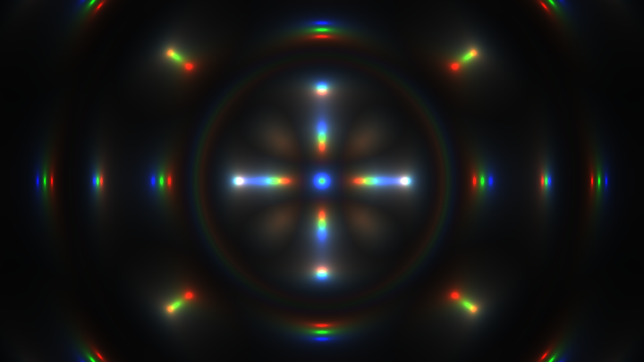
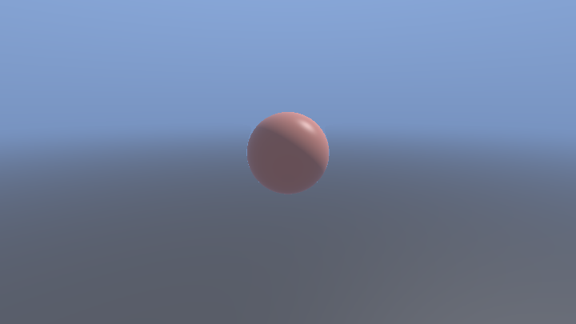
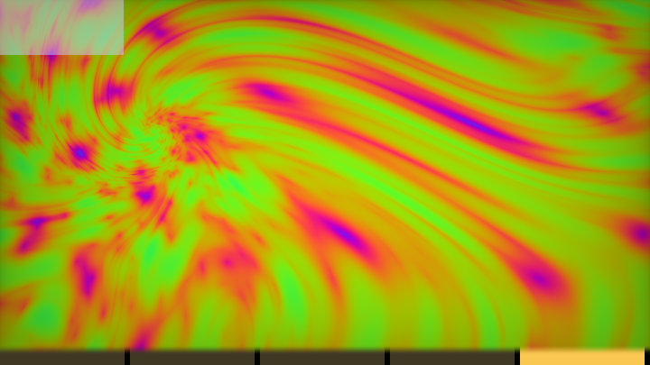

# 第 17 章 · 代码高尔夫

> 高尔夫（code golf）= 用尽一切手段把字符数压到极限。
>
> 语料 `P_golf_minimal` 有 151 个作品；标签 `golf` 在全库出现 79 次。它们是 Shadertoy 文化的一部分——但**不是学习渲染的正路**。
>
> 本章教你三件事：怎么把高尔夫**读懂**、常见压缩词典、以及什么时候应该把文件合上。

---

## 17.1 高尔夫在优化什么

目标函数几乎总是：

> **源码字符数（或字节数）最小，同时画面仍然「成立」。**

有时附带约束：`256 chars`、`512`、`tweetable`（约 280）、`4k intro` 风格。标题里出现 `394 Chars`、`156 chars_` 就是在报分。

> 📄 `000631-XXyGzh-Zippy_Zaps_394_Chars_`、`000121-DlBcz1-Microraymarcher_156_chars_`、`000238-msjXRK-Cosmic_256_Chars_`

它**不**优化：可读性、数值稳定、性能（有时反而更慢）、可维护性、教学清晰度。

---

## 17.2 何时不该学高尔夫

请先读完这段再往下：

| 你的目标 | 该不该钻高尔夫 |
|---|---|
| 学会 raymarching / 光照 / 流体 | **不该**。去读有完整 `map`/`calcNormal` 的作品 |
| 做产品、做工具、做可改参数的效果 | **不该** |
| 已经会写可读版，想欣赏 demoscene 文化 | 可以 |
| 想从 20 行可读版压到 1 条推特 | 可以，当作谜题 |
| 第一周学 GLSL | **绝对不该** |

高尔夫会训练一种有害直觉：变量越短越好、公式越不可读越高级。真正高级的是 **iq 那种可读且短的代码**——短是清晰的副产品，不是目标。

---

## 17.3 如何阅读高尔夫：五步拆解

以 Creation by Silexars 为例——史上最高赞高尔夫之一：

> 📄 出自 `001350-XsXXDn-Creation_by_Silexars/image.glsl`（Danguafer，1350 likes）

<!-- glsl-skip -->
```glsl
#define t iTime
#define r iResolution.xy

void mainImage( out vec4 fragColor, in vec2 fragCoord ){
	vec3 c;
	float l,z=t;
	for(int i=0;i<3;i++) {
		vec2 uv,p=fragCoord.xy/r;
		uv=p;
		p-=.5;
		p.x*=r.x/r.y;
		z+=.07;
		l=length(p);
		uv+=p/l*(sin(z)+1.)*abs(sin(l*9.-z-z));
		c[i]=.01/length(mod(uv,1.)-.5);
	}
	fragColor=vec4(c/l,t);
}
```

### 步骤 1：恢复名字

| 高尔夫 | 可读含义 |
|---|---|
| `t` | `iTime` |
| `r` | `iResolution.xy` |
| `c` | 输出颜色 RGB |
| `l` | `length(p)`，到中心距离 |
| `z` | 沿「深度/时间」推进的相位 |
| `p` | 居中并校正宽高比的坐标 |
| `uv` | 被扭曲后的采样坐标 |

### 步骤 2：认出循环结构

`for(i=0;i<3;i++)` + `c[i]=...` → **同一套扭曲算三遍，分别写入 R、G、B**，相位 `z+=.07` 错开 → 色差/色散拖尾。

### 步骤 3：翻译核心公式

<!-- glsl-skip -->
```glsl
uv += p/l * (sin(z)+1.) * abs(sin(l*9. - z - z));
```

- `p/l` = 径向单位向量（从中心指向外）
- `(sin(z)+1.)` = 0..2 的脉动强度
- `abs(sin(l*9 - 2z))` = 随半径的环状条纹

整体：把 UV **沿径向推出去**，推出量随时间和半径变化。

### 步骤 4：认出着色模型

<!-- glsl-skip -->
```glsl
c[i] = .01 / length(mod(uv,1.)-.5);
```

`mod(uv,1)-.5` 是重复网格里到最近中心的向量；`1/length` 是经典 glow。所以画面 = **扭曲域上的点阵辉光**。

### 步骤 5：对照写可读版

```glsl
void mainImage(out vec4 fragColor, in vec2 fragCoord)
{
    vec3 color = vec3(0.0);
    float radiusLen = 0.0;
    float phase = iTime;

    for (int channel = 0; channel < 3; channel++) {
        vec2 uv = fragCoord / iResolution.xy;
        vec2 p = uv - 0.5;
        p.x *= iResolution.x / iResolution.y;

        phase += 0.07;
        radiusLen = length(p);

        float radialPush = (sin(phase) + 1.0) * abs(sin(radiusLen * 9.0 - 2.0 * phase));
        uv += (p / radiusLen) * radialPush;

        vec2 cell = mod(uv, 1.0) - 0.5;
        color[channel] = 0.01 / length(cell);
    }

    fragColor = vec4(color / radiusLen, iTime);
}
```

**一旦你能写出右边，左边就不再神秘。** 高尔夫阅读的终极目标是这张对照表，不是背字符技巧。

---

## 17.4 另一例：156 字符 Raymarcher

> 📄 出自 `000121-DlBcz1-Microraymarcher_156_chars_/image.glsl`（iq）

<!-- glsl-skip -->
```glsl
void mainImage(out vec4 p,vec2 f){for(
p=vec4(f/iResolution.y,1,0)-.6;
f.x-->0.;
p*=.9+.1*length(cos(.7*p.x+vec3(p.z+iTime,p)))+.01*cos(4.*p.y));
p=(p+p.z)*.1;}
```

作者注释里给了**推导链**——这是高尔夫里罕见的珍品：

```
p += f(p)*rd
→ p += f(p)*normalized(p)
→ p *= 1+f(p)*step
→ ...
```

阅读要点：

1. **`out vec4 p` 兼做位置与最终颜色**——省变量。
2. **`f.x-->0.`** 把 `fragCoord.x` 当循环计数器（副作用）。
3. **`p*=...` 是「位置乘以标量」形式的步进**，不是标准 `p+=rd*d`。
4. 最后一行把位置映射成颜色。

可读对照（概念版）：

<!-- glsl-skip -->
```glsl
void mainImage(out vec4 fragColor, in vec2 fragCoord)
{
    // 用位置向量当行进状态（高尔夫把相机与步进揉在一起）
    vec3 pos = vec3(fragCoord / iResolution.y, 1.0) - 0.6;
    for (int i = 0; i < /*很多*/; i++) {
        float field = /* 某种场 g(pos) - k */;
        pos *= 0.9 + 0.1 * field; // 压缩过的步进
    }
    fragColor = vec4((pos + pos.z) * 0.1, 1.0);
}
```

真正要学的是注释里的代数变形，不是 `f.x--`。

---

## 17.5 常见压缩技巧词典

下面是「看见就能认」的词典。学会识别，不要优先学会使用。

### 名字与声明

| 技巧 | 例子 | 省什么 |
|---|---|---|
| 单字母变量 | `p,c,d,t,o,f` | 标识符 |
| `#define` 短名 | `#define t iTime` | 重复的长名 |
| 复用 `out` 参数 | `out vec4 p` 当位置 | 少声明一个变量 |
| 默认部件 | `vec3(p.z+iTime,p)` 利用 swizzle 构造 | 少打字 |
| 省略 `0` | `.5` `.9` `1.` | 字符 |
| 无空格 | `p*=.9+.1*` | 空白 |

### 语法阴招

| 技巧 | 含义 |
|---|---|
| `f.x-->0.` | for 循环：`f.x--` 直到 `>0` 为假 |
| `i++` 写在条件里 | 省循环体花括号 |
| `mix`/`clamp` 嵌套代替 if | 无分支且可能更短 |
| `p=p.yzx` 置换 | 廉价「旋转」坐标 |
| `c[i]` 写通道 | 三通道共享公式 |

### 数学替身

| 可读 | 高尔夫常见替身 |
|---|---|
| `normalize(v)` | `v/length(v)` 或靠场函数顺带归一 |
| `mat2` 旋转 | `p=p*mat2(c,s,-s,c)` 或置换近似 |
| `smoothstep(a,b,x)` | `clamp((x-a)/(b-a),0.,1.)` 有时更短或更长，看参数 |
| `pow(c,2.2)` | `c*c` 近似 gamma |
| `exp(-d*d)` | `1./(1.+d*d)` |
| `hash` | `fract(sin(dot(p,vec2(...)))*k)` 压成一行 |
| 噪声 | 直接 `cos`/`sin` 叠层冒充 |

### 渲染结构压缩

| 技巧 | 说明 |
|---|---|
| 无 `map`/`render` 函数 | 全进 `mainImage` |
| 步进与着色公式耦合 | 最后一行顺便 tonemap |
| 固定迭代次数 | `for(i=0;i++<99;)` |
| 不做法线 | 用位置或步进次数当颜色 |
| 负空间省括号 | 运算符优先级靠吃透 |

### Xor 风格短作品

语料里 Xor 大量 `sub512` / `300` 字符星空、星云、火焰：

> 📄 `000402-l3cfW4-Starship_320_`、`000366-3csSWB-Singularity_381_`、`000226-3XXSWS-3D_Fire_340_`、`000164-WXyczK-Rocaille_200_`

阅读策略：先找 `for` 循环（几乎一定是 raymarch 或层积），再找 `length`/`cos` 场，最后看 `fragColor=` 的 tonemap。

### Fabrice 的「短但可解析」

> 📄 `000223-Ms3SzB-rosace_3c`、`000209-lljSDy-quadtree_3`、`000348-ldfczS-isovalues_3`

FabriceNeyret2 的短码常常仍保留数学可解释性——**优先读这些练翻译**，比读纯粹搅在一起的 tweet 更有收获。

---

## 17.6 从可读版对照理解：练习法

拿任意高尔夫，强制自己产出三份文件：

1. **原文**（不动）
2. **美化版**：自动格式化 + 变量重命名，逻辑不变
3. **教学版**：拆函数、加注释、恢复标准 raymarch 结构

只做 1→2，你会停在「能跑的乱码」。做到 3，你才真正懂。

**可读对照起点**：Creation 族隧道/等离子的教学版。先读懂这个，再看高尔夫原文。

<!-- glsl-from: examples/ch17_stage1.glsl -->
```glsl
// named vars: phase, radialWarp, channel glow
```


### 练习题（语料内）

| 作品 | 建议焦点 |
|---|---|
| `001350-XsXXDn-Creation_by_Silexars` | 径向扭曲 + 三通道相位 |
| `000121-DlBcz1-Microraymarcher_156_chars_` | 步进代数变形 |
| `000481-MsjSW3-Ether`（nimitz） | 短但画面强的 3D |
| `000176-DlySDD-Nebula_Explained`（Xor） | **作者自己写了 explained**——金矿 |
| `001063-mtyGWy-Shader_Art_Coding_Introduction` | 教学向「看起来炫但代码可读」 |

`Nebula Explained` 这类「高尔夫 + 讲解」是最佳教材：作者已经帮你做了对照。

---

## 17.7 自己写高尔夫的合理姿势

若你已经会了，想玩：

1. **先写可读版并锁定画面**（截图参考）。
2. 再开新文件压缩；每压一波对比截图，防止「字符少了但画面崩了」。
3. 用脚本数字符（注意 Shadertoy 是否计空白/`#define` 展开规则——不同比赛不同）。
4. 压完**留一份可读版在仓库**，否则一个月后你自己也读不懂。

压缩顺序建议（伤害可读性从轻到重）：

```
去注释 → 短变量名 → 去空格与换行 → #define →
合并表达式 → 复用 out 参数 → 阴招语法 → 改算法近似
```

最后两步才会真正破坏可维护性。

---

## 17.8 高尔夫与本手册其它章的关系

| 你在手册里学的 | 高尔夫里长什么样 |
|---|---|
| 第 0 章场思维 | 仍在，只是场被压成一行 `cos`/`length` |
| 第 7–9 章 raymarch | `for` + `p+=` 或 `p*=`，无法线函数 |
| 第 4 章调色板 | `0.5+0.5*cos(x+vec3(0,.3,.7))` 压进最终式 |
| 第 15 章 glow | `k/length(...)` 到处都是 |
| 第 13 章多 Pass | 多数高尔夫是 **单 Pass**；多 Pass 高尔夫更少见 |

**结论**：高尔夫是「把已会的技法写短」，不是「发现新技法」的地方。技法来源仍是可读的高赞作品与本手册前几章。

---

## 17.9 文化注释：为什么社区热爱它

- **约束激发创意**：256 字符像十四行诗，限制本身是玩法。
- **可移植到推特 / pouet / 4k intro** 文化一脉。
- **高信息密度**：一眼看完整个世界的生成式。

尊重这种文化，同时保持清醒：你的职业项目里提交 156 字符 raymarcher，是事故不是排面。

---

## 17.10 字符级技巧扩词表（看见就翻译）

再补一批语料高频阴招，专门服务「阅读」：

### 利用 GLSL 宽松转换

<!-- glsl-skip -->
```glsl
// 布尔当 float
p += (d<0.) * n;          // 代替 if(d<0.) p+=n;

// 整数循环边界写成浮点比较
for(float i=0.;i++<5e1;)  // 50 次

// 把 fragColor 当临时寄存器
fragColor.rgb = ...;
fragColor.a = something;  // 稍后当权重用
```

### 坐标与相机一行化

<!-- glsl-skip -->
```glsl
// 常见短相机
vec3 p=vec3((FC.xy*2.-R)/R.y,1); // FC=fragCoord, R=分辨率
// 然后 p 既当射线方向的基底，又被步进乘法更新
```

Xor / Snoopeth 系作品爱用 `FC`、`R`、`t` 三件套 `#define`。

### 颜色即场

许多高尔夫**没有独立着色**：

<!-- glsl-skip -->
```glsl
fragColor = vec4(d, d*d, .5+d, 1); // 距离直接当 RGB
fragColor = vec4(.5+.5*cos(d+vec3(0,.3,.7)),1); // 调色板压进一行
```

看到 `cos(...+vec3(0,.3,.7))` 就翻译成「第 4 章余弦调色板」。

### 用 `mix` 选择

<!-- glsl-skip -->
```glsl
c = mix(c, c2, step(d,0.));   // d<=0 时取 c2
c = mix(a,b,t>0.);            // 布尔选支
```

比 `if` 短，有时还更长——高尔夫里以最终字符为准。

---

## 17.11 对照表：同一效果的三档写法

以「径向辉光圆」为例。

**教学档（本手册风格）**

```glsl
void mainImage(out vec4 fragColor, in vec2 fragCoord)
{
    vec2 p = (fragCoord - 0.5 * iResolution.xy) / iResolution.y;
    float d = length(p);
    float glow = 0.02 / d;
    vec3 col = vec3(glow);
    fragColor = vec4(col, 1.0);
}
```

**工程短档（清晰但省字）**

```glsl
void mainImage(out vec4 o, vec2 u)
{
    vec2 p = (u - .5*iResolution.xy)/iResolution.y;
    o = vec4(vec3(.02/length(p)),1);
}
```

**高尔夫档**

<!-- glsl-skip -->
```glsl
void mainImage(out vec4 o,vec2 u){u=(u-.5*iResolution.xy)/iResolution.y;o.xyz=vec3(.02/length(u));}
```

三档功能相同。学习时永远从教学档来；只有参赛才滑到第三档。

---

## 17.12 阅读检查清单（打印贴显示器）

打开一个标题含 `Chars` / `golf` / `tweet` 的作品时：

- [ ] 有没有 `#define`？先展开在纸上
- [ ] `for` 循环是 raymarch、层积，还是 RGB 三通道？
- [ ] 哪个变量是「位置」？哪个是「颜色」？是否复用？
- [ ] 场函数长什么样？`length`/`cos`/`abs` 嵌套画个树
- [ ] 最终 `fragColor=` 有没有 tonemap / gamma / 除以某个因子？
- [ ] 能否用 30 行可读 GLSL 复现 80% 的画面？

最后一项打勾，这篇高尔夫就算读完了。

---

## 17.13 练习作业

1. 把 Creation by Silexars 写成教学档，并调 `9.0` 与 `.07` 两个魔数。
2. 读 `000176-DlySDD-Nebula_Explained`，对照作者说明画流程图。
3. 取你第 3 章的一个 SDF 图案，写出工程短档（目标 < 20 行），**不要**追求绝对最短。
4. 读 `000121-DlBcz1` 注释中的代数链，用自己的话复述为什么 `p*=` 能代替 `p+=rd*d`。
5. （可选）参加一次「256 字符」自娱比赛：先可读，后压缩，git 保留两份。

---

## 17.16 阶梯实战：同一画面的三档写法

按 17.6 的练习法，这里给一条可跑对照线（Creation 族），再加一颗「短但清晰」的微光追：

| 阶段 | 文件 | 档位 |
|---|---|---|
| 1 | `ch17_stage1` | 教学可读（嵌在 17.6） |
| 2 | `ch17_stage2` | 紧凑中间态 |
| 3 | `ch17_stage3` | 迷你高尔夫味 |
| 4 | `ch17_stage4` | **短而清晰的微 Raymarcher**（学习目标） |

<!-- glsl-from: examples/ch17_stage2.glsl -->
```glsl
// compact middle ground
```


<!-- glsl-from: examples/ch17_stage3.glsl -->
```glsl
// mini-golf density (still readable enough)
```



<!-- glsl-from: examples/ch17_stage4.glsl -->
```glsl
// short clear raymarch: sphere + plane + sky
```



**延展**：把 stage1 压到 stage3 字符量，截图对比；再把 stage4 压一次——你会感到「短」和「不可读」不是一回事。

## 课间餐点 · 三档同屏橱窗：可读·压缩·咒语

> 阶梯练零件；这里把本章词汇一次端上桌。约 2 分钟看完一轮自动轮播——像课间买的糖，甜，但糖纸上写满了今天的知识点。

同一等离子体，三档写法轮播：可读结构 → 中度压缩 → 高尔夫密度。破除「短码恐惧」的趣味对照。

**怎么玩**

- **自动**：每约 2.75 秒解锁下一阶段，循环播放「从零长到成片」。
- **手动**：按住鼠标左右拖，scrub 阶段（底部黄条是进度）。
- **对照**：每阶段只多一样本章技法，看画面哪一帧突然「像了」。

**五幕菜单**

1. **可读版结构感**
2. **中度压缩**
3. **高尔夫密度**
4. **三档闪切对照**
5. **打磨暗角**

**关键旋钮**

| 旋钮 | 感觉 |
|---|---|
| 时间 | 等离子体流速 |
| 缩放 | 细节 |
| 闪切速度 | 对照节奏 |

**动手改**

1. 把 `STAGE_SEC` 改成 `1.2`，快进看结构。
2. 卡在最后一阶段（鼠标拖到最右），只调一个旋钮。
3. 回到本章对应 `stage` 小例，找到餐点里同名技法的「零件版」。

<!-- glsl-from: examples/ch17_snack.glsl -->
```glsl
// snackStage() 解锁图层 · 底部黄条 = 当前阶段 · 鼠标拖拽 scrub
```



## 要点回顾

1. 高尔夫优化**字符数**，牺牲一切别的；新手主线应避开。
2. 阅读五步：**恢复命名 → 认循环 → 译公式 → 认着色 → 写可读对照**。
3. 词典用来**识别** `#define t`、`c[i]`、`f.x--`、位置复用等，不是用来炫技。
4. 优先读带 Explained / 注释推导的短码（iq、Fabrice、Xor 的 explained 版）。
5. 自己压码必须保留可读版；先锁定画面再压缩。
6. 技法从完整作品学；高尔夫只是技法的极限书写体。

---

## 17.14 附：标题里的数字怎么读

| 标题片段 | 通常含义 |
|---|---|
| `256 Chars` / `256_` | 源码约 256 字符 |
| `512` / `sub512` | 512 字节/字符档 |
| `tweet` / `280` | 适合一条推特 |
| `4k` | 4 kilobyte intro 文化，未必真 ≤4096 |
| `3c` / `rosace_3c` | Fabrice 系列短码编号 |
| `Explained` | **优先读**：作者准备了人话 |

计数方式因比赛而异：有的不计空白，有的计 `#define` 展开后，有的只计 `mainImage` 函数体。不要用不同规则的数字横比「谁更短」。

本地语料里高尔夫桶前几名（按赞）：

1. `001350-XsXXDn-Creation_by_Silexars` — 必读入门
2. `001063-mtyGWy-Shader_Art_Coding_Introduction` — 教学向，偏可读
3. `000631-XXyGzh-Zippy_Zaps_394_Chars_` — 现代短码闪电
4. `000481-MsjSW3-Ether` — nimitz 短 3D
5. Xor 的 `320_` / `381_` / `256_` 星空系列 — 适合练翻译词典

读的顺序建议：**Silexars → Explained 系 → iq micro → Xor 星空**。不要第一天就啃 Zippy Zaps。

也可以把高尔夫当「单元测试」：你若自称懂径向扭曲，就应能在不看原文的情况下，用 40 行复现 Silexars 八成画面。复现失败的地方，就是你词汇表的缺口——回到第 0、3、4 章补，而不是继续收集更短的咒语。

---

## 17.15 一句话收束

> 高尔夫是修辞学，不是物理学。
>
> 先成为能把场写清楚的人，再决定要不要把句子写短。

若只能带走一条阅读经验，带走这条：

> **任何短到像咒语的 shader，背后都有一个你已经在前几章学过的普通算法。**

认出那个算法，咒语就破了。

本手册到第 17 章为止，已经覆盖「能记事的 shader」与「能交互的 shader」。高尔夫只是附录式的阅读力训练——用完即走，别在此安家。

---

> 上一章：[第 16 章 · 声音文字与交互](16-声音文字与交互.md)
>
> 下一章：按手册目录继续——配方大全与主题专题（见 README）。
>
> 若你是从仿真/后期一路读下来的：此刻你已经具备「多 Pass 状态机 + 后期管线 + 交互输入」的完整闭环。回去做一个小项目：键盘相机 + Buffer 拖尾 + bloom + 一行 FFT 脉动——比再读十个高尔夫更有用。
