# 第 18 章 · 效果配方大全

> 这是全书的**词汇表**。第 0 章教你怎么拆；这一章告诉你「拆完之后该做成什么场」。
>
> 每个条目都按同一模板：**心法 → 维度 → 步骤 → 参数 → 必读语料**。先把画面翻译成场，再选渲染手段，最后对着语料核对。
>
> 路径均相对于 `shaders/shaders/`，文件夹名已在语料库中核实。

---

## 怎么用这一章

1. 用第 0 章的五步法把目标画面分层。
2. 对每一层来这里查「同类效果」的配方。
3. 打开「语料必读」里的 `image.glsl`（多 Pass 作品再看 `buffer_*.glsl`），对照骨架，而不是逐行抄。
4. 卡住时先改**关键参数**表里的那几个数——多数效果的「感觉」几乎全由它们决定。

> **手册内可跑味道**：下列条目若嵌了 `glsl-from`，可直接在网页预览「配方长什么样」；真·生产级仍去语料精读。火/云/极光/霓虹/CRT 等交叉引用到其它章的阶梯，避免重复造轮子。

---

## 18.1 海洋 / 海浪

**心法**：把海面做成 **高度场** `h(x,z,t)`，用 `p.y - h` 当距离，再对法线做 Fresnel 混合天空与水体。

**推荐维度**：**高度场 raymarch**（首选）；远景可用 2.5D 横截面；水下走 3D SDF + SSS。

**核心步骤**：

1. 用多 octave 的「折浪」函数叠高度（`sea_octave`：`abs(sin)` 与 `abs(cos)` 混合再 `pow`，制造尖峰）。
2. 几何阶段用少 octave（如 3），着色阶段用多 octave（如 5）——**LOD 拆开**是 Seascape 的关键。
3. 每层用固定 `mat2` 旋转缩放（约 `1.6/1.2`），频率 ×1.9、振幅 ×0.22。
4. 双向时间偏移 `(uv±SEA_TIME)*freq`，避免单向卷席。
5. 沿视线做有限步数高度场求交（`p.y - h`），命中后用差分求法线。
6. Fresnel：`pow(1-dot(n,-eye),3)` 混合折射色（深蓝 + 漫反射）与反射天空。
7. 浪尖加高光 / SSS 偏绿；远处用距离衰减压对比。
8. 天空单独写成方向颜色函数，保证反射一致。

**关键参数**：`SEA_HEIGHT`、`SEA_CHOPPY`、`SEA_FREQ`、`SEA_SPEED`；几何/片元 octave 数；Fresnel 指数。

**语料必读**：

| 作品 | 路径 | 看什么 |
|---|---|---|
| Seascape（TDM，2224 赞） | `002224-Ms2SD1-Seascape/image.glsl` | 折浪 octave、Fresnel、双精度 map |
| Very fast procedural ocean | `000680-MdXyzX-Very_fast_procedural_ocean/image.glsl` | 更省的海面近似 |
| Oceanic | `000324-4sXGRM-Oceanic/image.glsl` | 海 + 云一体场景 |
| Tileable Water Caustic | `000506-MdlXz8-Tileable_Water_Caustic/image.glsl` | 焦散图案层 |

#### 可跑精读 · 海洋高度场 + Fresnel

海不是「画蓝色波浪贴图」，而是 **高度场** `h(x,z,t)`：相机射线去撞水面，命中后用法线算 Fresnel，把深水色与天空反射拌在一起。

**思路拆解**

1. `mapSea`：多 octave 折浪（`seaOctave`）叠高度；几何用少层、法线用多层（LOD）。
2. 高度场求交：在 `t` 上二分/步进，直到 `hit.y ≈ mapSea(hit.xz)`。
3. 法线：对 `h` 做有限差分。
4. `fres = pow(1-N·V, 3)` 混合 `waterColor` 与 `sky(reflect)`。
5. 浪尖高光 + 远处雾，压平远景对比。

**关键旋钮**

| 旋钮 | 感觉 |
|---|---|
| octave / amp | 浪有多碎、多高 |
| choppy | 浪尖尖锐程度 |
| Fresnel 指数 | 贴面看更透、掠射更镜 |
| 机位高度 | 太低会像「贴在水里」 |

**动手改（建议按序）**

1. 把 octave 从 3 改到 5，看远处是否过噪（该上 LOD）。
2. Fresnel 指数 3→5，镜面带变窄。
3. 关掉反射只留水色，确认形体还在。

**易错点**

- 求交写成 `h - p.y` 符号反了 → 整屏蓝块或钻地。
- 法线 eps 太大 → 高光糊成一片。

<!-- glsl-from: examples/ch18_ocean.glsl -->
```glsl
float h = mapSea(p.xz, t, 3);
// heightfield trace → normal → fresnel sky
```

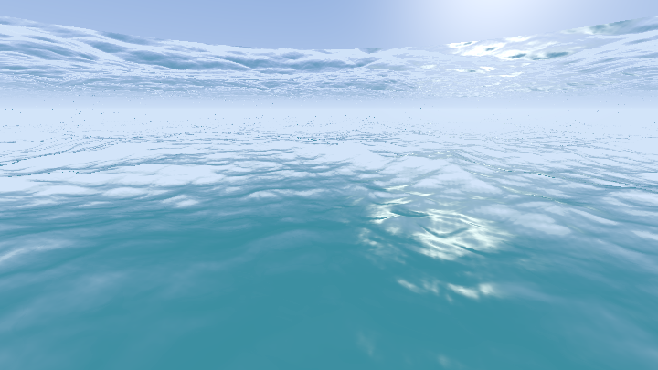

---

## 18.2 地形 / 山脉

**心法**：`terrain(x,z)` 是 **高度场**；渲染是「沿射线找 `ro.y+t*rd.y = terrain(xz)`」，不是通用 SDF 球步进。

**推荐维度**：**高度场 raymarch**；远景剪影可用 2D 一维高度曲线（见第 0 章山脊）。

**核心步骤**：

1. 用噪声 / 纹理采样叠 fbm 得到 `terrainH/M/L`（高/中/低细节三档）。
2. 射线与高度场求交：按 t 前进，比较 `pos.y` 与高度；步长可随距离放大。
3. 用法线：对 `terrainH` 做有限差分（eps 可随距离 `t` 放大）。
4. 材质按坡度（`nor.y`）与海拔混合：岩 → 草 → 雪。
5. 软阴影：沿光线再做一次高度场遮挡采样。
6. 天空、太阳盘、地平线雾分层 `mix`；云可用平面投影 fbm。
7. 可选：Buffer 存颜色+速度做运动模糊（Elevated 的 image Pass）。

**关键参数**：octave 数与振幅衰减；最大行进距离 `kMaxT`；雪线高度；雾密度；太阳方向。

**语料必读**：

| 作品 | 路径 | 看什么 |
|---|---|---|
| Elevated（iq，787 赞） | `000787-MdX3Rr-Elevated/buffer_a.glsl` | 标准地形管线、`setCamera`、雪线 |
| Canyon（iq） | `000305-MdBGzG-Canyon/image.glsl` | 峡谷变形高度场 |
| Himalayas | `000435-MdGfzh-Himalayas/` | 体积云 + 山（多 Pass） |
| Mystery Mountains | `000456-llsGW7-_2TC_15_Mystery_Mountains/image.glsl` | 电影感山景 |

---

## 18.3 雨打玻璃（窗上水珠）

**心法**：玻璃是一层 **2D 水珠蒙版场**；用它扰动 UV 去采样背景，再叠加雾气与拖尾。

**推荐维度**：**纯 2D**（几乎总是够用）；背景可以是静态图或另画的场景。

**核心步骤**：

1. 多层水珠：`StaticDrops`（静止）+ 两层动态 `DropLayer2`（不同缩放）。
2. 单元网格 `floor(uv*grid)` + hash(id) 决定珠心、尺寸、相位。
3. 主水珠用椭圆距离 `length((st-p)*aspect)`；下方拖尾用 `abs(st.x-x)` 的窄带。
4. 拖尾上再撒小碎珠（`sin` 调制密度）。
5. 用水珠强度对 UV 做折射偏移，采样背景（心形/街景/渐变皆可）。
6. 雾气层：低频噪声，水珠与拖尾处「刮掉」雾（trail 通道）。
7. 后期：暗角、轻微模糊、对比。

**关键参数**：雨量（三层权重 `l0,l1,l2`）；网格密度 `a`；拖尾宽度；雾浓度；折射强度。

**语料必读**：

| 作品 | 路径 | 看什么 |
|---|---|---|
| Heartfelt（BigWIngs，1078 赞） | `001078-ltffzl-Heartfelt/image.glsl` | 水珠分层教科书 |
| The Drive Home | `000789-MdfBRX-The_Drive_Home/image.glsl` | 雨窗 + 夜景散景 |
| Rain drops on screen | `000062-ldSBWW-Rain_drops_on_screen/image.glsl` | 更简实现 |

**可跑味道**：水珠 SDF 扭曲背景 UV + 拖尾刮雾。

<!-- glsl-from: examples/ch18_rain_glass.glsl -->
```glsl
uv += dropNormal * strength;
col = background(uv);
```

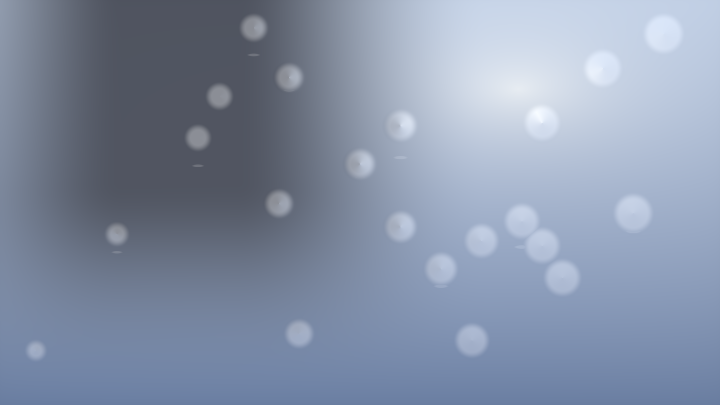

---

## 18.4 雨丝 / 地面积水涟漪

**心法**：雨丝是 **一维周期条带 + 速度偏移**；涟漪是 **网格触发的径向高度波**，再转成法线扰动。

**推荐维度**：雨丝 **2D**；涟漪 **2D**（可叠在任意底图上）；场景雨可用 3D 粒子板。

**核心步骤（涟漪）**：

1. `uv` 划网格，对邻域 `MAX_RADIUS` 内每个格子取 hash 得到落点与相位。
2. `t = fract(speed*iTime + hash)`，半径随 t 扩张。
3. 用 `sin(k*d)` × 环形窗口做波高；差分得扰动向量。
4. 合成假法线 `n = normalize(vec3(grad, 1))`，折射采样底图并加高光。

**核心步骤（雨丝）**：

1. 纵向拉伸 UV（`uv.x *= 40; uv.y *= 2`），`fract` 成条。
2. 每列 hash 决定有无雨丝、横向抖动、下落相位。
3. `smoothstep` 出细线，按深度/层数叠加透明。

**关键参数**：`MAX_RADIUS`、波频率 `31`、寿命衰减 `(1-t)^2`；雨丝长宽比与下落速度。

**语料必读**：

| 作品 | 路径 | 看什么 |
|---|---|---|
| Rainier mood（Zavie，292 赞） | `000292-ldfyzl-Rainier_mood/image.glsl` | 涟漪法线扰动经典 |
| jetstream | `000293-XlsGRs-jetstream/image.glsl` | 雨云闪电一体化 |
| Outrun The Rain | `000220-ltccRl-Outrun_The_Rain/` | 粒子雨 + 折射 |

---

## 18.5 雪 / 暴风雪

**心法**：近景是 **单元哈希的 2D 片状粒子**；积雪是地形上按高度与法线的 **阈值场**；暴风雪再加一层横向漂移噪声。

**推荐维度**：飘雪 **2D 多层视差**；积雪地形走高度场；雪花晶体可用 3D SDF。

**核心步骤**：

1. 多层：不同缩放与速度的雪层 `mix`（近大远小、近快远慢）。
2. 每层 `floor` 网格，hash 决定是否有雪、大小、透明度。
3. `uv += wind * iTime`；纵向再加下落。
4. 积雪：`smoothstep(雪线, 雪线+宽, height + noise)` × `smoothstep` 坡度（平处积、陡处滑）。
5. 暴风雪：提高密度、拉长拖尾、降低对比 + 雾。

**关键参数**：层数与视差速度；雪线；风速；片大小分布。

**语料必读**：

| 作品 | 路径 | 看什么 |
|---|---|---|
| Elevated 积雪段 | `000787-MdX3Rr-Elevated/buffer_a.glsl` | `h*e*o` 雪掩码 |
| Frozen Barrens | `000229-XltGRX-Frozen_Barrens/` | 冰雪行星 |
| Simple snow and blizzard | `000066-MscXD7-Simple_snow_and_blizard/image.glsl` | 轻量飘雪 |
| Over the Moon | `000152-4s33zf-Over_the_Moon/image.glsl` | 冬夜 2D 叙事 |

**可跑味道**：多层飘雪 + 树剪影。

<!-- glsl-from: examples/ch18_snow.glsl -->
```glsl
// layered snow flakes over winter gradient
```

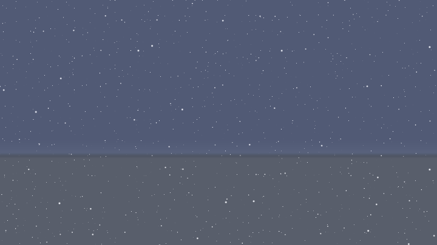

---

## 18.6 火 / 岩浆

**心法**：火是 **向上衰减的形状掩码 × 湍流噪声密度**，再用 `pow` 压成黑→红→黄白的假黑体。

**推荐维度**：火焰剪影 **纯 2D**；篝火/龙卷火 **体积 raymarch**；岩浆表面 **域扭曲噪声**。

**核心步骤（2D 火）**：

1. UV 归一化，底部为源，向上为焰心轴。
2. `n = fbm(uv - vec2(0, t))`，让噪声向上「流」。
3. 形状：`length(q * 横向挤压) - n * 纵向调制`，得到焰形距离感。
4. `c = 1 - pow(shape, k)` 得强度；`col = vec3(c, c^3, c^6)` 出火色。
5. 顶部用 `pow(uv.y, n)` 熄灭；可并排多焰心（`mod` 分段）。

**岩浆**：低频 fbm 做亮度，`sin(fbm*scale + t)` 出亮带；颜色偏橙红，加缓慢域扭曲。

**关键参数**：fbm octave；形状幂次；颜色幂次（决定「黄心」大小）；上升速度。

**语料必读**：

| 作品 | 路径 | 看什么 |
|---|---|---|
| Fires（xbe，392 赞） | `000392-XsXSWS-Fires/image.glsl` | 2D 火标准公式 |
| Noise animation - Lava | `000226-lslXRS-Noise_animation_-_Lava/image.glsl` | 岩浆噪声 |
| Campfire at night | `000283-Wtc3W2-Campfire_at_night/` | 体积火 + 夜景 |
| Combustible Voronoi | `000236-4tlSzl-Combustible_Voronoi/image.glsl` | Voronoi 燃烧 |

**交叉引用**：火焰柱在第 10 章 `ch10_stage8`。

<!-- glsl-from: examples/ch10_stage8.glsl -->
```glsl
// see ch10_stage8 fire column
```

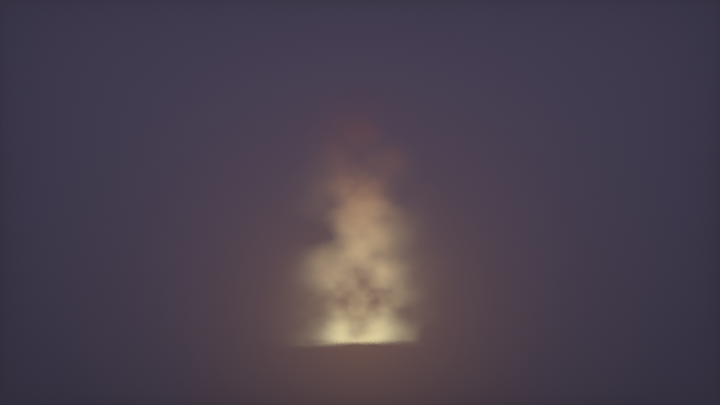

#### 可跑精读 · 岩浆表面（域扭曲）

岩浆和火不同：火是「向上的形状掩码×密度」，岩浆是「缓慢流动的亮带表面」。用低频域扭曲 + `sin(fbm*scale+t)` 挤出亮纹，再映射黑石→暗红→橙黄。

**思路拆解**

1. `q = uv + 0.3*fbm(uv*freq + t*slow)`。
2. `v = fbm(q)`；`band = sin(v*k + t)`。
3. 调色：`pow` 链压出黑体感。
4. 裂纹：高频率噪声在暗部加深。

**关键旋钮**

| 旋钮 | 感觉 |
|---|---|
| 域扭曲强度 | 流动扭曲 |
| `sin` 频率 | 亮带密度 |
| 颜色幂次 | 黄心大小 |

**动手改（建议按序）**

1. 去掉 `sin` 只留 fbm，看「糊岩浆」。
2. 加快 `t`，看何时开始像液体。
3. 对照 `ch10_stage8` 火焰柱：一个表面、一个体积。

**易错点**

- 动画太快 → 电光石火不像熔岩。
- 对比度不够 → 整屏橙，加裂纹暗部。

<!-- glsl-from: examples/ch18_lava.glsl -->
```glsl
vec2 q = uv + fbm(uv + t*0.05);
float v = fbm(q);
col = lavaPalette(sin(v*10.0+t));
```

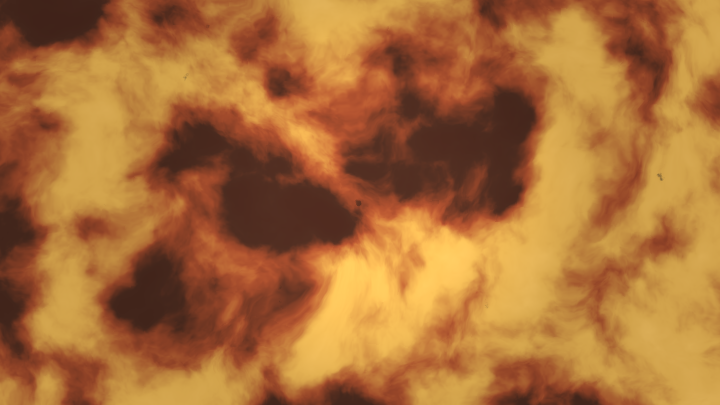

---

## 18.7 烟

**心法**：烟是 **低密度体积场**（fbm / curl / gyroid），沿视线做 Beer-Lambert 积分；便宜版则用 2D 域扭曲 alpha。

**推荐维度**：写实 **体积**； stylized / UI **2D 扭曲**；动力学烟 **多 Pass 流体**。

**核心步骤**：

1. 密度 `d = smoothstep(阈值, 阈值+软边, fbm(p) 或 |gyroid|)`。
2. 沿 `rd` 步进，累积 `alpha += (1-alpha) * dens * step`；颜色乘透射。
3. 动画：`p += curl(p)*t` 或直接 `p.y -= t`。
4. 自阴影：向光源再采几次密度。
5. 廉价版：2D `fbm(uv + fbm(uv+t))` 做 alpha 蒙版。

**关键参数**：阈值（烟「实」程度）；步数与步长；散射反照率；向上速度。

**语料必读**：

| 作品 | 路径 | 看什么 |
|---|---|---|
| Curling Smoke | `000162-cl23Wt-Curling_Smoke/` | curl + gyroid |
| Chimera's Breath | `000488-4tGfDW-Chimera_s_Breath/` | 流体烟尘仿真 |
| Volumetric lighting | `000418-tdjBR1-Volumetric_lighting/` | 体积光里的烟感 |
| Chill Smoke Orb | `000192-tflBDM-Chill_Smoke_Orb/image.glsl` | 短小体积烟 |

#### 可跑精读 · 上升烟雾（域扭曲）

便宜烟：垂直方向抬 UV，再用 `fbm(p+fbm(p))` 拧出丝缕，用 alpha 叠在暗背景上。真体积烟是沿视线积分密度；这版先把「形状语言」做对。

**思路拆解**

1. 以烟囱口为源，向上抬采样坐标（`uv.y - t`）。
2. 域扭曲制造卷曲边缘。
3. 多层不同速度/缩放叠加，避免「一块棉花」。
4. 顶部与边缘 fade，底部更实。

**关键旋钮**

| 旋钮 | 感觉 |
|---|---|
| 扭曲振幅 | 丝缕 vs 团块 |
| 上升速度 | 烟被「抽」多快 |
| 层数 | 厚重感 |

**动手改（建议按序）**

1. 只留一层，看懂基本形。
2. 加第二层反向慢速。
3. 想进阶：改成第 10 章体积积分（更贵）。

**易错点**

- 背景太亮 → 烟的 alpha 看不见。
- 扭曲过大 → 闪烁；先小振幅。

<!-- glsl-from: examples/ch18_smoke.glsl -->
```glsl
float n = fbm(uv + fbm(uv - vec2(0.0, t)));
float alpha = smoothstep(thr, thr+soft, n) * fade;
```

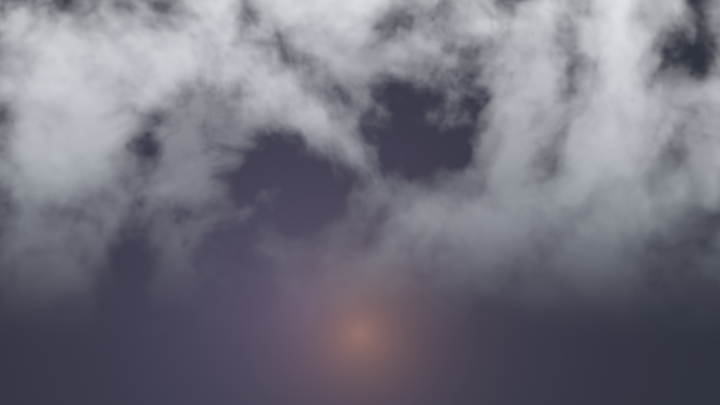

---

## 18.8 云

**心法**：云 = **3D/2D 密度场**（fbm 或 Worley 减 fbm）+ 体积积分；天空云也可用「投影到云层平面」的 2D 假体积。

**推荐维度**：地平线装饰云 **2D 平面投影**；飞穿云层 **体积**；行星云带 **球壳体积**。

**核心步骤**：

1. 密度：`fbm` 或 `Worley - fbm`（更碎的积云边缘）。
2. 约束在云层高度带 `smoothstep` 垂直包络。
3. 射线与云层求交后，固定步数积分；步长可随穿透变大。
4. 光照：向太阳做短距离密度采样得透射；多散射可用二次近似。
5. 与天空色按 alpha 合成；远处降对比。

**关键参数**：云层高度与厚度；覆盖率阈值；散射系数；太阳方向；积分步数。

**语料必读**：

| 作品 | 路径 | 看什么 |
|---|---|---|
| Himalayas | `000435-MdGfzh-Himalayas/` | 大气散射级云 |
| Tribute - Journey | `000769-ldlcRf-Tribute_-_Journey_/image.glsl` | 球形云角色场景 |
| Tiny Planet Clouds | `000295-ldyXRw-Tiny_Planet_Clouds/image.glsl` | 无纹理体积云 |
| Enscape Cube | `000433-4dSBDt-Enscape_Cube/` | 云海 + 海面 |

**交叉引用**：出片云在第 10 章云阶梯（`ch10_stage6`）。

<!-- glsl-from: examples/ch10_stage6.glsl -->
```glsl
// see ch10 cloud ladder
```

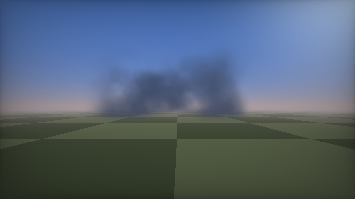

---

## 18.9 闪电

**心法**：把闪电看成 **ridged / 折线噪声的亮线距离场**，或「分支折线 SDF」；爆发时短暂点亮并照亮体积云。

**推荐维度**：全屏闪 **2D**；风暴场景 **2D 亮线 + 体积云**；高尔夫风一条公式流。

**核心步骤**：

1. 主干：对 x 做多层 `abs(noise)` 或中点位移折线，得到 `d = abs(uv.x - f(uv.y))`。
2. 分支：在 hash 决定的高度分叉，递归或有限层。
3. 颜色：`exp(-d/width) + pow(width/(d+eps), k)`。
4. 时间：`pow(hash(floor(t*rate)), n)` 做稀疏闪烁；闪时抬曝光。
5. 可与云密度相乘，只在云区可见。

**关键参数**：线宽；分支概率；闪烁频率；曝光脉冲；噪声频率。

**语料必读**：

| 作品 | 路径 | 看什么 |
|---|---|---|
| Zippy Zaps | `000631-XXyGzh-Zippy_Zaps_394_Chars_/image.glsl` | 极短电力感 |
| LIGHTNING | `000163-WscyWB-LIGHTNING/` | 风暴体积 + 电 |
| jetstream | `000293-XlsGRs-jetstream/image.glsl` | 平静雷雨氛围 |
| fbm lightning | `000068-dsXfDn-fbm_lightning/image.glsl` | fbm 电弧 |

**可跑味道**：hash 分支电光 + 暗云。

<!-- glsl-from: examples/ch18_lightning.glsl -->
```glsl
// bolt path from hash; flash exposure
```

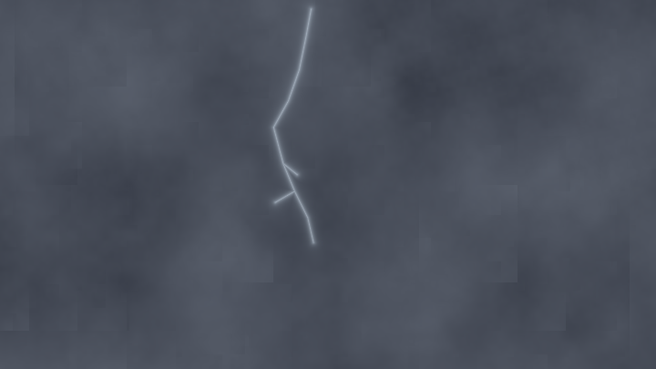

---

## 18.10 极光

**心法**：极光是 **薄帘状体积发射场**：水平方向大尺度条带噪声，垂直方向快速衰减，沿视线积分发光。

**推荐维度**：**体积**（多项式增大步长）；远景可用 2D 帘幕。

**核心步骤**：

1. 构造条带噪声（如 `triNoise2d`：三角波 + 域扭曲），避免过于平滑的 fbm。
2. 在视线方向按高度求一系列采样点（步长随 i 多项式增大——帘幕越远越稀）。
3. 每样本：密度 → 用 `sin(相位 + i)` 上色 → 指数衰减权重累积。
4. 抖动：`hash(fragCoord)*smoothstep` 减带宽伪影。
5. 底下铺星空 / 地面剪影。

**关键参数**：条带频率与扭曲速度；垂直衰减；积分次数（约 50）；色彩相位；抖动幅度。

**语料必读**：

| 作品 | 路径 | 看什么 |
|---|---|---|
| Auroras（nimitz，724 赞） | `000724-XtGGRt-Auroras/image.glsl` | 极光体积教科书 |
| The sun the sky and the clouds | `000229-tdSXzD-The_sun_the_sky_and_the_clouds/image.glsl` | 极光融入大气 |
| Portal 1 | `000180-tl3GW2-Portal_1/` | 沙漠 + 极光 + Droste |
| Aurora Explorer | `000119-4dtSzX-Aurora_Explorer_re_/image.glsl` | 可探索变体 |

**交叉引用**：极光飘带完整例在第 10 章 `ch10_stage9`（体积旁支）。

<!-- glsl-from: examples/ch10_stage9.glsl -->
```glsl
// see ch10_stage9 aurora ribbons
```

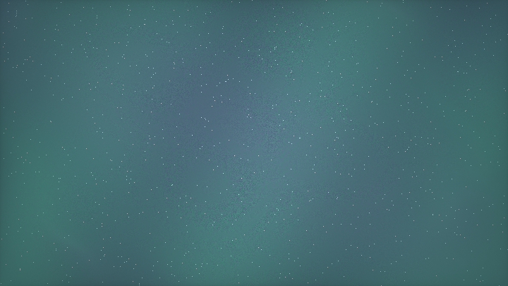

---

## 18.11 星空 / 银河 / 星云

**心法**：星点是 **网格哈希脉冲**；银河是 **带状密度 × 噪声**；星云/Star Nest 是 **迭代折叠的体积密度积分**。

**推荐维度**：夜空装饰 **2D**；飞穿星野 **体积分形**；黑洞吸积盘 **体积 + 多 Pass bloom**。

**核心步骤（星点）**：

1. `id = floor(uv*scale); f = fract(uv*scale)-0.5`。
2. `hash(id)` 决定亮度阈值；`smoothstep` 出圆点；可加衍射尖刺。
3. 多层不同 scale 叠视差。

**核心步骤（Star Nest 类）**：

1. 沿视线步进；每点做 `p = abs(p)/dot(p,p) - k` 迭代。
2. 累积 `|length(p)-prev|` 得结构密度，再立方对比。
3. 距离衰减 `fade`；可选 darkmatter 挖空。

**关键参数**：星点密度阈值；银河带宽；迭代次数 / volsteps；`formuparam`；饱和度。

**语料必读**：

| 作品 | 路径 | 看什么 |
|---|---|---|
| Star Nest（Kali，1157 赞） | `001157-XlfGRj-Star_Nest/image.glsl` | 体积星野公式 |
| Stars and galaxy | `000192-stBcW1-Stars_and_galaxy/image.glsl` | 2D 银河 |
| Interstellar | `000383-Xdl3D2-Interstellar/image.glsl` | 星野飞穿 |
| Gargantua With HDR Bloom | `000490-lstSRS-Gargantua_With_HDR_Bloom/` | 黑洞 + HDR |

**可跑味道**：闪烁星点 + fbm 星云带。

<!-- glsl-from: examples/ch18_stars.glsl -->
```glsl
// hash stars + nebula fbm
```

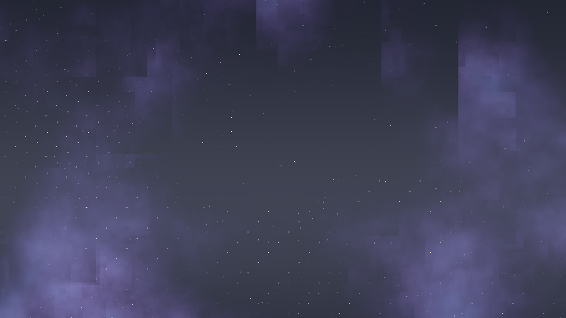

---

## 18.12 隧道

**心法**：把空间变成 **轴向重复的截面 SDF**：`p.z = mod(p.z, period)`，再对 `(x,y)` 做截面形状；或 2D 极坐标 `r, a` 直接画环壁。

**推荐维度**：抽象隧道 **2D 极坐标**；写实走廊 **raymarch + 域重复**；分形隧道 **KIFS/Menger**。

**核心步骤**：

1. 相机沿 +Z 前进：`ro.z += iTime * speed`。
2. `p.z = fract(p.z/L)*L - L/2` 做节段重复。
3. 截面：圆环、方管、Voronoi 细胞壁、三角网格等。
4. 可对截面随 z 旋转 / 扭曲：`p.xy *= rot(p.z*)`。
5. 雾与重复节的雾化隐藏接缝；加灯光球做引导。

**关键参数**：节距 `L`；截面半径/厚度；扭曲角速度；雾密度；速度。

**语料必读**：

| 作品 | 路径 | 看什么 |
|---|---|---|
| Tissue（iq） | `000258-XdBSzd-Tissue/image.glsl` | 2D 有机隧道 |
| Traced Tunnel | `000269-tdjfDR-Traced_Tunnel/image.glsl` | 路径追踪感隧道 |
| Abstract Corridor | `000415-MlXSWX-Abstract_Corridor/image.glsl` | 噪声走廊 |
| Cellular Tiled Tunnel | `000192-MscSDB-Cellular_Tiled_Tunnel/image.glsl` | Voronoi 隧道 |

**可跑味道**：对数极坐标隧道飞行。

<!-- glsl-from: examples/ch18_tunnel.glsl -->
```glsl
float a = atan(p.y,p.x); float r = log(length(p));
```

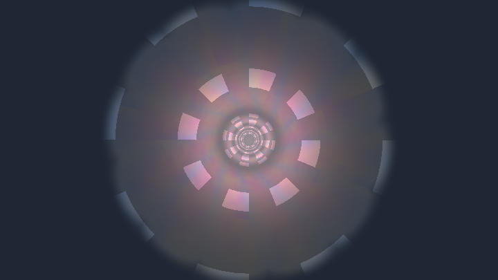

---

## 18.13 城市夜景 / 天际线

**心法**：楼群 = **网格 id + 随机高度的盒子 SDF**（或 2.5D 柱状挤出）；窗户是楼面 UV 上的 **哈希点亮**。

**推荐维度**：天际线剪影 **2D**；可飞入街道 **raymarch 盒子城**；等距城 **2.5D**。

**核心步骤**：

1. `id = floor(p.xz / cell)`，`h = hash(id)` 映射楼高。
2. `sdBox` 挤出；街道用更大网格留空，或对 id 剔除。
3. 窗户：楼面局部 UV 网格，`hash > 阈值` 点亮，颜色偏黄。
4. 夜间：几乎无环境光，靠窗光与霓虹；地面湿反射（Tokyo）。
5. 雾与高度雾压远楼；可加车灯长曝光条。

**关键参数**：小区尺寸；高度分布；窗户密度；雾；反射强度。

**语料必读**：

| 作品 | 路径 | 看什么 |
|---|---|---|
| Skyline（otaviogood，424 赞） | `000424-XtsSWs-Skyline/image.glsl` | 程序化都市 |
| Tokyo | `000260-Xtf3zn-Tokyo/image.glsl` | 雨夜车程 |
| Descent 3D | `000230-wdfGW4-Descent_3D/image.glsl` | 霓虹体素城 |
| Isometric City 2.5D | `000164-MljXzz-Isometric_City_2.5D/image.glsl` | 等距城 |

**可跑味道**：2.5D 天际线 + hash 窗户。

<!-- glsl-from: examples/ch18_city.glsl -->
```glsl
// building masks + window hash on/off
```

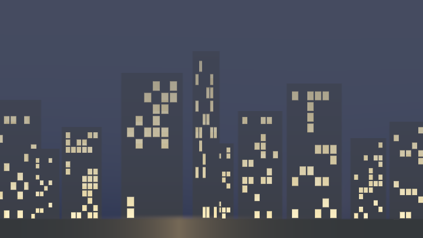

---

## 18.14 洞穴

**心法**：洞穴是 **负空间**：大球/噪声固体挖空，或 gyroid / Voronoi 骨架的壁面；重点在 **AO、三平面岩石、点光**。

**推荐维度**：**raymarch SDF**；矿脉生物感可用 Voronoi 隧道。

**核心步骤**：

1. 基底：`sdGyroid` / 噪声 iso-surface / 球并集挖洞。
2. `smin` 融柱与钟乳石（`sdCapsule` 从顶到底）。
3. 三平面纹理或 fbm bump；湿润高光。
4. 少量点光 + 强 AO + 体积尘雾。
5. 出口处强光形成剪影引导。

**关键参数**：iso 阈值；柱密度；光衰减；AO 半径；雾。

**语料必读**：

| 作品 | 路径 | 看什么 |
|---|---|---|
| The Cave | `000140-MsX3RH-The_Cave/image.glsl` | 洞穴光照 |
| Underground Passageway | `000175-XdcfDf-Underground_Passageway/` | 岩石通道 |
| Biomine | `000201-4lyGzR-Biomine/image.glsl` | 有机矿洞 |
| Cave Pillars | `000061-Xsd3z7-Cave_Pillars/image.glsl` | 石柱 |

#### 可跑精读 · 洞穴入口 + 晶体光

洞穴心法：**暗部包围盒 + 噪声扰动壁面 + 深处一点自发光**。入口外露天空形成剪影，内部用点光/晶体勾边。

**思路拆解**

1. 便宜 raymarch：球/盒掏空或噪声位移的管状空间。
2. 法线打很暗的环境光。
3. 晶体：小八面体/棱锥 SDF，`smin` 进壁面，加 emissive。
4. 雾随深度变浓，吞掉远细节。

**关键旋钮**

| 旋钮 | 感觉 |
|---|---|
| 噪声壁面振幅 | 有机程度（太大破 Lipschitz） |
| 雾密度 | 神秘感 |
| 晶体 emissive | 奇幻 vs 写实 |

**动手改（建议按序）**

1. 先无噪声，只留光滑隧道。
2. 加晶体自发光。
3. 对照第 8 章神庙：建筑是硬 CSG，洞穴是噪声壁。

**易错点**

- 壁面噪声过大 → 黑洞痤疮（回第 19 章）。
- 曝光不够 → 一片黑；加一点天空漏光。

<!-- glsl-from: examples/ch18_cave.glsl -->
```glsl
// cave wall DE + crystal emissive + depth fog
```


---

## 18.15 森林

**心法**：树是 **实例化 SDF**（树干胶囊 + 球叶冠 / 递归分支），或 2D 剪影层；纵深靠雾与层叠。

**推荐维度**：远景 **2D 多层剪影**；可走进 **raymarch 实例树**；雨林巨作看 iq 的 reprojection。

**核心步骤**：

1. 地面高度场；树位置用泊松/网格抖动 hash。
2. 单木：`sdCapsule` 干 + `smin` 球叶；或 2D 噪声剪影。
3. 只渲染近处 N 棵（按距离排序或哈希剔除）。
4. 林间神光：体积光沿太阳积短分。
5. 绿色调按深度去饱和；地面落叶用噪声斑。

**关键参数**：树密度；叶冠半径；雾；实例最大数量；色相偏移。

**语料必读**：

| 作品 | 路径 | 看什么 |
|---|---|---|
| Rainforest（iq，1339 赞） | `001339-4ttSWf-Rainforest/` | 顶级森林工程 |
| English Lane | `000352-fsXXzX-English_Lane/` | 林荫路 |
| Haunted Forest | `000115-4dl3z7-Haunted_Forest/image.glsl` | 夜林雾月 |
| Tree in the wind | `000378-tdjyzz-Tree_in_the_wind/` | 风中树 |

#### 可跑精读 · 多层树剪影 + 雾光

风格化森林很少真去 march 每片叶子。常用：**远山剪影 + 两三层树排版（近大远小）+ 雾混合 + 廉价光柱**。先骗过大脑的深度，再考虑 3D。

**思路拆解**

1. 天空与太阳盘打底。
2. 一维噪声远山。
3. 按层：`id = floor(x/cell)`，每格画一棵三角冠+树干 SDF；层间改缩放与雾量。
4. 从太阳方向叠几条衰减光柱（假丁达尔）。

**关键旋钮**

| 旋钮 | 感觉 |
|---|---|
| 层数 / cell | 疏密 |
| 雾量随层 | 空气透视 |
| 光柱强度 | 晨雾氛围 |

**动手改（建议按序）**

1. 只留一层树，调间距。
2. 加第二层并加大雾。
3. 光柱噪声化，避免「百叶窗」。

**易错点**

- 所有树同一高度 → 假。给 `hash(id)` 乘高度。
- 近景树不接地面 → 检查 `y0` 与 trunk 底部。

<!-- glsl-from: examples/ch18_forest.glsl -->
```glsl
float d = treeSilhouette(local, seed);
col = mix(col, treeCol, smoothstep(0.01,-0.01,d));
```

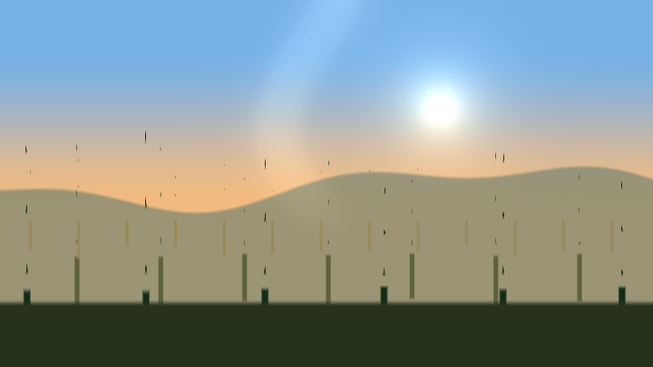

---

## 18.16 角色 / 生物

**心法**：角色 = **少量 SDF 图元 + smin 有机融合**；动画靠关节域变换（旋转子空间）；眼睛等细节单独图层。

**推荐维度**：**3D SDF raymarch**；扁平角色 **2D SDF**；布料/围巾用额外软体带。

**核心步骤**：

1. 先搭骨架：头球、躯干胶囊、肢胶囊。
2. `smin` 融合；凹陷用 `smax` / 减法。
3. 关节：对肢局部坐标 `rot`，再算 SDF。
4. 材质分区（id 从 map 第二分量返回）：皮肤 / 外壳 / 眼睛。
5. SSS 让生物感更强；剪影光勾边。
6. 简化版：2D 椭圆拼脸（见 Smiley Tutorial 思路）。

**关键参数**：`smin` 的 `k`；肢长度与角度；SSS 强度；眼睛高光。

**语料必读**：

| 作品 | 路径 | 看什么 |
|---|---|---|
| Tribute - Journey | `000769-ldlcRf-Tribute_-_Journey_/image.glsl` | 围巾角色 |
| Sea Creature（iq） | `000238-csB3zy-Sea_Creature/image.glsl` | 海生 SDF |
| The Eye | `000217-MsKBDG-_SH18_The_Eye/` | 器官级细节 |
| Smiley Tutorial | `000253-lsXcWn-Smiley_Tutorial/image.glsl` | 2D 角色入门 |

---

## 18.17 霓虹 / 辉光 UI

**心法**：先有 **精确 SDF 轮廓**，颜色不是填实心，而是 `exp(-k*|d|)` / `pow(k/(|d|+eps), p)` 的 **距离辉光场**。

**推荐维度**：**纯 2D SDF**；场景霓虹可嵌入 3D（六边形灯管）。

**核心步骤**：

1. 用圆、盒、线段、Bezier SDF 搭符号/爱心/文字轮廓。
2. 芯线：`smoothstep` 极窄描边；外辉：`exp(-|d|*k)`。
3. HDR 颜色（>1）再 tone map；叠加算多灯。
4. 可对 d 加轻微噪声让灯管「不完美」。
5. UI：按钮 = `sdRoundedBox` + 内发光；状态用色相偏移。

**关键参数**：辉光 `k` 与幂次；芯线宽度；曝光；色相。

**语料必读**：

| 作品 | 路径 | 看什么 |
|---|---|---|
| NEON LOVE | `000256-WdK3Dz-NEON_LOVE/` | Bezier 霓虹心 |
| Neon Lit Hexagons | `000324-MsVfz1-Neon_Lit_Hexagons/image.glsl` | 3D 霓虹体积 |
| Discoteq 2 | `000329-DtXfDr-Discoteq_2/image.glsl` | 光带舞蹈 |
| Oblivion radar | `000354-4s2SRt-Oblivion_radar/image.glsl` | UI 雷达 |

**交叉引用**：霓虹徽章在第 3 章 `ch3_stage8`；成片后期见第 15 章。

<!-- glsl-from: examples/ch3_stage8.glsl -->
```glsl
// see ch3_stage8 neon badge
```

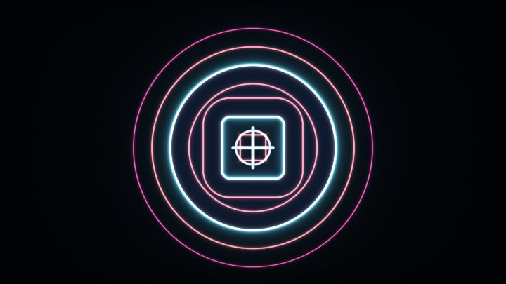

---

## 18.18 Soft Fluid（假流体）

**心法**：真流体要多 Pass Navier-Stokes；假流体用 **无散度矢量场（角噪声 / curl）** 去推粒子或扭曲 UV，看起来「像液体」。

**推荐维度**：**多 Pass 粒子**（Sinuous）或 **单 Pass 域扭曲**；真流体见 MIP Fluid。

**核心步骤（假）**：

1. `ang = noise(p)*scale + bias`，`vel = vec2(cos(ang), sin(ang))` → 近似无散度。
2. Buffer 里粒子 `pos += vel * dt`；或 UV `p += vel*dt` 采样上一帧。
3. 渲染成丝带/辉光点；用色相随速度变化。
4. 定期重置或淡出避免聚堆。

**真流体提示**：密度/速度多 Buffer；半拉格朗日平流；压力投影；MIP 加速。

**关键参数**：噪声频率；速度偏置（整体流向）；衰减；粒子数（Pass 分辨率）。

**语料必读**：

| 作品 | 路径 | 看什么 |
|---|---|---|
| Sinuous（nimitz，302 赞） | `000302-4sGSDw-Sinuous/` | 假流体心法注释 |
| Multiscale MIP Fluid | `000697-tsKXR3-Multiscale_MIP_Fluid/` | 真流体标杆 |
| spilled | `000626-MsGSRd-spilled/` | 倾洒流体 |
| Visualizing Curl Noise | `000133-mlsSWH-Visualizing_Curl_Noise/` | curl 可视化 |

#### 可跑精读 · Curl 墨水假流体

假流体不问 Navier-Stokes：用 **curl noise**（噪声梯度转 90°）当速度，反向 advection 颜色。观感「在搅」，成本是几次 fbm。

**思路拆解**

1. `v = curl(fbm)` → `(−∂n/∂y, ∂n/∂x)`。
2. 沿 `-v` 回溯 UV 若干步（半拉格朗日味道）。
3. 在回溯后的坐标上采样多层颜色 fbm。
4. 时间推进噪声相位。

**关键旋钮**

| 旋钮 | 感觉 |
|---|---|
| 回溯步数 | 丝缕长度 |
| curl 强度 | 涡旋猛烈度 |
| 调色板 | 墨水 / 油彩 |

**动手改（建议按序）**

1. 回溯改成 1 步，看「糊一团」。
2. 对照第 14 章真半拉格朗日说明。
3. 鼠标推一股局部速度（进阶）。

**易错点**

- 步数太多 → 性能炸且发糊。
- 忘记时间相位 → 静止纹理。

<!-- glsl-from: examples/ch18_fluid.glsl -->
```glsl
p -= curlNoise(p) * dt; // advect
col = palette(fbm(p));
```


---

## 18.19 传送门 / Droste（无限嵌套）

**心法**：Droste = **对数极坐标下的周期域变换**：把平面卷成自相似螺旋，使图像里再套图像；传送门常是 **圆盘内二次投影 / 旋转缩放迭代**。

**推荐维度**：**2D 域变换**；3D Droste 需特殊空间折叠。

**核心步骤**：

1. 转复数/极坐标：`r = length(p); a = atan`。
2. `log(r)` 与 `a` 组成新坐标，按周期 `mod`，再 `exp` 回去 → 自相似缩放。
3. 或迭代：`p = rot(p)/length(p)^k` 类反演。
4. 传送门框：圆环 SDF；框内替换射线方向或二次 UV。
5. 边缘 Fresnel / 能量波纹提示「出口」。

**关键参数**：缩放周期（嵌套密度）；旋转角速度；门半径；迭代次数。

**语料必读**：

| 作品 | 路径 | 看什么 |
|---|---|---|
| Portal 1 | `000180-tl3GW2-Portal_1/` | 传送门 + 场景 |
| Escher's prentententoonstelling | `000158-Mdf3zM-Escher_s_prentententoonstelling/image.glsl` | 经典 Droste |
| Droste 3D | `000106-lfGczc-Droste_3D/image.glsl` | 3D 嵌套 |
| Droste Cyclic Expansion Spiral | `000084-lcdcRM-Droste_Cyclic_Expansion_Spiral/image.glsl` | 螺旋展开 |

**可跑味道**：递归环 / Droste 螺旋感。

<!-- glsl-from: examples/ch18_portal.glsl -->
```glsl
// portal rings / droste spiral
```

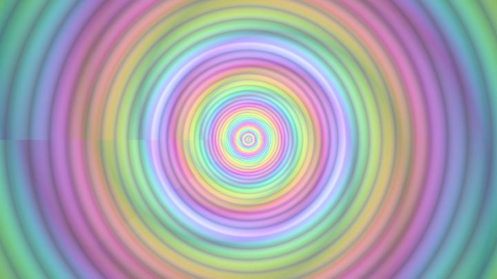

---

## 18.20 CRT / 复古屏幕

**心法**：最终画面 = **内容纹理 × 荫罩/扫描线图案场 × 桶形畸变 UV**，再加出血、噪点、轻微模糊。

**推荐维度**：**后期 2D**（内容可来自 Buffer 或精灵场景）；真「显示器」可把平面贴在 3D 曲屏上。

**核心步骤**：

1. UV 桶形畸变：`uv *= 1 + k*r^2`。
2. 扫描线：`sin(uv.y * resolution * π)` 调制亮度。
3. 荫罩：RGB 子像素条或点阵 `mod(fragCoord, 3)`。
4. 轻微 RGB 分离（色度偏移）。
5. 暗角 + 磷光余晖（与上一帧 mix）。
6. 内容本身用低分辨率像素感（Mario / Contra）。

**关键参数**：畸变 `k`；扫描线对比；子像素强度；流血；余晖系数。

**语料必读**：

| 作品 | 路径 | 看什么 |
|---|---|---|
| SIG15 Mario World | `000537-XtlSD7-_SIG15_Mario_World_1-1/` | 游戏 + CRT 气质 |
| vt220 coding at night | `000272-XdtfzX-vt220_coding_at_night_edition/` | 终端 CRT |
| Meta CRT | `000400-4dlyWX-Meta_CRT/` | CRT 相机系统 |
| FixingPixelArt | `000210-XsjSzR-FixingPixelArt/image.glsl` | 扫描线与像素 |

**交叉引用**：CRT 阶梯在第 15 章（若文件名不同则见 15.8 节嵌入例）。

<!-- glsl-from: examples/ch15_stage5.glsl -->
```glsl
// see ch15 CRT stage
```

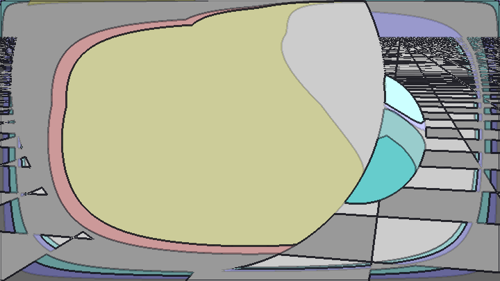

---

## 18.21 更多高频配方（速查）

### 海岸 / 梵高风景（2D 分层）

**心法**：一切是 **2D 图案场分层 mix**，不是 3D。  
**维度**：纯 2D。  
**步骤**：天空渐变 → 太阳 → 山脊高度剪影 → 海面波纹噪声 → 笔触/涡旋扭曲 → 暗角。  
**参数**：地平线、波纹频率、扭曲强度。  
**语料**：`000594-fstyD4-Coastal_Landscape/image.glsl`，`000465-Wt33Wf-Cyber_Fuji_2020/image.glsl`。

### 焦散

**心法**：两层噪声梯度差或 Voronoi 边的 **亮线场**。  
**维度**：2D（可投影到 3D 地面）。  
**语料**：`000506-MdlXz8-Tileable_Water_Caustic/image.glsl`。

### 黑洞 / 引力透镜

**心法**：对视线方向做 **径向弯曲域变换**，盘是薄体积环。  
**维度**：体积 + 后期 bloom。  
**语料**：`000490-lstSRS-Gargantua_With_HDR_Bloom/`，`000065-lcfyDj-BlackHole_swirl_portal_/image.glsl`。

### 水下 / 体积神光

**心法**：水体是雾密度；神光是 **沿光方向密度透射积分**。  
**语料**：`000385-4sXBRn-Luminescence/image.glsl`，`000305-lsXGzH-Spout/image.glsl`。

### 沙漠峡谷

**心法**：高度场 + 横向扭曲；沙色按法线与 AO。  
**语料**：`000292-Xs33Df-Desert_Canyon/image.glsl`，`000305-MdBGzG-Canyon/image.glsl`。

### 湿石头 / 岩石

**心法**：fbm 做高度或 bump；高光用极高幂次；积水是法线朝上的暗色镜面。  
**语料**：`000449-ldSSzV-Wet_stone/image.glsl`。

### 像素游戏 / 精灵场景

**心法**：逻辑在 Buffer；image 做取样放大与 CRT。  
**语料**：`000537-XtlSD7-_SIG15_Mario_World_1-1/`，`000189-XltGDr-_SH16C_Contra/`。

---

## 18.22 配方选择决策树（极简）

```
有自由相机转一圈吗？
  ├─ 否 → 能用 2D/2.5D 伪造吗？ → 尽量伪造（雨窗、火焰、CRT、星空）
  └─ 是 → 有「表面」吗？
            ├─ 有，且是地形/海面 → 高度场 raymarch
            ├─ 有，任意造型 → SDF raymarch
            └─ 无表面（云烟火星云） → 体积积分
需要记忆/互动流体吗？ → 多 Pass
只要看起来像流体 → curl / 域扭曲假流体
```

---

## 18.23 与第 0 章的衔接

做任意效果时，强制自己填完这张卡：

| 栏 | 你的答案 |
|---|---|
| 画面分层 | （从后到前） |
| 每一层是什么场 | 距离 / 密度 / 高度 / 图案 |
| 维度选择 | 2D / 2.5D / raymarch / 体积 / 多 Pass |
| 结构 | 重复？哈希？fbm？ |
| 关键参数 3 个 | |
| 对标语料 | `shaders/shaders/...` |

填得出来，就说明你已经会用这一章了。
