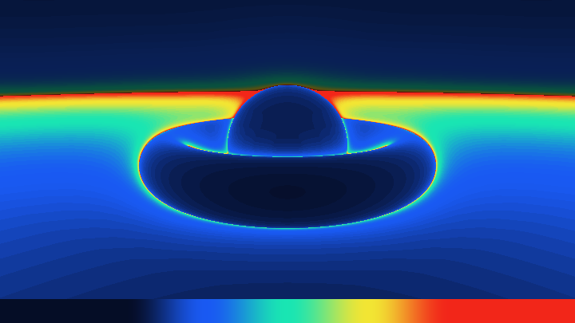
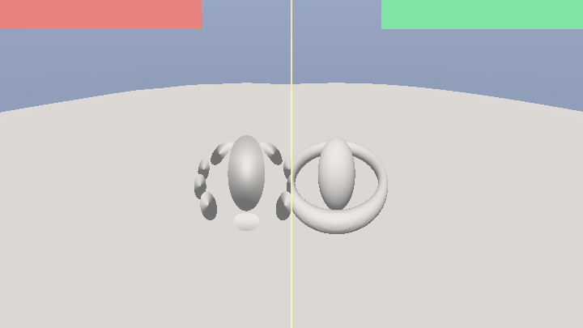
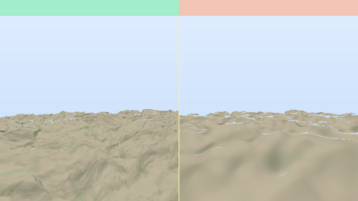
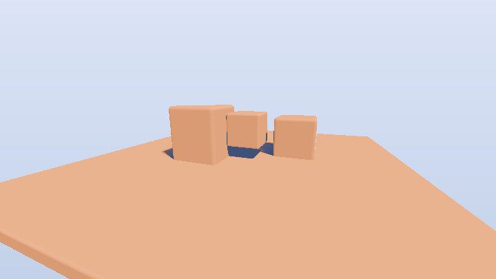

# 第 19 章 · 性能、调试与工程

> 效果做出来只是一半。另一半是：**它要在目标机器上稳稳跑住，并且坏了你能看得见原因**。
>
> 本章按「先找瓶颈 → 再修伪影 → 再谈精度与工程习惯」组织。建议同时对照第 15 章后期与 `analysis/notes/K_postfx.md` 里的 tonemap / 模糊 / 抖动章节。语料根目录：`shaders/shaders/`（已确认存在）。

---

## 19.1 先认清瓶颈在哪

Shadertoy 上几乎所有卡顿都可以归到三类：

| 瓶颈 | 典型症状 | 优先动手处 |
|---|---|---|
| **步数（march / 积分）** | 分辨率一升 FPS 线性掉；复杂处更卡 | 减少循环上限、加步长、提前退出、LOD |
| **带宽（多 Pass / 大核）** | 一开 Buffer 或全屏 blur 就掉 | 降 Buffer 分辨率、可分离滤波、少采样 |
| **发散/寄存器（巨型表达式）** | 偶发编译慢、移动端黑屏 | 拆函数、减临时 `vec4`、避免巨型宏 |

**经验法则**：单 Pass 里一个 `for` 跑 100+ 且每步还调用昂贵 `map`/`fbm`，这就是主犯。先用「可视化步数」（见 19.8）确认。

### 决策表：我该先优化什么？

| 你刚做完… | 先查 | 再动 |
|---|---|---|
| 新 raymarch 场景 | 步数热力图 | 上限、包围盒、LOD |
| 体积云/烟 | 步数 × 阴影二次步 | 提前退出、方向导数代长阴影 |
| Bloom / DOF / 大模糊 | Buffer 分辨率与 tap 数 | 半分辨率 + 可分离 |
| 路径追踪 | spp × bounce × 求交 | 累积、RR、NEE，而非盲目加 spp |
| 手机黑屏 | 循环上限 + hash 精度 | 砍半步数；无 sin 哈希 |

**不要**在没测量前「优化」：先可视化，再改循环上限。

---

## 19.2 步数瓶颈：raymarch 与体积

#### 可跑精读 · 步数热力图

优化前先测量。这张图把每个像素消耗的 raymarch 步数映射成颜色：蓝便宜、红昂贵。环面内侧、剪影边缘通常最红——那里该加包围盒、放宽远景 eps、或砍细节。

**思路拆解**

主循环计数 `steps`，不着色材质，只输出 `heat(steps/MAX)`。底部图例帮助读值。你会直观看到「暗部/掠射」更贵。

**关键旋钮**

| 旋钮 | 作用 |
|---|---|
| MAX_STEPS | 上限（热力图饱和位置） |
| 命中 eps | 过严会抬步数 |
| 场景复杂度 | 对照加噪声位移前后 |

**动手改（建议按序）**

1. 给地面加 `+ 0.15*sin(x*5)*sin(z*5)`，看热力爆炸。
2. 把 `eps` 改成 `0.001*t`，远景步数应下降。
3. 加包围球：球外大步跳。

**易错点**

- 热力饱和一片红 → 提高 MAX 或先简化场景。
- 别把热力图和最终美图混在同一输出里还开 tonemap，会看不懂。

<!-- glsl-from: examples/ch19_stage1.glsl -->
```glsl
for (i) { steps=i; d=map(); if (hit) break; t+=d; }
col = heat(float(steps)/MAX);
```



### 19.2.1 Raymarching

1. **上限要够用但别虚高**：语料常见 64–128；地形高度场可更少。
2. **安全步长**：`t += clamp(d, minStep, maxStep)`，避免贴面时抖、远处空走。
3. **包围盒 / 高度上限**：Elevated 用云层最大高度裁 `tmax`（`000787-MdX3Rr-Elevated/buffer_a.glsl`）——没必要的天空不要 march。
4. **命中阈值随距离放宽**：`eps = 0.001 * t`，远景少打几次。
5. **LOD map**：几何用少 octave，法线/着色用多 octave（`002224-Ms2SD1-Seascape` 的 `ITER_GEOMETRY` vs `ITER_FRAGMENT`）。
6. **别在循环里做软阴影+AO+反射**：先保证主射线便宜，贵的只在命中后做，且可降频。

### 19.2.2 体积积分

1. **固定步数 + 变步长**：极光（`000724-XtGGRt-Auroras`）用多项式增大步长，远帘幕便宜。
2. **透射提前退出**：`if (T < 0.01) break;`（T 为剩余透射率）。
3. **密度阈值**：空区域大步跳过（empty-space skipping 的穷人版：密度低则 `t += large`）。
4. **抖动起始点**：`t0 += hash(pixel)*step` 打散 banding，比无脑加倍步数更值。
5. **LOD 砍 fbm octave**：iq Clouds 的 `map5→map2` 是体积最划算优化（见第 10 章）。

### 19.2.3 2D 里的「假步数」

嵌套循环邻域（涟漪 `MAX_RADIUS`、模糊核）复杂度是 O(R²)。R 从 2→4 成本翻倍还多。能分层近似就分层。

### 模糊 / Bloom 带宽决策（来自 K_postfx 语料）

| 方法 | 成本直觉 | 代表 | 何时用 |
|---|---|---|---|
| 可分离高斯两 Pass | ~2×(2n+1) tap | 标准 Bloom 底 | 默认首选 |
| mip + `textureLod` | 1 tap 级 | iq Fast Separable | Buffer **开 mipmap** |
| One Sample Blur | 1 tap≈4 | 迭代近似高斯 | 极限便宜 |
| 极坐标 / 螺旋大量 tap | 数十 tap 全屏 | DOF 散景 | 半分辨率做 |
| 2D 直接卷积 | (2n+1)² | 教学对照 | 小半径 |

**铁律**：Shadertoy Buffer 默认**不生成 mipmap**；忘了在通道里勾选时，`textureLod(..., 3.0)` 仍读 lod0，模糊「失效」却仍昂贵地空转逻辑。

---

## 19.3 Overshoot 黑斑与表面痤疮

**现象**：物体表面出现不规则黑洞、闪烁黑点，或相机一动就「爬」。

**机制**：raymarch 一步跨过了薄表面（overshoot），下一采样已在物体内侧/外侧错误区域；或距离场不 Lipschitz（噪声扰动过大），步进假设被破坏。

**修法**：

1. 命中后 **回退**：`t -= d` 或二分细化 `for(i){ d=map; t+=d; }` 末尾再细搜。
2. 降低噪声对距离的调制幅度；位移用 `d - 0.05*noise` 而不是 `d - 1.0*noise`。
3. `t += min(d, maxStep)` 限制最大步。
4. 薄物体用 **更大的命中阈值** 或改解析求交。
5. 法线 eps 别小于命中阈值太多，否则法线噪声变黑斑。
6. 分形 DE：安全因子 `0.25~0.5`，Mandelbox 常再 `t*=0.7`（第 11 章）。

#### 可跑精读 · 左坏右好：薄面 overshoot

薄环面是痤疮放大器。左侧故意大步长+松阈值，射线一步跨过薄壁，法线/命中失败变黑洞；右侧 `clamp` 步长并收紧命中。

**思路拆解**

同一 `map`（薄 torus）。坏侧 `t += max(d, 0.35)`；好侧 `t += clamp(d, 0.02, 0.5)` 且 `eps=0.001*t`。中线分隔，角标红/绿。

**关键旋钮**

| 旋钮 | 作用 |
|---|---|
| 坏侧最小步 | 越大洞越多 |
| 环面半径 `t.y` | 越薄越容易坏 |
| 好侧 minStep | 太小会蹭步数 |

**动手改（建议按序）**

1. 把坏侧 `0.35` 改 `0.1`，洞变少但仍不如右侧。
2. 环变厚 `0.08→0.2`，坏侧也变稳——说明「薄」是诱因。
3. 命中后加 4 次二分细化（进阶）。

**易错点**

- 只加步数上限不修步长策略 → 更卡但不一定更稳。
- 噪声墙振幅过大时，再稳的步进也会痤疮：先削振幅。

<!-- glsl-from: examples/ch19_stage3.glsl -->
```glsl
// BAD: t += max(d, 0.35);
// GOOD: t += clamp(d, 0.02, 0.5);
```



### 决策表：黑斑到底是哪种？

| 观察 | 更像 | 先试 |
|---|---|---|
| 相机一动就爬、复杂处更密 | overshoot | 限 maxStep + 命中细化 |
| 只在噪声位移表面 | 非 Lipschitz | 减小位移幅度 |
| 只在阴影里 | 阴影自交 | `pos+nor*bias` |
| 分形深层迭代后爆 | DE 高估/反演 | `/scale`、clamp r2 |
| 短代码高尔夫全身花 | 数值爆炸 | `tanh`/`clamp` 软饱和 |

### 短代码防黑斑

> 📄 思路见 `000631-XXyGzh-Zippy_Zaps_394_Chars_`——`tanh` 等软饱和压爆值

数值爆炸时先软夹紧再问「哪除了零」，比盲目加大步数有效。

### 阴影痤疮 vs 主表面痤疮

主射线黑斑：march 逻辑。阴影痤疮：二次射线从表面下再出发，立刻命中自己。两者画面都像「麻子」，但修法不同——调试时**关掉软阴影**若麻子消失，就是 bias 问题，不是 DE 问题。

---

## 19.4 NaN / Inf 排查

**现象**：全黑、全白、彩虹噪点、某方向突然炸开；Desktop 与手机表现不同。

**高频震源**（含后期语料常见项）：

| 源 | 例子 | 防护 |
|---|---|---|
| `normalize(零向量)` | 法线差分全 0 | `normalize(v + 1e-6)` 或先 `length` 判断 |
| `0/0`、`x/0` | Fresnel、透视 `1/y`、luma Reinhard | `max(denom, 1e-3)` |
| `pow(负, 非整数)` | `pow(dot, 2.2)`、oklab `pow(x,1/3)` | `pow(max(x,0), …)` |
| `log/sqrt` 负 | 色调映射 | `max`/`abs` |
| `tan`/`asin` 定义域 | 极坐标 | `clamp` |
| 反馈 Buffer 爆炸 | 流体/反应扩散 | clamp 状态、重置帧 |
| 运动模糊 `dot(dv,dv)==0` | iq 解析 2D MB | 静止分支早退 |
| glow `1/d` | 中心 ε | 后续 tonemap 前检查 Inf |

> 📄 tonemap 前习惯——多部作品同构

<!-- glsl-frag -->
```glsl
col = max(col, vec3(0.0)); // 防止后续 pow/tonemap 喂负数
```

**排查步骤**：

1. 临时 `fragColor = vec4(isfinite(col.r)?col.r:1.0, …)` 或把可疑值画成红。
2. 从 `mainImage` 最后往前二分注释。
3. 检查所有 `texture` UV 是否进 NaN（NaN UV 会污染采样）。
4. 多 Pass：先确认 Buffer 在 `iFrame==0` 有合法初值。
5. 后期链：隔离「无 bloom / 无 tonemap / 无 gamma」逐段开。

GLSL 里 NaN 比较永远 false：`x > 0.0 && x <= 0.0` 测不出 NaN。用 `!(x==x)` 或平台支持的 `isnan`（注意 ES 支持情况），或间接哨兵（见 19.8）。

---

## 19.5 `fwidth` / `dFdx` 与分支坑

**规则**：`fwidth`、`dFdx`、`dFdy` 依赖 2×2 像素邻域。在 **非一致控制流**（某些像素进 if、某些不进）里调用，结果是**未定义行为**——撕裂、断线、摩尔纹、偶发正确。

第 0 章透视网格的写法是对的：

<!-- glsl-skip -->
```glsl
// 先无条件算完 grid，再用 step/mix 选择
float grid = ... /* 含 fwidth(g) */ ...;
col = mix(col, ground, step(uv.y, HORIZON));
```

**错误示范**：

<!-- glsl-skip -->
```glsl
if (uv.y < HORIZON) {
    float w = fwidth(g); // 危险
}
```

**相关**：`texture` 的隐式梯度在分支里同样危险；需要 LOD 时用 `textureLod`。

### 解析 AA：fwidth 的正确用法（K_postfx）

对 2D SDF，`smoothstep(0.0, fwidth(d), d)` 用「一像素内 d 的变化量」当过渡宽——性价比远超超采样。

> 📄 模式出自 `000088-4ssSRl-Antialias_filtering`（合成提取）

<!-- glsl-frag -->
```glsl
float f = 1.0 - smoothstep(0.0, fwidth(d), d);
```

| 注意点 | 说明 |
|---|---|
| 无分支调用 | quad 内 d 不连续 → 异常宽模糊带 |
| 倍数 | `1.0` 锐；`1.5` 舒服；`2+` 发虚 |
| 远处细线 | `fwidth` 大导致物体「溶掉」= analytic LOD，可 `clamp(w,…)` |
| `min` 多物体 | 切换处 fwidth 跳变；smoothmin 可缓 |
| 3D 表面贴花 | 屏幕 fwidth ≠ 沿面导数；应用 ray differentials / 传入 ddx |

**checkers / fcos 带限**：必须**每层频率单独带限**，不能对求和后再 `fwidth`——`fwidth(sum) ≠ sum(fwidth)`。

---

## 19.6 精度：mediump 陷阱与稳定写法

Shadertoy（WebGL2）片元侧常是 `highp`，但：

1. 大世界坐标（地形 `pos.xz` 上千）+ 噪声：用 **缩放常数**（Elevated 的 `SC`）或把噪声输入压到合理范围。
2. `fract(sin(dot(p, big)) * big)` 类 hash：输入太大时精度崩溃 → 闪烁。先 `mod(p, period)` 或换无 sin 哈希（第 5 章）。
3. 累加 HDR：最后 tone map，中间别过早 `clamp` 到 0..1 除非你知道在做什么。
4. 深度比较用相对 eps：`abs(a-b) < 1e-3*scale`。
5. **Interleaved Gradient Noise** 在 mediump 上会退化成条纹——移动端抖动源优先蓝噪声纹理或确保 highp（见 `000180-MslGR8-dithering_Color_Banding_Removal`）。

---

## 19.7 LOD、提前退出与「远景欺骗」

| 技术 | 做法 | 出处直觉 |
|---|---|---|
| 频率 LOD | 远处减少 fbm octave | Seascape / Elevated / Clouds |
| 屏幕导数 LOD | `fwidth` 限制栅格细节 | 第 0 章网格；fcos 带限 |
| 距离雾 | `mix(col, fog, 1-exp(-d*k))` 藏接缝与欠采样 | 几乎所有 3D |
| 提前退出 | 透射/alpha/步数条件 `break` | 体积云烟 |
| 2D 冒充 3D | 能不用 march 就不用 | Coastal / Fuji |
| 降采样 Pass | Bloom、DOF 在半分辨率 | Meta CRT 等 |
| 分形迭代 LOD | 远处减 KIFS/Mandelbulb 迭代 | Fractal Explorer 多分辨率 |

#### 可跑精读 · 左右 LOD 对照

同一机位：左侧高 octave 地形（贵且碎），右侧低 octave（便宜且软）。远景根本看不清 6 层细节——钱要花在近景。

**思路拆解**

分屏渲染两次 heightfield/fbm，仅 octave 不同。这是 Seascape「几何 3 / 着色 5」策略的可视版。

**关键旋钮**

| 旋钮 | 作用 |
|---|---|
| 左/右 octave | 成本与细节 |
| 距离雾 | 掩盖右侧简化 |

**动手改（建议按序）**

1. 把右侧 octave 提到和左侧一样，感受 FPS（心智上）与画面差异变小。
2. 按距离切换 octave：`oct = t<10 ? 6 : 2`。

**易错点**

- LOD 切换硬切 → 接缝；用 `t` 平滑混合 octave 权重。

<!-- glsl-from: examples/ch19_stage2.glsl -->
```glsl
// left: fbm 6 octaves; right: fbm 2 octaves
```



---

## 19.8 调试可视化技巧

把任意标量/向量临时当成颜色输出——这是最快的调试器。

> 实战顺序建议：先跑 **19.2 的步数热力** → 有黑斑再跑 **19.3 痤疮对照** → 阴影贵了看 **19.11**。不要凭感觉砍代码。

> 实战顺序建议：先跑 **19.2 的步数热力** → 有黑斑再跑 **19.3 痤疮对照** → 阴影贵了看 **19.11**。不要凭感觉砍代码。

### 常用劫持

<!-- glsl-skip -->
```glsl
// 1) 步数：越亮越贵
fragColor = vec4(vec3(float(steps) / float(MAX_STEPS)), 1.0);

// 2) 距离场切片（2D）
float d = map(vec3(uv * 2.0, 0.0));
fragColor = vec4(d > 0. ? vec3(d) : vec3(-d, 0., 0.), 1.);

// 3) 法线
fragColor = vec4(0.5 + 0.5 * nor, 1.0);

// 4) UV / 梯度是否爆炸
fragColor = vec4(fract(uv), 0., 1.0);

// 5) 掩码
fragColor = vec4(vec3(mask), 1.0);

// 6) NaN 哨兵（红=坏）
float bad = (col.x != col.x) ? 1.0 : 0.0;
fragColor = vec4(bad, col.g * (1. - bad), col.b * (1. - bad), 1.0);

// 7) 透过率 / alpha（体积）
fragColor = vec4(vec3(sum.a), 1.0);

// 8) 单看某一 Buffer
fragColor = texture(iChannel0, uv);
```

### 隔离法

1. 只画天空 / 只画地面 / 关掉软阴影 / 关掉反射——每次只开一层。
2. 固定 `iTime = 0` 与固定相机，排除动画偶然性。
3. 用 `iMouse` 扫参数：`mix(0.1, 2.0, iMouse.x/iResolution.x)`。
4. 后期：先关掉 bloom/DOF/色调，确认美基色正确再叠。

### 性能探针

在怀疑的循环里加计数器，把计数画到角上（或整屏灰度）。对比改前后平均值。路径追踪还可画「平均 bounce 数」。

---

## 19.9 色带、抖动与「最后一步」（调试相关后期）

8bit 帧缓冲渐变常见**色带（banding）**。修法不是加模糊，而是输出前加 **±0.5~1 LSB 抖动**。

| 抖动源 | 成本 | 注意 |
|---|---|---|
| 白噪声 hash | 极低 | 略脏 |
| Bayer / IGN | 极低 | IGN 勿乱加三角映射；mediump 小心 |
| 蓝噪声纹理 1:1 | 1 tex | **按像素平铺**，勿用屏幕 uv 拉伸 |
| Valve ScreenSpaceDither | ~7 指令 | RGB 独立质数 |

> 📄 出自 `000180-MslGR8-dithering_Color_Banding_Removal/image.glsl`

<!-- glsl-skip -->
```glsl
float InterleavedGradientNoise(vec2 uv) {
    const vec3 magic = vec3(0.06711056, 0.00583715, 52.9829189);
    return fract(magic.z * fract(dot(uv, magic.xy)));
}
```

**铁律**：抖动在 **gamma/tonemap 之后、写出之前**；在线性空间抖再 gamma，暗部会过强。蓝噪声必须 nearest、1:1，`fragCoord / texResolution`。

体积条带 ≠ 显示色带：前者抖**射线起点**（第 10 章），后者抖**最终颜色**。

---

## 19.10 常见伪影表

| 伪影 | 可能原因 | 处理 |
|---|---|---|
| 边缘锯齿 | `step` 硬阈值 | `smoothstep` + `fwidth` |
| 远处闪烁 / 摩尔纹 | 高频图案欠采样 | `fwidth`、降 octave、雾 |
| 色带（banding） | 8bit 渐变 | 抖动 `±1/255`；体积加 hash 偏移 |
| 表面黑斑 | overshoot / 坏距离场 | 见 19.3 |
| 阴影痤疮 | 阴影射线自交 | 沿法线偏置 `pos+nor*bias` |
| 法线噪 | eps 不当 / 噪声场 | 随距离放大 eps；平滑噪声 |
| 接缝可见 | `mod` 边界、纹理 wrap | 雾藏缝；重叠域 |
| 闪一帧的亮点 | 除零、specular 爆 | `max(dot,0)`；clamp 高光 |
| 反馈发白/发黑 | Buffer 不稳定 | 衰减项、初始化、钳制 |
| 雨窗拖影错 | 层权重反了 | 核对 Heartfelt 的 trail 通道 |
| 火「塑料感」 | 颜色幂次不够 | `vec3(c,c³,c⁶)` 拉对比 |
| 体积条带 | 固定步长对齐 | 抖动 t；变步长 |
| 手机黑屏 | 循环过大 / mediump | 减步数；稳定 hash |
| 分支撕裂 | `fwidth` 在 if 内 | 见 19.5 |
| 模糊无效 | Buffer 未开 mipmap | 通道设置勾选 |
| tonemap 花屏 | 负值进 `pow` | `max(col,0)` |
| PT 假收敛 | RNG 无 `iFrame` | 第 12 章 |
| 模糊方形边 | 高斯核截断 | `SAMPLES ≥ 3σ` |

---

## 19.11 软阴影与 AO 的成本控制

语料里 `softShadow`/`calcAO` 很常见，但也贵。

1. 只对主光做软阴影；填光用近似。
2. 阴影步数 8–16 通常够；用 iq 的 `min(res, k*d/t)` 累积。
3. AO 用少量球点采样（4–6），半径随场景尺度。
4. 可把阴影降到隔帧或半分辨率 Buffer（多 Pass 工程向）。

经典软阴影骨架（合成示例，思路同 iq 文章与 Elevated）：

<!-- glsl-skip -->
```glsl
float softshadow(vec3 ro, vec3 rd, float mint, float maxt, float k) {
    float res = 1.0;
    float t = mint;
    for (int i = 0; i < 16; i++) {
        float h = map(ro + rd * t);
        res = min(res, k * h / t);
        t += clamp(h, 0.02, 0.20);
        if (res < 0.001 || t > maxt) break;
    }
    return clamp(res, 0.0, 1.0);
}
```

体积云：优先方向导数（1 次密度）而非 16 步 `lightRay`——见第 10 章决策表。

#### 可跑精读 · 软阴影采样代价可视化

软阴影是第二次 march。把阴影射线消耗的步数上色，你会看到接触阴影带最贵——这就是为什么生产里常降软阴影步数、加大 `t` 步长、或远景改硬阴影。

**思路拆解**

主画面正常着色；或分屏/叠加显示 shadow steps。调 `k`（软度）与阴影循环上限，观察热力与笔影质量的交换。

**关键旋钮**

| 旋钮 | 作用 |
|---|---|
| 阴影 MAX 步 | 成本上限 |
| `k` 软度 | 半影宽 |
| 起点偏置 | 自阴影痤疮 |

**动手改（建议按序）**

1. 阴影步数 24→8，看半影是否阶梯化。
2. 远距离物体改 `hard shadow`。
3. 对照第 9 章 `softshadow` 公式。

**易错点**

- 阴影起点不抬 → 自己阴影自己（黑斑）。
- 每盏灯都软阴影 → 成本线性涨。

<!-- glsl-from: examples/ch19_stage4.glsl -->
```glsl
float sha = softShadow(pos, L);
// visualize shadowSteps as heat
```



---

## 19.12 多 Pass 工程要点

1. **`iFrame==0` 清空/种子**，否则刷屏垃圾。
2. Buffer 语义写进注释：`rgb=色, a=高度`——别靠记忆。
3. 反馈要有 **能量损失**（`*0.98`）或外力耗散，防无穷变亮。
4. 昂贵后期（Bloom、DOF）半分辨率算，再合成。
5. 调试时临时 `fragColor = texture(iChannel0, uv)` 单看某一 Pass。
6. 路径追踪：`blend` 存 `1/N`；相机动时重置（第 12 章）。
7. 可分离模糊：横向 Pass → 纵向 Pass，别在一个 Pass 里硬上 2D 核。

### Bloom 三段式检查清单

1. 阈值提取亮部（或用 mip 金字塔）；  
2. 模糊（半分辨率）；  
3. 加回美基色后再 tonemap。  

漏阈值 → 全屏发雾；漏 tonemap → 加法爆白；分辨率不匹配 → 晕影错位。完整参考：`000400-4dlyWX-Meta_CRT/`、Gargantua 系 mip bloom（见 K_postfx 笔记）。

---

## 19.13 Tonemap / 工作流里的性能与稳定性

HDR 路径常见崩溃点：

| 操作 | 风险 | 习惯 |
|---|---|---|
| Reinhard 按 luma 缩放 | `luma==0` → NaN | `+ eps` |
| ACES / Hable | 负输入 | 先 `max(col,0)` |
| `mix` + `pow` 两边都算 | 负值 NaN | 输入非负 |
| 过早 `clamp(0,1)` | 高光信息丢 | tonemap 再压 |

显示链推荐心智：

```
线性累积（Buffer）→ 曝光 → tonemap →（可选）抖动 → sRGB/gamma 写出
```

### Tonemap 选型（调试期先稳定）

| 曲线 | 气质 | 调试注意 |
|---|---|---|
| Reinhard `x/(1+x)` | 稳、略灰 | luma 版防除零 |
| ACES Narkowicz | 电影感、肩部压得好 | 输入非负；别双重 tonemap |
| Uncharted 2 / Hable | 可调白点 | 参数多，先用默认 |
| 有理式紧凑版 | 短代码 | 看注释里的白点假设 |

**双重 tonemap** 是常见「发灰」原因：Buffer 里已经压过一次，Image 又 ACES——调试时用哨兵确认哪一层还在线性域。

---

## 19.14 可分离模糊与「为什么我糊不动」

后期卡顿一半来自糊核。对照 `analysis/notes/K_postfx.md` §3：

1. **运行时归一化**：累加 `bloom/wg` 而不是假设解析系数和为 1——核被截断也不整体变暗。  
2. **`SAMPLES ≥ 3·SIGMA`**：否则方形边缘。  
3. **半分辨率**：Bloom/DOF 先 1/2 再 upsample，带宽降约 4 倍。  
4. **mip 作弊**：`textureLod` 要真有 mip；否则逻辑以为糊了，画面没变你却在空耗。  

> 📄 径向模糊式 God rays（屏幕空间）——`000179-XsKGRW-Full_Scene_Radial_Blur`（Shane）

调试时：临时把核权重输出成灰度，确认「能量是否集中在中心」；权重环状均匀 → 你在做 box，不是高斯。

### DOF 调试要点

| 症状 | 原因 | 处理 |
|---|---|---|
| 全屏都湿 | CoC 尺度错 / 焦点在身后 | 可视化 `abs(coc)` |
| 前景糊、背景不糊（或反） | 符号/单位反了 | 核对 near/far 约定 |
| 六边散景闪 | 样本过少 | 半分辨率加样本或积累 |
| 与运动模糊打架 | 同 Pass 语义未分 | Meta CRT 分通道思路 |

---

## 19.15 一张「发布前」检查清单

- [ ] 主循环有明确上限与提前退出  
- [ ] 用步数/代价可视化看过最坏像素  
- [ ] 无分支内 `fwidth`/`dFdx`  
- [ ] 所有 `pow`/`normalize`/`除法` 有非负/非零保护  
- [ ] 远景有雾或 LOD，无高频闪烁  
- [ ] HDR 路径有 tone map，不是乱 clamp；写出前可选 dither  
- [ ] 多 Pass 首帧初始化；反馈有衰减  
- [ ] Bloom/DOF 半分辨率；Buffer mipmap 若用了 `textureLod`  
- [ ] 体积/固定步长有抖动；阴影射线也有  
- [ ] 改分辨率（尤其竖屏）坐标仍正确  
- [ ] 移动端：循环上限砍一档仍可辨认  
- [ ] 无双重 tonemap；线性域与显示域分界清楚  

---

## 19.16 实战调试流程（建议背下来）

1. **复现**：固定时间、固定鼠标、最低后期。  
2. **定位 Pass**：逐个 `texture(iChannelN)` 显示。  
3. **定位场**：步数 / 法线 / 密度 / throughput 上色。  
4. **二分代码**：注释半个 shading。  
5. **打 NaN 哨兵**：红=坏。  
6. **量代价**：改上限前后对比热力图均值。  
7. **再谈好看**：雾、LOD、抖动、tonemap。  

### 决策表：症状 → 第一节去哪

| 症状 | 先翻 |
|---|---|
| 卡 | 19.1–19.2 |
| 表面黑洞 | 19.3 |
| 花屏/闪白 | 19.4 |
| 网格撕裂 | 19.5 |
| 远景闪烁 | 19.7 + 雾 |
| 渐变楼梯 | 19.9 |
| 模糊怪 / 不糊 | 19.2.3 + mipmap |
| PT 吵或不收敛 | 第 12 章 + RNG |

---

## 19.17 和语料的对照阅读

| 主题 | 打开（均在 `shaders/shaders/`） |
|---|---|
| 地形 LOD / 相机 / 软阴影 | `000787-MdX3Rr-Elevated/buffer_a.glsl` |
| 海面几何 vs 着色 octave | `002224-Ms2SD1-Seascape/image.glsl` |
| 体积变步长 + 抖动 | `000724-XtGGRt-Auroras/image.glsl` |
| 云 LOD map | `001615-XslGRr-Clouds/image.glsl` |
| 短代码数值爆炸 | `000631-XXyGzh-Zippy_Zaps_394_Chars_/image.glsl` |
| CRT / TAA / 多 Pass 后期 | `000400-4dlyWX-Meta_CRT/` |
| 流体稳定性 | `000697-tsKXR3-Multiscale_MIP_Fluid/` |
| 色带抖动对照 | `000180-MslGR8-dithering_Color_Banding_Removal` |
| fwidth AA | `000088-4ssSRl-Antialias_filtering` |
| 蓝噪声雾对照 | `000099-WsfBDf-Blue_Noise_Fog` |

性能不是「少写几行」，而是 **把计算花在人眼敏感的地方**。先对、再稳、最后再快。

---

## 19.18 编译期与移动端额外坑

| 现象 | 可能原因 | 处理 |
|---|---|---|
| 编译极慢 / 超时 | 巨型宏展开、过深内联 | 拆函数；降 unroll |
| 某 GPU 黑屏另一正常 | 循环上限被驱动砍；precision | `#define STEPS` 可配置；hash 换无 sin |
| 偶发花屏仅手机 | mediump + IGN/大常数 hash | highp；降域 `mod` |
| 多 Pass 第一帧闪 | 未初始化读到垃圾 | `iFrame==0` 写种子 |
| WebGL 丢扩展 | 用了桌面 GLSL 独有内建 | 贴 Shadertoy 兼容写法 |

**动态循环**：GLSL ES 对非常数循环上界更挑。把 `for(i=0;i<N;i++)` 的 `N` 尽量变成编译期常量或有明确上限的 `min(N, MAX)`，避免驱动生成最坏路径。

### 微基准习惯（无需外部工具）

1. 同一相机下，把 `MAX_STEPS` 从 64→32，目视可接受则留下；  
2. 热力图均值（全屏平均灰度）记录「改前/改后」；  
3. 开/关软阴影、开/关体积二次步进各测一档；  
4. 分辨率 0.5× 预览调参，1× 再验收——带宽瓶颈会立刻露馅。

---

## 19.19 与其它章的交叉索引

| 问题出在… | 去读 |
|---|---|
| 噪声闪、跨 GPU 不一致 | 第 5 章无 sin 哈希 |
| 体积条带 / 云塑料光 | 第 10 章抖动与透过率 |
| 分形穿模 | 第 11 章 DE `/scale` |
| PT 不收敛 / 自交黑点 | 第 12 章 RNG 与 eps |
| 多 Pass 鬼影 | 第 13 章状态与反馈 |
| 色调发灰、Bloom 发雾 | 第 15 章 + 本章 19.13–19.14 |

把「效果章」和「工程章」当成一对：**前者教你做什么，本章教你坏了怎么看见、贵了怎么砍。**

### 一页纸备忘（可贴显示器）

```
卡？ → 步数热力图 → 砍循环 / LOD / 半分辨率后期
花？ → NaN 红哨兵 → pow/normalize/除法
裂？ → fwidth 是否在 if 里
闪？ → hash 域太大 / 无雾 / 无抖动
糊不动？ → Buffer 开没开 mipmap
糊太贵？ → 可分离 + 半分辨率
发布？ → 19.15 清单打勾
```

---

## 本章要点回顾

- 瓶颈三分：**步数 / 带宽 / 发散**；先可视化再砍循环。
- Overshoot、坏 DE、自交 → 表面痤疮；修步长与 eps，而非加光。
- NaN 高频来自 `normalize(0)`、`pow(负)`、除零、反馈爆炸——后期链同样危险。
- **`fwidth` 禁止放进不一致分支**；解析 AA 与带限是便宜的抗锯齿/LOD。
- 抖动分两种：体积抖起点，显示抖最终色；蓝噪声 1:1 平铺。
- 多 Pass：初始化、语义注释、半分辨率后期、mipmap 要显式开。
- Tonemap 只做一次；模糊核要运行时归一化且别截太狠。
- 发布前清单过一遍，比事后在手机上猜黑屏原因便宜两个数量级。

---

> 上一章：[第 18 章 · 效果配方大全](18-效果配方大全.md) 　|　 目录：[README](README.md)
